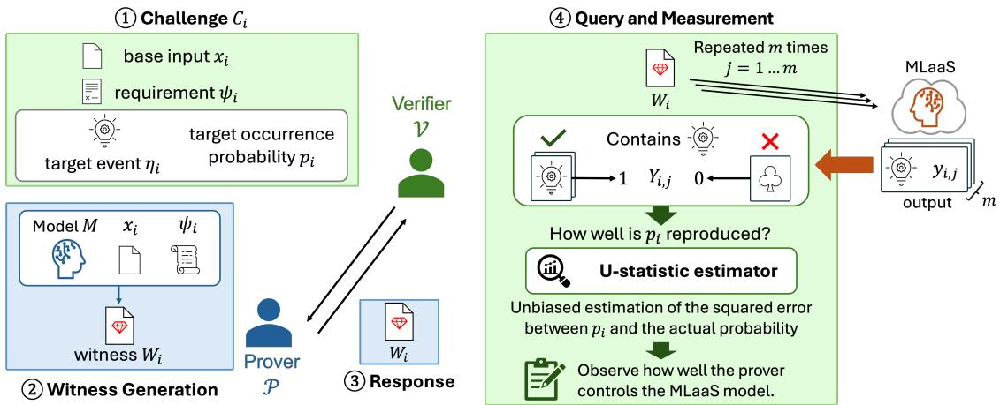
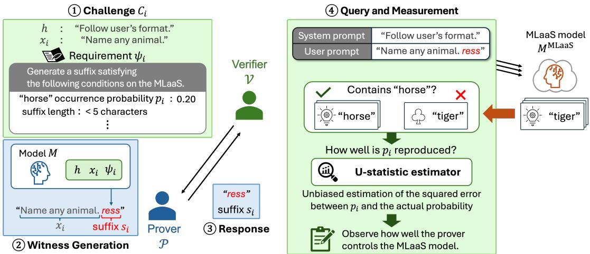
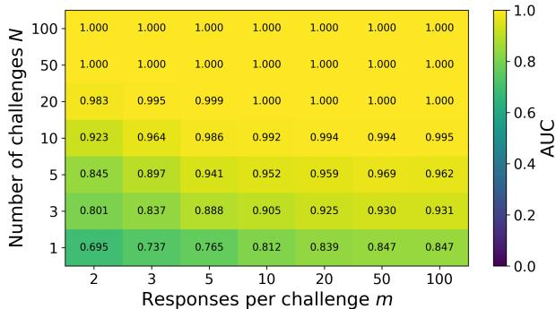
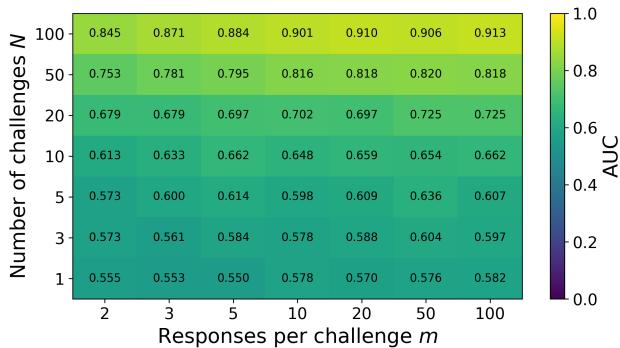
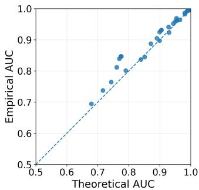
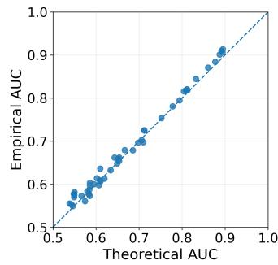

# Characterizing Statistical Separability in TP-CRIV

for Probabilistic AI Models

Teruki Sano, Minoru Kuribayashi, Masao Sakai, Shuji Isobe, Eisuke Koizumi, Zhang Zhang, Satoru Matsumoto

Abstract—Third-party challenge–response identity verification (TP-CRIV) enables an independent verifier to assess whether a claimant possesses a model identical to a remotely deployed model without directly accessing the reference model. However, for probabilistic AI models, repeated executions of the same query may produce different outputs and therefore different verification observations. This raises the question of how such stochastic evidence should be accumulated and how much evidence is required for reliable verification.

In this work, we characterize statistical separability in TP-CRIV of probabilistic AI models. Specifically, we relate challenge-wise behavior of matching and non-matching provers to verification-level separability. The characterization explicitly describes how the numbers of independent challenges and repeated responses affect detection performance and enables the verification budget required for a target AUC to be estimated. We instantiate the proposed characterization for LLMs using open-ended challenges. The experiments demonstrate matching– non-matching separation, close agreement between theoretical and empirical AUCs, and consistent estimates of the minimum verification budgets. These results provide a statistical basis for relating probabilistic model behavior to verification-level separability and the evidence required for third-party verification.

Index Terms—TP-CRIV, probabilistic AI models, statistical analysis, large language models (LLMs).

## I. INTRODUCTION

AI models are increasingly deployed through machinelearning-as-a-service (MLaaS) platforms, where their internal parameters and implementations are hidden from users and only input-output behavior is externally observable. Under such access, a broad line of model verification and fingerprinting research has investigated how model-specific behavior can be used to identify or verify a deployed model [1]. Existing approaches construct or identify discriminative probes, fingerprints, or behavioral features and compare the resulting behavior with reference information derived from a known model [2], [3]. For probabilistic generative models such as diffusion models and large language models (LLMs), repeated outputs and their resulting behavioral or feature distributions have also been explored as sources of model-specific information [4], [5]. In many of these settings, however, the party performing verification has access to the reference model itself or to reference behavior obtained from it.

Third-party challenge-response identity verification (TP-CRIV) [6] considers a different verification scenario. Rather than requiring the verifier to possess the reference model, a claimant, referred to as the prover, possesses a local model and claims that it is identical to a model deployed by an MLaaS provider. An independent verifier assesses this claim by issuing challenges to the prover and evaluating the resulting evidence through the ordinary input-output interface of the MLaaS service. The MLaaS provider is not required to participate in the verification beyond providing its standard inference interface. In this way, TP-CRIV enables a model holder to demonstrate its claimed relationship with a remotely deployed model to an independent third party.

Previous TP-CRIV studies have mainly considered approximately deterministic verification behavior in convolutional neural network classifiers. Extending TP-CRIV to probabilistic AI models introduces a fundamental difficulty. For such models, repeated executions of the same query may yield different verification-relevant outcomes, making a single challengeresponse insufficient for reliable verification. Verification must therefore accumulate stochastic evidence across multiple observations. Verification of probabilistic AI models must therefore evaluate statistical behavior accumulated over multiple observations rather than rely on an individual response.

This requirement immediately introduces a second problem: how much evidence is sufficient for reliable verification? The verifier may obtain additional evidence either by issuing more independent challenges or by repeatedly observing the behavior associated with the same challenge. Although both consume queries to the MLaaS service, they provide different forms of statistical evidence. A principled probabilistic verification framework must characterize how the underlying matching and non-matching behaviors and the allocation of observations jointly determine verification performance.

Rather than proposing a complete end-to-end verification framework, this work focuses on a more specific question: how to characterize statistical separability in TP-CRIV of probabilistic AI models from a finite number of stochastic responses. This work considers a setting in which the verifier specifies a target occurrence probability of a verification event for each challenge. The prover returns a witness intended to satisfy the specified probability, and the verifier observes the resulting behavior through the MLaaS input-output interface. However, because the underlying probability on the MLaaS model is latent, directly estimating its squared discrepancy from a finite sample introduces bias. To address this issue, we construct a U-statistic [7] that provides an unbiased estimate of the squared probabilistic discrepancy. We use these challengewise statistics to define a verification score and analyze its distributions for matching and non-matching prover populations. This analysis characterizes how the numbers of independent challenges and repeated responses per challenge affect their separation and the resulting verification performance.

Furthermore, the derived statistical characterization can be used to estimate the amount of evidence required to achieve a desired detection performance. Specifically, it estimates the required numbers of challenges and responses under a given verification setting. The verification budget can therefore be determined according to a target performance rather than treated as an arbitrary experimental parameter.

To evaluate these theoretical results under a concrete and practical instantiation, we consider LLMs under stochastic generation. Each challenge consists of an open-ended prompt, a target word, and a target occurrence probability. Using its local model, the prover generates a short suffix to control the target-word occurrence probability, exploiting the modelspecific probabilistic response landscape. Such control is expected to transfer more accurately for matching than for nonmatching provers. Experiments with five LLMs demonstrate that the resulting matching–non-matching separability is well characterized by the proposed theory and that the required verification budgets can also be estimated accurately.

The main contributions of this work are summarized as follows.

1) We formulate TP-CRIV with stochastic output as a verifier-specified occurrence-probability control problem and develop a U-statistic-based method to estimate the resulting discrepancy without finite-sample bias.

2) We theoretically characterize how the challenge-wise probabilistic behavior of matching and non-matching prover populations determine verification-level detection performance.

3) We characterize the amount and allocation of verification evidence required to achieve a desired detection performance, enabling principled verification-budget design.

4) We instantiate the analysis for LLMs using open-ended challenges. The experiments demonstrate matching–nonmatching separation, show close agreement between theoretical and empirical detection performance, and translate the observed stochastic behavior into estimates of the required verification budget.

## II. RELATED WORKS

Model identity verification has been studied under different assumptions regarding which party possesses the reference model and how model-specific reference information can be obtained. These assumptions fundamentally determine what evidence can be used for verification. We therefore first describe the flow of TP-CRIV [6], which defines the verification setting considered in this work, and then review related model fingerprinting studies [4], [5], [8]–[13].

## A. Third-Party Challenge–Response Identity Verification

TP-CRIV [6] considers a setting involving a prover, an independent verifier, and an MLaaS provider. The prover possesses a local model and claims that it is identical to a model deployed by the MLaaS provider. The verifier assesses this claim without accessing the prover’s model and interacts with the remotely deployed model only through the ordinary MLaaS input-output interface. A central feature of TP-CRIV is that the verifier evaluates the prover’s capability to generate model-dependent evidence in response to fresh challenges, rather than relying on a precomputed reference fingerprint. The resulting witness is then evaluated through the MLaaS interface.

For such a challenge–response mechanism to provide evidence of model identity, the task assigned to the prover must be tied to model-specific behavior. In particular, it is not sufficient merely to require the prover to produce an input that controls some output property. The required control should be designed such that the control component generated using the claimed model is expected to induce a corresponding behavior when transferred to the same model deployed on the MLaaS platform, while generally producing different behavior when it is generated using a non-matching model. Thus, modeldependent control serves as a means of converting access to the claimed model into fresh evidence that can subsequently be evaluated by the verifier.

A central distinction from existing fingerprinting is that the reference model is held by the prover rather than the verifier. Whereas fingerprinting can derive model-specific reference information in advance from a known model, TP-CRIV requires the prover to generate fresh model-dependent evidence for each verifier-selected challenge.

The previous TP-CRIV formulation considered verificationrelevant behavior that can be assessed approximately deterministically for each challenge, e.g. logits in classification models. This assumption becomes restrictive for probabilistic generative models, where repeated executions of the same witness may lead to different verification observations. We extend the TP-CRIV procedure from deterministic identity verification to the verification of probabilistic AI models.

## B. Model Fingerprinting for Probabilistic Models

Fingerprinting probabilistic generative models is challenging because repeated executions of the same input may produce different outputs. This stochasticity appears across different model families, including text-to-image diffusion models and LLMs, and therefore requires verification methods that remain reliable under output variation.

For text-to-image diffusion models, PromptLA [4] performs black-box integrity verification by comparing distributions of features extracted from repeatedly generated images. Other studies exploit model-specific consistency across different random seeds as an intrinsic behavioral fingerprint of diffusion models [8].

For LLMs, several fingerprinting approaches likewise seek model-specific behaviors that remain reliably distinguishable despite stochastic generation. LLMmap [9] employs active fingerprinting based on carefully selected queries whose responses are discriminative across different model versions while remaining relatively consistent for the same model under different prompting configurations and stochastic sampling conditions. TRAP [10] constructs model-specific adversarial prompts that induce a predefined target response on a reference model while exhibiting low transferability to other models, thereby producing highly discriminative response patterns. ESF [11] and RESF [12] address stochastic verification by incorporating reference-dependent response variability and statistical testing for distinguishing model modification from benign stochastic variation. LLMPrint [13] similarly optimizes fingerprint prompts to induce consistent model-specific token preferences that can be reliably recovered despite output variation and model post-processing. Although these methods differ in their mechanisms, they share the general objective of extracting or constructing model-specific behavior that remains sufficiently stable for reliable fingerprint verification.

In contrast, Bruckner proposed a behavioral fingerprinting approach that directly exploits stochastic response variation itself as model-specific information [5]. Rather than seeking fingerprint queries whose outputs remain stable, the method repeatedly submits simple open-ended prompts that admit multiple plausible answers and characterizes each model by the empirical distribution of its responses. Different LLMs exhibit distinct response tendencies to such ambiguous prompts, and the resulting empirical distributions are used as behavioral fingerprints. Thus, stochastic variation is not treated merely as noise to be suppressed or tolerated, but as part of the modelspecific information used for identification.

These studies are relevant to the present work in two respects. First, they demonstrate that externally observable LLM behavior contains model-dependent structure, including both stable response characteristics and model-specific stochastic response distributions. Second, they show several ways of handling probabilistic verification observations, ranging from allowing a set of possible responses to distributionlevel statistical inference and direct use of empirical response distributions.

Their verification setting, however, differs from TP-CRIV. These approaches generally rely on model-specific reference information established in advance from a known reference model. For methods that construct or optimize discriminative fingerprints, such information may consist of carefully selected queries, prompts, or expected responses. If this information were leaked or otherwise obtained by a malicious user, it could potentially be reused for verification without possession of the underlying model. For behavioral-distribution fingerprinting, the reference information instead takes the form of a trusted empirical response distribution, which must be obtained from the reference model through sufficient observations.

## III. VERIFICATION SETTING

## A. Setting and Assumptions

Figure 1 illustrates the probabilistic setting in the TP-CRIV procedure and verification procedure considered in this work. We consider a three-party verification setting consisting of a prover, a verifier, and an MLaaS provider.

• The prover $\mathcal { P }$ possesses a model M and claims that it is identical to $M ^ { \mathrm { M L a a S } }$ deployed by the MLaaS provider. Depending on the actual relationship between the two models, $\mathcal { P }$ is regarded as either matching or nonmatching.

• The verifier V aims to assess the prover’s claim. V has no access to the prover’s model M and can access $M ^ { \mathrm { M L a a S } }$ only through the MLaaS input-output interface.

• The MLaaS service hosts $M ^ { \mathrm { M L a a S } }$ and returns an output for each query submitted by V. It is accessible only through its ordinary inference interface and provides no verification-specific functionality.

In this work, we focus on verification settings in which a verification-relevant event occurs probabilistically, resulting in stochastic observations across repeated executions. Importantly, the scope of this work is determined by the stochasticity of the verification-relevant observation rather than by the general stochasticity of the model output. Specifically, the event outcome may vary across repeated executions of the same query, and each observation is represented as a binary value indicating whether the verification event occurs. Even if a model generates stochastic outputs, the present analysis is not required when the verification-relevant observation is deterministic for each query. We instead consider situations in which repeated observations are necessary to characterize the verification-relevant behavior.

We further assume that repeated observations for the same query under fixed generation conditions are independent and identically distributed (i.i.d.). Accordingly, the occurrence probability of the verification event remains unchanged across repeated executions. This assumption excludes stateful or adaptive behavior in which the MLaaS model changes its response distribution based on previous queries or outputs.

## B. Probabilistic Challenge–Response Procedure

Because the verification event is observed stochastically, a single response is insufficient to characterize the prover’s behavior. We therefore formulate each challenge by specifying a target occurrence probability for the verification event. The procedure consists of the following steps.

1) V prepares $N$ probabilistic challenges $C _ { i } , i = 1 , \dotsc , N .$ where

$$
C _ { i } = ( x _ { i } , \psi _ { i } ) .
$$

Here, $x _ { i }$ denotes a base input and $\psi _ { i }$ denotes the probabilistic requirement imposed on $\mathcal { P }$ . In the considered setting,

$$
\psi _ { i } = ( \eta _ { i } , p _ { i } ) ,
$$

where $\eta _ { i }$ specifies an event defined on the model output and $p _ { i }$ denotes its target occurrence probability.

2) Given $C _ { i } , ~ \mathcal { P }$ applies a witness-generation procedure ResGen to its local model $M \colon$

$$
w _ { i } = \operatorname { R e s G e n } ( M , C _ { i } ) .
$$

The procedure aims to generate a control component $w _ { i }$ such that

$$
\operatorname* { P r } [ \eta _ { i } ( M ( x _ { i } \oplus w _ { i } ) ) = 1 ] \approx p _ { i } ,
$$

where $\oplus$ denotes a model- and mechanism-specific operation that combines $x _ { i }$ with the generated control component $w _ { i }$

  
Fig. 1. Overview of the setting in the TP-CRIV procedure and the proposed observation procedure for probabilistic AI models. The illustrated procedure corresponds to the i-th challenge.

3) After generating $w _ { i } , \mathcal { P }$ returns a response to V. As a representative form, we express the returned witness as

$$
W _ { i } = x _ { i } \oplus w _ { i } .
$$

The exact response format depends on the verification mechanism. For example, $\mathcal { P }$ may return the complete witness $W _ { i } ,$ the pair $( x _ { i } , w _ { i } )$ , or only $w _ { i }$ when $x _ { i }$ is already available to V. In each case, V obtains or reconstructs $W _ { i }$ to be submitted to the MLaaS service.

4) After obtaining $W _ { i } , \nu$ submits it to the MLaaS service m $\geq 2$ times and receives

$$
y _ { i , j } = F ^ { \mathrm { M L a a S } } ( W _ { i } ) , \qquad j = 1 , \ldots , m ,
$$

where $F ^ { \mathrm { M L a a S } }$ denotes the service’s input–output interface. Each output is converted into a binary observation:

$$
Y _ { i , j } = \eta _ { i } ( y _ { i , j } ) , \qquad \eta _ { i } ( y ) = { \left\{ \begin{array} { l l } { 1 , } & { { \mathrm { i f ~ e v e n t ~ } } i { \mathrm { ~ o c c u r s } } , } \\ { 0 , } & { { \mathrm { o t h e r w i s e } } . } \end{array} \right. }
$$

The underlying event occurrence probability is

$$
q _ { i } = \mathrm { P r } [ \eta _ { i } ( F ^ { \mathrm { M L a a S } } ( W _ { i } ) ) = 1 ] .
$$

Since V obtains only stochastic observations $Y _ { i , j }$ of the verification event, rather than directly observing $q _ { i }$ , it estimates the squared discrepancy $( p _ { i } - q _ { i } ) ^ { 2 }$ using the second-order U-statistic

$$
U _ { i } = \frac { 1 } { m ( m - 1 ) } \sum _ { a \neq b } ^ { m } ( Y _ { i , a } - p _ { i } ) ( Y _ { i , b } - p _ { i } ) .\tag{1}
$$

Finally, V aggregates these observations across the $N$ challenges to obtain the verification score:

$$
T _ { N , m } = \frac { 1 } { N } \sum _ { i = 1 } ^ { N } U _ { i } .\tag{2}
$$

Given the defined matching and non-matching prover populations and their witness-generation methods, we consider challenges under which matching provers are expected to achieve smaller squared probabilistic discrepancies on average than non-matching provers.

To characterize how this underlying separation translates into verification performance, we next analyze the statistical properties of $U _ { i }$ and the aggregate score $T _ { N , m }$ under finite observations. This analysis relates the latent discrepancy $( p _ { i } -$ $q _ { i } ) ^ { 2 }$ to detection performance and provides estimates of the numbers of challenges and responses required to achieve a target performance.

## IV. THEORETICAL ANALYSIS OF U-STATISTIC-BASED VERIFICATION

We analyze the statistical separability of matching and non-matching prover populations using the U-statistic-based verification score introduced above. For each population, we consider the challenge-wise joint distribution of the target probability $p _ { i }$ and the occurrence probability $q _ { i }$ induced on the MLaaS model by the generated witness. Given these distributions, we derive a theoretical approximation to the area under the curve (AUC) as a function of the number of independent challenges N and the number of responses per challenge $m .$ . This characterization is conditional on the specified challenge-wise distributions; it does not establish that a particular challenge design or witness-generation procedure necessarily produces a positive matching–non-matching error gap. This relationship also allows the required verification budget to be estimated from a prescribed minimum AUC. Specifically, we derive $N _ { \mathrm { m i n } }$ for a fixed m and $m _ { \mathrm { m i n } }$ for a fixed N under the same approximation. To establish these results, we first derive the expectation and variance of the challenge-wise U-statistic, then characterize the distribution of the aggregate score and the resulting AUC.

## A. Statistical Properties of the Challenge-Wise U-Statistic

For a single challenge, we omit the challenge index and treat the target probability $p$ and the latent occurrence probability q as fixed. Under the assumed response model, $Y _ { 1 } , \ldots , Y _ { m } \stackrel { \mathrm { i . i . d . } } { \sim }$ Bernoulli(q). The U-statistic defined above can be written as

$$
U = { \frac { 1 } { m ( m - 1 ) } } \sum _ { a \neq b } ( Y _ { a } - p ) ( Y _ { b } - p ) ,
$$

where the sum is taken over all ordered pairs of distinct observations. For $a \neq b ,$ , independence gives

$$
\mathbb { E } [ Y _ { a } Y _ { b } ] = \mathbb { E } [ Y _ { a } ] \mathbb { E } [ Y _ { b } ] = q ^ { 2 } .
$$

Therefore,

$$
\mathbb { E } [ ( Y _ { a } - p ) ( Y _ { b } - p ) ] = q ^ { 2 } - 2 p q + p ^ { 2 } = ( p - q ) ^ { 2 } ,
$$

and hence

$$
\mathbb { E } [ U ] = ( p - q ) ^ { 2 } .\tag{3}
$$

Therefore, for any $m \geq 2 , U$ is an unbiased estimator of the squared probability-control error.

## B. Detection Based on U-Statistic Observations

We next characterize the separation between matching and non-matching provers based on the challenge-wise U-statistic observations. Suppose that $\nu$ prepares N independent challenges $C _ { i } , i = 1 , \ldots , N$ . For challenge $C _ { i } , \nu$ specifies a target probability $p _ { i } ,$ while $\mathcal { P }$ induces an underlying occurrence probability $q _ { i }$ for the designated event. V queries the MLaaS model m times and computes the challenge-wise $U _ { i }$

The aggregated verification score $T _ { N , m }$ is defined in Eq. (2). Since $\mathbb { E } [ U _ { i } ] = ( p _ { i } - q _ { i } ) ^ { 2 }$ , the expectation of the aggregated score is

$$
\mathbb { E } [ T _ { N , m } ] = \frac { 1 } { N } \sum _ { i = 1 } ^ { N } ( p _ { i } - q _ { i } ) ^ { 2 } .
$$

Thus, $T _ { N , m }$ estimates the average squared probability-control error across the verification challenges.

We denote the matching and non-matching prover populations by T and F, respectively. For each population $X \in \{ \mathtt { T } , \mathtt { F } \}$ , let $q _ { i } ^ { X }$ denote the event occurrence probability induced on the MLaaS model by a witness generated by a prover from that population for challenge $C _ { i }$ . The expected challenge-wise squared probability-control error is defined as

$$
\begin{array} { r } { \mathcal { E } ^ { X } = \mathbb { E } \left[ ( q _ { i } ^ { X } - p _ { i } ) ^ { 2 } \right] , \qquad X \in \{ \mathrm { T } , \mathrm { F } \} , } \end{array}\tag{4}
$$

where the expectation is taken over the challenge-wise distribution of $( p _ { i } , q _ { i } ^ { X } )$ . The corresponding aggregate verification score $T _ { N , m } ^ { X }$ therefore satisfies

$$
\mathbb { E } [ T _ { N , m } ^ { X } ] = \mathcal { E } ^ { X } .
$$

To characterize the distribution of the aggregated verification score, we next derive its variance from the challenge-wise $\mathrm { U } -$ statistic observations.

For $C _ { i } ,$ define the latent probability-control error as

$$
e _ { i } = q _ { i } - p _ { i } ,\tag{5}
$$

and let $X _ { i , a } = Y _ { i , a } - p _ { i }$ . Then, $\mathbb { E } [ X _ { i , a } \mid p _ { i } , q _ { i } ] = e _ { i }$ . Since $Y _ { i , a }$ follows a Bernoulli distribution with parameter $q _ { i }$

$$
\operatorname { V a r } [ X _ { i , a } \mid p _ { i } , q _ { i } ] = q _ { i } ( 1 - q _ { i } ) .
$$

The challenge-wise U-statistic can equivalently be written using unordered pairs as

$$
U _ { i } = \frac { 1 } { \binom { m } { 2 } } \sum _ { a < b } X _ { i , a } X _ { i , b } .
$$

This expression is equivalent to the ordered-pair form because each unordered pair appears twice in $\textstyle \sum _ { a \neq b } X _ { i , a } X _ { i , b }$

We define $s _ { i } = q _ { i } ( 1 - q _ { i } )$ . For distinct a and $b ,$

$$
\operatorname { V a r } \left[ X _ { i , a } X _ { i , b } \mid p _ { i } , q _ { i } \right] = s _ { i } ^ { 2 } + 2 e _ { i } ^ { 2 } s _ { i } .
$$

Furthermore, two product terms sharing one observation are correlated. For example,

$$
\operatorname { C o v } \left[ X _ { i , 1 } X _ { i , 2 } , X _ { i , 1 } X _ { i , 3 } \mid p _ { i } , q _ { i } \right] = e _ { i } ^ { 2 } s _ { i } .
$$

In contrast, two product terms having no common observation are independent and therefore have zero covariance.

Using the number of pair terms and overlapping pair combinations, the conditional variance of $U _ { i }$ is

$$
\mathrm { V a r } [ U _ { i } \mid p _ { i } , q _ { i } ] = \frac { 4 } { m } e _ { i } ^ { 2 } q _ { i } ( 1 - q _ { i } ) + \frac { 2 } { m ( m - 1 ) } q _ { i } ^ { 2 } ( 1 - q _ { i } ) ^ { 2 } .\tag{6}
$$

The above expression represents the stochastic variation of the U-statistic for fixed $p _ { i }$ and $q _ { i }$ . Across challenges, however, the latent probability-control error $e _ { i }$ , defined in Eq. (5), may also vary. Applying the law of total variance gives

$$
\mathrm { V a r } [ U _ { i } ] = \mathrm { V a r } \left[ \mathbb { E } [ U _ { i } \mid p _ { i } , q _ { i } ] \right] + \mathbb { E } \left[ \mathrm { V a r } [ U _ { i } \mid p _ { i } , q _ { i } ] \right] .
$$

Using Eqs. (3),(5) and (6), we obtain

$$
\begin{array} { l } { \displaystyle \mathrm { V a r } [ U _ { i } ] = \mathrm { V a r } [ e _ { i } ^ { 2 } ] + \frac { 4 } { m } \mathbb { E } \left[ e _ { i } ^ { 2 } q _ { i } ( 1 - q _ { i } ) \right] } \\ { \displaystyle + \frac { 2 } { m ( m - 1 ) } \mathbb { E } \left[ q _ { i } ^ { 2 } ( 1 - q _ { i } ) ^ { 2 } \right] . } \end{array}\tag{7}
$$

The expectations in the above expression are taken over the challenge-wise distribution of $( p _ { i } , q _ { i } )$ for the considered prover class. The first term represents the intrinsic challenge-tochallenge variation of the latent squared probability-control error, whereas the latter two terms represent the stochastic variation caused by finite response sampling.

For prover class $X \in \{ \mathtt { T } , \mathtt { F } \}$ , define $W ^ { X } ( m ) = \operatorname { V a r } [ U _ { i } ^ { X } ]$ More explicitly,

$$
\begin{array} { c l c r } { { W ^ { X } ( m ) = \mathrm { V a r } \left[ ( e _ { i } ^ { X } ) ^ { 2 } \right] + \displaystyle \frac { 4 } { m } \mathbb { E } \left[ ( e _ { i } ^ { X } ) ^ { 2 } q _ { i } ^ { X } ( 1 - q _ { i } ^ { X } ) \right] } } \\ { { + \displaystyle \frac { 2 } { m ( m - 1 ) } \mathbb { E } \left[ ( q _ { i } ^ { X } ) ^ { 2 } ( 1 - q _ { i } ^ { X } ) ^ { 2 } \right] . } } \end{array}\tag{8}
$$

Because the aggregated verification score $T _ { N , m } ^ { X }$ is given by Eq.(2) and the challenge-wise observations are assumed to be independent and drawn from the same prover-class distribution,

$$
\operatorname { V a r } [ T _ { N , m } ^ { X } ] = { \frac { W ^ { X } ( m ) } { N } } .
$$

Under these assumptions and for sufficiently large N, the central limit theorem gives

$$
T _ { N , m } ^ { X } \approx \mathcal { N } \left( \mathcal { E } ^ { X } , \frac { W ^ { X } ( m ) } { N } \right) ,
$$

where ${ \mathcal { N } } ( \mu , \sigma ^ { 2 } )$ denotes a normal distribution with mean $\mu$ and variance $\sigma ^ { 2 }$

Because a smaller verification score indicates better agreement with the verifier-specified probabilities, the AUC can be

expressed as $\mathrm { A U C } = \mathrm { P r } \left[ T _ { N , m } ^ { \texttt { T } } < T _ { N , m } ^ { \texttt { F } } \right]$ . Since the difference between two independent Gaussian random variables is also Gaussian, the AUC can be approximated as

$$
\operatorname { A U C } ( N , m ) \approx \Phi \left( { \frac { { \sqrt { N } } \left( { \mathcal { E } } ^ { \mathrm { { F } } } - { \mathcal { E } } ^ { \mathrm { { T } } } \right) } { { \sqrt { W ^ { \mathrm { { F } } } ( m ) + W ^ { \mathrm { { T } } } ( m ) } } } } \right) ,\tag{9}
$$

where $\Phi ( \cdot )$ denotes the cumulative distribution function of the standard normal distribution.

This expression directly relates the expected detection performance to the underlying challenge-wise probability-control behavior of the matching and non-matching prover classes. The numerator represents the difference in their expected squared probability-control errors, while the denominator accounts for both inter-challenge variation and finite-m stochastic response variation. Consequently, once the challenge-wise distributions of $p _ { i }$ and $q _ { i }$ are characterized, the expected AUC for any given N and m can be theoretically estimated.

## C. Required Verification Budget for a Target AUC

The derived AUC expression can also be used to estimate the verification budget required to achieve a target detection performance. The following budget derivations assume $\mathcal { E } ^ { \mathsf { F } } >$ ${ \mathcal { E } } ^ { \mathrm { T } }$ , meaning that matching provers achieve a smaller expected squared probability-control error than non-matching provers. This condition specifies the direction of separation required for an AUC greater than 0.5 under the Gaussian approximation. Let the target AUC be $\alpha ,$ where $0 . 5 < \alpha < 1$ . The condition $\mathrm { A U C } ( N , m ) > \alpha$ is approximately equivalent to

$$
\frac { \sqrt N \left( \mathcal E ^ { \mathtt { F } } - \mathcal E ^ { \mathtt { T } } \right) } { \sqrt { W ^ { \mathtt { F } } ( m ) + W ^ { \mathtt { T } } ( m ) } } > \Phi ^ { - 1 } ( \alpha ) .
$$

Therefore,

$$
N > \frac { \left( \Phi ^ { - 1 } ( \alpha ) \right) ^ { 2 } \left( W ^ { \mathtt { F } } ( m ) + W ^ { \mathtt { T } } ( m ) \right) } { \left( { \mathcal E } ^ { \mathtt { F } } - { \mathcal E } ^ { \mathtt { T } } \right) ^ { 2 } } .
$$

Since N must be an integer, the minimum number of challenges required for a fixed m is

$$
N _ { \mathrm { m i n } } ( m ; \alpha ) = \left\lfloor \frac { \left( \Phi ^ { - 1 } ( \alpha ) \right) ^ { 2 } \left( W ^ { \mathtt { F } } ( m ) + W ^ { \mathtt { T } } ( m ) \right) } { \left( \mathcal { E } ^ { \mathtt { F } } - \mathcal { E } ^ { \mathtt { T } } \right) ^ { 2 } } \right\rfloor + 1 .\tag{10}
$$

where ⌊·⌋ denotes the floor function.

To make the dependence on m explicit, define

$$
A ^ { X } = \mathrm { V a r } \left[ ( e _ { i } ^ { X } ) ^ { 2 } \right] ,\tag{11}
$$

$$
\begin{array} { r } { B ^ { X } = 4 \mathbb { E } \left[ ( e _ { i } ^ { X } ) ^ { 2 } q _ { i } ^ { X } ( 1 - q _ { i } ^ { X } ) \right] , } \end{array}\tag{12}
$$

$$
C ^ { X } = 2 \mathbb { E } \left[ ( q _ { i } ^ { X } ) ^ { 2 } ( 1 - q _ { i } ^ { X } ) ^ { 2 } \right] .\tag{13}
$$

Then,

$$
W ^ { X } ( m ) = A ^ { X } + \frac { B ^ { X } } { m } + \frac { C ^ { X } } { m ( m - 1 ) } .\tag{14}
$$

Let

$$
A = A ^ { \mathrm { T } } + A ^ { \mathrm { F } } , \qquad B = B ^ { \mathrm { T } } + B ^ { \mathrm { F } } , \qquad C = C ^ { \mathrm { T } } + C ^ { \mathrm { F } } .
$$

Accordingly,

$$
W ^ { \boldsymbol { \mathsf { F } } } ( m ) + W ^ { \boldsymbol { \mathsf { T } } } ( m ) = A + \frac { B } { m } + \frac { C } { m ( m - 1 ) } .
$$

Substituting this expression into Eq. (10) gives

$$
N _ { \mathrm { m i n } } ( m , \alpha ) = \left\lfloor \frac { ( \Phi ^ { - 1 } ( \alpha ) ) ^ { 2 } } { \left( \mathcal { E } ^ { \mathrm { F } } - \mathcal { E } ^ { \mathrm { T } } \right) ^ { 2 } } \left( A + \frac { B } { m } + \frac { C } { m ( m - 1 ) } \right) \right\rfloor + 1 .\tag{15}
$$

This expression explicitly describes the trade-off between the number of challenges N and the number of responses per challenge m. Increasing m reduces the finite-sampling terms $B / m$ and $C / m ( m - 1 )$ , whereas the challenge-level variation A remains. Therefore, increasing the number of responses per challenge m cannot eliminate the intrinsic challenge-tochallenge variation. This explains why the benefit of increasing m eventually diminishes.

Conversely, for a fixed N, the minimum number of responses per challenge can also be obtained. Define

$$
R = \frac { N \left( \mathcal { E } ^ { \mathtt { F } } - \mathcal { E } ^ { \mathtt { T } } \right) ^ { 2 } } { ( \Phi ^ { - 1 } ( \alpha ) ) ^ { 2 } } .\tag{16}
$$

Then the required condition becomes

$$
A + \frac { B } { m } + \frac { C } { m ( m - 1 ) } < R .\tag{17}
$$

Since $B \geq 0$ and $C \geq 0 .$ , the finite-sampling contribution

$$
{ \frac { B } { m } } + { \frac { C } { m ( m - 1 ) } }
$$

is non-increasing with respect to m for $m \geq 2$ . Therefore,

$$
A + \frac { B } { m } + \frac { C } { m ( m - 1 ) }
$$

decreases monotonically toward A as m increases. In particular, as $m  \infty$ , the above expression converges to A. Consequently, a finite m satisfying Eq.(17) exists if and only if $A < R$ . Equivalently,

$$
N > \frac { ( \Phi ^ { - 1 } ( \alpha ) ) ^ { 2 } A } { \left( { \mathcal { E } ^ { \mathtt { F } } - \mathcal { E } ^ { \mathtt { T } } } \right) ^ { 2 } } .
$$

If this condition is not satisfied, increasing m cannot achieve the target AUC, because the total variance term is bounded below by A. Conversely, when $R > A$ , the finite-sampling terms decrease toward zero, so a sufficiently large finite m necessarily satisfies the required inequality.

When $R > A .$ , define $D = R - A$ . Then

$$
\frac { B } { m } + \frac { C } { m ( m - 1 ) } < D .
$$

Rearranging gives

$$
D m ^ { 2 } - ( D + B ) m + ( B - C ) > 0 .
$$

The corresponding boundary is given by the larger root,

$$
m _ { \mathrm { b d } } ( N , \alpha ) = \frac { D + B + \sqrt { ( D + B ) ^ { 2 } - 4 D ( B - C ) } } { 2 D } .
$$

Therefore, the minimum number of responses is

$$
m _ { \mathrm { m i n } } ( N , \alpha ) = \mathrm { m a x } \left\{ 2 , \lfloor m _ { \mathrm { b d } } \rfloor + 1 \right\} .\tag{18}
$$

These expressions allow V to estimate the required verification budget directly from the challenge-wise probability behavior of matching and non-matching provers. In particular, empirical observations of $p _ { i }$ and $q _ { i }$ can be used to estimate $\mathcal { E } ^ { \mathrm { T } } , \mathcal { E } ^ { \mathrm { F } } , A , B ,$ and $C ,$ after which the theoretical AUC and the minimum required N and m can be calculated for a desired target AUC.

  
Fig. 2. Overview of the LLM instantiation of TP-CRIV for probabilistic models.

## V. LLM INSTANTIATION

In this section, we investigate whether the proposed TP-CRIV framework for probabilistic AI models can be instantiated for LLMs to distinguish matching from non-matching provers. Our objective in this study is not to construct a complete operational verification system with a calibrated decision threshold. Instead, we focus on two questions: whether modeldependent probabilistic challenges can produce statistical separation between matching and non-matching provers, and whether the resulting separability can be characterized using the theoretical analysis developed in the previous section.

## A. LLM Setting

Figure 2 illustrates the overall procedure of the LLM-based instantiation considered in this work. Both M and $M ^ { \mathrm { M L a a S } }$ are assumed to be LLMs operated under probabilistic generation with a nonzero temperature. Thus, repeated executions of the same input may produce different outputs.

In this feasibility study, model identity is instantiated in a strict form. A matching prover possesses the same LLM as $M ^ { \mathrm { M L a a S } }$ , whereas a non-matching prover possesses a different LLM. We further assume that both matching and nonmatching provers employ the same suffix-generation strategy ResGen. That is, each prover applies the same algorithm to its own local model under the same challenge specification. This allows us to examine whether the resulting difference in probabilistic behavior is attributable to the difference between the underlying models rather than to different prover strategies.

We represent the input-output operation of a model M as $M ( \mathcal { T } _ { M } ( h , x ) )$ , where $h$ and $x$ denote the system and user prompts, respectively, and $\mathcal { T } _ { M }$ is a predefined model-specific serialization function that converts them into the input format expected by M. The local model M and the deployed model $M ^ { \mathrm { { \dot { M } L a a S } } }$ use fixed serialization functions $\mathcal { T } _ { M }$ and $\mathcal { T } _ { M ^ { \mathrm { M L a a S } } }$ respectively, specified according to their prompt formats. We assume that each model uses a fixed serialization function appropriate to its prompt format, and that identical models use the same serialization function. These functions are specified in advance and are neither selected nor optimized by $\mathcal { P } .$

## B. TP-CRIV Procedure for LLMs

We instantiate the probabilistic challenge–response procedure described in the previous section as follows.

1) V constructs the i-th challenge as

$$
C _ { i } = ( h , x _ { i } , \psi _ { i } ) , \qquad \psi _ { i } = ( \omega _ { i } , p _ { i } , N _ { s } , \mathcal { F } _ { i } ) ,
$$

where h is a common system instruction, $x _ { i }$ is an openended user prompt, and $\psi _ { i }$ specifies the target word $\omega _ { i }$ , the target occurrence probability $p _ { i }$ , the maximum suffix length $N _ { s } ,$ and a set of prohibited target-related fragments ${ \mathcal { F } } _ { i }$ . The requirement specified by $\psi _ { i }$ is to generate a suffix $s _ { i }$ such that, when $s _ { i }$ is appended to $x _ { i }$ the response from the MLaaS model contains $\omega _ { i }$ with probability close to $p _ { i } .$ . The suffix must satisfy

$$
| s _ { i } | _ { \mathrm { c h a r } } \leq N _ { s } ,
$$

and must not contain $\omega _ { i }$ or any fragment in ${ \mathcal { F } } _ { i }$ . These constraints rule out directly including the target word or the specified target-related fragments in the suffix.

2) Given $C _ { i } , \mathcal { P }$ uses a suffix-generation algorithm SufGen, an instantiation of ResGen, with M to obtain

$$
s _ { i } = \operatorname { S u f G e n } ( M , C _ { i } ) .
$$

The algorithm seeks a suffix $s _ { i }$ that satisfies the generation constraints specified in $\psi _ { i }$ and makes the targetword occurrence probability under M close to $p _ { i } \colon$

$$
\mathrm { P r } [ \omega _ { i } \ \mathrm { a p p e a r s ~ i n ~ } M ( \mathcal { T } _ { M } ( h , x _ { i } \| s _ { i } ) ) ] \approx p _ { i } ,
$$

where the probability is taken over the model’s stochastic response generation.

3) P returns the generated $s _ { i }$ to V as its response to $C _ { i } .$

4) Upon receiving $s _ { i } ,$ V checks whether it satisfies the suffix constraints specified in $\psi _ { i }$ and rejects the response if any constraint is violated. Otherwise, V appends $s _ { i }$ to $x _ { i }$ and submits the resulting user input $x _ { i } \| s _ { i } .$ , where ∥ denotes string concatenation, together with the common system instruction $h ,$ to the MLaaS service m times to obtain output messages

$$
y _ { i , j } = M ^ { \mathrm { M L a a S } } ( \mathcal { T } _ { M ^ { \mathrm { M L a a S } } } ( h , x _ { i } \Vert s _ { i } ) ) , \qquad j = 1 , \dotsc , m ,
$$

where each invocation uses independent randomness for response generation.

For each response, $\nu$ records whether the target word $\omega _ { i }$ appears:

$$
Y _ { i , j } = { \left\{ \begin{array} { l l } { 1 , } & { { \mathrm { i f ~ } } \omega _ { i } \ { \mathrm { a p p e a r s ~ i n ~ } } y _ { i , j } , } \\ { 0 , } & { { \mathrm { o t h e r w i s e } } . } \end{array} \right. }
$$

Using these observations, V computes the challengewise score $U _ { i }$ via the U-statistic defined in Eq. (1). V repeats this procedure for N challenges, $i = 1 , \ldots , N$ and aggregates the resulting scores $U _ { i }$ into $T _ { N , m }$ as defined in Eq. (2).

In this feasibility study, we do not calibrate an operational decision threshold for accepting or rejecting ${ \mathcal { P } } .$ . Instead, we evaluate whether the distributions of $T _ { N , m }$ obtained from matching and non-matching provers are statistically separable. We further compare this empirical separability with the theoretical AUC and the required numbers of challenges and responses derived in the previous section.

## C. Challenge Design Principle

The challenge design is motivated by the observation that LLMs exhibit model-specific response distributions for simple open-ended prompts. For example, a prompt such as “Name an animal” allows multiple plausible responses, such as “dog,” “cat,” or “horse,” rather than a single correct answer. Previous work has shown that repeatedly querying LLMs with such prompts can reveal characteristic output distributions that can serve as behavioral fingerprints [5]. We exploit this property from a different perspective. An open-ended prompt admits multiple plausible responses, and the relative probabilities assigned to these responses depend on the underlying model. We refer to this model-dependent structure as a probabilistic response landscape. Our challenge asks the prover to locally manipulate this response landscape. Given an open-ended base prompt $x _ { i } .$ , the prover searches for a short suffix $s _ { i }$ that shifts the occurrence probability of a designated target word $\omega _ { i }$ toward the verifier-specified value $p _ { i }$ on its own model.

The key hypothesis is that the transferability of this local probability manipulation depends on the underlying model. When M and $\dot { M } ^ { \mathrm { M L a a S } }$ are the same model, a suffix constructed on M is expected to preserve a similar probability control effect on $M ^ { \mathrm { M L a a S } }$ , resulting in $q _ { i }$ close to $p _ { i }$ . When the prover possesses a different model, the same suffix-generation algorithm operates on a different probabilistic response landscape. The resulting suffix may therefore induce a different target-word probability after being transferred to $M ^ { \mathrm { M L a a S } }$ Across multiple challenges, such differences may produce statistically distinct score distributions for matching and nonmatching provers.

The suffix constraints are intended to strengthen this modeldependent effect. Prohibiting the target word and its related fragments suppresses direct lexical insertion, while restricting the suffix length limits the amount of explicit instruction that can be embedded in the suffix. The challenge is therefore designed to exploit subtle model-dependent response tendencies rather than a generally transferable explicit instruction.

Accordingly, the purpose of the proposed challenge is not to guarantee model identification for every possible pair of LLMs. Rather, this feasibility study investigates whether such constrained probability-control challenges can induce measurable separation between matching and non-matching models and whether the degree of separation can be theoretically characterized.

## D. Suffix Generation Method

As a concrete instantiation of the prover’s responsegeneration strategy, we introduce a GCG-based suffix generator [14]. Given $C _ { i } .$ , the generator searches for a suffix $s _ { i }$ that brings the occurrence probability of the target word $\omega _ { i }$ close to $p _ { i }$ on the prover’s local model M, while satisfying the constraints specified in $\psi _ { i }$ . In particular, the search aims to achieve this probability control under a tight character-length constraint $| s _ { i } | _ { \mathrm { c h a r } } \leq N _ { s }$ . Algorithm 1 summarizes the overall suffix-generation procedure.

To search effectively under this constraint, we combine gradient-guided candidate search with empirical evaluation through stochastic response generation. The gradient-guided stage uses a differentiable surrogate to identify promising suffix candidates, while the empirical stage evaluates their actual target-word occurrence probabilities and selects a suffix whose estimated probability is closest to $p _ { i }$ . Directly optimizing the empirical occurrence probability of the target word is difficult because stochastic text generation is non-differentiable. We therefore use a differentiable teacher-forcing probability as a surrogate during candidate search.

The original GCG method searches for adversarial suffixes by optimizing the likelihood of a desired target completion. In our implementation, we instead use the teacher-forcing probability of the first token of the target completion as a differentiable surrogate. Specifically, let $\pi _ { i } ( s )$ denote the probability assigned by the prover model to the first token of the target completion $\omega _ { i }$ given the serialized input $\mathcal { T } _ { M } ( h , x _ { i } , s )$ The search objective is $L _ { i } ( s ) = \left( \pi _ { i } ( s ) - p _ { i } \right) ^ { 2 }$ . This surrogate does not directly represent the probability that $\omega _ { i }$ appears in a stochastically generated response. Rather, the search is intended to bias the model’s local output distribution toward a state in which the overall occurrence tendency of the target word is affected. GCG is used to efficiently identify suffix candidates that reduce $L _ { i } ( s )$ . The resulting candidates are then evaluated through actual stochastic generation, and are empirically reranked according to the observed target-word occurrence probability.

## VI. EXPERIMENTAL EVALUATION

This section evaluates the LLM instantiation from four perspectives. Section VI-B examines the probability-control behavior of suffixes generated by matching and non-matching provers. Section VI-C evaluates the separation between their verification scores using empirical AUC. Section VI-D compares the theoretical and empirical AUCs to assess the accuracy of the approximation. Finally, Section VI-E examines the accuracy of the estimated minimum numbers of challenges and responses required to achieve a specified target AUC.

Algorithm 1 Probability-Targeted Suffix Generation Method   
Require: Challenge $\overline { { C _ { i } = \left( h , x _ { i } , \psi _ { i } \right) } }$ , prover model M   
Ensure: Suffix $s _ { i }$   
1: Extract $\omega _ { i } , p _ { i } ,$ , and suffix constraints from $\psi _ { i }$   
2: Generate candidate suffixes $s _ { i }$ using a GCG-based search   
3: Remove candidates that violate the suffix constraints   
4: Select a shortlist $S _ { i } ^ { \mathrm { s h o r t } }$ according to the GCG-based   
surrogate objective   
5: for all $s \in \bar { S } _ { i } ^ { \mathrm { s h o r t } }$ do   
6: for $k = 1 , \ldots , K _ { 1 }$ do   
7: $y _ { k } \sim M ( { \mathcal { T } } _ { M } ( h , x _ { i } \| s ) )$   
8: end for   
9: $\hat { p } _ { i } ^ { ( 1 ) } ( s ) = \frac { 1 } { K _ { 1 } } \sum _ { k = 1 } ^ { K _ { 1 } } \mathbf { 1 } [ \omega _ { i } \in y _ { k } ]$   
10: end for   
11: Retain candidates with the smallest $\vert \hat { p } _ { i } ^ { ( 1 ) } ( s ) - p _ { i } \vert$   
12: for all retained suffixes $s$ do   
13: for $k = K _ { 1 } + 1 , \ldots , K _ { 1 } + K _ { 2 }$ do   
14: $y _ { k } \sim M ( { \mathcal { T } } _ { M } ( h , x _ { i } \| s ) )$   
15: end for   
$K _ { 1 } + K _ { 2 }$   
16: $\hat { p } _ { i } ( s ) = \frac { 1 } { K _ { 1 } + K _ { 2 } } \quad et { } { ' } \sum _ { k = 1 } \mathbf { \bar { \mu } _ { 1 } } [ \omega _ { i } \in y _ { k } ]$   
17: end for   
18: $s _ { i } = \arg \operatorname* { m i n } _ { \mathbf { s } } | \hat { p } _ { i } ( s ) - p _ { i } |$   
19: return $s _ { i }$

## A. Experimental Setup

We evaluate the proposed challenge using five LLMs: Vicuna-7B-v1.5 [15], Mistral-7B-Instruct-v0.2 [16], Llama-2- 7B-chat-hf [17], Qwen2.5-7B-Instruct [18], and Yi-6B-Chat [19]. Hereafter, we refer to these models as Vicuna, Mistral, Llama-2, Qwen2.5, and $\mathrm { Y i , }$ respectively. Each of the five models is used both as M and $M ^ { \mathrm { { \bar { M L a a S } } } }$ , and all combinations are evaluated. For each fixed $M ^ { \mathrm { M L a a S } }$ , the same model serves as the matching prover, while the remaining four models serve as non-matching provers. All five prover models employ the same suffix-generation procedure described in the previous section. The common generation and suffix-generation settings are summarized in Table V in Appendix A.

We construct a fixed set of 500 challenges. Each base prompt $x _ { i }$ requests a single English instance belonging to a semantic category without uniquely specifying which valid instance should be returned. The challenge set covers a diverse range of semantic categories and uses multiple paraphrased prompt forms for each category. For each prompt, the target word $\omega _ { i }$ is selected from plausible responses belonging to the corresponding category. For each challenge, the target probability $p _ { i }$ is sampled from {0.2, 0.4, 0.6, 0.8}, and the resulting challenge specification $( x _ { i } , \omega _ { i } , p _ { i } )$ is fixed and shared across all model combinations. Thus, differences between matching and non-matching conditions are evaluated using the same set of probabilistic requirements. V additionally specifies the common system instruction h as “You follow the user’s output-format instructions exactly.”, which is provided to $\mathcal { P }$ before challenge execution and remains fixed across all challenges and models. Each LLM M is associated with a predefined model-specific prompt serialization function ${ \mathcal { T } } _ { M } ,$ whose template is provided in Appendix B. Importantly, neither the system instruction h nor the model-specific template $\mathcal { T } _ { M }$ is optimized by the P. Only the suffix $s _ { i }$ is generated by the prover.

EMPIRICAL PROBABILITY-CONTROL ERRORS FOR EACH GENERATION AND EVALUATION MODEL. VALUES ARE Eb WITH Ab IN PARENTHESES.
<table><tr><td rowspan="2">Evaluation model</td><td colspan="5">Generation model</td></tr><tr><td>Vicuna</td><td>Mistral</td><td>Llama-2</td><td>Qwen2.5</td><td>Yi</td></tr><tr><td>Vicuna</td><td>0.0392 (0.0083)</td><td>0.2074 (0.0402)</td><td>0.2110 (0.0425)</td><td>0.2203 (0.0431)</td><td>0.2010 (0.0410)</td></tr><tr><td>Mistral</td><td>0.2110 (0.0441)</td><td>0.0541 (0.0173)</td><td>0.2295 (0.0474)</td><td>0.2480 (0.0482)</td><td>0.2250 (0.0446)</td></tr><tr><td>Llama-2</td><td>0.1536 (0.0318)</td><td>0.2180 (0.0453)</td><td>0.1674 (0.0431)</td><td>0.2207 (0.0462)</td><td>0.2249 (0.0460)</td></tr><tr><td>Qwen</td><td>0.2119 (0.0455)</td><td>0.2307 (0.0466)</td><td>0.2508 (0.0488)</td><td>0.0420 (0.0137)</td><td>0.2373 (0.0491)</td></tr><tr><td> $\mathrm { Y i }$ </td><td>0.1579 (0.0323)</td><td>0.2212 (0.0437)</td><td>0.2339 (0.0449)</td><td>0.2175 (0.0454)</td><td>0.1411 (0.0377)</td></tr></table>

## B. Probability-Control Behavior

We first examine how the model used for suffix generation affects the probability-control behavior on a fixed evaluation target. For each target model, suffixes are independently generated using all five evaluated models and are then evaluated on the same fixed target model. In the verification setting, the suffix-generation model corresponds to $M ,$ whereas the evaluation target corresponds to $\dot { M } ^ { \mathrm { M L a a S } }$ . Thus, the samemodel combination represents the matching condition, while the remaining four combinations represent non-matching conditions. For each challenge, let $\hat { q } _ { i }$ denote the empirical occurrence probability of the target word on the evaluation target. We evaluate the probability-control behavior using the squared error $( p _ { i } - { \hat { q } } _ { i } ) ^ { 2 }$ . For quantitative comparison across all five target models, we compute

$$
\widehat { \mathcal { E } } = \frac { 1 } { 5 0 0 } \sum _ { i = 1 } ^ { 5 0 0 } ( p _ { i } - \widehat { q } _ { i } ) ^ { 2 } , \qquad \widehat { A } = \mathrm { V a r } \big [ ( p _ { i } - \widehat { q } _ { i } ) ^ { 2 } \big ] .
$$

The resulting probability-control performance is summarized in Table I for all combinations of the five prover models and five target models. The diagonal entries correspond to matching conditions and the four off-diagonal entries to nonmatching conditions. The magnitude of the matching–nonmatching difference varies across target models, showing that the suffix-generation procedure used in this study produces model-dependent probability-control behavior. In particular, the matching conditions for Vicuna, Mistral, and Qwen achieve relatively small mean squared errors respectively. In contrast, probability control is comparatively more difficult for Llama-2 and Yi under the present suffix-generation procedure, resulting in less pronounced matching–non-matching separation than for the other evaluated models. This procedure is one concrete prover strategy rather than a universally reliable challenge solver; the next subsection examines how the observed challenge-wise differences translate into verificationlevel separation.

All subsequent experiments use the suffixes generated in this experiment. Each suffix satisfies all constraints specified in $\psi _ { i } ,$ including the character-length limit $| s _ { i } | _ { \mathrm { c h a r } } \leq N _ { s }$ and the exclusion of the target word and prohibited target-related fragments. Thus, all suffixes pass the verifier’s validity check.

## C. Empirical Matching and Non-Matching Separation

We next investigate whether the challenge-wise probabilitycontrol differences translate into verification-level separation. For each fixed MLaaS model, the matching population consists of the 500 challenges generated using the same prover model. For the non-matching class, all (non-matching prover model, challenge) instances are combined into a single pooled population. For each Monte Carlo trial, N challenge instances are sampled from the corresponding population. For every selected instance, m stochastic responses are sampled, the challenge-wise U-statistic is computed, and the resulting values are averaged to obtain $T _ { N , m } .$ This Monte Carlo trial is repeated 2000 times for each $( N , m )$ setting to construct the empirical score distributions used for AUC evaluation. We evaluate $N \in \{ 1 , 3 , 5 , 1 0 , 2 0 , 5 0 , 1 0 0 \}$ and m ∈ {2, 3, 5, 10, 20, 50, 100}.

Figure 3 shows representative empirical AUC heatmaps for Vicuna and Llama-2 under different verification budgets $( N , m )$ . The empirical AUC exhibits clear model-dependent behavior. Vicuna, Mistral, and Qwen2.5 achieve strong matching–non-matching separation with relatively small verification budgets, consistent with their large probability-control gaps observed in the previous experiment. In contrast, Llama-2 and Yi require substantially more accumulated evidence to achieve comparable separation.

Interestingly, the allocation of the query budget between the number of independent challenges N and the number of repeated responses m has a strong effect on verification performance. For Llama-2 and Yi, when N is small, the AUC remains below 0.7 even when m is increased substantially. In contrast, even with the minimum setting $m = 2$ , increasing N leads to a marked improvement in AUC. Thus, even for comparable total query budgets $N m$ , allocating queries to a larger number of independent challenges can yield substantially better separation than repeatedly querying a small number of challenges.

These results indicate that verification performance is determined not only by stochastic observation noise within each challenge, but also by the variation across independently generated challenges. This relationship between $N , \ m$ , and matching–non-matching separation is theoretically characterized in the following section.

(a) $M ^ { \mathrm { M L a a S . } }$ Vicuna  
  
(b) $M ^ { \mathrm { M L a a S . } }$ : Llama-2  
Fig. 3. Representative empirical AUC heatmaps for matching–non-matching separation under different verification budgets $( N , m )$

## D. Comparison Between Theoretical and Empirical AUC

We next examine whether the theoretical AUC in Eq. (9) predicts the empirical verification performance. For each challenge, $q _ { i }$ is estimated by averaging all stored binary outcomes for that challenge. The quantities $\mathcal { E } ^ { X }$ and $A ^ { X } , B ^ { X } , C ^ { X }$ defined in Eqs. (4) and (11)–(13) are then estimated by replacing the latent $q _ { i } ^ { X }$ with its empirical estimate and replacing the corresponding expectations by empirical averages.

For the matching class T, these averages are taken over the 500 common challenges evaluated with the matching prover. For the non-matching class F, the four non-matching prover populations are combined before estimation, giving a single pooled population of $4 \times 5 0 0 ~ = ~ 2 0 0 0$ . Thus, the F-class parameters are estimated directly from the pooled population. Using these estimates in Eq. (8), the theoretical AUC for each $( N , m )$ is obtained from Eq. (9). The theoretical and empirical AUCs are evaluated using the same stored challenge and response data. For each Monte Carlo trial and each $( N , m )$ $N$ instances are sampled without replacement from both the matching and pooled non-matching populations. For each selected instance, m observations are sampled without replacement, and the resulting U-statistics are averaged according to Eq. (2). Accordingly, this comparison evaluates how well the Gaussian approximation with the estimated parameters reproduces verification performance on the observed empirical populations. It does not constitute an independent evaluation of prediction accuracy for newly generated challenges or previously unobserved prover populations. The theoretical variance retains the independent-sampling population form in

TABLE II  
PARAMETER VALUES COMPUTED FROM THE OBSERVED DATA FOR THE THEORETICAL AUC CALCULATION.
<table><tr><td>Evaluation model</td><td>Class</td><td> $\widehat { \mathcal { E } } ^ { X }$ </td><td> $\widehat { A } ^ { X }$ </td><td> $\widehat { B } ^ { X }$ </td><td> $\widehat { C } ^ { X }$ </td></tr><tr><td rowspan="2">Vicuna</td><td>T</td><td>0.0392</td><td>0.0083</td><td>0.0231</td><td>0.0774</td></tr><tr><td>F</td><td>0.2099</td><td>0.0418</td><td>0.0421</td><td>0.0258</td></tr><tr><td rowspan="2">Mistral</td><td>T</td><td>0.0541</td><td>0.0173</td><td>0.0135</td><td>0.0671</td></tr><tr><td>F</td><td>0.2284</td><td>0.0462</td><td>0.0287</td><td>0.0202</td></tr><tr><td rowspan="2">Llama-2</td><td>T</td><td>0.1674</td><td>0.0431</td><td>0.0246</td><td>0.0358</td></tr><tr><td>F</td><td>0.2043</td><td>0.0432</td><td>0.0342</td><td>0.0270</td></tr><tr><td rowspan="2">Qwen</td><td>T</td><td>0.0420</td><td>0.0137</td><td>0.0104</td><td>0.0685</td></tr><tr><td>F</td><td>0.2326</td><td>0.0477</td><td>0.0200</td><td>0.0144</td></tr><tr><td rowspan="2">Yi</td><td>T</td><td>0.1411</td><td>0.0377</td><td>0.0291</td><td>0.0463</td></tr><tr><td>F</td><td>0.2076</td><td>0.0424</td><td>0.0418</td><td>0.0284</td></tr></table>

  
(a) $M ^ { \mathrm { M L a a S } }$ : Vicuna  
(b) $M ^ { \mathrm { M L a a S } }$ : Llama-2  
Fig. 4. Comparison between theoretical and empirical pooled AUC for different verification budgets $( N , m )$ . The dashed line indicates perfect agreement. (a) Vicuna and (b) Llama-2 as $M$ MLaaS

Eq. (9), while the empirical evaluation uses resampling without replacement from the finite stored dataset.

Table II lists the parameter values computed from the observed data and used in the theoretical AUC calculation. Figure 4 compares the theoretical and empirical pooled AUCs over all tested $( N , m )$ combinations. The largest deviations from the diagonal are observed for $N = 1$ , particularly at large m. At $( N , m ) = ( 1 , 1 0 0 )$ , the absolute AUC differences are 0.1033 for Qwen2.5, 0.1043 for Mistral, and 0.0707 for Vicuna. In these cases, the empirical AUC is higher than the theoretical AUC. This discrepancy is primarily attributed to the limited accuracy of the Gaussian approximation for $N = 1$ where no aggregation over multiple challenge-wise U-statistics occurs. In contrast, aggregating multiple challenges makes the distribution of $T _ { N , m }$ closer to Gaussian. Indeed, across all evaluated target models and all tested $( N , m )$ combinations with $N \ > \ 1$ , the maximum absolute difference between the theoretical and empirical AUCs is only 0.028. Thus, for the evaluated empirical populations and budget settings with $N > 1$ , Eq. (9) closely reproduces the verification performance obtained by resampling the stored responses.

## E. Required Numbers of Challenges and Responses

Finally, we examine whether the theoretical expressions for the required verification budget agree with the empirically observed values. Using Eqs. (15) and (18), together with the parameter values estimated in Table II, we calculate the theoretical minimum verification budgets, $N _ { \mathrm { m i n } } ^ { \mathrm { t h e o } } ( m , \alpha )$ and $m _ { \mathrm { m i n } } ^ { \mathrm { t h e o } } ( N , \alpha )$ , for target AUC levels $\alpha \in \{ 0 . 8 0 , 0 . 9 0 , 0 . 9 5 \}$

For $m _ { \mathrm { m i n } } ^ { \mathrm { t h e o } } ( N , \alpha )$ , the theoretical analysis additionally determines whether a finite number of responses can achieve the target AUC. In the present experiment, we evaluate the quantity R defined in Eq. (16) using the estimated values $\widehat { \mathcal { E } } ^ { \mathrm { T } }$ and $\widehat { \mathcal { E } } ^ { \mathtt { F } } .$ , and denote the result by

$$
\widehat { R } ( N , \alpha ) = \frac { N \left( \widehat { \mathcal { E } } ^ { \mathtt { F } } - \widehat { \mathcal { E } } ^ { \mathtt { T } } \right) ^ { 2 } } { \left( \Phi ^ { - 1 } ( { \alpha } ) \right) ^ { 2 } } .\tag{19}
$$

Similarly, we define $\widehat { A } = \widehat { A } ^ { \mathrm { T } } + \widehat { A } ^ { \mathrm { F } }$ . A finite $m _ { \mathrm { m i n } } ^ { \mathrm { t h e o } } ( N , \alpha )$ exists if and only if

$$
\widehat { A } < \widehat { R } ( N , \alpha ) .\tag{20}
$$

When this condition is not satisfied, no finite m satisfies the target-AUC condition under the theoretical approximation; such cases are denoted by ×.

For comparison, we directly obtain the corresponding minimum budgets from the empirical pooled AUC. For a fixed number of responses m, we define $N _ { \mathrm { m i n } } ^ { \mathrm { e m p } } ( m , \alpha )$ as the smallest integer $N = 1 , \ldots , 1 0 0$ for which the empirical AUC is strictly greater than the target $\alpha .$ Similarly, for a fixed number of challenges $N _ { \ast }$ , we define $m _ { \operatorname* { m i n } } ^ { \mathrm { e m p } } ( N , \alpha )$ as the smallest integer $\textit { m } = \ 2 , \ldots , 1 0 0$ for which the empirical AUC is strictly greater than α. The same pooled matching–non-matching score distributions and sampling procedure used in the preceding empirical AUC experiment are used for this search. If the target AUC is not exceeded within the corresponding search range, the empirical result is denoted by NR (not reached).

To quantify the numerical agreement when both minimum budgets are finite, we use the mean absolute error (MAE) as the primary metric. Because the magnitude of the required budget differs substantially across target models, we additionally use the mean relative absolute error (MRAE) to measure the error relative to the scale of the theoretical prediction. For $N _ { \mathrm { m i n } } .$ , these metrics are defined as

$$
\mathrm { M A E } _ { N _ { \mathrm { m i n } } } = \frac { 1 } { K } \sum _ { i = 1 } ^ { K } \left| N _ { \mathrm { m i n } , i } ^ { \mathrm { e m p } } - N _ { \mathrm { m i n } , i } ^ { \mathrm { t h e o } } \right| ,\tag{21}
$$

$$
\mathrm { M R A E } _ { N _ { \mathrm { m i n } } } = \frac { 1 0 0 } { K } \sum _ { i = 1 } ^ { K } \frac { \left| N _ { \mathrm { m i n } , i } ^ { \mathrm { e m p } } - N _ { \mathrm { m i n } , i } ^ { \mathrm { t h e o } } \right| } { N _ { \mathrm { m i n } , i } ^ { \mathrm { t h e o } } } .\tag{22}
$$

Here, K denotes the number of conditions for which both $N _ { \mathrm { m i n } } ^ { \mathrm { e m p } }$ and $N _ { \mathrm { m i n } } ^ { \mathrm { t h e o } }$ are finite. The corresponding metrics for $m _ { \mathrm { m i n } }$ are defined analogously by replacing $N _ { \mathrm { m i n } }$ with $m _ { \mathrm { m i n } } .$

Table III summarizes the empirical and theoretical minimum budgets for all five target models. We discuss separately the cases in which both minima are finite and those in which at least one minimum is unavailable.

First, when both the empirical and theoretical minimum budgets are finite, their numerical agreement is evaluated using the MAE and MRAE. Table IV summarizes the results. For Vicuna, Mistral, and Qwen, the theoretical $N _ { \mathrm { m i n } }$ estimates differ from the empirical minima by less than one challenge on average. For Llama-2 and ${ \mathrm { Y i } } ,$ the larger absolute errors mainly reflect the larger scale of the required $N _ { \mathrm { m i n } }$ , while the relative deviations remain modest. A similar agreement is observed for $m _ { \mathrm { m i n } }$ , with the theoretical estimates remaining close to the empirical minima across the finite cases. Overall, the finitepair results show good agreement between the theoretical and empirical minimum verification budgets.

TABLE III  
EMPIRICAL AND THEORETICAL MINIMUM VERIFICATION BUDGETS: $N _ { \mathrm { m i n } }$ FOR FIXED m AND $m _ { \mathrm { m i n } }$ FOR FIXED N. NR DENOTES THAT THE TARGET AUC WAS NOT REACHED WITHIN THE SEARCH RANGE, WHEREAS × DENOTES THAT NO FINITE $m _ { \mathrm { m i n } } ^ { \mathrm { t h e o } }$ EXISTS.
<table><tr><td rowspan="2"> $M ^ { \mathrm { M L a a S } }$ </td><td rowspan="2"></td><td colspan="7"> $\overline { { N _ { \mathrm { m i n } } ^ { \mathrm { e m p } } ( m , \alpha ) / N _ { \mathrm { m i n } } ^ { \mathrm { t h e o } } ( m , \alpha ) } }$ </td><td colspan="7"> $\overline { { m _ { \mathrm { m i n } } ^ { \mathrm { e m p } } ( N , \alpha ) / m _ { \mathrm { m i n } } ^ { \mathrm { t h e o } } ( N , \alpha ) } }$ </td></tr><tr><td> $m = 2$ </td><td> $m = 3$ </td><td> $m = 5$ </td><td> $m = 1 0$ </td><td> $m = 2 0$ </td><td> $\overline { { m = 5 0 } }$ </td><td> $\overline { { m = 1 0 0 } }$ </td><td> $\overline { { N = 1 } }$ </td><td> $N = 3$ </td><td>N= 5</td><td></td><td></td><td></td><td>N = 10 N = 20 N = 50 N = 100</td></tr><tr><td rowspan="3">Vicuna</td><td>0.80</td><td>3 /4</td><td>2 / 3</td><td>2 / 2</td><td>1 / 2</td><td>1 / 2</td><td>1 / 2</td><td>1 / 2</td><td>8 / ×</td><td>2 / 3</td><td>2 / 2</td><td>2 / 2</td><td>2 / 2</td><td>2 / 2</td><td>2 / 2</td></tr><tr><td>0.90</td><td>8 / 8</td><td>6/6</td><td>4/4</td><td>3/4</td><td>3 /4</td><td>3 / 3</td><td>3 / 3</td><td>NR /×</td><td>8 / 22</td><td>4/4</td><td>2/2</td><td>2/2</td><td>2/2</td><td>2/2</td></tr><tr><td>0.95</td><td>13 / 13</td><td>8/9</td><td>6/7</td><td>5/6</td><td>5/5</td><td>4/5</td><td>5/5</td><td>NR /×</td><td>NR / ×</td><td>7 / 19</td><td>3/3</td><td>2/2</td><td>2/2</td><td>2/2</td></tr><tr><td rowspan="3">Mistral</td><td>0.80</td><td>3 /3</td><td>2 /3</td><td>2 /2</td><td>1/2</td><td>1 / 2</td><td>1 /2</td><td>1 /2</td><td>8 / ×</td><td>2 /2</td><td>2 /2</td><td>2 /2</td><td>2 / 2</td><td>2 /2</td><td>2 / 2</td></tr><tr><td>0.90</td><td>7/7</td><td>5/5</td><td>4/5</td><td>4/4</td><td>3 /4</td><td>3/4</td><td>3 / 4</td><td>NR /×</td><td>14 / ×</td><td>3 / 3</td><td>2 /2</td><td>2 / 2</td><td>2/2</td><td>2 /2</td></tr><tr><td>0.95</td><td>12 / 12</td><td>8/9</td><td>717</td><td>6/7</td><td>6/6</td><td>6/6</td><td>6/6</td><td>NR /×</td><td>NR / ×</td><td>76/ ×</td><td>3/3</td><td>2/2</td><td>2/2</td><td>2/2</td></tr><tr><td rowspan="3">Llama-2</td><td>0.80</td><td>68 / 77</td><td>55 / 61</td><td>47  / 53</td><td>47  / 49</td><td>45 / 47</td><td>41  /  46</td><td>41 / 46</td><td>NR /×</td><td>NR / ×</td><td>NR/ ×</td><td>NR/ ×</td><td>NR/ ×</td><td>6/7</td><td>2 / 2</td></tr><tr><td>0.90</td><td>NR /  178</td><td></td><td>NR /  122</td><td>99 / 112</td><td>92 / 108</td><td>90 / 106</td><td>90 / 105</td><td>NR /×</td><td></td><td>NR / ×</td><td>NR / ×</td><td>NR / ×</td><td>NR / ×</td><td>61×</td></tr><tr><td>0.95</td><td>NR / 292</td><td>NR /  141 NR / 231</td><td>NR / 201</td><td>NR / 185</td><td>NR / 178</td><td>NR / 174</td><td>NR / 173</td><td>NR /×</td><td>NR / × NR / ×</td><td>NR / ×</td><td>NR / ×</td><td>NR / ×</td><td>NR / ×</td><td>NR / ×</td></tr><tr><td rowspan="3">Qwen</td><td></td><td></td><td>2/ 2</td><td>1 / 2</td><td>1 / 2</td><td>1/ 2</td><td></td><td></td><td></td><td></td><td></td><td></td><td></td><td>2/ 2</td><td>2 / 2</td></tr><tr><td>0.80</td><td>3 /3</td><td></td><td></td><td></td><td></td><td>1/ 2</td><td>1/ 2</td><td>5 / ×</td><td>2 / 2</td><td>2 / 2</td><td>2 / 2</td><td>2 / 2</td><td></td><td>2/2</td></tr><tr><td>0.90</td><td>6/6</td><td>4/ 4</td><td>4/ 4</td><td>3/3</td><td>2/3</td><td>2/3</td><td>2/3</td><td>NR/× NR/×</td><td>6/ 9</td><td>3/3</td><td>2 / 2</td><td>2 /2</td><td>2/2</td><td>2/2</td></tr><tr><td rowspan="3">Yi</td><td>0.95</td><td>9/9</td><td>6/7</td><td>5 /6</td><td>5/5</td><td>5/5</td><td>5/5</td><td>5/5</td><td></td><td>NR/ ×</td><td>5/8</td><td>2/2</td><td>2/2 3 /3</td><td>2/2 2 /2</td><td></td></tr><tr><td>0.80</td><td>23 / 25</td><td>19 / 20</td><td>14 / 16</td><td>14 / 15</td><td>13 / 14</td><td>14 / 14</td><td>12 / 13</td><td>NR /×</td><td>NR / ×</td><td>NR /×</td><td>NR / ×</td><td></td><td></td><td>2 /2</td></tr><tr><td>0.90 0.95</td><td>53 / 57 85 / 94</td><td>42 / 44 68 / 72</td><td>36 / 37 53 / 60</td><td>31 / 33 50 / 54</td><td>30 / 32 47 / 52</td><td>30 / 31 43 / 50</td><td>28 /  30 45 / 50</td><td>NR /× NR / ×</td><td>NR / × NR / ×</td><td>NR / × NR / ×</td><td>NR / × NR / ×</td><td>NR / × NR/×</td><td>3 /3 10 / 41</td><td>2 /2 2/2</td></tr></table>

TABLE IV

ERRORS BETWEEN EMPIRICAL AND THEORETICAL MINIMUM VERIFICATION BUDGETS.
<table><tr><td rowspan="2"> $M ^ { \mathrm { M L a a S } }$ </td><td colspan="3"> $N _ { \mathrm { m i n } }$  1</td><td colspan="3"> $m _ { \mathrm { m i n } }$ </td></tr><tr><td>K</td><td> $\overline { { \mathrm { M A E } _ { N _ { \mathrm { m i n } } } } }$  1</td><td> $\overline { { \mathrm { M R A E } _ { N _ { \mathrm { m i n } } } } }$  (%)</td><td>K  $\overline { { \mathrm { M A E } _ { m _ { \mathrm { m i n } } } } }$ </td><td>一 一</td><td> $\overline { { \mathrm { M R A E } _ { m _ { \mathrm { m i n } } } \left( \% \right) } }$ </td></tr><tr><td>Vicuna</td><td>21</td><td>0.571</td><td>17.64</td><td>17</td><td>1.588</td><td>9.42</td></tr><tr><td>Mistral</td><td>21</td><td>0.524</td><td>16.84</td><td>15</td><td>0.000</td><td>0.00</td></tr><tr><td>Llama-2</td><td>11</td><td>8.636</td><td>10.79</td><td>2</td><td>0.500</td><td>7.14</td></tr><tr><td>Qwen</td><td>21</td><td>0.476</td><td>18.14</td><td>17</td><td>0.353</td><td>4.17</td></tr><tr><td>Yi</td><td>21</td><td>3.000</td><td>7.20</td><td>7</td><td>4.429</td><td>10.80</td></tr></table>

Second, NR indicates only that the target AUC was not reached within the empirical search range. For Llama-2, several theoretical $N _ { \mathrm { m i n } }$ values exceed 100, which is consistent with the corresponding empirical NR results under the search limit $N \leq 1 0 0$

In contrast, a theoretical × for $m _ { \mathrm { m i n } } ^ { \mathrm { t h e o } }$ indicates that Eq. (20) is not satisfied for the estimated parameters. In this case, the theoretical AUC remains below the target even as $m  \infty ,$ because increasing the number of responses eliminates the finite-response variance terms but not the intrinsic challengeto-challenge variance represented by Ab. When an empirical NR is paired with a theoretical ×, the two results are therefore qualitatively consistent: the theory predicts that increasing m alone cannot achieve the target AUC, while the empirical search does not achieve it within $m \le 1 0 0$ . The empirical result alone, however, does not establish infeasibility beyond the investigated range.

Several conditions instead yield a finite ${ m _ { \mathrm { m i n } } ^ { \mathrm { e m p } } }$ while $m _ { \mathrm { m i n } } ^ { \mathrm { t h e o } }$ is ×. These cases correspond to disagreement in whether the target-AUC boundary is crossed, rather than simply to a large numerical error in the predicted budget. The theoretical feasibility decision is based on the Gaussian AUC approximation and the estimated population parameters. Consequently, when the limiting AUC is close to the target $\alpha ,$ a relatively small approximation error can change the binary finite/infeasible classification. This effect is particularly relevant for small $N _ { \ast }$ , for which the Gaussian approximation of the aggregate score is less accurate, as also observed in the preceding comparison between theoretical and empirical AUC. Thus, the finite-empirical/theoretical-× cases are naturally interpreted as boundary cases in which the feasibility classification is more sensitive to approximation error than the numerical budget estimation in the finite-pair regime.

## VII. CONCLUDING REMARKS AND FUTURE WORK

This work characterized statistical separability in TP-CRIV for probabilistic AI models. We treated stochastic response behavior as an explicit control target rather than merely as observation noise and introduced a U-statistic for unbiasedly observing the resulting challenge-wise probabilistic discrepancy. By analyzing the verification score, we derived a theoretical approximation of the AUC and further connected the challenge-wise probabilistic behavior to the verification budget required to achieve a prescribed detection performance. Thus, the main contribution of this work is a statistical characterization that relates model-dependent probabilistic behavior to verification-level separability and the required verification budget.

We instantiated the proposed characterization for LLMs using open-ended challenges. Experiments demonstrated matching–non-matching separation and showed that the theoretical AUC closely follows the empirical verification performance. The theoretically estimated minimum verification budgets were also consistent with the corresponding empirical minima over the finite regime. These results demonstrate that probabilistic challenge–response behavior, inferred from stochastic observations, can be quantitatively related to verification performance and used to estimate the amount of evidence required for verification.

This study establishes a theoretical characterization of statistical separability as a starting point for investigating probabilistic challenge–response verification under broader conditions. Future work will extend the empirical scope to broader prover models, witness-generation strategies, and challenge designs, with the aim of characterizing the challenge-wise probabilistic behaviors that arise under different verification conditions. The theoretical characterization developed in this work can then be used to translate these behaviors into expected matching– non-matching separability and required verification budgets. Such evaluations will also help identify challenge designs and prover conditions that yield reliable separation in practice.

[17] H. Touvron et al., “Llama 2: Open foundation and fine-tuned chat models,” arXiv preprint arXiv:2307.09288, 2023.

## REFERENCES

[1] F. Regazzoni, P. Palmieri, F. Smailbegovic, R. Cammarota, and I. Polian, “Protecting artificial intelligence ips: a survey of watermarking and fingerprinting for machine learning,” CAAI Transactions on Intelligence Technology, vol. 6, no. 2, pp. 180–191, 2021.

[2] X. Cao, J. Jia, and N. Z. Gong, “IPGuard: Protecting intellectual property of deep neural networks via fingerprinting the classification boundary,” in Proc. ACM Asia Conf. Comput. Commun. Security (AsiaCCS), pp. 14– 25, 2021.

[3] J. Chen et al., “Copy, right? a testing framework for copyright protection of deep learning models,” in Proc. 2022 IEEE Symp. Security Privacy (SP), pp. 824–841, IEEE, 2022.

[4] Z. Zhang, F. Li, C. Di, H. Zhu, H. Wang, and S. Wang, “Promptla: Towards integrity verification of black-box text-to-image diffusion models,” 2024.

[5] T. Bruckner, “One token is enough: Fingerprinting and verifying large language models from single-token output distributions,” 2026.

[6] T. Sano et al., “TP-CRIV: A framework for third-party challengeresponse identity verification of ai models,” IEEE Access, pp. 1–1, 2026.

[7] W. Hoeffding, “A class of statistics with asymptotically normal distribution,” The Annals ofMathematical Statistics, vol. 19, no. 3, pp. 293–325, 1948.

[8] Y. Huang et al., “Fingerprinting text-to-image diffusion models via collapsed generation,” 2026.

[9] D. Pasquini, E. M. Kornaropoulos, and G. Ateniese, “LLMmap: Fingerprinting for large language models,” in Proc. 34th USENIX Security Symp. (USENIX Security), pp. 299–318, USENIX Association, Aug. 2025.

[10] M. Gubri, D. Ulmer, H. Lee, S. Yun, and S. J. Oh, “TRAP: Targeted random adversarial prompt honeypot for black-box identification,” in Findings of the Association for Computational Linguistics: ACL 2024, pp. 11496–11517, Association for Computational Linguistics, Aug. 2024.

[11] X. Bai et al., “ESF: Efficient sensitive fingerprinting for black-box tamper detection of large language models,” in Findings of the Association for Computational Linguistics: ACL 2025, pp. 10477–10494, Association for Computational Linguistics, July 2025.

[12] P. Hu, X. Bai, X. Ma, C. He, D. Zhang, and B. B. Zhu, “RESF: Regularized-entropy-sensitive fingerprinting for black-box tamper detection of large language models,” in Proc. 2025 Conf. Empirical Methods Natural Language Process. (EMNLP), pp. 4889–4903, Association for Computational Linguistics, Nov. 2025.

[13] Y. Hu et al., “Fingerprinting LLMs via prompt injection,” in Proc. 64th Annu. Meeting Assoc. Comput. Linguistics (ACL), Vol. 1: Long Papers, pp. 11795–11810, Association for Computational Linguistics, July 2026.

[14] A. Zou, Z. Wang, N. Carlini, M. Nasr, J. Z. Kolter, and M. Fredrikson, “Universal and transferable adversarial attacks on aligned language models,” arXiv preprint arXiv:2307.15043, 2023.

[15] W.-L. Chiang et al., “Vicuna: An open-source chatbot impressing gpt-4 with 90%\* chatgpt quality,” March 2023.

[16] A. Q. Jiang et al., “Mistral 7b,” arXiv preprint arXiv:2310.06825, 2023.

[18] A. Yang et al., “Qwen2.5 technical report,” arXiv preprint arXiv:2412.15115, 2024.

[19] 01.AI et al., “Yi: Open foundation models by 01.ai,” 2024.

## APPENDIX

This appendix provides the experimental settings shared across all evaluated LLMs and the prompt templates used for each model.

TABLE V  
COMMON EXPERIMENTAL SETTINGS FOR ALL EVALUATED LLMS.
<table><tr><td>Parameter</td><td>Value</td></tr><tr><td>Inference settings</td><td></td></tr><tr><td>Temperature</td><td>0.8</td></tr><tr><td>Top-p</td><td>0.95</td></tr><tr><td>Top-k Maximum new tokens</td><td>50</td></tr><tr><td></td><td>32</td></tr><tr><td>Quantization</td><td>4-bit NF4</td></tr><tr><td>Computation dtype</td><td>FP16</td></tr><tr><td>Suffix-generation settings</td><td></td></tr><tr><td>GCG suffix length</td><td>1 token</td></tr><tr><td>GCG iterations</td><td>12</td></tr><tr><td>GCG top-k candidates</td><td>512</td></tr><tr><td>Directional candidates</td><td>128</td></tr><tr><td>Visible suffix limit  $N _ { s }$ </td><td>5 characters</td></tr><tr><td>Minimum prohibited fragment length</td><td>3 characters</td></tr><tr><td>Empirical shortlist size</td><td>50</td></tr><tr><td>First-stage samples  $K _ { 1 }$ </td><td>20</td></tr><tr><td>First-stage retained candidates</td><td>20</td></tr><tr><td>Additional samples  $K _ { 2 }$ </td><td>80</td></tr></table>

## A. Common Settings

Table V summarizes the settings used for all five models. The same inference settings are used for both prover-side and MLaaS-side evaluations, and the same suffix-generation settings are used by all provers.

## B. Model-Specific Prompt Templates

The serialization function $\mathcal { T } _ { M }$ follows a fixed template associated with the model receiving the query. Each model uses the same template in both its prover and MLaaS roles.

For all models, we use the same system instruction $h ,$ inserted into the {system\_prompt} field of each model’s template. Here, {base\_prompt} and {suffix} denote $x _ { i }$ and $s _ { i } ,$ respectively. The exact prompt formats are given below.

1) Mistral-7B-Instruct-v0.2:

[INST] {system\_prompt}

{base\_prompt}{suffix} [/INST]

2) Vicuna-7B-v1.5:

{system\_prompt}

USER: {base\_prompt}{suffix} ASSISTANT:

3) Llama-2-7B-chat-hf:

[INST] <<SYS>>

{system\_prompt}

<</SYS>>

{base\_prompt}{suffix} [/INST]

4) Qwen2.5-7B-Instruct and Yi-6B-Chat:

<|im\_start|>system   
{system\_prompt}<|im\_end|>   
<|im\_start|>user   
{base\_prompt}{suffix}<|im\_end|>   
<|im\_start|>assistant