# Cognition-Oriented Emotion Tracing from Causes to Consequences in Real-World Social Scenes

Hao Li, Jinye Zhang, Bobo Li, Mong-Li Lee, Wynne Hsu, Zheng Wang, Senior Member, IEEE, Hao Fei<sup>\*</sup>, Senior Member, IEEE, and Min Zhang, Senior Member, IEEE

Abstract—Affective computing has progressed from traditional categorical emotion recognition with small specialized models to open-ended affective analysis with large models, lifting recognition performance to unprecedented levels. However, theories in affective science describe emotion as an unfolding process involving causally interacting components, with appraisal, regulation, and social interpretation shaping its emergence, expression, and consequences. Computational modeling and evaluation of this full process remain largely unexplored in the field. To this end, this paper proposes the TRACE framework, which formalizes an affective episode through three interrelated stages, Condition, Affect, and Effect, incorporating both observable cues and cognitive factors such as the subject’s internal stance toward the situation and strategic regulation of emotional display. Based on this formalization, we present TRACE-Bench, a benchmark for evaluating multimodal models on affective understanding in real-world social scenes, which comprises five tasks with widening structural spans, from grounded affect recognition, regulation decoding, and cause reasoning to effect reasoning and full-chain reconstruction, covering 3,746 structured question-answer pairs over 646 videos. A matched human–model comparison reveals a substantial gap to human performance. Across the full benchmark, the evaluated affect-specialized models also generally lag behind general-purpose MLLMs. Analysis of model outputs identifies recurring failure patterns, including treating displayed behavior as genuine feeling and fabricating plausible but unsupported events during long-chain generation. Motivated by these findings, we propose TRACER, a cognition-grounded structured reasoning method. Each derivation step couples a natural-language inference with explicit premise citations drawn from factual observations, cognitive appraisals, and established upstream conclusions. The linked steps form a traceable graph of intermediate and target conclusions. Experiments show that TRACER outperforms all evaluated model baselines on each of the five tasks. Project page: https://cogaffc.github.io/TRACE.

Index Terms—affective computing, cognitive-affective reasoning, multimodal large language models, benchmark

## 1 INTRODUCTION

FFECTIVE computing has progressively expanded its of surface signals to the contextual interpretation of human affect [1]. Early paradigms formalized emotion as a closed classification problem, relying on small specialized models to predict categorical states or continuous dimensions from facial, acoustic, and linguistic cues [2], [3], [4]. As the field advanced, this scope broadened to incorporate conversational context [5], [6] and explicit causal triggers [7], [8]. More recently, the advent of multimodal large language models has propelled affective analysis beyond rigid labels, enabling open-ended emotion descriptions [9], [10], causal explanations [11], [12], and generalized affective reasoning [13], [14], [15], lifting recognition performance to unprecedented levels. Nevertheless, despite this generative shift, the prevailing computational paradigm remains fundamentally observational: it maps perceptible signals to affective outcomes or provides descriptive accounts of emotional events. As surface-level recognition approaches

human performance [16], the ceiling of this paradigm becomes apparent. By treating affect as a direct readout of observable behavior, it leaves cognitive mechanisms such as subjective appraisal, internal drivers, and strategic regulation largely unexplored.

In cognitive psychology and affective science [17], [18], [19], affect has been studied not as an isolated output signal but as a dynamic process with complex cognitive involvement. Appraisal theories offer a causal perspective on emotion elicitation: events elicit different emotional responses depending on how they relate to a person’s beliefs, desires, expectations, and coping potential [20], [21]. The resulting affect may then be strategically managed before it becomes publicly visible [22], and its display may further change what other people think, feel, and do [23]. In other words, an affective episode can be understood as a chain shaped by cognition: antecedent → emotion → consequence. Capturing this full chain, rather than a single link on it, is a precondition for the next generation of affective applications: an empathetic dialogue agent needs to know where an emotion comes from in order to respond appropriately, a social robot needs to anticipate what its expression will bring about, and a mental-health support system needs to distinguish what a person displays from what the person feels. Computational research has started to adopt this cognitive view: textual commonsense studies infer the intents, reactions, and likely consequences behind events [24], [25], [26], and emotional-intelligence and Theoryof-Mind oriented benchmarks bring mental-state inference into evaluation [27], [28], [29], [30]. Yet each of these efforts covers only one section of the chain and remains scattered across modalities and task formats: the antecedent of affect is often reduced to an external trigger, omitting the internal stance that makes it matter; the regulation between felt and displayed affect is rarely modeled; and the downstream consequences of affect on others lack systematic evaluation. The result is a set of fragmented computational treatments that lack a unified definition of affective episodes from a formal cognitive perspective.

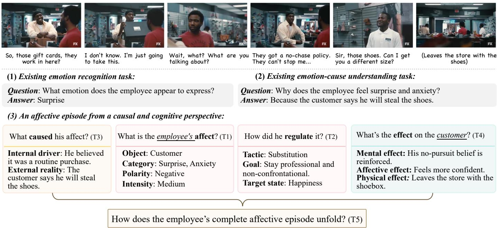  
Fig. 1. Existing affective benchmarks often evaluate local targets such as affective states or causes. TRACE-Bench evaluates the full cognitive-affective chain: from the conditions that give rise to an emotion, through the regulation that reshapes its expression, to the consequences it produces for the subject or other participants.

To address this gap, we introduce TRACE, short for Tracing Emotions from Causes to Consequences, to study cognitiveaffective processes in real-world social scenes with complex interpersonal dynamics. TRACE asks how a subject-centered affective episode can be formally represented, systematically evaluated, and computationally reconstructed from multimodal social interactions. We begin by defining the affective episode itself.

Affective Blueprint. We introduce an Affective Blueprint that represents an affective episode through three causally connected stages: Condition → Affect → Effect. Condition captures the antecedent of affect, including the external reality and the subject’s internal driver that together make the situation emotionally significant. Affect records the felt state and its observable manifestation, along with the regulatory process by which the subject may reshape what is displayed, for example suppressing sadness to maintain composure. Effect records the downstream consequences, mental, affective, and physical, that the episode produces for the subject or other participants. Each transition in this chain is shaped by cognition, whether through the subject’s interpretation of the triggering event, strategic regulation of display, or the observer’s inference from what is shown. Section 3.1 presents the theoretical grounding, and Section 3.2 gives the full formal definition.

TRACE-Bench. Based on this representation, TRACE-Bench formulates affective process understanding as five complementary, diagnostic tasks whose structural span widens along the chain, from a single stage, to cross-stage causal relations, to the complete episode. 1 Grounded Affect Recognition evaluates whether a predicted affective state is supported by the subject’s concrete manifestations. 2 Regulation Decoding evaluates whether a model can recover the cognitive regulation that mediates between the subject’s felt state and outward manifestation, including why and how the displayed affect is reshaped. 3 Affective Cause Reasoning and 4 Affective Effect Reasoning trace an observed affect backward to its external reality and internal driver, and forward to its mental, affective, and physical consequences. 5 Full Chain Reconstruction jointly recovers Condition, Affect, and Effect. It evaluates whether the reconstructed episode is supported by the observed evidence and remains cognitively and causally correct. The five tasks share the same Blueprint and annotation framework, allowing different reasoning capabilities to be evaluated from a unified process perspective. Under this task design, we carefully curate and annotate 3,746 structured question-answer pairs from 646 video clips, spanning diverse social scenes, interpersonal relations, and configurations of the Affective Blueprint.

TRACER. Evaluation on TRACE-Bench exposes two recurring failure patterns that motivate our method. The first is surface reading: a model reads affect from observable behavior without considering what the situation means to the person involved. In Fig. 1, the employee maintains a friendly manner when the customer announces the theft. Taken in isolation, his manner suggests a pleasant exchange. From his perspective, however, the announcement threatens his job, and maintaining his composure is a way of coping with that threat. Such a cognitive interpretation is needed to understand what gives rise to his affective state, what he actually feels, and why he regulates its expression, yet current models mostly remain at the level of observable behavior. The second is factual drift: when reconstructing an affective chain, a model treats interpretations it forms during reasoning, even when incorrect, as established facts and builds further conclusions on them, introducing plausible events that are not grounded in facts observable in the video. To address these failures, we propose TRACER, which structures reasoning around explicit factual observations and cognitive analysis of what those observations mean to the characters involved. Specifically, we first establish what occurs in the video, then analyze its significance from each character’s perspective along four cognitive appraisal dimensions: relevance, implication, coping potential, and normative significance. With this factual and cognitive basis, we derive the requested constructs through a task-specific reasoning topology grounded in the Blueprint. The topology specifies the dependencies supporting each inference, which the model makes explicit by citing the relevant observations, appraisal readings, or established conclusions as premises. Evaluation on TRACE-Bench shows that TRACER outperforms all evaluated model baselines on each of the five tasks. Diagnostic experiments show reduced factual fabrication under TRACER and improved State attribution with supplied appraisal records.

This work makes three contributions.

• We introduce the Affective Blueprint to formalize affective episodes in complex social scenes as three interrelated stages, Condition, Affect, and Effect, with cognition shaping the relations among them.

• We introduce TRACE-Bench, a multimodal benchmark with 3,746 structured QA pairs over 646 videos and five tasks that evaluate affective chain understanding at widening structural spans, from single-stage analysis through cross-stage reasoning to full-chain reconstruction.

• We propose TRACER, a Blueprint-guided structured reasoning method that grounds affective inference in factual observations and character-specific cognitive appraisals.

## 2 RELATED WORK

## 2.1 Affective Recognition and Extraction

Affective computing has long relied on benchmarks that make affect measurable through localized targets. Representative datasets such as IEMOCAP [2], MELD [5], and CMU-MOSI [4] standardize categorical or sentiment-oriented prediction from speech, facial behavior, and language. Dimensional settings further evaluate valence and arousal signals [31], as in the ABAW series [3]. EMOTIC [32] combines person and scene context to recognize categorical and dimensional emotions in images. Recent multimodal resources extend the input space to richer and larger settings, including face-audio integration [33] and privacy-aware de-identified observation [34]. MERBench [35] provides a unified evaluation of feature selection, multimodal fusion, and robustness for emotion recognition. These benchmarks are important because they establish whether a model can recognize affective evidence, yet their evaluation target is still centered on the current state, polarity, or expressed signal.

A related line moves from recognition to extraction, asking which part of the context explains an affective state. Emotion-Cause Pair Extraction [7], RECCON [8], MECPE [36], and SemEval-2024 Task 3 [37] recover the utterance, event, or pair associated with an emotion in dialogue. ECEM [11] adds free-form causal explanations, and MTMEUR [14] expands the format to progressive question answering over affective cues and triggering factors. Together, recognition and extraction benchmarks make affective evaluation concrete: a model predicts a state, identifies a cue, or selects an explanatory fragment. The resulting targets are useful and measurable, but they remain local with respect to the affective episode. They do not jointly evaluate the external situation, the subject’s internal driver, the relation between felt state and manifestation, and the effects that follow in the surrounding interaction.

## 2.2 Generative Affective Understanding

The rise of MLLMs has shifted affective evaluation from closed-form prediction toward open-ended output. Recent surveys of affective computing in the LLM era note that heterogeneous affective understanding and generation tasks are increasingly cast as instruction-following or sequencegeneration problems [16]. This matters for benchmark design because the expected output is no longer limited to a class label; it may also be an explanation, caption, judgment, or response. EMER [9] makes this shift explicit by asking models not only to predict emotions, but also to provide the evidence and reasoning behind the prediction, thereby using explanations to reduce label ambiguity and support more fine-grained affective labels. AffectGPT [10] further develops this direction with descriptive emotion annotations, MER-Caption, and MER-UniBench, aligning multimodal emotion understanding with the free-form output style of MLLMs. Emotion-LLaMA [13] focuses on instructiontuned multimodal emotion recognition and reasoning with audio, visual, and textual inputs, while EmoLLMs [38] studies instruction-following LLMs for broader affective analysis across classification and regression tasks. In parallel, emotional intelligence benchmarks such as EmoBench-M [28] and MME-Emotion [15] broaden evaluation from single tasks to multi-scenario understanding and reasoning, including the causes of an emotion. Their tasks are nevertheless scored independently, and none represents how a felt state is regulated in display or what it brings about in others. TRACE-Bench instead organizes its tasks around one subjectcentered episode, so that Condition, State, Manifestation, Regulation, and Effect are evaluated as components of one affective episode rather than as separate abilities.

## 2.3 Cognitive and Social Reasoning

A third line of work studies the social and cognitive reasoning needed to interpret human behavior beyond surface signals. Textual commonsense work, including Event2Mind [24], ATOMIC [25], and CICERO [26], studies intent, reaction, motivation, and likely subsequent events. In video and multimodal settings, Social-IQ [39] evaluates question answering for artificial social intelligence, MovieGraphs [40] represents movie clips with graphs of characters, relationships, interactions, attributes, and motivations, and DramaQA [41] uses character-centered hierarchical QA to evaluate video story understanding. Multimodal intent benchmarks such as MIntRec2.0 [42] further examine how language, vision, and audio support intent recognition in multi-party conversations. Theory-of-mind benchmarks make the latent cognitive target more explicit: MMToM-QA [43] evaluates belief and goal inference in household activities, MuMA-ToM [44] extends the setting to multi-agent interactions and beliefs about others’ goals, and MoMentS [45] evaluates ToM abilities in realistic narrative videos. EmoBench [27] and ToMBench [46] likewise place affective or social understanding within broader abilities such as emotional intelligence, intent attribution, and mental-state inference. These benchmarks clarify why affective computing in complex social scenes cannot be reduced to recognizing visible expressions. Their primary targets include intentions, beliefs, relations, story states, and general social judgments. TRACE-Bench centers these capabilities on a subject-centered affective episode, evaluating whether the triggering condition, the felt affective state, its manifestation, possible regulation, and the resulting mental, affective, and physical effects are mutually consistent under the Affective Blueprint.

## 3 PRELIMINARIES

This section draws on established theories from cognitive science and social psychology to analyze the internal composition of an affective process, and formalizes this analysis into a representation with concrete stages and attributes. Section 3.1 provides the theoretical grounding, and Section 3.2 translates it into the Affective Blueprint.

## 3.1 Theoretical Grounding

THEORY 1: Cognitive Appraisal Theory [17], [18], [47]

A situation acquires affective significance through appraisal of the relation between the external situation and the subject’s internal stance.

Affective responses depend on both what happens and the psychological state from which the subject encounters it. Appraisal theory explains this dependency: the significance of an event emerges through its evaluation in relation to the subject’s current beliefs, goals, concerns, and coping possibilities. The same external event can therefore produce different affective responses when subjects bring different internal states to it. As illustrated in Fig. 2, a poor exam result may evoke sadness for a student who treats it as evidence of personal failure, while eliciting determination when it is understood as an opportunity for growth. Modeling an affective episode therefore requires recovering both the external situation and the subject-specific internal conditions.

## THEORY 2: Emotion Regulation Theory [22], [48]

Emotion regulation can modify affective experience and expression, allowing outward manifestation to diverge from the felt state.

Even after an emotion has emerged, its outward manifestation may differ from what the subject feels. The mapping from felt affect to observable expression can be shaped by emotion regulation. A subject may suppress, amplify, substitute, or fabricate an affective display in response to social goals, relationship concerns, or situational expectations [49], [50]. The lower-left part of Fig. 2 illustrates this relation. Although the student remains sad, the presence of a rival motivates her to conceal the sadness and display a forced smile. This illustrates that an observable manifestation cannot always be interpreted as a direct readout of the underlying affective state. Therefore, understanding an affective process requires considering whether and how emotion regulation shapes the transition from what is felt to what is shown.

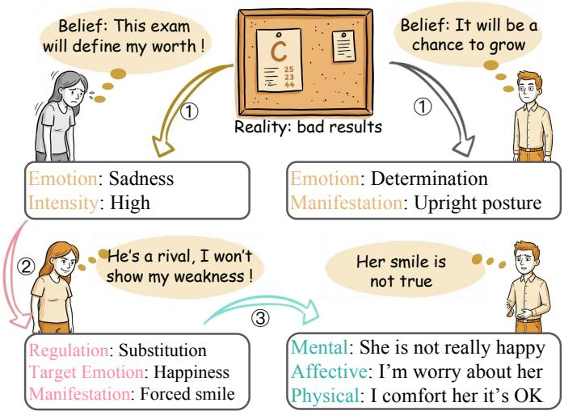  
Fig. 2. Theoretical grounding of affect as a causally structured process. The example illustrates how internal stance shapes affective meaning, how regulation can separate felt affect from display, and how displayed affect can influence others.

## THEORY 3: Emotions as Social Information (EASI) [23]

Emotions provide social information that can influence what others understand, feel, and do during interaction.

Affective experiences extend beyond individual expression and can shape the subsequent course of social interaction. The Emotions as Social Information (EASI) framework explains that a subject’s affective response provides socially relevant information that can influence how others understand the person and situation, how they feel in response, and how they subsequently behave [23], [51]. Observers interpret available affective cues together with the situational context, updating their beliefs and forming affective responses that can further guide their behavior toward the subject [52]. Affect can therefore propagate across individuals, producing cognitive, affective, and behavioral changes in others.

The lower-right part of Fig. 2 illustrates this interpersonal dynamic. In the example, another student forms the belief that she is concealing sadness (mental effect), feels concern for her (affective effect), and steps forward to offer comfort (physical effect). Therefore, understanding an affective process requires tracing how a subject’s affective response gives rise to downstream mental, affective, and physical consequences in others.

Together, the three theories each anchor one span of the chain: appraisal theory explains how affect is triggered (Condition), regulation theory explains how a feeling reaches its public form (Affect), and EASI explains how a display acts on others (Effect). They jointly establish the cognitive and causal account of affect that we formalize below.

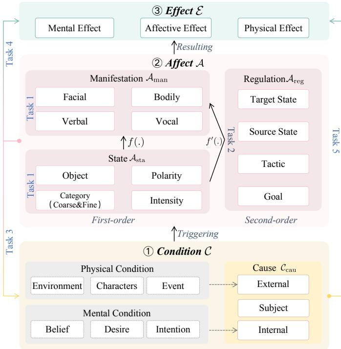  
Fig. 3. The Affective Blueprint. A subject-centered affective episode is represented through three causally connected stages: Condition, Affect, and Effect. Each stage is decomposed into several components, each represented by a set of fields.

## 3.2 The Affective Blueprint

Building on these theoretical foundations, we construct the Affective Blueprint B, our formal representation of a subjectcentered affective episode in real-world social interaction. The Blueprint includes three aspects that our formulation treats as jointly necessary: the conditions through which a situation acquires affective significance, the affective response together with its regulation and manifestation, and the downstream consequences that unfold in the interaction. We organize them into three causally connected stages, Condition C, Affect A, and Effect E:

$$
\mathcal { B } = \langle \mathcal { C } , \mathcal { A } , \mathcal { E } \rangle .\tag{1}
$$

Fig. 3 shows the resulting structure.

Stage I: Condition. Given a Subject $( C _ { \mathrm { s u b } } )$ whose affective process is being analyzed, the Condition stage provides the broader context from which the subject’s affective response emerges. Physical Condition describes the external situation through its environment, characters, and events, while Mental Condition captures the subject’s beliefs, desires, and intentions [53]. For a specific affective episode, we further identify the antecedents most directly relevant to the response as its affective cause. Specifically, External Reality $( C _ { \mathrm { e x t } } ^ { - } )$ captures the external circumstance implicated in the response, while Internal Driver $( C _ { \mathrm { i n t } } )$ captures the subjectspecific internal stance that gives this circumstance affective significance. We represent the affective cause as

$$
C _ { \mathrm { c a u } } = ( C _ { \mathrm { e x t } } , C _ { \mathrm { s u b } } , C _ { \mathrm { i n t } } ) .
$$

Stage II: Affect. The Affect stage comprises two first-order components, Affective State and Manifestation, together with a second-order analysis of their relation, Regulation. Affective State $( A _ { \mathrm { s t a } } )$ records what the subject feels through four fields: object, category, polarity, and intensity. Object specifies the person toward whom the affect is directed. Category identifies the affect at coarse and fine-grained levels, while polarity and intensity characterize its valence and strength. Manifestation $( A _ { \mathrm { m a n } } )$ records the outward expressions corresponding to $A _ { \mathrm { s t a } }$ across facial, bodily, verbal, and vocal channels. Facial and bodily channels capture visible expressions and movements, while verbal content captures what the subject says and vocal cues characterize the utterance’s acoustic and prosodic delivery.

Regulation $( A _ { \mathrm { r e g } } )$ provides a second-order analysis of the relation between $A _ { \mathrm { s t a } }$ and $A _ { \mathrm { m a n } }$ . It records the regulation tactic, its goal, and the source and target affective states. The source state s corresponds to the subject’s felt affective state $A _ { \mathrm { s t a } } ,$ while the target state t denotes the affective state intended for outward display through $A _ { \mathrm { m a n } }$ . In Fig. 2, for example, the student remains sad but displays a forced smile. Sadness is the source state, the smile is the manifestation, and happiness is the target state. Under Suppression, the target retains the source category even when its outward expression becomes barely perceptible. The tactic characterizes the relation between the source and target states.

Let $s _ { c }$ and $t _ { c }$ denote their respective categories, and let N denote Neutral. For a shared non-neutral category, $r _ { i } ~ \in$ {lower, comparable, higher} describes the intensity conveyed by the manifestation relative to the felt intensity. The five tactics are defined as follows:

$$
\mathrm { t a c t i c } ( s , t , r _ { i } ) = \left\{ \begin{array} { l l } { \mathrm { N o n e } , } & { s _ { c } = t _ { c } = N , } \\ & { \mathrm { o r } s _ { c } = t _ { c } \neq N , r _ { i } = \mathrm { c o m p a r a b l e } , } \\ { \mathrm { S u p p r e s s i o n } , } & { s _ { c } = t _ { c } \neq N , r _ { i } = \mathrm { l o w e r } , } \\ { \mathrm { A m p l i f i c a t i o n } , } & { s _ { c } = t _ { c } \neq N , r _ { i } = \mathrm { h i g h e r } , } \\ { \mathrm { S u b s t i t u t i o n } , } & { s _ { c } \neq N , t _ { c } \notin \{ s _ { c } , N \} , } \\ { \mathrm { F a b r i c a t i o n } , } & { s _ { c } = N , t _ { c } \neq N . } \end{array} \right.\tag{2}
$$

For a multi-label $A _ { \mathrm { s t a } } , \ s _ { c }$ denotes the particular affective category involved in the regulation. We record the target category and encode its intensity relative to the source through the regulation tactic, rather than assigning a separate target-intensity value. The Affect stage is thus represented as

$$
\begin{array} { r } { \mathcal { A } = ( A _ { \mathrm { s t a } } , A _ { \mathrm { m a n } } , A _ { \mathrm { r e g } } ) . } \end{array}
$$

Stage III: Effect. The Effect stage records the downstream consequences of the Subject’s affective response within the interaction. We distinguish three channels. Mental Effect $\left( E _ { \mathrm { m e n } } \right)$ records what a recipient comes to believe, desire, or intend. Affective Effect $\bar { ( E _ { \mathrm { a f f } } ) }$ records the affect experienced by the recipient as a consequence. Physical Effect $( E _ { \mathrm { p h y } } )$ records the recipient’s resulting action or behavioral response. Each channel is associated with its own recipient, so different effects within the same affective episode may involve different individuals. The recipient may also be the

TABLE 1  
Field-level schema of the Affective Blueprint. Each row specifies one field and its admissible value space. Effect fields describe the impact of the subject’s affect. Effect recipients are identified within the corresponding effect fields.
<table><tr><td>Component</td><td>Field</td><td>Definition</td><td>Value space</td></tr><tr><td colspan="4">I CONDITION What triggers an affect?</td></tr><tr><td rowspan="2">Cause  $\left( C _ { \mathrm { c a u } } \right)$ </td><td>subject</td><td>Focal person in the affective episode</td><td>Free-form text</td></tr><tr><td>external_reality internal_driver</td><td>Objective event triggering the subject&#x27;s affect Subject&#x27;s belief, desire, or intention motivating affect</td><td>Free-form text Free-form text</td></tr><tr><td colspan="4"></td></tr><tr><td rowspan="6">Affective State  $\left( A _ { \mathrm { s t a } } \right)$ </td><td>object</td><td>Il AFFECT What is the subject&#x27;s affective state, and how is it expressed and regulated? Person toward whom the affect is directed</td><td>Free-form text</td></tr><tr><td>coarse_category</td><td>Category of the subject&#x27;s affective state</td><td>12 categories</td></tr><tr><td>fine_description</td><td>Contextual nuance or blend of affect</td><td>Free-form text</td></tr><tr><td>polarity</td><td>Valence of the affective state</td><td>{Positive, Negative, Neutral, Mixed}</td></tr><tr><td>intensity</td><td>Strength of the affective state</td><td>{High, Medium, Low, None}</td></tr><tr><td></td><td></td><td></td></tr><tr><td rowspan="5">Manifestation  $\left( A _ { \mathrm { m a n } } \right)$ </td><td>facial_expression body_language</td><td>Observable facial movement or configuration Observable posture, gesture, movement, or spatial behavior</td><td>Free-form text Free-form text</td></tr><tr><td>vocal_cues</td><td>Tone, pitch, volume, pace, or rhythm</td><td>Free-form text</td></tr><tr><td>verbal_content</td><td>Subject&#x27;s words or speech act</td><td>Free-form text</td></tr><tr><td>tactic_type</td><td></td><td></td></tr><tr><td>goal</td><td>Regulatory relation between source and target</td><td>See Eq. (2)</td></tr><tr><td rowspan="3">Regulation  $\left( A _ { \mathrm { r e g } } \right)$ </td><td></td><td>Purpose of regulating the affective state source_affect_state Affective state before regulation</td><td>Free-form text</td></tr><tr><td></td><td></td><td>12 categories</td></tr><tr><td></td><td>target_affect_state Affective state the subject intends to manifest</td><td>12 categories</td></tr><tr><td colspan="4">III EFFECT How does the subject&#x27;s affect influence those present? Mental Effect</td></tr><tr><td> $\left( E _ { \mathrm { m e n } } \right)$ </td><td>mental_effect</td><td>Impact on a recipient&#x27;s mental state</td><td>Free-form text</td></tr><tr><td>Affective Effect  $( E _ { \mathrm { a f f } } )$ </td><td>affective_effect</td><td>Impact on a recipient&#x27;s affective state</td><td>Free-form text</td></tr><tr><td colspan="2">Physical Effect  $( E _ { \mathrm { p h y } } )$  physical_effect</td><td>Impact on a recipient&#x27;s action or speech</td><td>Free-form text</td></tr></table>

Subject. For example, a person who remains angry with a colleague may later refuse the colleague’s request for help because of that anger. Here, the Physical Effect is the Subject’s own subsequent behavior. The Effect stage is represented as

$$
\mathcal { E } = ( E _ { \mathrm { m e n } } , E _ { \mathrm { a f f } } , E _ { \mathrm { p h y } } ) .
$$

Table 1 summarizes the fields and value forms used to represent these components.

## 4 TRACE-BENCH: BENCHMARKING AFFECTIVE CHAIN INFERENCE

Building on the Affective Blueprint, we develop TRACE-Bench to evaluate affective chain inference in multimodal social videos. We first formulate five tasks covering withinstage reasoning, cross-stage reasoning, and full-chain reconstruction, then describe the data construction process and evaluation protocol.

## 4.1 Task Formulation

Each task takes a multimodal social video v, including its visual content, audio, and aligned subtitles, as the base input. A task instance specifies three parts:

• Context $\left( \mathrm { c t x } _ { t } \right)$ identifies the focal subject and episode.

• Known Constructs $( K _ { t } )$ are the Blueprint constructs whose values are provided by the question.

• Queried Constructs (Q<sub>t</sub>) specify which Blueprint constructs the model is asked to infer and, for a queried Effect, its channel and recipient.

A known construct may be supplied through only a subset of its fields, as specified for each task. The answer template

specifies the requested fields and any supporting evidence required by the task. The model generates the answer as

$$
\widehat { Y } _ { t } = f ( v , \mathrm { c t x } _ { t } , K _ { t } , Q _ { t } ) .\tag{3}
$$

The five tasks cover within-stage reasoning (Tasks 1–2), crossstage reasoning (Tasks 3–4), and full-chain reconstruction (Task 5). The mappings below summarize their given and queried constructs, with the shared video input v omitted. Construct symbols denote task-level roles, with the supplied or predicted fields specified in the accompanying text and answer template. Square brackets indicate annotationdependent constructs.

Task 1. Grounded Affect Recognition. Given ctx<sub>1</sub>, which specifies the focal subject and episode, the model jointly predicts Affective State $A _ { \mathrm { s t a } }$ and Manifestation $A _ { \mathrm { m a n } } \mathrm { . }$

$$
( \mathrm { c t x } _ { 1 } ) \longrightarrow Q _ { 1 } = \{ A _ { \mathrm { s t a } } , A _ { \mathrm { m a n } } \}\tag{4a}
$$

No Blueprint constructs are supplied. Task 1 evaluates joint recognition of the subject’s felt state and observable expressions from multimodal evidence.

Task 2. Regulation Decoding. Task 2 asks whether and how the observed manifestation is regulated relative to the felt affective state. The task supplies the category under regulation, its intensity, and the affective object as known information about $\boldsymbol { A } _ { \mathrm { s t a } } .$ Within the episode specified by ctx<sub>2</sub>, the model infers regulation $A _ { \mathrm { r e g } } { \mathrm { : } }$

$$
( \mathrm { c t x } _ { 2 } ; A _ { \mathrm { s t a } } ) \longrightarrow Q _ { 2 } = \{ A _ { \mathrm { r e g } } \}\tag{4b}
$$

The model reads the display from the video and determines whether it has been reshaped relative to the given state. Its answer identifies the tactic and, when regulation occurs, the goal and target affective state intended for outward display. In addition to the queried Regulation construct, Task 2 requires Regulation Evidence $( M _ { \mathrm { r e g } } )$ , comprising the manifestation cues in $A _ { \mathrm { m a n } }$ that specifically support the inferred regulation. $M _ { \mathrm { r e g } }$ is scored on regulated instances and is not an additional Blueprint construct. The source state is fixed by the supplied $\bar { A } _ { \mathrm { s t a } }$ . Whereas Task 1 jointly identifies what is felt and shown, Task 2 examines the regulatory relation between them.

Task 3. Affective Cause Reasoning. Task 3 reasons backward from the subject’s Affect to its cause. Given $A _ { \mathrm { s t a } } , A _ { \mathrm { m a n } } ,$ and any available annotation of $A _ { \mathrm { r e g } } ,$ together with ct $\mathrm { { X } _ { 3 } , }$ the model infers the relevant antecedents in the Condition stage:

$$
( \mathrm { c t x } _ { 3 } ; A _ { \mathrm { s t a } } , A _ { \mathrm { m a n } } , [ A _ { \mathrm { r e g } } ] ) \longrightarrow Q _ { 3 } = \{ C _ { \mathrm { e x t } } , [ C _ { \mathrm { i n t } } ] \}\tag{4c}
$$

The supplied $A _ { \mathrm { s t a } }$ includes category, intensity, polarity, and object, but excludes the fine-grained description. $A _ { \mathrm { m a n } }$ includes the annotated channels. The model must ground the affective outcome in its external antecedent and, when the annotation supports it, infer the Internal Driver that gives the event its affective significance. External Reality is required in every Task 3 instance, while Internal Driver is included only when supported by the annotation.

Task 4. Affective Effect Reasoning. Task 4 reasons forward from the subject’s Affect to its Effect. Given $A _ { \mathrm { s t a } } , A _ { \mathrm { m a n } } ,$ and any available annotation of $A _ { \mathrm { r e g } } ,$ together with ctx<sub>4</sub>, the model predicts the consequence along the queried Effect channel for the specified recipient. We write this query as $E _ { q } ( r )$ , where $q \in \dot { \{ \mathrm { m e n } , \mathrm { a f f } , \mathrm { p h y } \} }$ identifies the channel and r the recipient:

$$
( \mathrm { c t x } _ { 4 } ; A _ { \mathrm { s t a } } , A _ { \mathrm { m a n } } , [ A _ { \mathrm { r e g } } ] ) \longrightarrow Q _ { 4 } = \{ E _ { q } ( r ) \}\tag{4d}
$$

Unlike Task $^ { 3 , }$ the supplied $A _ { \mathrm { s t a } }$ also includes the finegrained description. $\bar { A _ { \mathrm { m a n } } }$ and $A _ { \mathrm { r e g } }$ follow the same provision rules as in Task 3. Task 4 infers the downstream consequence for the specified recipient along the queried Effect channel.

Task 5. Full Chain Reconstruction. Task 5 jointly recovers the complete Affective Blueprint from ctx<sub>5</sub>, which identifies the focal subject, affective object, and episode anchor. The query specifies the Condition and Affect constructs together with the requested Effect channels and their recipients:

$$
( \mathrm { c t x } _ { 5 } ) \longrightarrow Q _ { 5 } = \{ C _ { \mathrm { e x t } } , [ C _ { \mathrm { i n t } } ] , A _ { \mathrm { s t a } } , A _ { \mathrm { m a n } } , [ A _ { \mathrm { r e g } } ] , E \}\tag{4e}
$$

Here E collectively denotes the requested $E _ { q } ( r )$ entries. The affective object is given in ct $\mathrm { x } _ { \mathrm { 5 } }$ and is neither inferred nor scored. No other Blueprint fields are supplied. Question and answer templates appear in Appendix C.4.

## 4.2 Data Construction

Step 1: Source Collection. We construct TRACE-Bench from social video clips drawn from Movie-clips [54], EQ4You [55], and Social-IQ [39]. The raw collections are first screened by an MLLM that summarizes each clip’s basic content and filters out clips that lack sufficient context for a recognizable affective episode, such as isolated reaction shots, expositiononly dialogue, single-person monologues, and highly stylized performances. Clips that pass this initial screening are further verified during chain annotation, where additional unsuitable clips are discarded. This two-stage process yields a curated pool of context-rich social interaction clips.

Step 2: Chain Annotation. The basic annotation unit is a subject-centered affective chain, namely a subject-centered affective episode anchored at a specific moment in the video. We adopt this granularity because the Affective Blueprint is defined around a single subject’s process from Condition through Affect to Effect. Each chain is stored as a structured JSON object organized by the three Blueprint stages. A video may yield multiple chains across characters or moments, each localized by an episode anchor such as an utterance, facial display, body action, or vocal cue.

For each selected clip, an MLLM drafts candidate chains from the video and subtitles. Human annotators then reject invalid proposals, correct inaccurate fields, add missed episodes, and verify the retained content against the subject, anchor, and scene evidence. Appendix C.1 reports fieldlevel rewrite rates for retained candidate chains. During verification, a field is filled only when the video and subtitles provide sufficient evidence for it. A chain is retained as long as it contains sufficient information for at least one valid stage or cross-stage relation. The independent re-annotation protocol and agreement results are reported in Appendix C.2, while guidelines for selected key fields are provided in Appendix C.3.

Step 3: QA Annotation. A verified chain may support multiple evaluation tasks, depending on which parts of the Blueprint are available in its annotation. We therefore assign each chain only to the tasks it can support and convert the corresponding annotations into task-specific QA pairs through predefined templates. For each eligible task, the template determines which information is exposed as the episode context ct $\mathrm { x } _ { t }$ and Known Constructs $K _ { t } ,$ which constructs are queried as $Q _ { t } ,$ and how the relevant chain fields are rewritten into the question and reference answer. The same chain may consequently yield multiple QA pairs under different task templates. Each resulting pair undergoes final human validation against the original chain annotation.

Dataset Statistics. TRACE-Bench contains 3,746 structured QA pairs from 646 videos. The videos span settings such as homes and workplaces, covering close personal relationships as well as professional and authority-based interactions.

Task 1 uses a 12-category affective vocabulary comprising basic categories grounded in Ekman’s account [56], additional categories such as guilt and relief, and Neutral. Task 2 covers all five regulation tactics, from intensity modulation and category substitution to None, where the display matches the felt state. Task 4 contains between 286 and 452 queries for each of the three Effect channels. Fig. 4 summarizes task composition and annotation distributions.

## 4.3 Evaluation Protocol

The five tasks require predictions of both categorical labels and open-ended descriptions, which we score at the field level before aggregating them into task scores. Categorical predictions are compared directly with the reference: since an Affective State can contain multiple categories, category sets are scored by set-F1, and single-label fields by exact match.

Open-ended descriptions can express equivalent content in different wording, so we use DeepSeek-V4-Flash to rate each prediction against the annotated reference. Semantic adequacy, $d _ { 1 } ,$ , measures whether the prediction captures the intended content for the correct character and episode. A prediction may also overlap with the reference by repeating generic statements or listing competing guesses, and a separate redundancy rating, $d _ { 2 }$ , estimates how much of the answer adds no information relevant to the queried field. Each field is rated repeatedly, and the $d _ { 1 }$ and $d _ { 2 }$ values are averaged separately, giving the field score

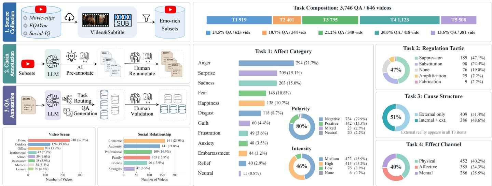  
Fig. 4. TRACE-Bench construction pipeline and dataset statistics, with the three-stage construction workflow on the left.

$$
s ( f ) = \bar { d } _ { 1 } ( f ) \big ( 1 - \lambda \bar { d } _ { 2 } ( f ) \big ) ,\tag{5}
$$

where both ratings lie in [0, 1] and λ bounds the redundancy discount. We set $\lambda = 0 . 5 ,$ so that redundancy can reduce a field score by at most half while semantic adequacy remains its basis. Appendix B.1 provides the field-matching rules and judging rubric.

Field scores are combined along the structure of the Affective Blueprint: fields are first averaged within constructs and then constructs within stages, so that a construct described by several fields, such as Manifestation, does not outweigh the others. Full-chain reconstruction thus gives Condition, Affect, and Effect equal weight. In Task 2, Regulation Evidence is scored alongside the applicable Regulation fields, with equal weight for each. With $N _ { t }$ evaluated items in task $t , F _ { t i }$ the evaluated fields of item $i ,$ and $w _ { t i } ( f )$ their normalized taskspecific weights, the overall score averages item scores within each task and then across tasks:

$$
\mathrm { T R A C E - S c o r e } = \frac { 1 0 0 } { 5 } \sum _ { t = 1 } ^ { 5 } \frac { 1 } { N _ { t } } \sum _ { i = 1 } ^ { N _ { t } } \sum _ { f \in F _ { t i } } w _ { t i } ( f ) s _ { t i } ( f ) .\tag{6}
$$

Appendix B.2 specifies task-dependent scoring conditions and the treatment of missing fields, Appendix B.3 the scoring and reporting of unparsed outputs, and Appendix A.7 human solvability and judge calibration.

We use video-level cluster bootstrap (10,000 resamples), sampling videos with replacement and retaining all their items, with shared resamples across models and tasks. We apply Holm correction to comparisons against 14 baselines on each of the five tasks. The same resamples yield the 95% confidence interval for the five-task average margin over GPT-5 (thinking).

## 5 TRACER: COGNITION-GROUNDED STRUC-TURED REASONING

TRACE tasks involve heterogeneous Blueprint constructs, including observable manifestations, psychological drivers, affective states, regulation, and downstream effects. Inferring these constructs requires different forms of evidence and attention to their dependencies within an affective episode. This complexity presents two challenges to current models. First, models must interpret the affective meaning behind the observed behaviors and interactions. They must determine whether an event functions as an affective trigger for the subject and whether an outward manifestation expresses the felt state or a regulated display. Reliance on visible cues leads to a surface reading that collapses these alternatives. Second, placing heterogeneous constructs in a single generation process increases factual drift, especially in multi-field, longchain reconstruction. An upstream interpretation may be promoted into an established fact and then used to generate a plausible downstream event beyond the recorded evidence. The resulting chain remains linguistically coherent while departing from what occurs in the video.

To address these challenges, we propose TRACER, which constrains every inference to premises from factual observations, their affective meanings, and relevant Blueprint constructs.

## 5.1 Method Overview

As shown in Fig. 5, TRACER transforms multimodal social video into task-specific predictions through three stages. Factual Observation Extraction converts the video and aligned subtitles into an indexed record O of observable events, behaviors, and utterances. Cognition-Grounded Affective Analysis interprets the relevant observations from the involved characters’ perspectives, producing character-specific appraisal readings A. Blueprint-Guided Structured Derivation combines these observations and appraisal readings with the task’s known and queried constructs to derive the requested outputs through premise-grounded reasoning.

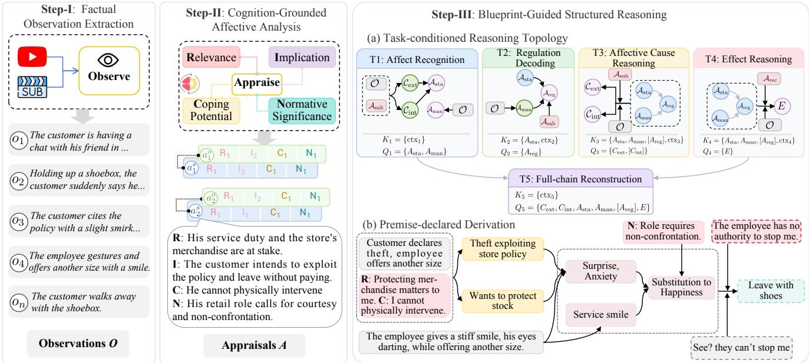  
Fig. 5. Overview of TRACER. Factual observations are interpreted through character-centered appraisal and used in Blueprint-guided derivation. (a) Gray arrows denote intrinsic relations, while black arrows specify inference dependencies and premise requirements. Blue, green, and purple construct nodes denote known, intermediate, and queried constructs, respectively. (b) An abridged shoe-store example illustrates how observations, appraisals, and intermediate conclusions jointly support subsequent inferences.

The five tasks share this pipeline and the Affective Blueprint, while the final derivation is organized according to each task’s supplied and queried constructs. All three stages use stage-specific prompts with off-the-shelf MLLMs or LLMs and require no additional training.

## 5.2 Factual Observation Extraction

The first stage establishes the factual record used throughout reasoning. Given a complete video v and aligned subtitles $s ,$ the observation module (Appendix A.2) produces

$$
\mathcal { O } = \mathrm { O b s e r v e } ( v , s ) = \{ o _ { i } \} _ { i = 1 } ^ { n } ,\tag{7}
$$

where each observation item $o _ { i }$ records factual content from a local video interval or its aligned subtitles and receives a stable identifier. Together, they form a temporally ordered account of the participants, actions, interactions, facial and bodily behavior, vocal delivery, and spoken content in the scene.

This stage records perceptible content before assigning its affective meaning. Affective state, internal driver, regulation, and downstream effect are therefore reserved for later reasoning. This boundary gives every subsequent conclusion an independent factual source and keeps an inferred state from becoming evidence for its own manifestation.

The model uses the task context ctx<sub>t</sub> as an anchor to locate relevant observations in O. It then selects and groups observation items $S _ { t } \subseteq \mathcal { O }$ for appraisal and reasoning. The full record remains available for citation throughout the subsequent stages.

## 5.3 Cognition-Grounded Affective Analysis

An observed event acquires affective meaning through its relation to a character’s goals, expectations, resources, and social position. Inspired by cognitive appraisal theory [18], we analyze the selected items from the position of the character involved. The analyzed characters are specified by the task, namely the subject and, when the query includes an Effect, the target recipient. For character r, a selected group of items $S _ { t , k } \subseteq S _ { t } ^ { \mathsf { ^ { - } } }$ , and appraisal dimension $d ,$ the analysis produces

$$
a _ { r , k } ^ { ( d ) } = \operatorname { A p p r a i s e } _ { d } ( S _ { t , k } \mid r ) , \qquad d \in \mathbb { D } ,\tag{8}
$$

where $a _ { r , k } ^ { ( d ) }$ is a complete natural-language proposition stating what the cited facts mean from $r ^ { \prime } { \mathrm { s } }$ position. Its evidence links remain attached to the proposition. The four dimensions in D examine complementary parts of this meaning:

Cognitive Appraisal Dimensions

• Relevance identifies why the event attracts the character’s attention through novelty, intrinsic pleasantness, or relation to an active goal or need.

• Implication determines the event’s consequences for that goal or need through agency, expected outcome, goal conduciveness, and urgency.

• Coping Potential examines the character’s control, available power and resources, and capacity to adapt to the consequences.

• Normative Significance evaluates compatibility with the character’s self-concept, personal standards, and recognized social or moral standards.

The output of each dimension is an evidence-grounded interpretation rather than a score, level, category, or polarity. We collect the resulting readings as A. In Fig. 5(a), A<sub>sub</sub> and $A _ { \mathrm { r e c } }$ denote the subject-side and recipient-side readings in this collection. Subject-side readings are produced for every selected group. When the queried construct includes an Effect, recipient-side readings are additionally produced for the group that contains the subject’s described behavior. The same observation can thus receive different meanings under the subject and recipient perspectives while each interpretation remains bound to its role and cited facts. These readings enter Blueprint-guided derivation as cognitive premises, not final field values. Core prompt instructions appear in Appendix A.3.

## 5.4 Blueprint-Guided Structured Derivation

Given the factual observations O and appraisal readings A established in the previous stages, the final stage derives the Blueprint constructs required by the task. The five tasks share the same affective structure but differ in their known constructs $K _ { t }$ and queried constructs $Q _ { t }$ , requiring different derivation paths. $\bar { \mathsf A }$ task-conditioned reasoning topology specifies which constructs must be established, what information each inference requires, and their derivation order. Premise-declared derivation then uses concrete premises from the current video to carry out these inferences.

Task-conditioned reasoning topology (RT). The Affective Blueprint provides the common construct system and the intrinsic relations among its components. RT organizes the dependencies needed to establish the queried constructs, introducing missing constructs as intermediate conclusions when needed. Fig. 5(a) distinguishes intrinsic Blueprint relations in gray from active inference links in black. The former describe how constructs are related within an affective episode, while the latter specify how available information is used to derive a construct for the current task. In Task 3, for example, supplied Affect constrains the inference of its antecedent Condition, while the underlying affective process still follows Condition → Affect.

Nodes. We retain External, Internal, State, Manifestation, Regulation, and Effect as construct nodes. Their roles depend on the task: a construct may be supplied in $K _ { t } ,$ introduced as an intermediate conclusion, or queried in $Q _ { t }$ . Premisesource nodes represent observations O and subject-side and recipient-side appraisal collections $\mathcal { A } _ { \mathrm { s u b } }$ and $\mathcal { A } _ { \mathrm { r e c } }$

Links. A construct-dependency link $u \to x$ requires information from u to infer x. External and Internal jointly support State, reflecting how an external event acquires affective significance in relation to the subject’s internal stance. State and Manifestation jointly support Regulation through their comparison. Effect draws on the supplied or derived Affect constructs, including Regulation when applicable. The topology also specifies the premise sources used by each inference. External and Internal draw on observations together with subject-side appraisal. Manifestation is derived directly from observations, independently of the inferred State. Regulation uses subject-side appraisal, while Effect uses appraisal from the queried recipient.

We represent the resulting topology as

$$
\mathcal { T } _ { t } = ( V _ { t } , E _ { t } , \prec _ { t } ) .\tag{9}
$$

where $V _ { t }$ contains the relevant construct and premise-source nodes, $E _ { t }$ contains the active inference links, and $\prec _ { t }$ places construct premises before conclusions that use them. Supplied values in $K _ { t }$ remain fixed during derivation.

Premise-declared derivation (PDD). Following the topology, PDD selects concrete observations and appraisal readings for the current video, together with supplied constructs or earlier conclusions, and cites them as premises. This design follows the broader principle of making intermediate reasoning structure explicit during inference, as explored in prior work on faithful and structured logical reasoning [57], [58]. For each intermediate or queried construct, the model jointly produces the construct identity, its premise references, and the inferred field values:

$$
c _ { j } = \langle x _ { j } , P _ { j } , y _ { j } \rangle .\tag{10}
$$

Here $x _ { j }$ identifies the construct, $P _ { j }$ records its premise references, and $y _ { j }$ contains its inferred field values. The derivation sequence $\bar { \mathcal { D } _ { t } } = ( c _ { 1 } , \ldots , c _ { L } )$ follows $\prec _ { t }$ . Established nodes become available to later steps with fixed identifiers and field values, while the full observation and appraisal collections remain accessible for premise selection. The final answer values $\mathcal { D } _ { t } [ Q _ { t } ]$ are extracted from the queried nodes rather than generated separately. These form the task answer $\widehat { Y } _ { t } ,$ with Task 2 additionally including Regulation Evidence $M _ { \mathrm { r e g } } .$

In Fig. 5(b), the customer’s declaration and the employee’s appraisal establish External, while the employee’s concerns about merchandise and non-confrontation support Internal. These intermediate conclusions then support the inferred State. For Task 1, the Condition constructs therefore serve as intermediate premises even though the task queries State and Manifestation.

## 6 EXPERIMENTS

## 6.1 Experimental Setup

Model groups. We compare TRACER with the three baseline groups listed in Table 2. Open-source generic models cover different scales and multimodal architectures, including LLaVA-OneVision [59], MiniCPM-V-4.5 [61], InternVL3.5 [64], and Qwen3-VL [65]. Affective-specialized models are trained specifically for emotion understanding and include Emotion-LLaMA [13], AffectGPT [10], and Emotion-Qwen [66]. Closedsource models comprise GPT-5 [67], evaluated in thinking and non-thinking modes, and Gemini-3-Pro [68]. These groups allow comparison of model-family strengths and limitations across TRACE tasks.

Implementation details. Baseline models receive video frames, available subtitles appended to the prompt, and the task question. Only Qwen3-Omni-30B receives audio. Frame budgets are model-specific: GPT-5 uses eight uniformly sampled frames, while Qwen3-VL-32B uses its video processor with a 60-frame budget, both covering the full clip. The question provides known information and a JSON template specifying the requested fields. For TRACER, Qwen3-VL generates factual observation records, and GPT-5 generates character-specific appraisals and subsequent construct-level inferences. Appendix A.1 gives full inference settings. All models follow the evaluation protocol in Section 4.3.

## 6.2 Main Results on TRACE-Bench

Overall performance. Closed-source general-purpose models lead the baselines in Table 2, with GPT-5 (thinking) scoring highest overall. TRACER outperforms every model baseline

TABLE 2  
Main results on TRACE-Bench. Avg. averages T1–T4 and T5 Full. Model scores use the main evaluation set; Human scores use a subset of 50 questions per task. Matched model scores are in Appendix A.7. Per-stage T5 scores are in Section 6.4. Unless otherwise stated, tables use bold for the best model results and underlining for the second best. \* marks cells with substantial parsing failures, and † cells where most outputs could not be parsed.
<table><tr><td>Model</td><td>T1 Rec.</td><td>T2 Reg.</td><td>T3 Cause</td><td>T4 Effect</td><td>T5 Full</td><td>Avg.</td></tr><tr><td>Human (n = 50)</td><td>83.60</td><td>72.32</td><td>85.55</td><td>78.90</td><td>75.40</td><td>79.15</td></tr><tr><td colspan="7">Affect Specialized</td></tr><tr><td>Emotion-LLaMA [13]</td><td>0.45</td><td>5.22*</td><td>2.26+</td><td>0.31†</td><td>0.20†</td><td>1.69</td></tr><tr><td>AffectGPT [10]</td><td>34.57</td><td>4.64+</td><td>17.99*</td><td>15.79*</td><td>20.87</td><td>18.77</td></tr><tr><td>Emotion-Qwen</td><td>29.45*</td><td>24.24*</td><td>21.04*</td><td>13.49</td><td>19.13*</td><td>21.47</td></tr><tr><td colspan="7">Open Source Generic</td></tr><tr><td>LLaVA-OneVision-7B [59]</td><td>35.13</td><td>23.51</td><td>25.28</td><td>4.11</td><td>5.47†</td><td>18.70</td></tr><tr><td>LLaVA-NeXT-Video-32B [60]</td><td>25.89</td><td>27.01</td><td>27.13*</td><td>23.61</td><td>13.80*</td><td>23.49</td></tr><tr><td>MiniCPM-V-4.5 [61]</td><td>37.30</td><td>29.19</td><td>43.04</td><td>28.27</td><td>29.43</td><td>33.45</td></tr><tr><td>GLM-4.6V-Flash-9B [62]</td><td>40.80</td><td>28.85</td><td>42.30</td><td>28.81</td><td>32.36</td><td>34.62</td></tr><tr><td>LLaVA-OneVision-70B [59]</td><td>42.74</td><td>26.73</td><td>47.30</td><td>33.03</td><td>34.62</td><td>36.88</td></tr><tr><td>Qwen3-Omni-30B [63]</td><td>46.28</td><td>33.17</td><td>51.69</td><td>39.81</td><td>41.78</td><td>42.55</td></tr><tr><td>InternVL3.5-38B [64]</td><td>45.35</td><td>28.05</td><td>46.16</td><td>32.19</td><td>37.07</td><td>37.76</td></tr><tr><td>Qwen3-VL-32B [65]</td><td>50.97</td><td>35.49</td><td>60.42</td><td>44.38</td><td>50.16</td><td>48.28</td></tr><tr><td colspan="7">Closed Source Generic</td></tr><tr><td>GPT-5 (non-thinking)</td><td>56.13</td><td>37.26</td><td>70.74</td><td>52.36</td><td>58.22</td><td>54.94</td></tr><tr><td>Gemini-3-Pro</td><td>54.32</td><td>40.55</td><td>70.74</td><td>51.48</td><td>56.05</td><td>54.63</td></tr><tr><td>GPT-5 (thinking)</td><td>56.61</td><td>41.56</td><td>77.11</td><td>53.75</td><td>60.79</td><td>57.96</td></tr><tr><td>TRACER (Ours)</td><td>61.67</td><td>49.53</td><td>84.55</td><td>59.47</td><td>63.59</td><td>63.76</td></tr></table>

(a) Component profile.  
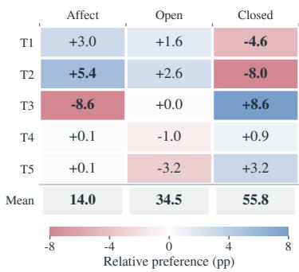

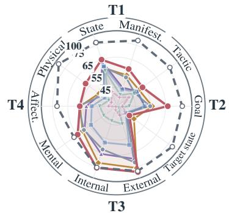  
(b) Family preference.  
Fig. 6. Model profiles by (a) task component and (b) family. Human scores average two participants.

For a matched human–model comparison, we evaluate models on the same 50 questions per task answered by the two human participants (Appendix A.7). On this subset, humans average 79.15, GPT-5 (thinking) 58.75, and TRACER 63.58, leaving a human–TRACER gap of 15.57 points. TRACER is closest to humans on T3: 84.39 versus 85.55, a 1.16-point gap. The other four tasks show larger gaps.

Scale and thinking yield task-selective gains. Within LLaVA-OneVision, scaling from 7B to 70B improves all five tasks, with the largest gains in cause reasoning, effect reasoning, and full-chain reconstruction. However, Qwen3- VL-32B outperforms the 70B model across all tasks, showing that parameter count alone does not explain performance differences across models. Enabling thinking in GPT-5 primarily benefits cause diagnosis and regulation decoding, with smaller gains in affect recognition and effect reasoning. For example, T3 improves by 6.37 points, whereas T1 changes by only 0.48 points.

on each task $( p \ < \ 0 . 0 5$ , bootstrap test, Holm-corrected). Its average margin over GPT-5 (thinking) is 5.80 points (bootstrap 95% CI 4.42 to 7.17). The largest gains occur in T2 regulation decoding (7.97 points) and T3 cause diagnosis (7.44 points), followed by T4 effect reasoning and T1 affect recognition. Gains span recognition and reasoning. Full-chain reconstruction shows the smallest improvement. Despite this improvement, T2 remains the lowest-scoring task for both GPT-5 (thinking) and TRACER.

Model families favor different tasks. Fig. 6b shows distinct task profiles across the three model families. Affectspecialized models exhibit relative strengths in T1 affect recognition and T2 regulation decoding, but a pronounced weakness in T3 cause reasoning. Open-source generalpurpose models have a more balanced profile across individual tasks, yet show a deficit in T5, where Condition, Affect, and Effect must be reconstructed jointly. Closedsource models display a contrasting pattern: their strengths are concentrated in cause reasoning and full-chain reconstruction, while T1 and T2 are comparatively weaker parts of their profile. Scores are centered by family and task averages (supplementary Eq. S1), so these profiles describe withinfamily task preferences, not absolute rankings across families. Closed-source models can therefore be relatively weaker on T1 and T2 yet score higher than affect-specialized models.

## 6.3 Evidence Ablation

Design. To assess the contribution of video evidence beyond the information supplied in each task, we evaluate GPT-5 (thinking) and Qwen3-VL-32B with the question and supplied fields alone, then add subtitles, frames, or both. Frame inputs use eight frames for GPT-5 and 60 for Qwen. We also test GPT-5 with subtitles and 16 frames.

Results and analysis. Joint subtitle and frame input outperforms question-only input on all five tasks for both models (Fig. 7), showing that the supplied fields do not replace episode-specific evidence. Neither channel alone matches joint input on any task, supporting the need for multimodal evidence in affective understanding. Channel preferences nevertheless vary: both models favor subtitles on T3 and T5, but their preferences differ on T1, T2, and T4. For example, Qwen favors frames on T4, whereas GPT-5 favors subtitles. Increasing GPT-5’s frame count from eight to 16 produces small gains on four tasks and a slight decrease on T2. Combining evidence channels therefore provides a more consistent benefit than denser visual sampling.

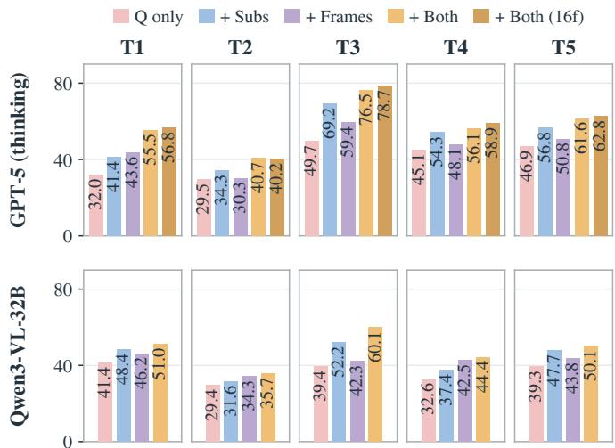

Fig. 7. Evidence ablation. Q includes the question and supplied fields. Frames denotes 8 frames for GPT-5 and 60 for Qwen. Both (16f): GPT-5 with subtitles and 16 frames.  
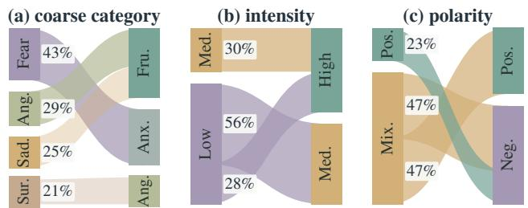

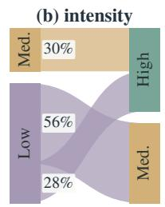

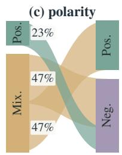  
Fig. 8. T1 confusions from true (left) to predicted (right) labels. Band widths show proportions within each true class.

## 6.4 Within-Task Performance Breakdown

Task averages can mask uneven component performance. Components are scored over applicable instances, with full results in Appendix A.4.

Task 1. Grounded Affect Recognition. Table 3 shows a consistent gap between the two first-order components: State scores higher than Manifestation for all six baselines, with larger gaps for the two open-source models than for GPT-5. Enabling thinking improves Manifestation by 1.4 points, while State remains nearly unchanged. Looking more closely at the State predictions reveals where the remaining errors concentrate. Fig. 8 shows recurrent confusions between semantically related categories, particularly fear and anxiety, and anger and frustration. Intensity predictions frequently shift both low- and high-intensity states toward medium, while mixed polarity is often reduced to a single polarity. Thus, higher State scores still mask errors in category, intensity, and mixed polarity.

TABLE 3  
T1 field-level performance. Shaded rows report construct scores aggregated within each instance.
<table><tr><td></td><td>EmoQ*</td><td>OV-70B</td><td>Q3-VL</td><td>GPT5-N</td><td>Gem-3</td><td>GPT5-T</td><td>TRACER</td></tr><tr><td>Affective state</td><td>36.8</td><td>57.3</td><td>60.1</td><td>59.7</td><td>63.3</td><td>59.2</td><td>64.9</td></tr><tr><td>Category</td><td>27.2</td><td>40.1</td><td>38.8</td><td>36.1</td><td>48.1</td><td>41.5</td><td>40.5</td></tr><tr><td>Description</td><td>11.7</td><td>36.8</td><td>48.1</td><td>55.6</td><td>53.7</td><td>57.3</td><td>60.0</td></tr><tr><td>Polarity</td><td>57.5</td><td>80.1</td><td>81.4</td><td>69.1</td><td>81.4</td><td>71.3</td><td>77.5</td></tr><tr><td>Intensity</td><td>35.4</td><td>61.1</td><td>64.2</td><td>64.5</td><td>58.2</td><td>63.3</td><td>66.5</td></tr><tr><td>Object</td><td>51.8</td><td>67.7</td><td>67.8</td><td>73.0</td><td>74.7</td><td>62.5</td><td>79.9</td></tr><tr><td>Manifestation</td><td>22.1</td><td>28.2</td><td>41.8</td><td>52.6</td><td>45.4</td><td>54.0</td><td>58.4</td></tr><tr><td>Facial</td><td>30.0</td><td>32.9</td><td>47.2</td><td>56.9</td><td>48.5</td><td>59.2</td><td>57.7</td></tr><tr><td>Body</td><td>20.4</td><td>23.1</td><td>36.6</td><td>46.2</td><td>37.3</td><td>47.2</td><td>55.6</td></tr><tr><td>Verbal</td><td>16.0</td><td>31.0</td><td>44.8</td><td>60.1</td><td>55.4</td><td>61.6</td><td>70.6</td></tr><tr><td>Vocal</td><td>23.3</td><td>27.5</td><td>43.0</td><td>52.4</td><td>45.6</td><td>54.2</td><td>56.6</td></tr></table>

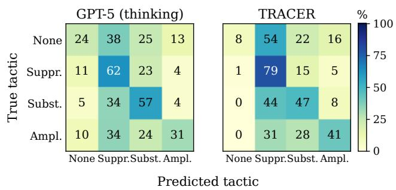  
Fig. 9. T2 tactic confusion for GPT-5 (thinking) and TRACER. Rows: reference; columns: prediction; values: row percentages. Fabrication is omitted from both axes.

Task 2. Regulation Decoding. For Task 2, the clearest error pattern appears in tactic prediction. Models frequently infer active regulation when the reference tactic is None, with falsealarm rates ranging from 76% to 96% across GPT-5 (thinking), Qwen3-VL, and TRACER. As shown in Fig. 9, Suppression is the most common prediction for these unregulated cases. TRACER identifies Suppression and Amplification more often than GPT-5 (thinking), but also recognizes None less often, indicating a stronger tendency to over-detect regulation. This pattern suggests that tactic prediction remains particularly difficult at the boundary between genuinely regulated displays and cases without active regulation. Beyond tactic prediction, thinking substantially improves Target State for GPT-5, from 28.0 to 46.7 (Table 4), suggesting that reasoning helps infer the intended target affect given the underlying felt state.

Task 3. Affective Cause Reasoning. All evaluated models across the three families score lower on Internal Driver than External Reality, falling below y = x in Fig. 10. Thinking improves GPT-5’s Internal Driver score more than External Reality, narrowing this gap. TRACER scores highest on both components, improving more over GPT-5 (thinking) on External Reality. Internal Driver also improves but remains lower-scoring. These results suggest that, despite gains in overall cause reasoning, recovering the subject’s Internal Driver remains harder for most evaluated models.

TABLE 4  
T2 field-level performance. Goal and Regulation Evidence use regulated instances. Target state is scored only when its reference category differs from the source category.
<table><tr><td></td><td>EmoQ*</td><td>OV-70B</td><td>Q3-VL</td><td>GPT5-N</td><td>Gem-3</td><td>GPT5-T</td><td>TRACER</td></tr><tr><td>Tactic</td><td>36.7</td><td>46.9</td><td>48.9</td><td>47.4</td><td>49.5</td><td>50.9</td><td>53.8</td></tr><tr><td>Target state</td><td>28.0</td><td>5.6</td><td>26.2</td><td>28.0</td><td>31.6</td><td>46.7</td><td>37.7</td></tr><tr><td>Goal</td><td>13.5</td><td>30.1</td><td>51.1</td><td>54.8</td><td>51.2</td><td>56.2</td><td>66.5</td></tr><tr><td>Reg. evidence</td><td>10.0</td><td>8.7</td><td>18.1</td><td>23.6</td><td>18.1</td><td>23.6</td><td>50.3</td></tr></table>

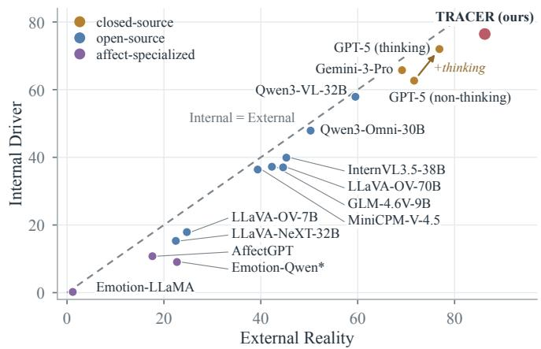  
Fig. 10. T3 External Reality versus Internal Driver scores by model. The dashed line marks equal scores. The arrow shows GPT-5’s change with thinking.

TABLE 6  
T5 full-chain reconstruction scores by construct.
<table><tr><td></td><td>Cond.</td><td>State</td><td>Manif.</td><td>Reg.</td><td>Effect</td></tr><tr><td>Emotion-Qwen*</td><td>14.09</td><td>45.69</td><td>23.20</td><td>12.09</td><td>11.18</td></tr><tr><td>LLaVA-OV-70B</td><td>33.49</td><td>64.10</td><td>39.28</td><td>32.08</td><td>20.39</td></tr><tr><td>Qwen3-VL-32B</td><td>51.59</td><td>69.61</td><td>55.83</td><td>40.64</td><td>38.21</td></tr><tr><td>GPT-5 (non-thinking)</td><td>66.91</td><td>70.34</td><td>62.01</td><td>42.55</td><td>43.80</td></tr><tr><td>Gemini-3-Pro</td><td>63.67</td><td>73.22</td><td>58.72</td><td>21.46</td><td>43.25</td></tr><tr><td>GPT-5 (thinking)</td><td>70.29</td><td>70.54</td><td>63.14</td><td>41.09</td><td>47.74</td></tr><tr><td>TRACER</td><td>72.18</td><td>71.88</td><td>63.08</td><td>42.18</td><td>53.84</td></tr></table>

Task 4. Affective Effect Reasoning. Physical Effect is the lowest-scoring channel for the general-purpose baselines shown in Table 5, in both the full evaluation and the other-directed subset (Fig. 11). The relative performance on Mental and Affective Effect, however, varies across models. In Fig. 11, closed-source models and Qwen3-VL score higher on Mental than on Affective Effect, whereas the remaining open-source and affect-specialized models show the reverse pattern. TRACER achieves the highest Mental and Physical Effect scores in both evaluation scopes, while its Affective Effect score remains close to GPT-5 (thinking). Its gains are therefore uneven across channels, with the largest improvement over GPT-5 (thinking) on Physical Effect, from 46.9 to 58.0 in Table 5. This improvement also accords with the T5 diagnostic results in Section 6.5, which show fewer unsupported Effect statements under TRACER.

Task 5. Full Chain Reconstruction. Full-chain performance varies markedly by component (Table 6). Affective State scores highest across all baselines, but the lowest-scoring component varies: Effect scores lowest for Emotion-Qwen, LLaVA-OneVision-70B, and Qwen3-VL-32B, while Regulation scores lowest for the closed-source general-purpose models. For GPT-5, enabling thinking mainly improves Condition and Effect, with only minor changes in the remaining components. TRACER further improves on GPT-5 (thinking), raising the overall full-chain score from 60.79 to 63.59. Its largest component-level gain is on Effect, which increases from 47.74 to 53.84, while State, Manifestation, and Regulation change only slightly. These results suggest that TRACER’s improvement in full-chain reconstruction is particularly pronounced in identifying downstream consequences.

TABLE 5  
T4 effect-channel performance, including self-directed and other-directed effects. Each channel is scored on its applicable instances.
<table><tr><td></td><td>EmoQ*</td><td>OV-70B</td><td>Q3-VL</td><td>GPT5-N</td><td>Gem-3</td><td>GPT5-T</td><td>TRACER</td></tr><tr><td>Mental</td><td>2.1</td><td>38.1</td><td>53.5</td><td>59.4</td><td>58.8</td><td>60.5</td><td>64.5</td></tr><tr><td>Affective</td><td>19.6</td><td>40.7</td><td>49.0</td><td>57.8</td><td>52.6</td><td>56.8</td><td>57.0</td></tr><tr><td>Physical</td><td>15.5</td><td>23.3</td><td>34.6</td><td>43.3</td><td>45.9</td><td>46.9</td><td>58.0</td></tr></table>

<table><tr><td rowspan=1 colspan=1></td><td rowspan=1 colspan=1>Mental Effect</td><td rowspan=1 colspan=2>Affective Effect  Physical Effect</td></tr><tr><td rowspan=1 colspan=1>TRACER (ours)</td><td rowspan=1 colspan=1>66.8</td><td rowspan=1 colspan=1>57.2</td><td rowspan=1 colspan=1>58.0</td></tr><tr><td rowspan=1 colspan=1>GPT-5 (thinking)</td><td rowspan=1 colspan=1>61.2</td><td rowspan=1 colspan=1>57.4</td><td rowspan=1 colspan=1>50.2</td></tr><tr><td rowspan=1 colspan=1>GPT-5 (non-thinking)</td><td rowspan=1 colspan=1>59.9</td><td rowspan=1 colspan=1>58.5</td><td rowspan=1 colspan=1>47.0</td></tr><tr><td rowspan=1 colspan=1>Gemini-3-Pro</td><td rowspan=1 colspan=1>59.4</td><td rowspan=1 colspan=1>53.2</td><td rowspan=1 colspan=1>46.0</td></tr><tr><td rowspan=1 colspan=1>Qwen3-VL-32B</td><td rowspan=1 colspan=1>53.5</td><td rowspan=1 colspan=1>50.2</td><td rowspan=1 colspan=1>38.2</td></tr><tr><td rowspan=1 colspan=1>Qwen3-Omni-30B</td><td rowspan=1 colspan=1>47.7</td><td rowspan=1 colspan=1>48.1</td><td rowspan=1 colspan=1>33.2</td></tr><tr><td rowspan=1 colspan=1>LLaVA-OV-70B</td><td rowspan=1 colspan=1>38.7</td><td rowspan=1 colspan=1>41.5</td><td rowspan=1 colspan=1>31.1</td></tr><tr><td rowspan=1 colspan=1>InternVL3.5-38B</td><td rowspan=1 colspan=1>38.4</td><td rowspan=1 colspan=1>43.2</td><td rowspan=1 colspan=1>23.0</td></tr><tr><td rowspan=1 colspan=1>GLM-4.6V-9B</td><td rowspan=1 colspan=1>42.3</td><td rowspan=1 colspan=1>43.5</td><td rowspan=1 colspan=1>8.6</td></tr><tr><td rowspan=1 colspan=1>MiniCPM-V-4.5</td><td rowspan=1 colspan=1>31.6</td><td rowspan=1 colspan=1>37.9</td><td rowspan=1 colspan=1>16.6</td></tr><tr><td rowspan=1 colspan=1>LLaVA-NeXT-32B</td><td rowspan=1 colspan=1>25.9</td><td rowspan=1 colspan=1>35.0</td><td rowspan=1 colspan=1>19.0</td></tr><tr><td rowspan=1 colspan=1>LLaVA-OV-7B</td><td rowspan=1 colspan=1>1.7</td><td rowspan=1 colspan=1>6.1</td><td rowspan=1 colspan=1>1.4</td></tr><tr><td rowspan=1 colspan=1>AffectGPT</td><td rowspan=1 colspan=1>12.0</td><td rowspan=1 colspan=1>21.1</td><td rowspan=1 colspan=1>12.7</td></tr><tr><td rowspan=1 colspan=1>Emotion-Qwen*</td><td rowspan=1 colspan=1>2.4</td><td rowspan=1 colspan=1>19.5</td><td rowspan=1 colspan=1>15.4</td></tr><tr><td rowspan=1 colspan=1>Emotion-LLaMA</td><td rowspan=1 colspan=1>0.0</td><td rowspan=1 colspan=1>0.7</td><td rowspan=1 colspan=1>0.04</td></tr></table>

Fig. 11. T4 effect-channel scores on other-directed instances. Dashed lines separate TRACER, closed-source, open-source, and affectspecialized models.

## 6.5 Diagnostic Evaluation of Failure Modes

These experiments diagnose factual drift through fabricated observable content in full-chain reconstruction, and surface reading through confusion between Affective State and Manifestation. Both use judgments blind to configuration identity.

## 6.5.1 Factual Drift in Full-Chain Reconstruction

Setup and metric. For T5 outputs, we check factual statements in External Reality, Manifestation, and Physical Effect against video frames and subtitles. The fabrication rate is the percentage of fabricated statements among all judged statements, including unverifiable ones. Empty fields are tracked separately. Appendix A.6.1 details the sample, agentic audit, human verification, and results.

Results and analysis. Baseline fabrication is most pronounced in downstream Effect statements (Fig. 13). TRACER reduces the aggregate rate from 11.0% to 4.7%, with the largest reduction in Effect, from 17.3% to 3.3%. Supplying observation records alone also reduces fabrication, showing the contribution of explicit evidence. The full method substantially reduces unsupported observable content, particularly in the inferred aftermath of the episode.

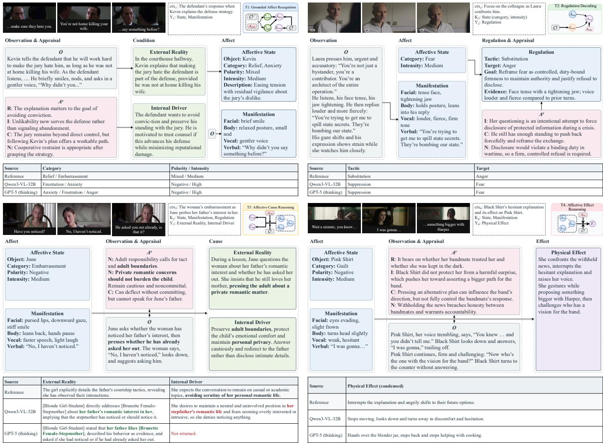  
Fig. 12. Case studies for T1–T4, with T1 and T2 in the top row and T3 and T4 in the bottom row. Panels show task inputs, selected observations and appraisal readings, construct outputs, and reference and baseline comparisons. Text is condensed from the source records. The T1 example comes from a separate illustrative run. The layouts follow the corresponding task-specific reasoning topologies.

## 6.5.2 Surface Reading of Affective Manifestations

Setup and metric. We test whether appraisal helps models identify the subject’s felt state when it differs from the outward display. The baseline describes the clip from video frames and subtitles without being alerted to this mismatch. Appraisal CoT asks the model to analyze each character’s situation along the four appraisal dimensions before writing the description. In the appraisal-records setting, readings produced by a separate analysis are supplied alongside the original inputs. Fig. 14 reports the intervention comparisons for GPT-5 and Qwen3-VL, using the same moments across settings within each model. We score State attribution at moments where State and Manifestation differ in category as correct State, Manifestation mistaken for State, or other errors or omissions. Appendix A.6.2 details the prompts, text-based judging, human verification, and control results.

Results and analysis. Both models frequently mistake Manifestation for State in their baseline descriptions (Fig. 14). Supplying appraisal records improves correct State attribution from 50% to 60% for GPT-5 and from 40% to 51% for Qwen3-VL. For GPT-5, appraisal CoT offers little improvement, whereas supplied records yield more correct State attributions with the same share of other errors or omissions. For Qwen3-VL, appraisal CoT raises correct State attribution to 47%, but surface reading remains at 26%. Supplied records reduce surface reading to 2%, while other errors or omissions increase to 47%. Avoiding the displayed category therefore does not always mean identifying the felt state correctly. These results support appraisal records for improving State attribution, although other errors remain.

## 6.6 Component Ablation

Setup. We assess the contributions of evidence provision, appraisal-based reasoning, and structured execution on the same fixed list of 150 items per task (stratified sampling in Appendix A.5). These sets differ in size from the main evaluation. Think denotes test-time reasoning, with minimal effort used in TRACER. Frames and Subs are the raw video channels. Obs is the observation inventory used in their place. App supplies appraisal records, whereas CoT prompts the model to generate appraisal-based reasoning within its answer call. RT supplies the reasoning topology of Section 5.4 as guidance on construct dependencies and the use of observation and appraisal premises. PDD implements that topology by generating conclusion nodes in dependency order, with explicit premise references and inferred field values. Configurations using Obs and App share the corresponding records with TRACER. All configurations are evaluated under the same judge.

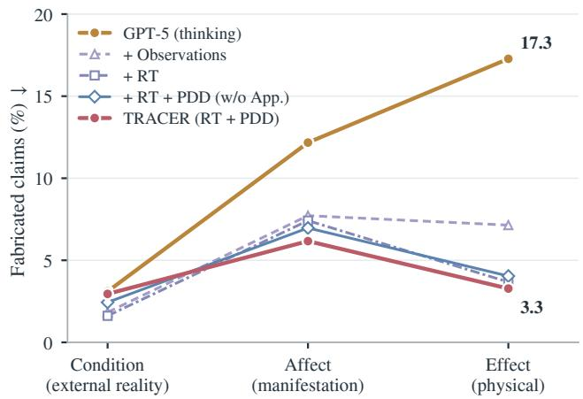  
Fig. 13. Fabrication rates by chain stage. RT and PDD correspond to the topology and derivation modules in Section 5.4. RT includes supplied appraisals, removed in the w/o App. configuration.

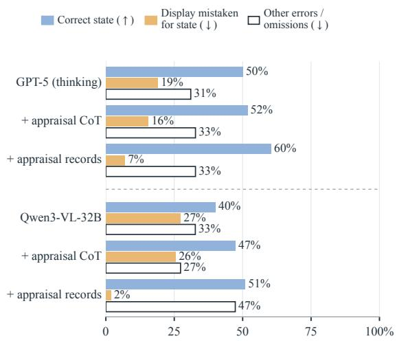  
Fig. 14. Appraisal interventions for State attribution. Display mistaken for state means identifying the outward display as the felt state when they differ. All settings share 58 moments for GPT-5 and 55 for Qwen3-VL.

TABLE 7  
Component ablation. Filled circles indicate enabled components (open Think: minimal reasoning). RT and PDD denote task-conditioned reasoning topology and premise-declared derivation, respectively. T2 uses the revised regulation task, as in Table 2.
<table><tr><td></td><td>Think</td><td>Frames</td><td>Subs</td><td>Obs</td><td>App</td><td>CoT</td><td>RT</td><td>PDD</td><td>T1</td><td>T2</td><td>T3</td><td>T4</td><td>T5</td><td>Avg.</td></tr><tr><td>GPT-5 (non-thinking)</td><td>O</td><td></td><td></td><td>0</td><td>o</td><td>0</td><td>o</td><td>0</td><td>56.92</td><td>39.53</td><td>70.84</td><td>55.00</td><td>57.62</td><td>55.98</td></tr><tr><td>GPT-5 (thinking)</td><td></td><td></td><td></td><td>0</td><td>0</td><td>O</td><td>0</td><td>0</td><td>56.84</td><td>43.49</td><td>75.39</td><td>57.73</td><td>60.89</td><td>58.87</td></tr><tr><td>w/ Appraisal-based CoT</td><td></td><td></td><td></td><td>O</td><td>0</td><td></td><td>0</td><td>0</td><td>55.62</td><td>47.39</td><td>80.01</td><td>58.86</td><td>61.15</td><td>60.61</td></tr><tr><td>w/ Observations</td><td></td><td>0</td><td>0</td><td></td><td>0</td><td>0</td><td>0</td><td>0</td><td>50.63</td><td>46.84</td><td>77.52</td><td>47.07</td><td>59.02</td><td>56.22</td></tr><tr><td>w/ Observations &amp; Appraisals</td><td></td><td>0</td><td>0</td><td></td><td></td><td>0</td><td>O</td><td>0</td><td>52.56</td><td>48.37</td><td>79.73</td><td>54.20</td><td>62.83</td><td>59.54</td></tr><tr><td>w/RT</td><td></td><td>0</td><td>0</td><td></td><td></td><td>O</td><td></td><td>0</td><td>53.77</td><td>51.12</td><td>80.38</td><td>55.45</td><td>61.42</td><td>60.43</td></tr><tr><td>w/RT</td><td>0</td><td>0</td><td>0</td><td></td><td></td><td>0</td><td></td><td>o</td><td>56.52</td><td>49.76</td><td>74.97</td><td>53.39</td><td>59.68</td><td>58.86</td></tr><tr><td>w/ RT + PDD (TRACER)</td><td>o</td><td>o</td><td>o</td><td></td><td></td><td>O</td><td></td><td></td><td>61.71</td><td>52.12</td><td>83.76</td><td>59.93</td><td>63.39</td><td>64.18</td></tr></table>

Effect of supplied material. Replacing raw video input with observation records improves T2 and T3 but lowers T1 and T4, with losses in intensity, facial expression, and the recipient’s affective reaction. Adding appraisal records raises every task over observations alone, most on T4 (7.1 points) and T5 (3.8), and lifts the average above GPT-5 (thinking). Observation records alone therefore produce taskdependent gains and losses, while adding appraisals yields a net improvement over the raw-input baseline.

Effect of appraisal reasoning. We test whether prompting GPT-5 to reason through cognitive appraisals within its answer call is sufficient to improve affective understanding. Appraisal-based CoT raises the average score from 58.87 to

60.61, but the gains are task-dependent: T2–T4 improve, T1 declines, and T5 remains nearly unchanged. It still trails RT + PDD by 3.6 points, suggesting that appraisal prompting alone does not recover the full method’s gains.

Effect of RT. We examine whether providing the taskconditioned dependency structure as guidance improves reasoning. With the same observation and appraisal records, adding RT yields a modest average gain of 0.89 points and does not improve all tasks. Performance drops further when reasoning effort is reduced to minimal. These results suggest that supplying the dependency structure as guidance alone offers limited benefits.

Effect of PDD. PDD turns the topology into an explicit execution procedure. Holding the observation records, appraisal records, RT, and reasoning effort fixed, adding PDD improves all five tasks and raises the average score from 58.86 to 64.18. This comparison supports explicitly executing the topology, with intermediate constructs derived in dependency order and carried forward as premises, rather than merely presenting it as guidance.

## 6.7 Limitations and Future Work

TRACE-Bench uses subject-centered affective episodes as its annotation and evaluation unit, linking each episode’s causes, affect, and consequences within the surrounding scene. Although a video may contain several annotated episodes, the current tasks do not explicitly evaluate dependencies between successive episodes or changes in regulation strategy across them. Future work can extend the annotations and tasks to examine how earlier affective experiences shape later appraisals and regulation over longer interactions.

At the method level, TRACER reasons over a fixed observation record extracted before derivation. This representation improves evidence accessibility, but it can omit fine-grained cues that later become important for a particular construct. Our ablations reflect this trade-off: replacing raw inputs with observation records improves some tasks while reducing performance on affect intensity, facial expression, and the recipient’s affective response. A promising extension is to make evidence acquisition adaptive, allowing the reasoning process to revisit relevant video intervals when the current record is insufficient to resolve a construct. Future work could also reduce the computational overhead of observation extraction, appraisal, and derivation while preserving evidence grounding.

## 7 CONCLUSION

We presented TRACE, a framework for studying affective understanding as a cognition-shaped process in complex social video. The Affective Blueprint formalizes a subjectcentered affective episode through Condition, Affect, and Effect, and TRACE-Bench operationalizes this formulation through five tasks spanning single-stage analysis, crossstage reasoning, and full-chain reconstruction. Evaluation across affect-specialized, open-source general-purpose, and closed-source general-purpose MLLMs shows that current performance remains substantially below human performance, and that stronger emotion recognition does not reliably extend to understanding regulation, causes, effects, or complete affective chains. Error analyses further expose two persistent weaknesses: surface reading of outward behavior and factual drift during chain reconstruction. To provide a baseline for this setting, we developed TRACER, which combines cognition-grounded appraisal with premisedeclared derivation. TRACER improves performance across all five tasks, with the largest gains in regulation decoding and cause reasoning, and substantially reduces unsupported content in full-chain reconstruction. These results suggest that, as multimodal models become increasingly capable of recognizing affective signals, the cognitive processes underlying affect deserve greater attention in both modeling and evaluation.

## REFERENCES

[1] Z. Zeng, M. Pantic, G. I. Roisman, and T. S. Huang, “A survey of affect recognition methods: Audio, visual, and spontaneous expressions,” IEEE Transactions on Pattern Analysis and Machine Intelligence, vol. 31, no. 1, pp. 39–58, 2009.

[2] C. Busso, M. Bulut, C.-C. Lee, A. Kazemzadeh, E. Mower, S. Kim, J. N. Chang, S. Lee, and S. S. Narayanan, “IEMOCAP: Interactive emotional dyadic motion capture database,” in Language Resources and Evaluation, vol. 42, no. 4. Springer, 2008, pp. 335–359.

[3] D. Kollias et al., “ABAW: Valence-arousal estimation, expression recognition, action unit detection & multi-task learning challenges,” in Proceedings of CVPR Workshops, 2023.

[4] A. Zadeh, R. Zellers, E. Pincus, and L.-P. Morency, “Multimodal sentiment intensity analysis in videos: Facial gestures and verbal messages,” in IEEE Intelligent Systems, vol. 31, no. 6, 2016, pp. 82–88.

[5] S. Poria, D. Hazarika, N. Majumder, G. Naik, E. Cambria, and R. Mihalcea, “MELD: A multimodal multi-party dataset for emotion recognition in conversations,” in Proceedings of ACL, 2019, pp. 527– 536.

[6] N. Majumder, S. Poria, D. Hazarika, R. Mihalcea, A. Gelbukh, and E. Cambria, “DialogueRNN: An attentive RNN for emotion detection in conversations,” Proceedings of the AAAI Conference on Artificial Intelligence, vol. 33, no. 01, pp. 6818–6825, 2019.

[7] R. Xia and Z. Ding, “Emotion-cause pair extraction: A new task to emotion analysis in texts,” in Proceedings of ACL, 2019, pp. 1003– 1012.

[8] S. Poria, N. Majumder, D. Hazarika, D. Ghosal, R. Bhardwaj, S. Y. B. Jian, P. Hong, R. Ghosh, A. Roy, N. Chhaya, A. Gelbukh, and R. Mihalcea, “Recognizing emotion cause in conversations,” Cognitive Computation, vol. 13, pp. 1317–1332, 2021.

[9] Z. Lian, H. Sun, L. Sun, H. Gu, Z. Wen, S. Zhang, S. Chen, M. Xu, K. Xu, K. Chen, L. Chen, S. Liang, Y. Li, J. Yi, B. Liu, and J. Tao, “Explainable multimodal emotion recognition,” arXiv preprint arXiv:2306.15401, 2023.

[10] Z. Lian, H. Chen, L. Chen, H. Sun, L. Sun, Y. Ren, Z. Cheng, B. Liu, R. Liu, X. Peng, J. Yi, and J. Tao, “AffectGPT: A new dataset, model, and benchmark for emotion understanding with multimodal large language models,” in Proceedings of ICML, vol. 267, 2025, pp. 36 993– 37 014.

[11] L. Wang, X. Yang, S. Feng, D. Wang, Y. Zhang, and Z. Zhang, “Generative emotion cause explanation in multimodal conversations,” in Proceedings of ACM ICMR, 2025.

[12] Y. Lin, J. Sun, Z.-Q. Cheng, J. Wang, H. Liang, Z. Cheng, Y. Dong, J.-Y. He, X. Peng, and X.-S. Hua, “Why we feel: Breaking boundaries in emotional reasoning with multimodal large language models,” in Proceedings of the IEEE/CVF CVPR Workshops, 2025, pp. 5235–5245.

[13] Z. Cheng, Z.-Q. Cheng, J.-Y. He, J. Sun, K. Wang, Y. Lin, Z. Lian, X. Peng, and A. G. Hauptmann, “Emotion-llama: Multimodal emotion recognition and reasoning with instruction tuning,” in Advances in Neural Information Processing Systems, vol. 37, 2024.

[14] J. Hu, H. Shi, C. Dai, Z. Li, P. Song, and M. Wang, “Beyond emotion recognition: A multi-turn multimodal emotion understanding and reasoning benchmark,” in Proceedings of ACM Multimedia, 2025.

[15] F. Zhang, Z. Cheng, C. Deng, H. Li, Z. Lian, Q. Chen, H. Liu, W. Wang, Y.-F. Zhang, R. Zhang, Z. Guo, Z. Zhu, H. Wu, H. Wang, Y. Zheng, X. Peng, X. Wu, K. Wang, X. Li, J. Ye, and P.-A. Heng, “MME-Emotion: A holistic evaluation benchmark for emotional intelligence in multimodal large language models,” in International Conference on Learning Representations, 2026.

[16] Y. Zhang, X. Yang, X. Xu, Z. Gao, Y. Huang, S. Mu, S. Feng, D. Wang, Y. Zhang, K. Song, and G. Yu, “Affective computing in the era of large language models: A survey from the NLP perspective,” Knowledge-Based Systems, vol. 337, p. 115411, 2026. [Online]. Available: https://doi.org/10.1016/j.knosys.2026.115411

[17] R. S. Lazarus, Emotion and Adaptation. Oxford University Press, 1991.

[18] K. R. Scherer, “Appraisal considered as a process of multilevel sequential checking,” in Appraisal Processes in Emotion: Theory, Methods, Research, K. R. Scherer, A. Schorr, and T. Johnstone, Eds. Oxford University Press, 2001, pp. 92–120.

[19] ——, “The dynamic architecture of emotion: Evidence for the component process model,” Cognition and Emotion, vol. 23, no. 7, pp. 1307–1351, 2009.

[20] A. Moors, P. C. Ellsworth, K. R. Scherer, and N. H. Frijda, “Appraisal theories of emotion: State of the art and future development,” Emotion Review, vol. 5, no. 2, pp. 119–124, 2013.

[21] K. R. Scherer and A. Moors, “The emotion process: Event appraisal and component differentiation,” Annual Review of Psychology, vol. 70, no. 1, pp. 719–745, 2019.

[22] J. J. Gross, “The emerging field of emotion regulation: An integrative review,” Review of General Psychology, vol. 2, no. 3, pp. 271–299, 1998.

[23] G. A. Van Kleef, “How emotions regulate social life: The emotions as social information (easi) model,” Current Directions in Psychologi cal Science, vol. 18, no. 3, pp. 184–188, 2009.

[24] H. Rashkin, M. Sap, E. Allaway, N. A. Smith, and Y. Choi, “Event2Mind: Commonsense inference on events, intents, and reactions,” in Proceedings of the 56th Annual Meeting of the Association for Computational Linguistics, 2018, pp. 463–473.

[25] M. Sap, R. Le Bras, E. Allaway, C. Bhagavatula, N. Lourie, H. Rashkin, B. Roof, N. A. Smith, and Y. Choi, “ATOMIC: An atlas of machine commonsense for if-then reasoning,” in Proceedings of AAAI, vol. 33, 2019, pp. 3027–3035.

[26] D. Ghosal, S. Shen, N. Majumder, R. Mihalcea, and S. Poria, “CICERO: A dataset for contextualized commonsense inference in dialogues,” in Proceedings of the 60th Annual Meeting of the Association for Computational Linguistics, 2022, pp. 5010–5028.

[27] S. Sabour et al., “EmoBench: Evaluating the emotional intelligence of large language models,” in Proceedings of ACL, 2024.

[28] H. Hu, Y. Zhou, L. You, H. Xu, Q. Wang, Z. Lian, F. R. Yu, F. Ma, and L. Cui, “EmoBench-M: Benchmarking emotional intelligence for multimodal large language models,” arXiv preprint arXiv:2502.04424, 2025.

[29] M. Luo, B. Li, S. Xu, S. Zhang, Q. Chen, M. Han, W. Chen, Y. Huang, H. Fei, M.-L. Lee, and W. Hsu, “Unveiling the cognitive compass: Theory-of-mind-guided multimodal emotion reasoning,” in International Conference on Learning Representations, 2026. [Online]. Available: https://arxiv.org/abs/2602.00971

[30] S. Bhattacharyya, E. Kuriabov, L. Craig, T. Dilliraj, R. B. Adams Jr., J. Li, and J. Z. Wang, “Large language models show fragile cognitive reasoning about human emotions,” arXiv preprint arXiv:2508.05880, 2025. [Online]. Available: https://arxiv.org/abs/2508.05880

[31] J. A. Russell, “A circumplex model of affect,” Journal of Personality and Social Psychology, vol. 39, no. 6, pp. 1161–1178, 1980.

[32] R. Kosti, J. M. Alvarez, A. Recasens, and A. Lapedriza, “Context based emotion recognition using EMOTIC dataset,” IEEE Transactions on Pattern Analysis and Machine Intelligence, vol. 42, no. 11, pp. 2755–2766, 2020.

[33] Q. Yang, D. Bai, Y.-X. Peng, and X. Wei, “Omni-emotion: Extending video MLLM with detailed face and audio modeling for multimodal emotion analysis,” arXiv preprint arXiv:2501.09502, 2025.

[34] D. Li, B. Xing, X. Liu, B. Xia, B. Wen, and H. Kalvi¨ ainen, “DEEMO:¨ De-identity multimodal emotion recognition and reasoning,” in Proceedings of ACM Multimedia, 2025.

[35] Z. Lian, L. Sun, Y. Ren, H. Gu, H. Sun, L. Chen, B. Liu, and J. Tao, “MERBench: A unified evaluation benchmark for multimodal emotion recognition,” IEEE Transactions on Pattern Analysis and Machine Intelligence, vol. 48, no. 5, pp. 5793–5810, 2026.

[36] F. Wang, Z. Ding, R. Xia, Z. Li, and J. Yu, “Multimodal emotioncause pair extraction in conversations,” IEEE Transactions on Affective Computing, vol. 14, no. 3, pp. 1832–1844, 2023.

[37] F. Wang, R. Xia, Z. Ding et al., “Semeval-2024 task 3: Multimodal emotion cause analysis in conversations,” in Proceedings of the 18th International Workshop on Semantic Evaluation (SemEval-2024), 2024, pp. 1968–1977.

[38] Z. Liu, K. Yang, T. Zhang, Q. Xie, and S. Ananiadou, “EmoLLMs: A series of emotional large language models and annotation tools for comprehensive affective analysis,” in Proceedings of ACM SIGKDD, 2024.

[39] A. Zadeh, M. Chan, P. P. Liang, E. Tong, and L.-P. Morency, “Social-IQ: A question answering benchmark for artificial social intelligence,” in Proceedings of the IEEE/CVF Conference on Computer Vision and Pattern Recognition, 2019, pp. 8807–8817.

[40] P. Vicol, M. Tapaswi, L. Castrejon, and S. Fidler, “MovieGraphs: Towards understanding human-centric situations from videos,” in Proceedings of the IEEE Conference on Computer Vision and Pattern Recognition, 2018, pp. 8581–8590.

[41] S. Choi, K.-W. On, Y.-J. Heo, A. Seo, Y. Jang, M. Lee, and B.-T. Zhang, “DramaQA: Character-centered video story understanding with hierarchical qa,” in Proceedings of the AAAI Conference on Artificial Intelligence, vol. 35, no. 2, 2021, pp. 1166–1174.

[42] H. Zhang, X. Wang, H. Xu, Q. Zhou, K. Gao, J. Su, J. Zhao, W. Li, and Y. Chen, “MIntRec2.0: A large-scale benchmark dataset for multimodal intent recognition and out-of-scope detection in conversations,” in International Conference on Learning Representations, 2024.

[43] C. Jin, Y. Wu, J. Cao, J. Xiang, Y.-L. Kuo, Z. Hu, T. Ullman, A. Torralba, J. Tenenbaum, and T. Shu, “MMToM-QA: Multimodal theory of mind question answering,” in Proceedings of the 62nd Annual Meeting of the Association for Computational Linguistics (Volume 1: Long Papers), 2024, pp. 16 077–16 102. [Online]. Available: https://aclanthology.org/2024.acl-long.851/

[44] H. Shi, S. Ye, X. Fang, C. Jin, L. Isik, Y.-L. Kuo, and T. Shu, “MuMA-ToM: Multi-modal multi-agent theory of mind,” Proceedings of the AAAI Conference on Artificial Intelligence, vol. 39, no. 2, pp. 1510–1519, 2025.

[45] E. Villa-Cueva, S. M. M. Ahmed, R. Chevi, J. C. B. Cruz, K. Elzeky, F. Cristobal, A. F. Aji, S. Wang, R. Mihalcea, and T. Solorio, “MoMentS: A comprehensive multimodal benchmark for theory of mind,” in Findings of the Association for Computational Linguistics: EMNLP 2025, 2025, pp. 22 591–22 611. [Online]. Available: https://aclanthology.org/2025.findings-emnlp.1230/

[46] Z. Chen et al., “ToMBench: Benchmarking theory of mind in large language models,” in Proceedings of ACL, 2024.

[47] A. Ortony, G. L. Clore, and A. Collins, The Cognitive Structure of Emotions. Cambridge University Press, 1988.

[48] J. J. Gross, “Emotion regulation: Current status and future prospects,” Psychological Inquiry, vol. 26, no. 1, pp. 1–26, 2015.

[49] P. Ekman and W. V. Friesen, “The repertoire of nonverbal behavior: Categories, origins, usage, and coding,” Semiotica, vol. 1, no. 1, pp. 49–98, 1969.

[50] A. R. Hochschild, “Emotion work, feeling rules, and social structure,” American Journal of Sociology, vol. 85, no. 3, pp. 551–575, 1979.

[51] G. A. Van Kleef and S. Cotˆ e, “The social effects of emotions,”´ Annual Review of Psychology, vol. 73, pp. 629–658, 2022.

[52] C. M. de Melo, P. J. Carnevale, S. J. Read, and J. Gratch, “Reading people’s minds from emotion expressions in interdependent decision making,” Journal of Personality and Social Psychology, vol. 106, no. 1, pp. 73–88, 2014.

[53] A. S. Rao and M. P. Georgeff, “BDI agents: From theory to practice,” in Proceedings of the First International Conference on Multi-Agent Systems. San Francisco, CA: MIT Press, 1995, pp. 312–319.

[54] ChristophSchuhmann, “movie-clips,” Hugging Face dataset. Available: https://huggingface.co/datasets/ChristophSchuhmann/ movie-clips, 2023, accessed: 2026-07-07.

[55] EQ4You, “movieclips,” Hugging Face dataset. Available: https: //huggingface.co/datasets/EQ4You/movieclips, 2024, accessed: 2026-07-07.

[56] P. Ekman, “An argument for basic emotions,” Cognition and Emotion, vol. 6, no. 3-4, pp. 169–200, 1992.

[57] J. Xu, H. Fei, L. Pan, Q. Liu, M.-L. Lee, and W. Hsu, “Faithful logical reasoning via symbolic chain-of-thought,” in Proceedings of the 62nd Annual Meeting of the Association for Computational Linguistics (Volume 1: Long Papers), 2024, pp. 13 326–13 365. [Online]. Available: https://aclanthology.org/2024.acl-long.720/

[58] J. Xu, H. Fei, M. Luo, Q. Liu, L. Pan, W. Y. Wang, P. Nakov, M.-L. Lee, and W. Hsu, “Aristotle: Mastering logical reasoning with a logiccomplete decompose-search-resolve framework,” in Proceedings of the 63rd Annual Meeting of the Association for Computational Linguistics (Volume 1: Long Papers), 2025, pp. 3052–3075. [Online]. Available: https://aclanthology.org/2025.acl-long.153/

[59] B. Li, Y. Zhang, D. Guo, R. Zhang, F. Li, H. Zhang, K. Zhang, P. Zhang, Y. Li, Z. Liu, and C. Li, “LLaVA-OneVision: Easy visual task transfer,” Transactions on Machine Learning Research, 2025.

[60] F. Li, R. Zhang, H. Zhang, Y. Zhang, B. Li, W. Li, Z. Ma, and C. Li, “LLaVA-NeXT-Interleave: Tackling multi-image, video, and 3d in large multimodal models,” arXiv preprint arXiv:2407.07895, 2024.

[61] Y. Yao et al., “MiniCPM-V 4.5: Cooking efficient MLLMs via architecture, data, and training recipes,” arXiv preprint arXiv:2509.18154, 2025.

[62] GLM-V Team et al., “GLM-4.5V and GLM-4.1V-Thinking: Towards versatile multimodal reasoning with scalable reinforcement learning,” arXiv preprint arXiv:2507.01006, 2025.

[63] J. Xu, Z. Guo, H. Hu, Y. Chu, X. Wang, J. He, Y. Wang, X. Shi, T. He, X. Zhu et al., “Qwen3-Omni technical report,” arXiv preprint arXiv:2509.17765, 2025.

[64] Z. Chen et al., “InternVL3.5: Exploring advanced training and testtime recipes for open-source multimodal models,” arXiv preprint arXiv:2508.18265, 2025.

[65] Qwen Team, “Qwen3-VL technical report,” arXiv preprint arXiv:2511.21631, 2025.

[66] D. Huang, Q. Li, C. Yan, Z. Cheng, Z. Han, Y. Huang, X. Li, B. Li, X. Wang, Z. Lian et al., “Emotion-qwen: A unified framework for emotion and vision understanding,” arXiv preprint arXiv:2505.06685, 2025.

[67] A. Singh, A. Fry, A. Perelman, A. Tart, A. Ganesh, A. El-Kishky, A. McLaughlin, A. Low, A. Ostrow, A. Ananthram et al., “Openai gpt-5 system card,” arXiv preprint arXiv:2601.03267, 2025.

[68] Google DeepMind, “Gemini 3 Pro model card,” https://deepmind. google/models/model-cards/gemini-3-pro/, 2026, model released November 2025. Updated May 2026.

You record what is VISIBLE and AUDIBLE in a video. You are an observer:   
you do not interpret, you do not name emotions, you do not judge or assign   
causes — you record what is seen and heard, faithfully, in time order, across   
the WHOLE clip.   
[. . . ] Everything visual [. . . ] is yours to observe from the video, and you should   
trust your eyes for it.   
Model-generated speaker/action attribution:   
{dialogue\_attribution}   
A moment is a short span where one EVENT holds together — one   
exchange, one action, one reaction. [. . . ] For roughly {moment\_budget}   
moments total (a guide, not a quota): cover the whole clip with reasonably   
EVEN attention [. . . ] a camera cut is NOT a moment boundary.   
– Do NOT name anyone’s emotion or inner state [. . . ] Record the face and the   
voice — the literal markers — do not label what they mean.   
– Do NOT assign roles or causality [. . . ]   
– Do NOT select for relevance to any later question. Record the whole scene   
as it is.   
– Do NOT invent. [. . . ] Record only what is actually observable.   
Output only the JSON object. [. . . ]   
Characters from QA questions (subject, object, recipient): {roster}   
Subtitle transcript (verbatim, with times [. . . ] ): {subtitle\_text}   
(b) Output format   
{ "observations": [ {   
"id": "o1",   
"time\_s\_t": [start\_seconds, end\_seconds],   
"present\_characters": ["[Appearance-Role(Name)]"],   
"content": "Everything observable in this moment,   
integrated: [. . . ] " } ],   
"notes": "Optional: [. . . ] " }   
(c) One observation of a record   
{ "id": "o2", "time\_s\_t": [10.0, 20.0],   
"present\_characters": ["[Black Suit-Father]",   
"[Blonde-Mother]", "[Audience]"],   
"content": “The camera cuts to a close-up of [Black Suit-Father] as he   
sits down beside [Blonde-Mother] [. . . ] He turns to her and says, ’Excuse me,’   
then ’Hi,’ with a slight smile and a relaxed posture. [. . . ] [Blonde-Mother] turns   
her head toward him, smiling faintly, then looks back toward the stage. [. . . ] ” }

# Appendix

This appendix provides implementation and experimental details (Appendix A), the scoring protocol (Appendix B), and details of data construction and annotation (Appendix C). Figures, tables, and equations here carry the prefix “S”.

## APPENDIX A

## IMPLEMENTATION AND EXPERIMENTAL DETAILS A.1 Inference Settings

During inference, we provide all evaluated methods with the same task instructions and subtitle transcripts. Alongside these textual inputs, the models receive frames sampled across the complete clip, with the model-specific budgets listed below. Audio is provided only to Qwen3-Omni-30B. We retain the released inference settings for affect-specialized models. GPT-5 uses the provider’s default reasoning setting for the thinking baseline and minimal reasoning effort for the non-thinking baseline.

<table><tr><td>Model</td><td>Video budget</td></tr><tr><td>Open-source general-purpose</td><td></td></tr><tr><td>LLaVA-OneVision-7B/70B, LLaVA-NeXT-Video-32B</td><td>32 frames</td></tr><tr><td>InternVL3.5-38B, Qwen3-Omni-30B, Qwen3-VL-32B</td><td>60 frames</td></tr><tr><td>GLM-4.6V-Flash-9B</td><td>8 frames</td></tr><tr><td>MiniCPM-V-4.5</td><td>5 fps</td></tr><tr><td>Closed-source general-purpose</td><td></td></tr><tr><td>GPT-5 (thinking/non-thinking), Gemini-3-Pro</td><td>8 frames</td></tr></table>

TRACER settings. We use Qwen3-VL-32B to extract one observation record per video and reuse that record across tasks, ablations, and diagnostics, following the procedure in Appendix A.2. We then use GPT-5 for appraisal, anchor alignment, and structured derivation, setting its reasoning effort to low for appraisal and minimal for the latter two operations. For T5, we derive Condition, Affect, and Effect through separate calls.

TABLE S3  
Answer-generation calls and token usage, averaged over five tasks.
<table><tr><td>Configuration</td><td>Calls1</td><td>Input</td><td>Output</td><td>Hidden reasoning</td></tr><tr><td>GPT-5 (thinking)</td><td>1</td><td>1.7k</td><td>1.25k</td><td>1.06k</td></tr><tr><td>GPT-5 (thinking) + Obs</td><td>1</td><td>2.2k</td><td>1.10k</td><td>0.90k</td></tr><tr><td>GPT-5 (thinking) + Obs + App</td><td>1</td><td>2.9k</td><td>1.13k</td><td>0.93k</td></tr><tr><td>TRACER</td><td>1.4</td><td>17.3k</td><td>0.71k</td><td>0</td></tr></table>

Fig. S1. Observation extraction. (a) Abridged observer prompt with simplified input labels; [. . . ] marks omissions and braces denote inserted inputs. (b) Output format. (c) One observation of a record.

Token use. We measure token use on five questions per task and average equally across the five tasks (Table S3). T1–T4 each use one derivation call, while T5 uses three, giving TRACER an average of 1.4 calls per question. Output counts include provider-reported hidden reasoning tokens. The table reports answer generation; observation records are generated once per video on a local GPU, and appraisal uses 9.2k input and 1.0k output tokens per question. These records are reused across configurations. Each TRACER derivation call includes the method specification and observation record, resulting in higher input token use.

## (a) Observer prompt (abridged)

## A.2 Observation Extraction

To construct the observation record, we sample each video at 1 fps, up to 256 frames, and provide these frames to Qwen3- VL-32B-Instruct with timestamped subtitles and modelgenerated speaker/action attribution, using a character roster to align person references. The character roster is compiled from the subject, object, and recipient identifiers provided in the QA questions. Speaker/action attribution is generated by a preceding model stage using the full dialogue. The observation call does not include the full task question. We ask the model to describe 8 to 12 moments depending on clip length, allowing up to 8,192 output tokens. For each moment, it records an identifier, time span, characters, and a description grounded in the frames and subtitles. The prompt and output example in Fig. S1 show how these records are organized, with emotion labels, causal statements, and selection by relevance excluded.

TABLE S1  
T1 affect recognition. State and Manifestation totals are computed within each item.
<table><tr><td></td><td colspan="6">Affective State</td><td colspan="5">Manifestation</td></tr><tr><td>Model</td><td>Cat.</td><td>Desc.</td><td>Pol.</td><td>Int.</td><td>Obj.</td><td>All</td><td>Facial</td><td>Body</td><td>Verbal</td><td>Vocal</td><td>All</td></tr><tr><td>Affect-specialized</td><td></td><td></td><td></td><td></td><td></td><td></td><td></td><td></td><td></td><td></td><td></td></tr><tr><td>Emotion-LLaMA</td><td>1.4</td><td>0.1</td><td>1.1</td><td>1.4</td><td>0.0</td><td>0.8</td><td>0.1</td><td>0.1</td><td>0.1</td><td>0.1</td><td>0.1</td></tr><tr><td>AffectGPT</td><td>21.8</td><td>23.5</td><td>71.5</td><td>50.2</td><td>56.4</td><td>44.8</td><td>27.7</td><td>22.8</td><td>15.6</td><td>31.8</td><td>24.4</td></tr><tr><td>Emotion-Qwen</td><td>27.2*</td><td>11.7</td><td>57.5</td><td>35.4</td><td>51.8</td><td>36.8</td><td>30.0</td><td>20.4</td><td>16.0</td><td>23.3</td><td>22.1</td></tr><tr><td colspan="10">Open-source general-purpose</td><td></td><td></td></tr><tr><td>LLaVA-OneVision-7B</td><td>31.6</td><td>16.3</td><td>74.4</td><td>51.8</td><td>72.8</td><td>49.5</td><td>27.9</td><td>19.1</td><td>14.2</td><td>21.5</td><td>20.7</td></tr><tr><td>LLaVA-NeXT-Video-32B</td><td>27.6</td><td>12.3</td><td>79.5</td><td>44.3</td><td>35.2</td><td>39.9</td><td>15.0</td><td>10.0</td><td>10.3</td><td>12.1</td><td>11.9</td></tr><tr><td>MiniCPM-V-4.5</td><td>37.2</td><td>27.2</td><td>65.7</td><td>48.9</td><td>60.8</td><td>48.0</td><td>28.5</td><td>25.1</td><td>27.0</td><td>29.1</td><td>26.6</td></tr><tr><td>GLM-4.6V-Flash-9B</td><td>29.4</td><td>35.9</td><td>77.0</td><td>57.2</td><td>63.0</td><td>52.6</td><td>34.3</td><td>20.4</td><td>34.8</td><td>28.7</td><td>29.0</td></tr><tr><td>LLaVA-OneVision-70B</td><td>40.1</td><td>36.8</td><td>80.1</td><td>61.1</td><td>67.7</td><td>57.3</td><td>32.9</td><td>23.1</td><td>31.0</td><td>27.5</td><td>28.2</td></tr><tr><td>Qwen3-Omni-30B</td><td>42.5</td><td>43.6</td><td>76.1</td><td>59.2</td><td>52.5</td><td>54.9</td><td>42.0</td><td>32.1</td><td>40.4</td><td>38.9</td><td>37.7</td></tr><tr><td>InternVL3.5-38B</td><td>44.0</td><td>37.0</td><td>77.3</td><td>61.4</td><td>74.7</td><td>59.0</td><td>40.0</td><td>27.5</td><td>30.3</td><td>31.0</td><td>31.7</td></tr><tr><td>Qwen3-VL-32B</td><td>38.8</td><td>48.1</td><td>81.4</td><td>64.2</td><td>67.8</td><td>60.1</td><td>47.2</td><td>36.6</td><td>44.8</td><td>43.0</td><td>41.8</td></tr><tr><td colspan="10">Closed-source general-purpose</td><td></td><td></td></tr><tr><td>GPT-5 (non-thinking)</td><td>36.1</td><td>55.6</td><td>69.1</td><td>64.5</td><td>73.0</td><td>59.7</td><td>56.9</td><td>46.2</td><td>60.1</td><td>52.4</td><td>52.6</td></tr><tr><td>Gemini-3-Pro</td><td>48.1</td><td>53.7</td><td>81.4</td><td>58.2</td><td>74.7</td><td>63.3</td><td>48.5</td><td>37.3</td><td>55.4</td><td>45.6</td><td>45.4</td></tr><tr><td>GPT-5 (thinking)</td><td>41.5</td><td>57.3</td><td>71.3</td><td>63.3</td><td>62.5</td><td>59.2</td><td>59.2</td><td>47.2</td><td>61.6</td><td>54.2</td><td>54.0</td></tr><tr><td colspan="10">Ours TRACER</td></tr><tr><td></td><td>40.5</td><td>60.0</td><td>77.5</td><td>66.5</td><td>79.9</td><td>64.9</td><td>57.7</td><td>55.6</td><td>70.6</td><td>56.6</td><td>58.4</td></tr></table>

TABLE S2

Field-level results for T2 regulation decoding, T3 cause reasoning, and T4 effect reasoning.
<table><tr><td></td><td colspan="4">T2 Regulation</td><td colspan="2">T3 Cause</td><td colspan="3">T4 Effect</td></tr><tr><td>Model</td><td>Tactic</td><td>Target</td><td>Goal</td><td>Evidence</td><td>External</td><td>Internal</td><td>Mental</td><td>Affective</td><td>Physical</td></tr><tr><td>Affect-specialized</td><td></td><td></td><td></td><td></td><td></td><td></td><td></td><td></td><td></td></tr><tr><td>Emotion-LLaMA</td><td>10.2*</td><td>5.6</td><td>4.3</td><td>1.5</td><td>2.5+</td><td>0.2</td><td>0.0+</td><td>0.6</td><td>0.2</td></tr><tr><td>AffectGPT</td><td>7.0+</td><td>1.9</td><td>6.2</td><td>1.6</td><td>19.6*</td><td>10.8</td><td>12.4*</td><td>22.1</td><td>12.6</td></tr><tr><td>Emotion-Qwen</td><td>36.7</td><td>28.0</td><td>13.5</td><td>10.0</td><td>24.4*</td><td>9.1</td><td>2.1</td><td>19.6</td><td>15.5</td></tr><tr><td colspan="10">Open-source general-purpose</td></tr><tr><td>LLaVA-OneVision-7B</td><td>45.4</td><td>15.9</td><td>23.2</td><td>5.2</td><td>26.9</td><td>17.9</td><td>2.3</td><td>6.9</td><td>2.9</td></tr><tr><td>LLaVA-NeXT-Video-32B</td><td>47.9</td><td>8.4</td><td>28.9</td><td>4.1</td><td>28.9*</td><td>15.3</td><td>23.1</td><td>33.9</td><td>15.2</td></tr><tr><td>MiniCPM-V-4.5</td><td>40.9</td><td>32.7</td><td>40.1</td><td>13.0</td><td>43.8</td><td>36.4</td><td>32.5</td><td>37.4</td><td>17.9</td></tr><tr><td>GLM-4.6V-Flash-9B</td><td>44.6</td><td>5.6</td><td>36.9</td><td>6.4</td><td>43.5</td><td>37.2</td><td>41.8</td><td>43.4</td><td>8.2</td></tr><tr><td>LLaVA-OneVision-70B</td><td>46.9</td><td>5.6</td><td>30.1</td><td>8.7</td><td>49.1</td><td>37.0</td><td>38.1</td><td>40.7</td><td>23.3</td></tr><tr><td>Qwen3-Omni-30B</td><td>47.4</td><td>22.4</td><td>46.5</td><td>17.6</td><td>52.3</td><td>47.9</td><td>47.4</td><td>47.4</td><td>28.6</td></tr><tr><td>InternVL3.5-38B</td><td>47.4</td><td>5.6</td><td>30.3</td><td>8.5</td><td>47.5</td><td>39.9</td><td>36.4</td><td>41.7</td><td>21.5</td></tr><tr><td>Qwen3-VL-32B</td><td>48.9</td><td>26.2</td><td>51.1</td><td>18.1</td><td>60.8</td><td>57.9</td><td>53.5</td><td>49.0</td><td>34.6</td></tr><tr><td colspan="10">Closed-source general-purpose</td></tr><tr><td>GPT-5 (non-thinking)</td><td>47.4</td><td>28.0</td><td>54.8</td><td>23.6</td><td>72.9</td><td>62.6</td><td>59.4</td><td>57.8</td><td>43.3</td></tr><tr><td>Gemini-3-Pro</td><td>49.5</td><td>31.6</td><td>51.2</td><td>18.1</td><td>71.6</td><td>65.8</td><td>58.8</td><td>52.6</td><td>45.9</td></tr><tr><td>GPT-5 (thinking)</td><td>50.9</td><td>46.7</td><td>56.2</td><td>23.6</td><td>78.3</td><td>72.0</td><td>60.5</td><td>56.8</td><td>46.9</td></tr><tr><td colspan="10">Ours TRACER</td></tr><tr><td></td><td>53.8</td><td>37.7</td><td>66.5</td><td>50.3</td><td>87.1</td><td>76.4</td><td>64.5</td><td>57.0</td><td>58.0</td></tr></table>

## A.3 Appraisal Prompt

For each appraisal request, we provide the observation record and specify the character and the group of items to interpret. The model returns one evaluative proposition for each of the four dimensions. During subsequent derivation, it selects which of these propositions to cite as premises. Fig. S2 reproduces the core instructions, omitting the surrounding method description and item-specific input.

## A.4 Field-Level Results

Tables S1–S4 extend the selected comparisons in Section 6.4 of the main paper to all evaluated models.

We average each field’s score over the items that query it, whereas task scores are aggregated within each item before averaging across items. An asterisk flags parsing rates below 90% and a dagger rates below 50%; failed outputs score zero in both cases. The parsing rates and the means over parsed outputs are provided in Appendix B.3.

## A.5 Ablation and Model-Family Comparisons

Sampling. The ablation uses a fixed list of 150 items per task. We divide the per-item scores of GPT-5 (thinking), on a 0–1 scale, into five equal-width bands: [0, 0.2), [0.2, 0.4), [0.4, 0.6), [0.6, 0.8), and [0.8, 1]. For each task, the 150 items

## Appraisal instructions

## You are the appraiser.

Stance: For each request below, put yourself in that person’s own position, with their standing, relationships, concerns, and stakes in this scene, and evaluate the situation at the anchored moment, one reading per requested dimension.

## What each dimension’s reading must state:

• relevance: which goal, need, or attachment of this person the event touches, and how much is at stake for them.

• implication: who or what caused it and with what intent, whether it helps or obstructs this person’s goals, and how certain and urgent it is.

coping: whether this person can influence the event (control), whether they have the strength or standing to do so (power), and if not, whether they could live with the outcome (adjustment).

• normative: whether it violates or surpasses a standard this person holds or their community enforces, and what the social setting demands of their visible behavior.

## Grounding:

• basis states the concrete facts the reading rests on, including relationship and status facts when they matter, with supporting ids in observation\_ids.

• reading is one evaluative proposition from this person’s own position, on the requested dimension only.

## Boundaries:

• Do not describe expressive channels for their own sake.

• Do not emit emotion labels or answer fields.

• Do not answer for any other person or any dimension that was not requested.

Fig. S2. Core appraisal instructions. Wording is retained from the recorded prompt, with formatting adjusted.  
TABLE S4  
T5 full-chain reconstruction. Full is the overall T5 score.
<table><tr><td>Model</td><td>Cond.</td><td>State</td><td>Manif.</td><td>Reg.</td><td>Effect</td><td>Full</td></tr><tr><td>Affect-specialized</td><td></td><td></td><td></td><td></td><td></td><td></td></tr><tr><td>Emotion-LLaMA</td><td>0.00+</td><td>1.38</td><td>0.00</td><td>0.00</td><td>0.00</td><td>0.20</td></tr><tr><td>AffectGPT</td><td>31.36*</td><td>47.28</td><td>0.34</td><td>1.32</td><td>9.89</td><td>20.87</td></tr><tr><td>Emotion-Qwen</td><td>14.09*</td><td>45.69</td><td>23.20</td><td>12.09</td><td>11.18</td><td>19.13</td></tr><tr><td colspan="7">Open-source general-purpose</td></tr><tr><td>LLaVA-OneVision-7B</td><td>1.95†</td><td>15.86</td><td>6.65</td><td>3.17</td><td>3.99</td><td>5.47</td></tr><tr><td>LLaVA-NeXT-Video-32B</td><td>13.80*</td><td>28.58</td><td>12.35</td><td>13.67</td><td>7.71</td><td>13.80</td></tr><tr><td>MiniCPM-V-4.5</td><td>26.95</td><td>58.14</td><td>28.59</td><td>12.40</td><td>21.22</td><td>29.43</td></tr><tr><td>GLM-4.6V-Flash-9B</td><td>33.43</td><td>57.82</td><td>43.43</td><td>15.00</td><td>16.57</td><td>32.36</td></tr><tr><td>LLaVA-OneVision-70B</td><td>33.49</td><td>64.10</td><td>39.28</td><td>32.08</td><td>20.39</td><td>34.62</td></tr><tr><td>Qwen3-Omni-30B</td><td>43.93</td><td>64.17</td><td>46.62</td><td>33.11</td><td>27.76</td><td>41.78</td></tr><tr><td>InternVL3.5-38B</td><td>36.99</td><td>64.93</td><td>42.47</td><td>17.08</td><td>24.28</td><td>37.07</td></tr><tr><td>Qwen3-VL-32B</td><td>51.59</td><td>69.61</td><td>55.83</td><td>40.64</td><td>38.21</td><td>50.16</td></tr><tr><td colspan="7">Closed-source general-purpose</td></tr><tr><td>GPT-5 (non-thinking)</td><td>66.91</td><td>70.34</td><td>62.01</td><td>42.55</td><td>43.80</td><td>58.22</td></tr><tr><td>Gemini-3-Pro</td><td>63.67</td><td>73.22</td><td>58.72</td><td>21.46</td><td>43.25</td><td>56.05</td></tr><tr><td>GPT-5 (thinking)</td><td>70.29</td><td>70.54</td><td>63.14</td><td>41.09</td><td>47.74</td><td>60.79</td></tr><tr><td colspan="7">Ours</td></tr><tr><td>TRACER</td><td>72.18</td><td>71.88</td><td>63.08</td><td>42.18</td><td>53.84</td><td>63.59</td></tr></table>

are allocated across these bands in proportion to their shares in the full pool.

Model-family normalization. For the three baseline families in Fig. 6b of the main paper, let $S _ { g , t }$ be the mean score of family g on task t, excluding TRACER. The heatmap uses double-centered scores:

$$
P _ { g , t } = S _ { g , t } - { \bar { S } } _ { g } - { \bar { S } } _ { t } + { \bar { S } } ,\tag{S1}
$$

where $\bar { S } _ { g } , \bar { S } _ { t } ,$ and S<sup>¯</sup> are the family, task, and grand means. Positive values indicate relative strengths. The Mean row reports the uncentered family scores.

TABLE S5  
T5 fabrication rates by stage (%, lower is better).
<table><tr><td>Configuration</td><td>Cond.</td><td>Affect</td><td>Effect</td><td>All</td><td>Unver.</td><td>Mispl.</td></tr><tr><td>GPT-5 (thinking)</td><td>3.1</td><td>12.2</td><td>17.3</td><td>11.0</td><td>12.6</td><td>9.5</td></tr><tr><td>+ Observations</td><td>1.8</td><td>7.7</td><td>7.1</td><td>6.3</td><td>12.6</td><td>6.5</td></tr><tr><td>+ RT</td><td>1.6</td><td>7.4</td><td>3.7</td><td>5.5</td><td>13.0</td><td>5.0</td></tr><tr><td>+ RT + PDD‡</td><td>2.4</td><td>7.0</td><td>4.0</td><td>5.0</td><td>13.5</td><td>3.6</td></tr><tr><td>TRACER</td><td>3.0</td><td>6.2</td><td>3.3</td><td>4.7</td><td>12.9</td><td>3.9</td></tr></table>

Unver.: unverifiable, not ranked. Mispl.: misplaced. <sup>‡</sup>Without appraisal records.

## A.6 Diagnostic Experiments

## A.6.1 Factual Drift

Assessment. To diagnose factual drift, we audit 460 answers to 92 T5 items under the five configurations in Table S5, checking External Reality, the four Manifestation channels, and Physical Effect against video evidence. For each answer, we provide an agent using claude-opus-5 with timestamped subtitles without speaker labels and a common frame grid. The agent can read files and extract additional frames as needed, inspecting an average of 23 time points per answer. Observation records help locate relevant moments and align speaker references. Events are verified against video frames and subtitles. We conceal configuration identities with randomized path codes and withhold reference answers, answers from other configurations, and audio.

Decision rule. The agent splits each field into atomic factual statements and assigns one of four labels using the rubric in Fig. S3:
<table><tr><td>Label</td><td>Criterion</td></tr><tr><td>S: Supported</td><td>Evidence confirms the event and character.</td></tr><tr><td>L: Misplaced</td><td>The statement describes another character or moment.</td></tr><tr><td>F: Fabricated</td><td>Relevant frames or subtitles cover the claimed content but do not support it.</td></tr><tr><td>U: Unverifiable</td><td>Off-screen events or missing audio or dia- logue prevent verification.</td></tr></table>

Writing $n _ { S } , n _ { L } , n _ { F } , n _ { U }$ for the label counts, we report

$$
{ \mathrm { F a b r i c a t i o n ~ r a t e } } = { \frac { n _ { F } } { n _ { S } + n _ { L } + n _ { F } + n _ { U } } } .
$$

Across the audited answers, 10,579 statements enter this denominator. We treat empty fields as omissions rather than statements and exclude off-topic answers, which also yield no statements, from the fabrication rate. The single off-topic answer is reported separately (1 of 460).

Human verification. Each answer receives one primary agentic assessment. Human reviewers reassess 64 distinct answers, including 20 with multiple reassessments in the pilot phase. Pairing each reassessment with its primary assessment gives 105 pairs and 630 field-slot comparisons. Judgments on whether a slot contains fabricated content agree in 570 comparisons (90.5%, κ = 0.59). These comparisons are not independent, since some answers contribute multiple pairs.

Paired comparison. Pairing fabrication rates by item, the GPT-5 (thinking) minus TRACER difference is 6.3 percentage points (t = 6.69). The smaller differences from + RT and

## Audit rubric

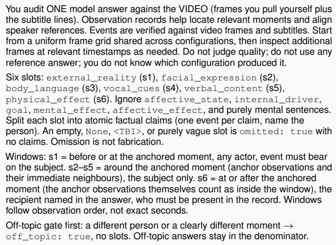

Per claim: Q1 do the frames or the subtitles contain this event, action, or line? Restatements count, inferences do not. Present only in the record, and the window is genuinely uncovered (off-screen, no audio/subtitle coverage, subject absent) → U with unverifiable\_reason; if the modality covers the window and the content is not there → F. Absent everywhere → F, evidence no match in frames, subtitles or record. Q2 is the actor allowed for this slot and is the event inside the slot’s window? No → L (quote the line, say which person or position). Yes → S (quote the subtitle line id or the frame timestamp; set support to frames / subtitles / both and window to anchor / neighbour).

Rules: vocal claims (volume, tone, tremor) are S only with a textual cue in the subtitles (exclamation, repetition, stammer, pace from timing), otherwise U with reason no\_audio — a record description of the voice is never sufficient; motion claims may be judged from change across adjacent grid frames. Degree words never flip a label; opposite direction is F; a visible reaction in s6 needs a visible basis; unattributed dialogue is attributed via the co-timed observation; when uncertain between S and F, choose F. Before labelling any F or L, view frames from that claim’s time window (pull them yourself if the shipped frame grid do not cover it) and list every timestamp viewed in frames\_viewed. All six slots must appear. Return the audit results in JSON format.

Fig. S3. Rubric of the unsupported-content audit. Slots s1–s6 are the audited fields. Labels: S supported, L misplaced, F fabricated, U unverifiable The off-topic denominator refers to the answer-level off-topic rate, not the statement-level fabrication rate.  
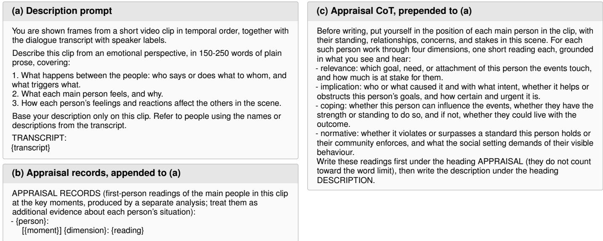  
Fig. S4. Prompts of the surface-reading diagnostic. (a) Description prompt. (b) Block appended in the appraisal-records setting. (c) Instruction prepended in the appraisal-CoT setting.

+ RT + PDD (w/o App.) are not statistically significant.   
Unverifiable rates remain similar across configurations.

## A.6.2 Surface Reading

Assessment. We ask models to describe each clip using the prompts in Fig. S4, without directing them to regulation or a particular moment. From these descriptions, we assess State attribution at moments where State and Manifestation differ in category, using unregulated moments as controls. We give a judge using claude-opus-5 the description and annotated State and Manifestation categories, but no video or subtitles, and conceal model and configuration identities with randomized path codes.

Decision rule. For each character–moment, the judge assigns one outcome:

• Correct State: the description identifies the annotated State, including a synonym or a main component of a mixed state. Naming both State and Manifestation also counts as correct.

• Surface reading: Manifestation is mistaken for State. This outcome does not apply to unregulated controls.

• Other/omitted: another error or no attribution.

Human verification. After the Opus judge assigns one classification to each character–moment, a human reviewer independently re-evaluates a subset drawn from the comparison and intervention sets. The two judgments agree on 91 of 98 descriptions (92.9%).

Table S6 reports regulated moments and unregulated controls separately. Table S7 extends the intervention comparison to four models. For the open-source models, reduced surface reading is accompanied by an increase in other errors or omissions, so it does not translate fully into correct State attribution.

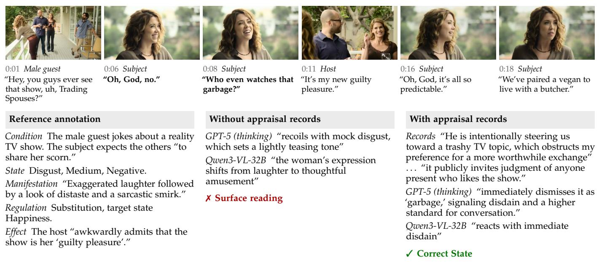  
Fig. S5. Appraisal intervention on a regulated moment. Top: frames and dialogue of the annotated episode, with the focal utterance in bold. Bottom: the reference annotation and excerpts of the model descriptions without and with appraisal records. Without the records, both models take the laughter at face value. With them, both identify the annotated State.

TABLE S6  
State attribution with and without regulation (%).
<table><tr><td>Moment</td><td>n</td><td>Correct State ↑</td><td>Surface reading ↓</td><td>Other/ omitted</td></tr><tr><td colspan="5">GPT-5 (thinking)</td></tr><tr><td>Regulated</td><td>58</td><td>50.0</td><td>19.0</td><td>31.0</td></tr><tr><td>Unregulated</td><td>10</td><td>50.0</td><td>一</td><td>50.0</td></tr><tr><td colspan="5">Qwen3-VL-32B</td></tr><tr><td>Regulated</td><td>58</td><td>37.9</td><td>27.6</td><td>34.5</td></tr><tr><td>Unregulated</td><td>10</td><td>90.0</td><td>一</td><td>10.0</td></tr><tr><td colspan="5">AffectGPT</td></tr><tr><td>Regulated</td><td>52</td><td>11.5</td><td>1.9</td><td>86.5</td></tr><tr><td>Unregulated</td><td>10</td><td>50.0</td><td>一</td><td>50.0</td></tr></table>

Surface reading: Manifestation mistaken for State. Other/omitted: other errors or omissions. –: not applicable.

Fig. S5 illustrates the role of appraisal in interpreting the same observable cue. The supplied records connect the guest’s preference for a more worthwhile conversation with the social cost of criticizing it. Both models then interpret her laughter as softening disdain rather than expressing amusement.

## A.7 Human Solvability and Judge Calibration

Human solvability. We select 50 questions per task from 250 distinct videos using reference annotations and video metadata, without consulting model predictions or evaluation results. We stratify by the first annotated affect category for T1, regulation tactic for T2, whether Internal Driver is queried for T3, the queried Effect channel (mental, affective, or physical) for T4, and whether the chain involves regulation for T5. Sampling follows the eligible pool’s stratum proportions. Strata expected to contribute fewer than two questions are merged before selection, without additional weighting. Videos used in other paper analyses, including annotationagreement assessment and case studies, are excluded. The seed, stratum proportions, exclusions, and ordered sample list are frozen before answer collection. Unavailable items are replaced by the next eligible item on the list, with skips and replacements logged. Two human participants independently answer each question using the same inputs as the models. Table S8 compares their mean scores with model scores on the same questions. Their task and component means also appear in Table 2 and Fig. 6a of the main paper.

TABLE S7  
Effect of appraisal on state attribution (%).
<table><tr><td>Setting</td><td>n</td><td>Correct State ↑</td><td>Surface reading ↓</td><td>Other/ omitted</td></tr><tr><td>GPT-5 (thinking)</td><td></td><td></td><td></td><td></td></tr><tr><td>Baseline</td><td>58</td><td>50.0</td><td>19.0</td><td>31.0</td></tr><tr><td>Appraisal CoT</td><td>58</td><td>51.7</td><td>15.5</td><td>32.8</td></tr><tr><td>Appraisal records</td><td>58</td><td>60.3</td><td>6.9</td><td>32.8</td></tr><tr><td>Qwen3-VL-32B</td><td></td><td></td><td></td><td></td></tr><tr><td>Baseline</td><td>55</td><td>40.0</td><td>27.3</td><td>32.7</td></tr><tr><td>Appraisal CoT</td><td>55</td><td>47.3</td><td>25.5</td><td>27.3</td></tr><tr><td>Appraisal records</td><td>55</td><td>50.9</td><td>1.8</td><td>47.3</td></tr><tr><td>InternVL3.5-38B</td><td></td><td></td><td></td><td></td></tr><tr><td>Baseline</td><td>55</td><td>38.2</td><td>21.8</td><td>40.0</td></tr><tr><td>Appraisal records</td><td>55</td><td>43.6</td><td>9.1</td><td>47.3</td></tr><tr><td>GLM-4.6V-Flash</td><td></td><td></td><td></td><td></td></tr><tr><td>Baseline</td><td>55</td><td>38.2</td><td>18.2</td><td>43.6</td></tr><tr><td>Appraisal records</td><td>55</td><td>47.3</td><td>3.6</td><td>49.1</td></tr></table>

Baseline: no appraisal intervention.

Judge calibration. To compare automated scores with human judgments, we sample 100 open-text fields, stratified by model, field type, and judge score, and ask a blinded human rater to score them from 0 to 4. We multiply the judge scores

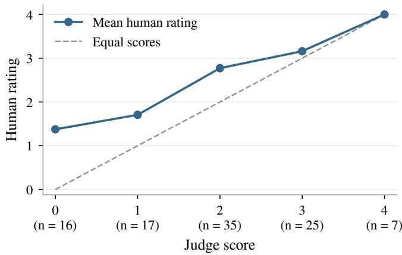  
Fig. S6. Human–judge calibration on 100 free-text fields. Points show mean human ratings, with group sizes below the axis. The dashed line indicates equal scores.  
TABLE S8

Human and model performance on the same 50 questions per task.   
Human scores average two participants; Avg. averages the five tasks.

<table><tr><td>Model / Human</td><td>T1</td><td>T2</td><td>T3</td><td>T4</td><td>T5</td><td>Avg.</td></tr><tr><td>Human</td><td>83.60</td><td>72.32</td><td>85.55</td><td>78.90</td><td>75.40</td><td>79.15</td></tr><tr><td>GPT-5 (thinking)</td><td>57.97</td><td>41.87</td><td>75.80</td><td>57.61</td><td>60.48</td><td>58.75</td></tr><tr><td>GPT-5 (non-thinking)</td><td>55.21</td><td>36.00</td><td>68.12</td><td>61.06</td><td>59.09</td><td>55.89</td></tr><tr><td>Gemini-3-Pro</td><td>55.59</td><td>41.53</td><td>68.00</td><td>60.19</td><td>54.18</td><td>55.90</td></tr><tr><td>Qwen3-VL-32B</td><td>50.56</td><td>34.26</td><td>63.66</td><td>49.00</td><td>50.68</td><td>49.63</td></tr><tr><td>Qwen3-Omni-30B</td><td>49.32</td><td>29.37</td><td>54.32</td><td>42.68</td><td>41.55</td><td>43.45</td></tr><tr><td>InternVL3.5-38B</td><td>48.00</td><td>28.64</td><td>44.05</td><td>34.94</td><td>35.16</td><td>38.16</td></tr><tr><td>TRACER (Ours)</td><td>60.78</td><td>49.91</td><td>84.39</td><td>60.21</td><td>62.59</td><td>63.58</td></tr></table>

by four and round them to the same scale before comparing the two sets of ratings. Fig. S6 shows their relationship, and the table below reports agreement statistics with bootstrap 95% confidence intervals.
<table><tr><td>Statistic</td><td>Estimate</td><td>95% CI</td></tr><tr><td>Spearman&#x27;s ρ</td><td>0.65</td><td>[0.49, 0.78]</td></tr><tr><td>Quadratic weighted κ</td><td>0.55</td><td>[0.41, 0.67]</td></tr><tr><td>Agreement within one point</td><td>84%</td><td>[76%, 91%]</td></tr><tr><td>Mean human minus judge score</td><td>0.65</td><td>[0.45, 0.83]</td></tr></table>

The positive mean difference indicates that the judge assigns lower scores than the human rater.

## APPENDIX B

## SCORING PROTOCOL

This appendix supplements the evaluation metrics in Section 4.3 of the main paper, detailing field scores, task aggregation, and the treatment of unparsed outputs.

## B.1 Field-Level Scoring

For an evaluated field $f ,$ let $\hat { y } _ { f }$ and $y _ { f }$ denote the prediction and reference. The field score is

$$
s _ { f } = \left\{ \begin{array} { l l } { \mathrm { F } 1 _ { \mathrm { s e t } } ( \hat { y } _ { f } , y _ { f } ) , } & { f \in \mathcal { F } _ { \mathrm { c a t } } , } \\ { \mathbf { 1 } [ \hat { y } _ { f } = y _ { f } ] , } & { f \in \mathcal { F } _ { \mathrm { l a b e l } } , } \\ { \bar { d } _ { 1 , f } ( 1 - \frac { 1 } { 2 } \bar { d } _ { 2 , f } ) , } & { f \in \mathcal { F } _ { \mathrm { t e x t } } . } \end{array} \right.\tag{S2}
$$

Here $\mathcal { F } _ { \mathrm { c a t } }$ contains Affective State category fields. $\mathcal { F } _ { \mathrm { l a b e l } }$ contains polarity, intensity, regulation tactic, and regulation source and target categories. $\mathcal { F } _ { \mathrm { t e x t } }$ contains open-text fields. Label comparisons normalize case and separators. The indicator $\mathbf { 1 } [ \cdot ]$ is 1 for a match and 0 otherwise. DeepSeek-V4- Flash rates each open-text field three times for T2 and twice for the other tasks. $d _ { 1 }$ and $d _ { 2 }$ are averaged separately before computing the field score.

Semantic adequacy $( d _ { 1 } )$ . The judge assesses agreement with the reference in meaning, including the character, focal episode, and information requested by the field. Equivalent wording receives the same credit.

TABLE S9  
Semantic adequacy d<sub>1</sub>: higher is better.
<table><tr><td>Score</td><td>Criterion</td></tr><tr><td>0.00</td><td>No meaningful match, an opposite claim, or the wrong character or episode.</td></tr><tr><td>0.25</td><td>Only a broad or generic relation to the reference.</td></tr><tr><td>0.50</td><td>Partial match, with an important detail or role missing or incorrect.</td></tr><tr><td>0.75</td><td>Correct central meaning, with a secondary omission or harmless addition.</td></tr><tr><td>1.00</td><td>Correct content, characters, and episode, regardless of wording.</td></tr></table>

Redundancy $\left( d _ { 2 } \right)$ . The judge estimates how much of the answer adds no information relevant to the queried field. This includes repetition within the answer, irrelevant restatements of the question, generic filler, and competing guesses. Agreement with the reference and useful supporting details are not redundancy. Answer length itself is not penalized, and factual errors are assessed through $d _ { 1 }$

TABLE S10  
Redundancy d<sub>2</sub>: higher is worse.
<table><tr><td>Score</td><td>Criterion</td></tr><tr><td>0.00</td><td>Focused answer with almost no unnecessary content.</td></tr><tr><td>0.25</td><td>Minor repetition, filler, or unnecessary hedging.</td></tr><tr><td>0.50</td><td>About half the answer is uninformative or lists compet- ing guesses.</td></tr><tr><td>0.75</td><td>Most of the answer is repetition, generic content, or competing guesses.</td></tr><tr><td>1.00</td><td>Almost entirely redundant or noncommittal.</td></tr></table>

The judge assigns each rating on a continuous [0, 1] scale rather than calculating it from word counts. The bars in (S2) denote the mean of the repeated ratings for each dimension.

## B.2 Task-Level Aggregation

Field scores are combined according to the task’s requested outputs, including Regulation Evidence in Task 2. In Task 5, the given affective object is excluded from the State score. The equations below instantiate the hierarchy in (6) of the main paper when all components are annotated:

$$
\begin{array} { r l } & { S _ { \mathrm { T 1 } } = \frac { 1 } { 2 } ( S _ { \mathrm { S t a t e } } + S _ { \mathrm { M a n i f e s t a t i o n } } ) , } \\ & { S _ { \mathrm { T 2 } } = \frac { 1 } { 4 } ( S _ { \mathrm { T a c t i c } } + S _ { \mathrm { T a r g e t } } + S _ { \mathrm { G o a l } } + S _ { \mathrm { E v i d e n c e } } ) , } \\ & { S _ { \mathrm { T 3 } } = \frac { 1 } { 2 } ( S _ { \mathrm { E x t e r n a l R e a l i t y } } + S _ { \mathrm { I n t e r n a l D r i v e r } } ) , } \\ & { S _ { \mathrm { T 4 } } = S _ { \mathrm { r e q u e s t e d E f e c t } } , } \end{array}
$$

Fig. S7. Field-level rewrite rates after human review of retained MLLMproposed chains.

$$
\begin{array} { r } { S _ { \mathrm { T 5 } } = \frac { 1 } { 3 } ( S _ { \mathrm { C o n d i t i o n } } + S _ { \mathrm { A f f e c t } } + S _ { \mathrm { E f f e c t } } ) , \qquad } \\ { S _ { \mathrm { A f f e c t } } = \frac { 1 } { 3 } ( S _ { \mathrm { S t a t e } } + S _ { \mathrm { M a n i f e s t a t i o n } } + S _ { \mathrm { R e g u l a t i o n } } ) . } \end{array}\tag{S3}
$$

Applicable fields. The reference determines which components enter each mean. Two cases must be distinguished:

• Not annotated in the reference. Exclude the component and renormalize the remaining weights at that level.

• Missing from the prediction. Keep the component’s weight and assign it zero.

Item scores are averaged within each task, and the five task means contribute equally to the overall score, as in (6) of the main paper.

T2 regulation. The source state is supplied in the question, so the task evaluates the regulation rather than recognizing that state again:

• Target. Score it only when the reference target category differs from the supplied source category, that is, for Substitution and Fabrication. Two predicted categories do not match a single reference category.

• No regulation. Score tactic alone.

Here $S _ { \mathrm { E v i d e n c e } }$ scores Regulation Evidence $( M _ { \mathrm { r e g } } ) _ { \cdot }$ , the manifestation cues supporting the regulation judgment. It is a task-specific output, not a separate Blueprint construct. For regulated items, it receives equal weight with the other applicable fields. Neither the evidence score nor the goal score enters the mean for items without regulation.

## B.3 Parsing and Score Reporting

An output that cannot be parsed receives an item score of zero. Table S11 distinguishes the resulting all-item mean from the mean over parsable outputs alone.

All reported scores keep parsing failures at zero. The table gives both values for settings below 90% parsing success, with the reported value in bold.

TABLE S11  
Output parsing rates below 90%. Bold values are reported in Table 2 of the main paper.
<table><tr><td>Model</td><td>Task</td><td>Pars. (%)</td><td>All</td><td>Pars. only</td></tr><tr><td>Emotion-LLaMA*</td><td>T2</td><td>61</td><td>5.22</td><td>8.61</td></tr><tr><td>Emotion-LLaMA†</td><td>T3</td><td>37</td><td>2.26</td><td>6.11</td></tr><tr><td>Emotion-LLaMA†</td><td>T4</td><td>49.5</td><td>0.31</td><td>0.63</td></tr><tr><td>Emotion-LLaMA†</td><td>T5</td><td>7</td><td>0.20</td><td>2.81</td></tr><tr><td>AffectGPT†</td><td>T2</td><td>17</td><td>4.64</td><td>27.38</td></tr><tr><td>AffectGPT*</td><td>T3</td><td>79</td><td>17.99</td><td>22.84</td></tr><tr><td>AffectGPT*</td><td>T4</td><td>83</td><td>15.79</td><td>18.94</td></tr><tr><td>AffectGPT*</td><td>T5</td><td>87</td><td>20.87</td><td>23.96</td></tr><tr><td>Emotion-Qwen*</td><td>T1</td><td>81</td><td>29.45</td><td>36.58</td></tr><tr><td>Emotion-Qwen*</td><td>T2</td><td>81</td><td>24.24</td><td>30.09</td></tr><tr><td>Emotion-Qwen*</td><td>T3</td><td>82</td><td>21.04</td><td>25.74</td></tr><tr><td>Emotion-Qwen</td><td>T5</td><td>77</td><td>19.13</td><td>24.80</td></tr><tr><td>LLaVA-OneVision-7B†</td><td>T5</td><td>29</td><td>5.47</td><td>18.76</td></tr><tr><td>LLaVA-NeXT-Video-32B*</td><td>T3</td><td>84</td><td>27.13</td><td>32.19</td></tr><tr><td>LLaVA-NeXT-Video-32B*</td><td>T5</td><td>54</td><td>13.80</td><td>25.77</td></tr></table>

Pars.: share of parsable outputs. All: unparsable outputs score zero. Pars. only: mean over the parsable outputs. <sup>\*</sup>At least half parsable. <sup>†</sup>Fewer than half parsable.

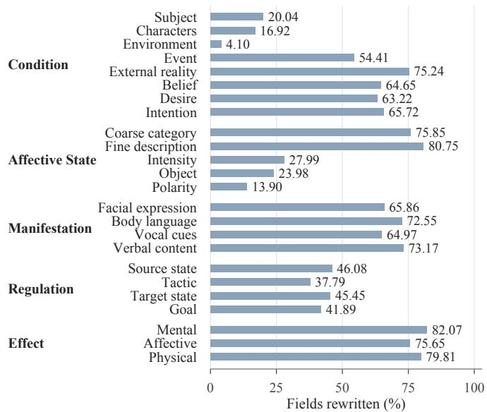

## APPENDIX C

## DATA CONSTRUCTION AND ANNOTATION

## C.1 Annotation and Human Revision

Paired records. To quantify human edits, we pair 1,125 retained MLLM-proposed chains with their raw human records from the annotation archive, before AI polishing. For each field, we restrict the comparison to chains where that field is present in both records.

Edit criterion. We count a field as edited when its value differs after ignoring formatting and standardizing emptyvalue markers. The resulting rates in Fig. S7 therefore include wording changes as well as changes in meaning.

## C.2 Annotation Consistency

Dataset construction involved eight trained annotators. Two annotators independently re-annotated 50 chains excluded from guideline development, using frames and subtitles. We compare these two annotations (A and B) field by field, including only chains for which both provide an applicable answer. Fig. S9 reports the results.

Closed fields. We compute Cohen’s κ, with linear weights for the ordered intensity levels (Low, Medium, and High). Category, Tactic, and Intensity each have 50 eligible chains; Polarity has 32 and Target has 29. For Category, we compare the first listed emotion category. For Target, we compare only the emotion category, taking it to match the felt category for Suppression and Amplification.

Open-text fields. For each field, we pair the non-empty texts from A and B and randomize their order. A model judge (claude-opus-5), blind to annotator identity, assesses the pairs using a shared rubric: the same content (1), partly overlapping (0.5), or different or contradictory (0). Wording and length may differ without changing the content; adding or omitting a substantive element constitutes partial agreement. We report strict agreement, the proportion of eligible pairs rated 1, rather than the mean rating. This measures agreement on content where both annotations provide text, not on whether a field should be present.

(a) A response can span consecutive actions  
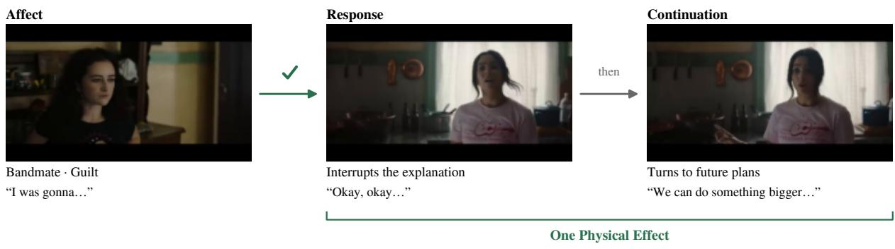

(b) Distinguishing responses to different events  
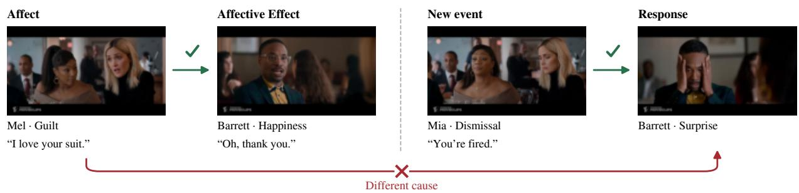  
Fig. S8. Effect boundaries. (a) Consecutive actions belong to one Physical Effect. (b) Barrett’s later surprise follows the dismissal, not Mel’s preceding Affect. Checks mark supported links, and the cross marks the incorrect attribution.

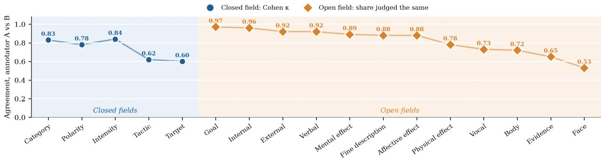  
Fig. S9. Agreement between two independent re-annotations. Closed fields: Cohen’s κ (linear weights for Intensity). Open fields: proportion of pairs judged to state the same content. Only κ corrects for chance agreement; the two measures are not directly comparable.

Eligible pair counts are 50 each for External Reality, Internal Driver, fine-grained affective description, and Body Language; 49 each for Facial Expression and Vocal Cues; 48 for Verbal Content; 31 each for Regulation Goal and Evidence; and 45, 33, and 46 for Mental, Affective, and Physical Effect, respectively. Counts fall below 50 when a chain lacks the field or either annotator leaves it unfilled.

## C.3 Field Annotation Guidance

The following criteria supplement the annotation procedure in the main paper.

Intensity. State intensity is judged from the situation, the person’s concerns, and their response. A calm Manifestation or successful Regulation does not imply low intensity, and high intensity does not require loss of control. The levels are:

• Low: mild feeling with little influence on attention or ongoing activity.

• Medium: feeling that changes attention or response without dominating the episode.

• High: strong feeling that dominates the person’s concerns or creates an urgent need to respond.

Mixed polarity. Positive and negative feelings coexist in the same person at the same moment, such as relief with embarrassment. A mismatch between State and Manifestation, or a change across moments, is not sufficient.

Effect. When annotating an Effect, we include connected utterances or actions that respond to the subject’s affective episode, even when they extend beyond the first response. We exclude reactions to a new event, as illustrated by the contrasting cases in Fig. S8.

## C.4 Task and Answer Formats

Following Section 4.1 of the main paper, each question combines episode context (ctx<sub>t</sub>), known constructs (K<sub>t</sub>), and a JSON template for queried constructs (Q<sub>t</sub>). Task 2 stores Regulation Evidence $\left( M _ { \mathrm { r e g } } \right)$ in the evidence field of regulation\_pathway; this is not an additional Blueprint construct. Fig. S10 gives the question and answer formats for all five tasks.

Fig. S10. Task and answer templates. Braces indicate item-specific content. Field names follow Table 1 of the main paper. Item identifiers are omitted. Manifestation channels, Regulation, Internal Driver, and Effect channels appear only when annotated.

## T1 Grounded Affect Recognition

```jsonl
Task: Infer the subject’s affective state and observable affective manifestation.
Focal Context: Focus on {subject}. {scene and trigger}, based on the
subject’s observed {annotated channels}, infer the subject’s internal affective
state.
Known Structured Fields:
- subject: {subject}
Answer Template:
{
"subject": "{subject}",
"affective_state": {
"object": "string", "coarse_category": ["string"],
"fine_description": "string",
"polarity": "string", "intensity": "string" },
"affective_manifestation": {
"facial_expression": "string",
"body_language": "string",
"vocal_cues": "string", "verbal_content": "string" }
}
```

## T2 Regulation Decoding

Task: Given the subject’s affective state (category and intensity) at the focal moment, decide whether and how the subject regulates its outward manifestation. Report the regulation tactic, the goal, the target affective state as a category, and the evidence observed in the video.

Focal Context: Focus on {subject}. Focal window: {m:ss}-{m:ss}. Focal Context: Focus on {subject}. Focal window: {m:ss}-{m:ss}.

Known Structured Fields:   
source\_subject: {subject}   
affective\_state.object: {object}   
affective\_state.coarse\_category: {category}   
affective\_state.intensity: {intensity}   
Answer Template:   
"subject": "{subject}",   
"regulation\_pathway": {   
"tactic\_type": "string", "goal": "string",   
"target\_affect\_state": "string", "evidence": "string"   
<sup>}</sup><sub>}</sub>

## T3 Affective Cause Reasoning

Task: Given the subject’s affective state and manifestation, infer the affective cause requested by the answer template.

Focal Context: Analyze the affective cause for {subject}’s {affect} toward {object}.

```textproto
Known Structured Fields:
source_subject: {subject}
- affective_state.object: {object}
affective_state.coarse_category: {category}
affective_state.polarity: {polarity}
affective_state.intensity: {intensity}
affective_manifestation.facial_expression: {text}
affective_manifestation.body_language: {text}
affective_manifestation.vocal_cues: {text}
affective_manifestation.verbal_content: {text}
regulation_pathway.tactic_type: {tactic}
regulation_pathway.goal: {text}
- regulation_pathway.target_affect_state: {category}
regulation_pathway.evidence: {text}
```

## T3 Affective Cause Reasoning (continued)

Answer Template:   
"subject": "{subject}",   
"affective\_cause": {   
"internal\_driver": "string",   
"external\_reality": "string" }   
}

## T4 Affective Effect Reasoning

Task: Given the source full affect stage, infer the requested downstream effect on the specified recipient.

Focal Context: Known source affective episode: {subject}’s full affect toward {object}. Requested downstream effect: {effect type} on {recipient}.

## Known Structured Fields: wn Structured Fields:

```yaml
source_subject: {subject}
source_affective_state.object: {object}
source_affective_state.coarse_category: {category}
source_affective_state.fine_description: {text}
source_affective_state.polarity: {polarity}
source_affective_state.intensity: {intensity}
source_affective_manifestation.facial_expression:
{text}
source_affective_manifestation.body_language: {text}
source_affective_manifestation.vocal_cues: {text}
source_affective_manifestation.verbal_content: {text}
source_regulation_pathway.tactic_type: {tactic}
source_regulation_pathway.goal: {text}
source_regulation_pathway.target_affect_state:
{category}
source_regulation_pathway.evidence: {text}
effect_type: {effect type}
effect_recipient: {recipient}
Answer Template:
"subject": "{subject}",
"object": "{object}",
"{effect type}": "string"
```

## T5 Full Chain Reconstruction

Task: Reconstruct the complete condition-affect-effect chain for the focal affective moment.

Focal Context: Reconstruct the affective chain for {subject}’s affect related to {object} in the environment {environment} Around this focal moment: When {name} says “{line}”.

Known Structured Fields:   
subject: {subject}   
affect\_object: {object}   
focal\_anchor: Around this focal moment: When {name}   
says "{line}".   
given\_affective\_fields: none; reconstruct the full   
chain from the focal anchor and multimodal evidence

## Answer Template:

```jsonl
"1_condition": {
"subject": "{subject}",
"causal_analysis": {
"internal_driver": "<TBI>",
"external_reality": "<TBI>" } },
"2_affect": {
"affective_state": {
"object": "{object}", "coarse_category": "<TBI>",
"fine_description": "<TBI>",
"intensity": "<TBI>", "polarity": "<TBI>" },
"affective_manifestation": {
"facial_expression": "<TBI>",
"body_language": "<TBI>",
"vocal_cues": "<TBI>", "verbal_content": "<TBI>" },
"regulation_pathway": {
"tactic_type": "<TBI>", "goal": "<TBI>",
"source_affect_state": "<TBI>",
"target_affect_state": "<TBI>" } },
"3_effect": {
"mental_effect": "<TBI> on {recipient}",
"affective_effect": "<TBI> on {recipient}",
"physical_effect": "<TBI> on {recipient}" }
```