# Design Creativity Bench: Measuring creativity in LLM-Generated UI

Aman Rusia∗ Abhijit Bhole Prashank Gupta Dipanjan Dey

Kombai Inc. https://kombai.com

## Abstract

As leading LLMs improve on capability evaluations, their limitations in producing creative outputs on design tasks remain insuficiently characterised. Our work introduces Design Creativity Bench, a benchmark that evaluates diversity and appropriateness in UI designs. It measures distinctiveness among models on the same prompt (originality), how much a model’s designs change between two prompts for the same UI goal in diferent product domains (creative range), and the share of a brief’s acceptance criteria each design meets (appropriateness). Originality is 0.592 for same-prompt design pairs from diferent models (95% CI [0.582, 0.602]), far below the 0.764 for same-prompt human–model pairs (95% CI [0.751, 0.778]). Creative range is 0.581 across models (95% CI [0.567, 0.597]), against 0.902 for human designs (95% CI [0.884, 0.919]). Appropriateness is above 90% for every model, and the best model reaches 99.2%, slightly above the 98.0% for human designs. Our work shows that the default output of LLMs, though generally appropriate, is substantially more repetitive than the human baseline. This calls for strong measures to address the issue.

## 1 Introduction

Creativity and originality are important qualities in user interface (UI) design (Lavie and Tractinsky, 2004). While LLM capabilities appear to be on an exponential growth trajectory (Kwa et al., 2025; Xiao et al., 2025), the creativity of LLMs in UI design remains largely unknown.

Previous studies have reported poorer creativity in LLMs compared with humans on text and code generation tasks (Chakrabarty et al., 2024; Lu et al., 2025; Wenger and Kenett, 2025). The dominant account attributes output homogeneity to post-training alignment (Kirk et al., 2024; Padmakumar and He, 2024; Peeperkorn et al., 2024; Jiang et al., 2025; West and Potts, 2025; Shypula et al., 2025), but recent work argues that it may originate in the likelihood-maximisation objective itself (Fortier et al., 2026), suggesting that post-alignment interventions alone may not resolve the problem.

Creativity is frequently characterized in terms of appropriateness and novelty (Guilford, 1950; Runco and Jaeger, 2012; Peeperkorn et al., 2024). Studies of LLMs on open-ended tasks commonly assess novelty through output diversity, i.e. how diferent outputs are from one another (Tevet and Berant, 2021; Zhang et al., 2025; Jiang et al., 2025; Wenger and Kenett, 2025; Padmakumar and He, 2024). Several studies have examined whether simple prompting and prompt Design a dashboard to track a patient queue, schedule and alerts.

prompt Design an account settings page with profile, password, 2FA and preferences.  
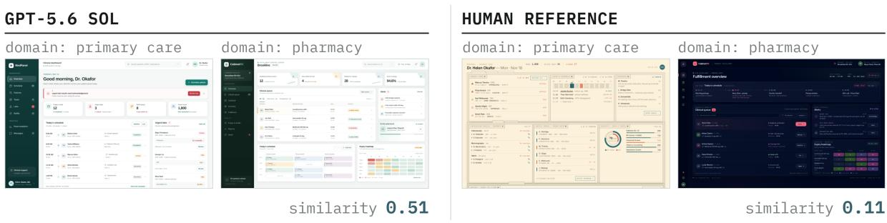

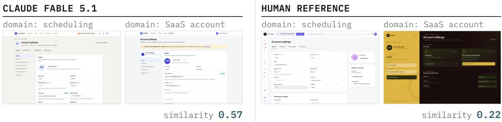  
Figure 1: Diversity in LLM UI generation compared with human designs. The examples are drawn from the benchmark $\mathcal { D } _ { B } .$ The model-generated designs are markedly more similar across domain and content variants than the corresponding human reference designs. Each row pairs two prompts that share the goal shown (paraphrased) and difer in product domain and content; similarity is the pair score, from 0 to 1, where higher means more alike. We ask models to generate desktop designs for a 1280 × 720 target viewport.

sampling changes can increase this diversity, including prompt paraphrasing, creativity-oriented system prompts, in-context regeneration, temperature variation, and alternative sampling schemes (Shur-Ofry et al., 2026; Zhang et al., 2025; Jiang et al., 2025; Peeperkorn et al., 2024; Wenger and Kenett, 2025). These changes often have limited efects (Peeperkorn et al., 2024; Jiang et al., 2025; Wenger and Kenett, 2025; Zhang et al., 2025), and even where larger gains occur, independently generated outputs from the individual models evaluated in these studies remain below human baselines (Shur-Ofry et al., 2026; Zhang et al., 2025).

These studies identify persistent limitations in the diversity of generated outputs, even when individual responses are otherwise appropriate. However, findings from text and code generation tasks do not establish the extent of this problem in UI design tasks. This gap motivates us to examine whether LLM-generated UI designs exhibit similar limitations.

To this end, we introduce Design Creativity Bench. This benchmark uses pairs of open-ended design briefs that share a design goal and UI archetype but difer in product domain and content requirements. Our open-ended UI briefs leave many design decisions unspecified, permitting multiple plausible solutions; Appendix A1 illustrates these choices for one brief. Changes in domain and content provide additional reasons to vary those decisions. We evaluate the HTML outputs generated by LLMs for these briefs using three complementary measures.

• Originality measures diferences between models on the same prompt, reported as mean dissimilarity of those design pairs.

• Creative range measures variation within a model across the paired briefs, reported as the mean distinctiveness of its design pairs across the two briefs.

• Appropriateness measures percentage of a brief’s acceptance criteria that a design satisfies.

We also combine the three measures into an overall score, a summary of each model’s creativity, and report it along with the individual measures.

We also collect human-created designs under the same briefs and evaluate them using the same metrics. These human-created designs form our human gold baseline, an empirical reference for design creativity as reflected in variation among acceptable designs. Throughout the paper, we refer to this set as the human baseline or human reference.

Together, these measures let us evaluate UI design creativity as reflected in variation among acceptable designs, using the human baseline as a point of comparison.

## 2 Details of the metrics

## 2.1 Measuring how much two designs repeat

We first select a method to obtain a similarity score S for a pair; the distinctiveness of the pair is 1 − S. To check the score against human judgement, we labeled 100 design pairs as distinct, not distinct, or unsure (no pair was labelled unsure). On this dataset $( \mathcal { D } _ { C } )$ , the selected similarity score separates the two classes with an AUC of 0.85. $\mathcal { D } _ { C }$ was not used to select or tune the scorer, so this is an out-of-sample check. Appendix B7 provides details.

The similarity-score method itself was selected from various options based on humanagreement and robustness evaluations. We describe it next.

Embedding and scoring. Comparing UI designs is more involved than comparing image or text similarity because more invariants are involved: a product card with a diferent title, icon and spacing is materially the same design element.

Other visual variants that do not change the semantics of a UI element include:

• Viewport width changes

• Responsive reflow

• Text changes

• Changes in graphics or icons

• Spacing changes (up to some limit)

• Font-scale changes

• Size of the dynamically sized group (N rows of tables, N cards in a grid)

At the same time, some changes do alter the design: deleting or duplicating child elements, reordering them, changing the layout direction, or flattening and reparenting parts of the hierarchy. We call these structural edits. Raw image embeddings treat them almost like the invariant changes above, so a score built on them cannot tell a new layout from a restyled one.

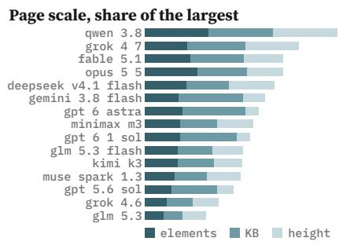

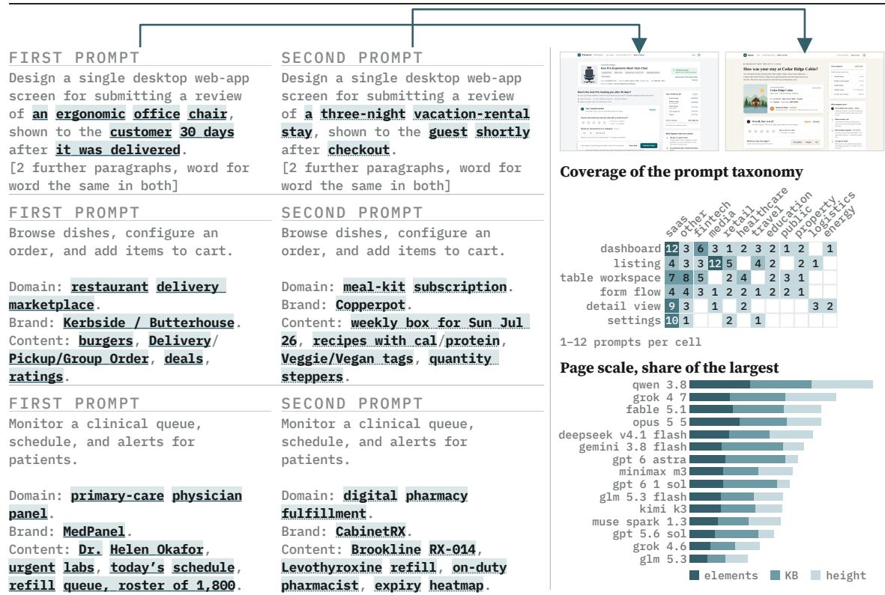  
Figure 2: Prompt pair examples to measure creative range. Prompt inventory for $\mathcal { D } _ { B }$ . Left: three prompt pairs. The two prompts in each pair share the goal but difer in domain and content. Top right: what Claude Fable 5.1 returned for the first pair, each design linked by an arrow to the prompt that produced it. Right: the taxonomy covered by the 160 prompts, with screen archetype plotted against product vertical and prompt counts shown using a single hue because each cell value is a magnitude; and how much page content each model generates.

We show that embeddings trained to ignore the invariant changes and react to the structural ones have higher agreement with human labels.

We use both kinds of edits to train a linear layer over image embeddings (loosely termed a projection layer, as it reduces the vector to 64 dimensions) on a separate dataset, $\mathcal { D } _ { P }$ . The dataset $\mathcal { D } _ { P }$ and loss functions are outlined in Appendix B2. We experimented with leading image embeddings (Gemini Embedding (Google, n.d.)) and specialized UI embeddings (UIClip (Wu et al., 2024), a CLIP model (Radford et al., 2021) fine-tuned on interface screenshots). We observed that UIClip has lower loss on larger (page-level) segments, while Gemini performs better on smaller segments; therefore, we also experimented with a weighted, rescaled combination of the two embeddings, henceforth called the hybrid embedding.

We also observed that pages are often large and that full-page image embeddings lose finer diferences. Our work obtains page segments and compares pages based on segmentlevel diferences. Segment-level similarity is obtained by first segmenting the whole page into containers (top-level sections, compound components, stacks, etc.), embedding each segment’s rendered crop, matching segments between pairs (allowing null matches), assigning an importance weight to each segment pair, and then summing the weighted scores (Appendix B1 defines a segment and how each one is captured). We treat the design’s color system as a separate top-level comparison; to avoid double counting, we train the embedding layers to be invariant to color systems (details in Appendix B4).

In addition to embedding-based approaches, we also consider LLM-as-judge methods, which receive a design pair and assign a similarity score. In Figure 8, the scoring approaches are evaluated against a comparison dataset, $\mathcal { D } _ { B } ^ { H }$ , labeled by three human reviewers (Appendix B5). While our fine-tuned, hybrid, segment-wise scoring outperformed whole-page embeddings and raw embeddings, LLM-as-judge had the highest agreement with human consensus. On the other hand, the best LLM-as-judge (Grok 4.6), when used to obtain a single similarity score, had robustness issues on our design-perturbation dataset $\mathcal { D } _ { L }$ . Its score was not monotonic under graded perturbations, as shown in Figure 9. We choose the best embedding-based approach as the score for our leaderboard because it passes all monotonicity checks.

## 2.2 Measuring originality

For each model, we compare its designs with those of every other model designing against the same brief. Models from the same lab are left out from the pairings. Originality is the mean of $1 - S$ over these pairs, where S is the pair similarity score. Higher values indicate greater distinctiveness from the model population. The human reference uses the same measure on human–model pairs.

## 2.3 Measuring creative range

Creative range applies the same pair score within one model. Each task is issued as two prompts that keep the goal and UI archetype but change the product domain and content description (Figure 2). For each model and task, the model’s two designs form one pair. A model’s creative range is the mean of $1 - S$ over its two-prompt pairs. Higher values indicate that the model’s designs respond to the change in the brief. The human reference is scored the same way on the two human designs of each task.

## 2.4 Measuring appropriateness

For each design brief, we first define a set of yes/no criteria that together specify what an appropriate and correct design must satisfy: the requested screen, the content and values the brief states, controls for the actions it asks for, and the correctness of any values derived from them. Each criterion is also tagged as critical when failing it means the design does not do the job the brief asks, such as a wrong page type, a missing or wrong required value, or no control for a core action. We then judge each generated design against its brief’s criteria and report the percentage of criteria met across a model’s designs. Appendix C gives an example criteria set.

## 3 Results

Fifteen leading models (Table 1) were used to generate 160 designs each (2,400 primary model designs in total) across 80 tasks and 80 diferentiated pairs per model $( { \mathcal { D } } _ { B } ;$ Appendix B gives the breakdown). Originality and creative range were measured using an embedding method with high human agreement on two diferent evaluations (AUC 0.87 on $\mathcal { D } _ { B } ^ { H }$ , AUC 0.85 on $\mathcal { D } _ { C } )$ Human designers received the benchmark briefs and access to public inspiration libraries, such as Behance and Kombai Gallery. They created designs for these briefs by adapting publicly available design references to the brief requirements. Reference access was intended to support high-quality design within time constraints and reflect how designers often use inspirations in practice.

Table 1: Participating models, with the reasoning efort each model was generated with. Every model runs at its highest efort except Claude Opus 5.5† which runs at xhigh since at max it runs out of the time budget.
<table><tr><td>Model (effort) Qwen3.8 Max (max)</td><td>Provider</td></tr><tr><td>Claude Fable 5.1 (max) Claude Opus 5.5 (xhigh)† DeepSeek V4.1 Flash (max) Gemini 3.8 Flash (high) Muse Spark 1.3 (xhigh)</td><td>Alibaba Anthropic Anthropic DeepSeek Google Meta</td></tr><tr><td>MiniMax M3 (high) Kimi K3 (max) GPT-5.6 Sol (max)</td><td>MiniMax Moonshot OpenAI</td></tr><tr><td>GPT-6 Astra (max) GPT-6.1 Sol (max) Grok 4.6 (xhigh) Grok 4.7 (xhigh) GLM-5.3 (max) GLM-5.3-Flash (max)</td><td>OpenAI OpenAI xAI xAI Z.ai</td></tr></table>

Model-generated designs resemble one another more than they resemble the human reference. Table 2 ranks the models by originality. We take every pair of designs from two diferent models designing from the same prompt and average their distinctiveness 1 − S. Across the fifteen models, originality is 0.592 (95% CI [0.582, 0.602]) over 15,840 unique model–model pairs, compared with 0.764 [0.751, 0.778] for 2,400 human–model pairs. The pooled interval uses 20,000 bootstrap resamples of whole tasks (Efron, 1979; Field and Welsh, 2007) (seed 7), retaining every pair within each sampled task and recomputing the pooled mean; it conditions on the observed models, generations and fitted scorer. The most original models are GPT-6 Astra (0.646) and Grok 4.7 (0.643), and the least original, Kimi K3, scores 0.547. Even the most original model is 0.12 below the human row, and no model interval reaches it.

Diferentiating the prompt does not diferentiate the design. Table 3 ranks the models on creative range. The model is fixed and the prompt changes: both prompts state the same goal in the same page archetype and difer only in product domain and sample content. Across the fifteen models, the mean distinctiveness of those pairs is 0.581 (95% CI [0.567, 0.597]), against 0.902 [0.884, 0.919] for the human pairs built the same way. The pooled interval resamples whole tasks as in Table 2 (20,000 resamples, seed 7). The spread is wide – GLM-5.3 scores 0.634 and GPT-6 Astra 0.472 – but no model interval reaches the human value. The least distinct archetype is settings (0.554) and the most distinct is listing (0.590).

What makes this an important result is that there are enough changes in the two prompts to motivate diversity. Indeed, when the same model designs two unrelated tasks, the mean

Table 2: Originality. Two models from diferent labs design against the same prompt. We report the mean distinctiveness 1 − S of those pairs. A high value means a model difers from the others. Each model contributes 160 pairs per partner from another lab: 1,920 to 2,240 pairs. The human row compares each human design with model designs from all 15 models. Intervals are task-blocked bootstraps. Bold marks the highest model value. Cost and time are medians per generated design.
<table><tr><td>Rank</td><td>Model</td><td>Originality</td><td>95% CI</td><td>Cost (USD)</td><td>Time (min)</td></tr><tr><td>1</td><td>GPT-6 Astra</td><td>0.646</td><td>[0.631, 0.661]</td><td>2.564</td><td>13.8</td></tr><tr><td>2</td><td>Grok 4.7</td><td>0.643</td><td>[0.631, 0.655]</td><td>0.593</td><td>18.8</td></tr><tr><td>3</td><td>GPT-6.1 Sol</td><td>0.642</td><td>[0.628, 0.657]</td><td>0.460</td><td>15.8</td></tr><tr><td>4</td><td>Gemini 3.8 Flash</td><td>0.637</td><td>[0.621, 0.653]</td><td>0.123</td><td>0.9</td></tr><tr><td>5</td><td>Qwen3.8 Max</td><td>0.623</td><td>[0.609, 0.636]</td><td>0.309</td><td>18.0</td></tr><tr><td>6</td><td>Grok 4.6</td><td>0.591</td><td>[0.579, 0.602]</td><td>0.100</td><td>3.5</td></tr><tr><td>7</td><td>GPT-5.6 Sol</td><td>0.587</td><td>[0.574, 0.600]</td><td>0.598</td><td>4.4</td></tr><tr><td>8</td><td>MiniMax M3</td><td>0.587</td><td>[0.575, 0.599]</td><td>0.024</td><td>2.5</td></tr><tr><td>9</td><td>GLM-5.3</td><td>0.579</td><td>[0.567, 0.590]</td><td>0.043</td><td>2.5</td></tr><tr><td>10</td><td>DeepSeek V4.1 Flash</td><td>0.576</td><td>[0.565, 0.588]</td><td>0.051</td><td>5.3</td></tr><tr><td>11</td><td>Muse Spark 1.3</td><td>0.568</td><td>[0.558, 0.578]</td><td>0.080</td><td>1.1</td></tr><tr><td>12</td><td>Claude Fable 5.1</td><td>0.558</td><td>[0.547, 0.570]</td><td>5.329</td><td>13.9</td></tr><tr><td>13</td><td>Claude Opus 5.5</td><td>0.557</td><td>[0.548, 0.567]</td><td>1.557</td><td>13.1</td></tr><tr><td>14</td><td>GLM-5.3-Flash</td><td>0.553</td><td>[0.543, 0.564]</td><td>0.022</td><td>10.0</td></tr><tr><td>15</td><td>Kimi K3</td><td>0.547</td><td>[0.536, 0.558]</td><td>0.570</td><td>17.0</td></tr><tr><td></td><td>Human reference</td><td>0.764</td><td>[0.751, 0.778]</td><td></td><td></td></tr></table>

distinctiveness is 0.811 (Figure 4b).

Originality does not imply creative range. The two rankings are unrelated (Spearman −0.13, p = 0.66; exploratory 95% model-bootstrap interval [−0.65, 0.50], 20,000 resamples, seed 7; Figure 3). GPT-6 Astra is the most original model in Table 2 and last in Table 3, difering from its competitors while repeating its own design on most domain changes; GPT-6.1 Sol and GPT-5.6 Sol, second and third last, show the same pattern. Grok 4.7, Gemini 3.8 Flash and Qwen3.8 Max are above the model mean on both. Originality and creative range measure diferent properties; these rankings do not establish statistical independence.

Design outputs of today’s frontier models are generally appropriate. As reported in Table 4, every model in our current test set meets more than 90% of its briefs’ criteria, and every model meets more than 96% of the critical criteria. Claude Opus 5.5 scored the highest mean criteria satisfaction at 99.2%, followed by GPT-6 Astra at 99.1%, both slightly above the human reference at 98.0%. The most common failures related to appropriateness are missing controls for a workflow the brief names (33%), or sample data whose counts and totals do not match (26%).

Overall score. Figure 5 ranks the models on one overall score. The score gives equal weight to appropriateness and to diversity. Diversity combines originality and creative range with weights of 0.9 and 0.1; Appendix B8 explains the weights. The score is a T-score: 50 is the average model, and 10 points is one standard deviation. GPT-6 Astra (65.5) and GPT-6.1 Sol (63.7) rank highest among models below the human reference score of 92.3.

Table 3: Creative range. Each task is issued as two prompts that share a goal and page archetype but difer in product domain and content. Cells are the mean distinctiveness 1 − S of a model’s two designs for the two prompts, split by archetype; higher means the design changed more with the brief. Each model contributes 80 pairs, one per task: Listing 18, Dashboard 18, Form flow 11, Table 16, Detail 10, Settings 7. The overall column pools all 80 pairs, and its interval is a task-blocked bootstrap. The human row pairs the two human designs of each task. Rows are ranked on the overall value and bold marks the highest model value in each column; the human reference is excluded from that comparison.
<table><tr><td>Rank</td><td>Model</td><td>Listing</td><td>Dashboard</td><td>Form flow</td><td>Table</td><td>Detail</td><td>Settings</td><td>Overall</td><td>95% CI</td></tr><tr><td></td><td>1 GLM-5.3</td><td>0.63</td><td>0.63</td><td>0.68</td><td>0.65</td><td>0.61</td><td>0.59</td><td>0.634</td><td>[0.607, 0.662]</td></tr><tr><td>2</td><td>Gemini 3.8 Flash</td><td>0.63</td><td>0.62</td><td>0.68</td><td>0.63</td><td>0.60</td><td>0.58</td><td>0.628</td><td>[0.602, 0.652]</td></tr><tr><td>3</td><td>Grok 4.6</td><td>0.63</td><td>0.65</td><td>0.64</td><td>0.61</td><td>0.61</td><td>0.54</td><td>0.625</td><td>[0.599, 0.650]</td></tr><tr><td>4</td><td>Qwen3.8 Max</td><td>0.65</td><td>0.62</td><td>0.60</td><td>0.60</td><td>0.62</td><td>0.59</td><td>0.617</td><td>[0.597, 0.639]</td></tr><tr><td>5</td><td>Kimi K3</td><td>0.60</td><td>0.59</td><td>0.62</td><td>0.63</td><td>0.67</td><td>0.62</td><td>0.615</td><td>[0.593, 0.636]</td></tr><tr><td>6</td><td>GLM-5.3-Flash</td><td>0.60</td><td>0.63</td><td>0.58</td><td>0.63</td><td>0.62</td><td>0.60</td><td>0.611</td><td>[0.590, 0.632]</td></tr><tr><td>7</td><td>Grok 4.7</td><td>0.62</td><td>0.63</td><td>0.58</td><td>0.58</td><td>0.59</td><td>0.60</td><td>0.603</td><td>[0.583, 0.624]</td></tr><tr><td>8</td><td>MiniMax M3</td><td>0.60</td><td>0.61</td><td>0.59</td><td>0.62</td><td>0.55</td><td>0.62</td><td>0.602</td><td>[0.580, 0.624]</td></tr><tr><td>9</td><td>DeepSeek V4.1 Flash</td><td>0.57</td><td>0.61</td><td>0.64</td><td>0.57</td><td>0.61</td><td>0.59</td><td>0.596</td><td>[0.576, 0.617]</td></tr><tr><td>10</td><td>Claude Fable 5.1</td><td>0.62</td><td>0.58</td><td>0.56</td><td>0.60</td><td>0.56</td><td>0.57</td><td>0.589</td><td>[0.562, 0.615]</td></tr><tr><td>11</td><td>Claude Opus 5.5</td><td>0.57</td><td>0.58</td><td>0.56</td><td>0.59</td><td>0.57</td><td>0.54</td><td>0.574</td><td>[0.551, 0.597]</td></tr><tr><td>12</td><td>Muse Spark 1.3</td><td>0.57</td><td>0.57</td><td>0.58</td><td>0.56</td><td>0.56</td><td>0.51</td><td>0.565</td><td>[0.545, 0.585]</td></tr><tr><td>13</td><td>GPT-5.6 Sol</td><td>0.55</td><td>0.48</td><td>0.50</td><td>0.51</td><td>0.51</td><td>0.43</td><td>0.505</td><td>[0.482, 0.527]</td></tr><tr><td>14</td><td>GPT-6.1 Sol</td><td>0.50</td><td>0.49</td><td>0.45</td><td>0.51</td><td>0.47</td><td>0.47</td><td>0.487</td><td>[0.462, 0.513]</td></tr><tr><td>15</td><td>GPT-6 Astra</td><td>0.50</td><td>0.46</td><td>0.46</td><td>0.48</td><td>0.48</td><td>0.43</td><td>0.472</td><td>[0.448, 0.498]</td></tr><tr><td></td><td>Human reference</td><td>0.89</td><td>0.91</td><td>0.91</td><td>0.93</td><td>0.86</td><td>0.89</td><td>0.902</td><td>[0.884, 0.919]</td></tr></table>

Table 4: Appropriateness. The mean pass rate is the percentage of a brief’s criteria a design meets, averaged over a model’s designs; critical criteria met is the percentage of critical criteria met across all of a model’s designs. Scores use every explicit criterion and the implied criteria of critical or major priority. Both are computed on all 160 prompts. Bold marks the highest model value in each column.
<table><tr><td>Rank</td><td>Model</td><td>Mean pass rate</td><td>Critical criteria met</td></tr><tr><td>1</td><td>Claude Opus 5.5</td><td>99.2%</td><td>99.9%</td></tr><tr><td>2</td><td>GPT-6 Astra</td><td>99.1%</td><td>99.7%</td></tr><tr><td>3</td><td>GPT-6.1 Sol</td><td>98.8%</td><td>99.6%</td></tr><tr><td>4</td><td>Claude Fable 5.1</td><td>98.5%</td><td>98.9%</td></tr><tr><td>5</td><td>GPT-5.6 Sol</td><td>98.2%</td><td>99.3%</td></tr><tr><td>6</td><td>Grok 4.7</td><td>97.8%</td><td>98.5%</td></tr><tr><td>7</td><td>Muse Spark 1.3</td><td>97.8%</td><td>99.0%</td></tr><tr><td>8</td><td>Qwen3.8 Max</td><td>97.6%</td><td>98.1%</td></tr><tr><td>9</td><td>Gemini 3.8 Flash</td><td>97.5%</td><td>98.7%</td></tr><tr><td>10</td><td>Kimi K3</td><td>96.8%</td><td>97.7%</td></tr><tr><td>11</td><td>DeepSeek V4.1 Flash</td><td>96.3%</td><td>98.0%</td></tr><tr><td>12</td><td>GLM-5.3-Flash</td><td>96.1%</td><td>97.2%</td></tr><tr><td>13</td><td>GLM-5.3</td><td>95.6%</td><td>97.2%</td></tr><tr><td>14</td><td>Grok 4.6</td><td>95.5%</td><td>97.4%</td></tr><tr><td>15</td><td>MiniMax M3</td><td>93.4%</td><td>96.4%</td></tr><tr><td></td><td>Human reference</td><td>98.0%</td><td>98.6%</td></tr></table>

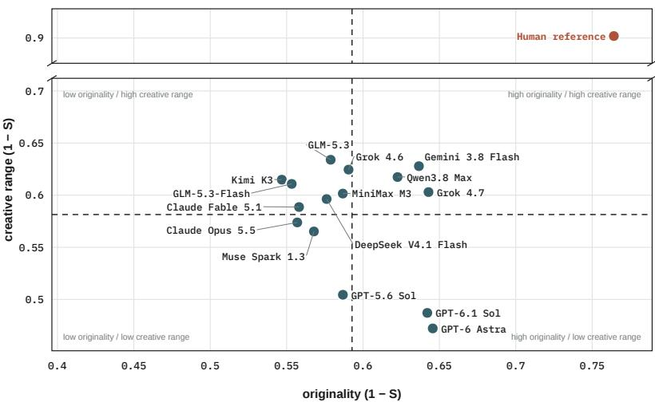  
Figure 3: Creative range against originality. Each point is one model: its originality, the mean distinctiveness $1 - S$ of its same-prompt pairs with other models (Table $2 ;$ increasing to the right) against its creative range, the mean distinctiveness of its two-prompt pairs (Table 3; increasing upwards). Both axes are scaled so that one standard deviation of the fifteen models spans the same length, and the dashed lines at the model means (0.593 and 0.581; SD 0.036 and 0.052) split the plane into four comparable quadrants. The human reference is placed on the same scale but excluded from the mean and SD; it lies 4.8 SD to the right and 6.1 SD above, and is drawn above the break in the vertical axis. Grok 4.7, Gemini 3.8 Flash and Qwen3.8 Max fall in the upper-right quadrant among models: above-average originality and creative range.

## 4 Limitations

We do not control for temperature, sampling or other decoding parameters. Hosted APIs are called with default temperature and sampling.

Repetition within one context is not measured: each design is generated in a fresh context, so we do not generate a second design while the first is still visible to the model.

No diversity-seeking prompting was attempted: all models receive the same prompt without any specialised techniques to invoke creative outputs.

The human reference comprises designs created by multiple human designers, who adapted references from public inspiration libraries to the benchmark briefs. It supports comparisons between model outputs and human-designed solutions to the same briefs, as well as comparisons between human designs across paired briefs. However, it does not measure same-designer repetition or variation between diferent human designers responding to the same prompt.

## 5 Conclusion

Today’s frontier models generally produce UI designs that meet our appropriateness requirements. They nevertheless fall well short on diversity measures. Under the tested generation settings, designs from diferent models resemble one another more than they resemble the human reference, and every model exhibits less variation across paired briefs than the human reference does. Even the most original model is 0.12 below the human reference in originality, while the model with the widest creative range is 0.27 below it.

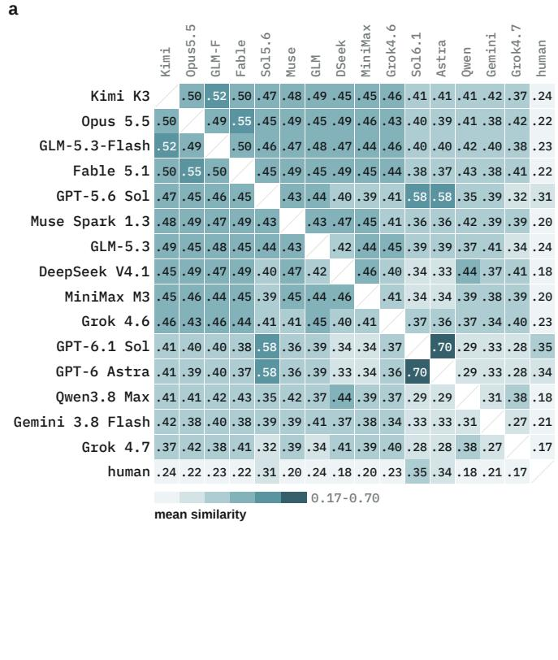

b  
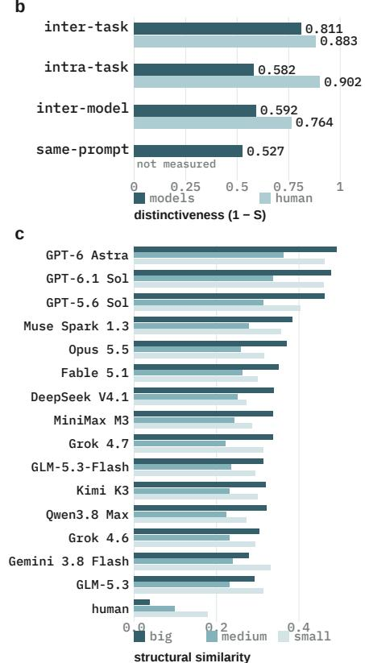  
Figure 4: Design distinctiveness across comparison conditions. Results on $\mathcal { D } _ { B }$ . (a) Pairwise similarity for diferent models on same prompts; human cells compare a model with a human reference. Higher score is worse. (b) Distinctiveness score on four diferent comparisons: diferent tasks; diferentiated prompts within one task; diferent models on same prompt; and independent generations of an identical prompt. The first two human bars compare two human designs; the inter-model human bar compares models with humans. Higher is better. (c) Segment wise similarity grouped by segment size: small $( < 2 \% )$ , medium (2–10%), and big $( \geq 1 0 \% )$ , where percentages are with respect to view port size. Higher is worse.

Originality and creative range capture diferent aspects of this limitation. GPT-6 Astra has the highest originality but the narrowest creative range: its designs difer from those of other models while remaining comparatively similar across changes in product domain and content. A distinctive model style can therefore coexist with limited variation across briefs.

Our work extends the study of LLM output diversity to UI design and examines repetition both across models and across related briefs. The human baseline shows that substantially greater design diversity is compatible with high appropriateness on these tasks. Design Creativity Bench provides a framework for measuring these diferences and evaluating techniques that increase the diversity of LLM-generated designs while preserving their ability to meet the brief’s requirements.

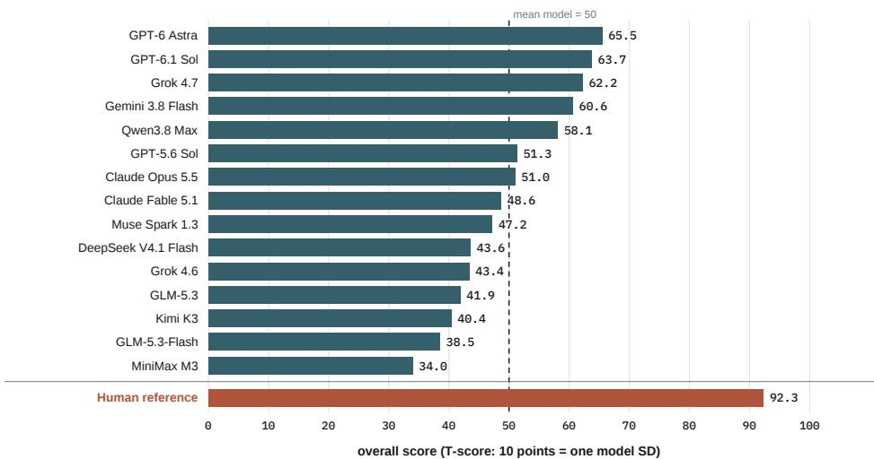  
Figure 5: Overall score. The mean of standardised diversity (0.9× originality + 0.1× creative range) and standardised appropriateness, standardised again and shown as a T-score: 50 is the mean model and 10 points one model standard deviation. The human reference is placed on the same scale but excluded from the mean and standard deviation. Appendix B8 gives the details.

## Competing interests

All authors are afiliated with Kombai Inc., which develops AI products for UI design and front-end development.

## A Supplementary methods and results

## A1 How much one prompt leaves open

Section 1 claims that a UI prompt leaves a large space of good answers. If that is true, two independent designers have little reason to arrive at the same screen. This appendix illustrates the claim on a single prompt. The prompt is a separate illustrative example written for this appendix, not one of the $\mathcal { D } _ { B }$ prompts, and it is not representative of them: unlike the benchmark prompts, it fixes navigation, palette, type scale and components. We enumerate a set of screens a competent designer could defensibly build for it. The enumeration is illustrative, not exhaustive. We then ask how much choice remains once everything the prompt fixes is set aside.

The prompt. The prompt asks for a Staf → Access screen for Ridgewell Clinics, a fictional regional outpatient provider. The screen lives inside a staf application on a desktop viewport. An administrator uses it to give each person exactly one global role. The administrator also uses it to inspect what a role is allowed to do. The content is fixed in advance and is deliberately untidy: seven staf, five roles, twelve permissions and no per-person exceptions. Location is supplied as workplace context and grants no access. The prompt also fixes the surrounding application and its existing navigation, the desktop viewport, and the design system that supplies the colours, the type scale and the components.

What the prompt leaves open. Five questions remain. How is the screen divided into panes? Which object organises it, the person or the role? What does the administrator see before acting? How are the twelve permissions revealed? How is an edit committed?

Counting the options. We enumerated 63 complete screens that answer those five questions defensibly. Other defensible answers may exist. Some of them difer only in runtime state. A filtered table, an empty search, a failed row and a save confirmation are one design seen at four moments. Folding those into their parent leaves 51 distinct structures. We call each one a leaf (Figure 6). The enumeration is a partition, so every enumerated design belongs to exactly one branch and none is counted twice. Each leaf also carries a probability. The probability is the product of the decisions along its path. Each decision is weighted by how conventional an LLM judges it to be, so familiar structures come out more likely than unusual ones. These weights are assumptions. They are not estimated from choices made by real designers, and every probability below depends on them.

How flat the distribution is. Under the assumed weights, the resulting distribution is close to flat (Figure 7). Its Shannon entropy is 5.35 bits. A uniform choice among 51 leaves would give $\log _ { 2 } 5 1 = 5 . 6 7$ bits. The most likely structure takes only 8.3% of the mass. The tenth most likely structure still takes 2.7%. Thirteen leaves are needed to cover half the mass.

What this means for a pair of designs. For a benchmark built on pairs, the quantity of interest is the collision probability $\textstyle \sum _ { i } p _ { i } ^ { 2 }$ . It is the chance that two designers drawing independently from this distribution land on the same structure. Here it is 3.03%. Two independent competent designs to this prompt therefore difer in structure 96.97% of the time.

One prompt·51 structural leaves  
  
Figure 6: Part of the design space of one prompt. The five top-level forks of the enumeration, with the share of the probability mass under each. Six of the 51 leaves are shown as rendered screens. Every branch shows its likeliest leaf. The largest branch also shows its second likeliest, so that a fork inside a branch is visible as well. From the left: a people table with permissions on a hover menu (3.9%); a roster beside a roles-by-permissions map (5.6%); a people list with a role inspector (3.7%); a roster that opens a person drawer (8.3%); tabs that switch between the people table and the role map (3.9%); and a roster that opens a dedicated person page (4.3%). These six carry 29.7% of the mass between them. The prompt fixes the navigation, the palette and the components, so the variation to look for sits in the work area.

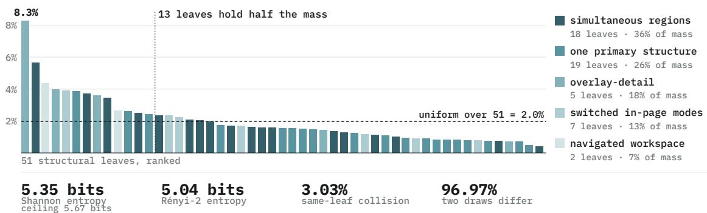  
Figure 7: Residual design space of one prompt. The 51 structural leaves of the Staf → Access prompt, ranked by probability and coloured by the top-level branch of the enumeration. Each leaf’s probability is the product of the decisions along its path, weighted so that conventional structures come out more likely (an LLM determines the weights). The dashed line is what a uniform choice among 51 leaves would give. The distribution is close to flat. The most likely structure, a roster that opens a drawer for one person, takes 8.3% of the mass, and thirteen leaves are needed to reach half of it. The collision probability $\textstyle \sum _ { i } p _ { i } ^ { 2 }$ is 3.03%, so two independent draws from this assumed distribution difer in structure 96.97% of the time. This follows from the weights; it is not an observed rate for designers.

The same fact stated as an entropy is a Rényi-2 entropy of 5.04 bits. Over 500 independent pairs, the standard deviation of that 96.97% rate is 0.008.

## B Evaluation dataset

Tasks, prompts, and pairs. Figure 2 shows a sample of three prompt pairs from $\mathcal { D } _ { B }$ across design archetypes and verticals. The pairs are constructed such that they share the same design goal and UI archetype. Each of the 80 tasks is written for two product domains, giving $8 0 \times 2 = 1 6 0$ prompts. The two prompts of a task form its diferentiated pair, giving 80 pairs per model. No decisions related to visual styles or information architecture are mentioned in any of the prompts, and they are left entirely up to the model to decide (along with the majority of the content). Brand name, domain taxonomy and some key content serve as diferentiating attributes between the prompts of a task. As illustrated in Appendix A1, our prompt construction leaves many design decisions up to the model.

Generation. Each prompt is passed to the model through the same wrapper, which requests a complete standalone HTML document submitted through a single tool. The output length distribution of the HTML documents is shown in Figure 2, bottom right panel. Models are asked to populate realistic mock data in tables, lists, charts, calendars, and detail panels, present at first paint without a data fetch or user interaction. External assets, frameworks, and files are disallowed unless explicitly permitted by the task. If the HTML raises an error when rendered in a browser, the trace is returned for at most three repair attempts; sixteen outputs errored on the first attempt and all sixteen cleared on the first repair.

We use native hosted APIs with default temperature and sampling settings and the reasoning eforts in Table 1.

## B1 Segment extraction and image capture

Two things about a page are compared separately. The first is its information architecture (IA): how the page is organised and composed. The second is its colour system. IA is compared through segments, which this appendix defines. Colour is compared as a property of the whole page.

What a segment is. A segment is a container in the rendered page. It holds at least two boxed children and covers at least 6,000 pixels of area. A boxed child is a child element whose rendered width and height both exceed one pixel. Segments are the compositions a reader would name: a navigation bar, a table, a content panel. One segment can sit inside another. The segments of a page are therefore overlapping regions rather than a partition of the screenshot. Text and icons are not segments on their own. They are represented through the composition that contains them.

How segments are found. Detection is deterministic and calls no model. Every DOM element is given an identifier. Each element’s box and visibility are then measured in the browser, and the elements that meet the definition above are retained. Hidden elements are excluded. Media elements are excluded as containers: img, video, svg, canvas, picture, iframe and object.

What the segments feed. A segment’s area and its position relative to the initial viewport set how much the page score weights it. A page can hold the same composition more than once. Such a repeat is removed when it finds no counterpart on the other page and its own page already has a matched copy of it. The weights are recomputed over what remains. The colour system is read from the same rendered page. Colour invariance is learned by the projection during training, so the page itself is left unmodified. Appendix B3 defines the encoder calibration, the size blend, the importance weights, the matching between two pages’ segments, and the score built from them.

## B2 Projection dataset, training, and metrics

Some edits to a page change how it looks without changing the design. A new colour theme, a new copy string and a wider viewport are examples. We call these nuisance edits. Other edits change the design itself. Deleting a child, changing the layout axis and reparenting an element are examples. We call these structural edits. A similarity score is useful here when it ignores the first kind and reacts to the second. The two encoders here are gemini-embedding-2 and UIClip ViT-B/32. Raw cosine similarity in either of their embedding spaces separates the two kinds of edit barely above chance (Table 5). We therefore fit one compact linear map per encoder on a dataset built from these two kinds of edit.

The dataset. The projection dataset $\mathcal { D } _ { P }$ is diferent from the benchmark $\mathcal { D } _ { B }$ . It is obtained from pages generated from a mix of GPT-5.6 Luna, Qwen 3.7 Flash, Gemini 3 Flash Preview and MiniMax M3. Product domain, objective, audience, page shell, interaction, state, density, content mix and section count change among these pages. Every page is written with CSS theme variables and ARIA roles, which lets an edit be applied in the browser.

Training pairs. The builder takes up to sixteen containers from each page as anchors. An anchor is captured twice, once before an edit and once after it. Those two images are one training pair. The pair is labelled by the family of the edit. Nuisance families are viewport change, copy substitution, theme change, spacing, responsive reflow, type scale, wrapper depth, icon or graphic change, and zoom. The UIClip variant adds chrome, tone and letterform changes. Structural families delete or clone children, keep only the first child, change the layout axis, remove layout rules, reorder children, flatten the hierarchy, or reparent elements. A structural edit whose screenshot does not visibly change is rejected. Every record stores the source page, the anchor, the edit family, both images, the geometry and a validity flag.

The Gemini manifest holds 86,238 valid pairs: 58,805 nuisance and 27,433 structural. The UIClip manifest holds 104,428: 77,000 nuisance and 27,428 structural.

The map. Pages are shufled under a fixed seed and split 80/20, which keeps every anchor and every variant of a page on one side. This gives 304 training pages, $\mathcal { D } _ { P } ^ { \mathrm { t r a i n } }$ , and 77 validation pages, $\mathcal { D } _ { P } ^ { \mathrm { v a l } }$ . The input for encoder e is the crop’s embedding $x _ { e }$ with standardised log-width and log-height appended. The map is

$$
z _ { e } ( x _ { e } ) = { W _ { e } } ( [ x _ { e } ; \widehat { \log w } ; \widehat { \log h } ] - \mu _ { e } ) ,\tag{1}
$$

where $\mu _ { e }$ is the centroid of $\mathcal { D } _ { P } ^ { \mathrm { t r a i n } }$ and $W _ { e }$ has 64 output dimensions.

The loss. Each comparison is a triplet drawn from one anchor: the crop itself, the same crop after a nuisance edit, and the same crop after a structural edit. The map is asked to hold the nuisance variant closer than the structural one by a fixed margin. Learning a metric from relative comparisons in this way is standard (Schrof et al., 2015). Write c for cosine similarity between projected vectors, $p$ for a nuisance variant, n for a structural variant, $( u , v )$ for two crops from diferent pages, and $[ x ] _ { + } = \operatorname* { m a x } ( x , 0 )$ . The loss contains

$$
\begin{array} { r l } & { \mathcal { L } _ { \mathrm { r a n k } } = \mathrm { E } _ { ( a , p , n ) } [ 0 . 1 5 + c ( a , n ) - c ( a , p ) ] _ { + } , } \\ & { \mathcal { L } _ { \mathrm { i n v } } = \mathrm { E } _ { ( a , p ) } [ 0 . 9 0 - c ( a , p ) ] _ { + } , } \\ & { \mathcal { L } _ { \mathrm { c a l } } = \mathrm { E } _ { ( u , v ) } c ( u , v ) ^ { 2 } , \qquad \mathcal { L } _ { \mathrm { o r t h } } = 0 . 0 5 \| W W ^ { \top } - I \| _ { F } ^ { 2 } . } \end{array}\tag{2}
$$

The first term carries the margin. The second asks a nuisance variant to sit at similarity 0.90 or above. The third pulls crops from diferent pages towards zero. The fourth keeps the rows of W close to orthonormal. Pairs that are already near-duplicates in the original embedding space are excluded from the third term. Training runs for 60 epochs at learning rate 0.05, in batches of 256 nuisance pairs together with the structural comparisons that share their anchors. The checkpoint with the best AUC on $\mathcal { D } _ { P } ^ { \mathrm { v a l } }$ is kept.

Diagnostics. Pair accuracy is the share of triplets in which the nuisance variant scores above the structural variant from the same anchor. AUC compares the nuisance and structural similarity distributions over all anchors. The three medians describe the scale the score works on. Table 5 reports all of these on $\mathcal { D } _ { P } ^ { \mathrm { v a l } }$ $\mathcal { D } _ { P } ^ { \mathrm { v a l } }$ also chose the checkpoint, so they are model-selection diagnostics rather than a held-out test.

Table 5: Projection diagnostics on $\mathcal { D } _ { P } ^ { \mathrm { v a l } }$ , the split that also selected the checkpoint. Nuis., str. and unrel. are the median similarities of nuisance pairs, structural pairs, and pairs of crops from diferent pages.
<table><tr><td>Space</td><td>Pair acc.</td><td>AUC</td><td>Nuis.</td><td>Str.</td><td>Unrel.</td></tr><tr><td>Gemini</td><td>.645</td><td>.640</td><td>.980</td><td>.966</td><td>.074</td></tr><tr><td>Gemini, projected</td><td>.732</td><td>.722</td><td>.945</td><td>.879</td><td>-.016</td></tr><tr><td>UIClip</td><td>.661</td><td>.649</td><td>.996</td><td>.990</td><td>.008</td></tr><tr><td>UIClip, projected</td><td>.730</td><td>.724</td><td>.954</td><td>.862</td><td>-.019</td></tr></table>

## B3 Similarity calibration and score implementation

This appendix explains the similarity score for two UI segments. Appendix B1 defines the segments and their images. Appendix B2 defines the two projected spaces, the nuisance and structural edits they are fitted on, and the validation split $\mathcal { D } _ { P } ^ { \mathrm { v a l } }$ that the calibrations here are read from.

Putting the two encoders on one scale. Each segment image supplies one projected vector per encoder. For segments i and j from the two pages we take the cosine similarities $c _ { i j } ^ { G }$ and $c _ { i j } ^ { U }$ in the projected Gemini and UIClip spaces. The two spaces do not share a scale. Let $u _ { e }$ and $n _ { e }$ be the median similarities of unrelated pairs and of nuisance pairs for encoder e on $\mathcal { D } _ { P } ^ { \mathrm { v a l } }$ . UIClip is mapped onto Gemini’s scale by

$$
\widetilde { c } _ { i j } ^ { U } = u _ { G } + \frac { n _ { G } - u _ { G } } { n _ { U } - u _ { U } } \big ( c _ { i j } ^ { U } - u _ { U } \big ) .\tag{3}
$$

Unrelated pairs now sit at the same baseline in both spaces, and nuisance pairs sit at the same high reference. A single matching threshold $( \tau ,$ below) therefore means the same thing in both.

Creating the hybrid embedding. UIClip’s weight increases with segment area, while Gemini retains the majority of the weight for regions smaller than one reference viewport. With segment areas $a _ { i } , a _ { j }$ , reference viewport area $V = 1 2 8 0 \times 7 2 0$ , and the logistic function $\sigma ( t ) = 1 / ( 1 + e ^ { - t } )$

$$
\alpha _ { i j } = \sigma \bigg ( \frac { \log ( \operatorname* { m i n } ( a _ { i } , a _ { j } ) / V ) } { 0 . 5 } \bigg ) , \qquad s _ { i j } = ( 1 - \alpha _ { i j } ) c _ { i j } ^ { G } + \alpha _ { i j } \tilde { c } _ { i j } ^ { U } .\tag{4}
$$

Writing $r = \operatorname* { m i n } ( a _ { i } , a _ { j } ) / V$ , this gives $\alpha = r ^ { 2 } / ( 1 + r ^ { 2 } )$ : UIClip receives 0.99% of the weight at $r = 0 . 1$ , 20% at $r = 0 . 5 ,$ , and 50% at $r = 1$ . UIClip dominates only when both segments exceed one reference viewport in area.

Importance and the page budget. Models difer substantially in how much HTML and content they produce for one prompt (Figure 2). A verbose model fills a page with extra sections and repeated records. A terse model designs the same task with fewer elements. Counting matched segments would confuse repetition with this diference in output size. We measure the fraction of important design mass that repeats instead. A page carries a capped quantity of importance spread over its elements. Adding an element divides that quantity diferently rather than adding to it. Segment-wise scoring can then compare how two pages allocate importance even when they hold very diferent numbers of segments.

A segment’s intrinsic importance follows from the space it occupies and from whether the reader meets it on arrival. For segment area $a _ { i }$ and reference viewport area $V = 1 2 8 0 \times 7 2 0$ the viewport at which pages are rendered and measured, it is

$$
r _ { i } = \mathrm { m i n } ( a _ { i } / V , 1 ) p _ { i } , \qquad p _ { i } = \left\{ \begin{array} { l l } { 1 } & { \mathrm { i n ~ t h e ~ i n i t i a l ~ v i e w p o r t , } } \\ { 0 . 6 } & { \mathrm { b e l o w ~ t h e ~ f o l d , } } \\ { 0 . 1 } & { \mathrm { o v e r l a y ~ o r ~ c o n d i t i o n a l ~ c o n t e n t . } } \end{array} \right.\tag{5}
$$

Content outside the initial view is capped at half of each page’s total. Total page importance is capped at $B = 5 . 4$ . The same budget then applies to every comparison. Writing $R _ { \mathrm { i n } }$ and $R _ { \mathrm { o u t } }$ for the intrinsic importance inside and outside the initial view, the final weights are

$$
\kappa = \operatorname* { m i n } ( 1 , R _ { \mathrm { i n } } / R _ { \mathrm { o u t } } ) , \quad r _ { i } ^ { \prime } = \left\{ { r _ { i } } \quad i \ \mathrm { i n s i d e } , \qquad w _ { i } = r _ { i } ^ { \prime } \operatorname* { m i n } \left( 1 , \frac { \mathcal { B } } { \sum _ { k } r _ { k } ^ { \prime } } \right) , \right.\tag{6}
$$

with $\kappa = 1$ when $R _ { \mathrm { o u t } } = 0$ . Each page’s weights are computed on its own. Adding sections cannot raise a page’s importance without bound.

Matching the two segment sets. Let A and B denote the two segment sets. The Hungarian algorithm (Kuhn, 1955; Munkres, 1957) gives a partial one-to-one matching $M ^ { * }$ , with a null assignment available for every segment:

$$
M ^ { * } = \operatorname * { a r g m i n } _ { M \ { \mathrm { o n e - t o - o n e } } } \left[ \sum _ { ( i , j ) \in M } ( 1 - s _ { i j } ) + { \frac { 1 - \tau } { 2 } } { ( | A | + | B | - 2 | M | ) } \right] , \qquad \tau = 0 . 4 5 .\tag{7}
$$

A match is preferred to leaving both segments unmatched only when its similarity clears $\tau .$ . We selected $\tau$ on $\mathcal { D } _ { P } ^ { \mathrm { v a l } }$ from 6,094 nuisance pairs and 4,000 unrelated pairs.

The assignment is solved with the rectangular variant of Crouse (2016). The cost matrix holds the segment costs $1 - s _ { i j }$ , one null slot per segment at cost $( 1 - \tau ) / 2$ , and null–null assignments at zero cost. Unrelated segments are therefore never forced to match.

After matching, an unmatched segment that near-duplicates a matched segment on its own page is removed at similarity 0.90. Both pages’ weights are then recomputed over the segments that remain, giving the weights $w _ { i }$ used below. A second copy of a pattern the page already shows is therefore not counted as an unmatched new composition.

The IA score. Writing $s _ { i j }$ for the blended similarity of segments i and $j ,$ and $w _ { i }$ for those weights, the IA score is

$$
S _ { \mathrm { I A } } ( A , B ) = \frac { \sum _ { ( i , j ) \in { \cal M } ^ { * } } \operatorname* { m i n } ( w _ { i } ^ { A } , w _ { j } ^ { B } ) s _ { i j } } { \operatorname* { m a x } \left( \sum _ { i \in { \cal A } } w _ { i } ^ { A } , \sum _ { j \in { \cal B } } w _ { j } ^ { B } \right) } .\tag{8}
$$

Dividing by the larger of the two page totals puts the result on a common scale. Writing $\begin{array} { r } { T _ { A } = \sum _ { i } w _ { i } ^ { A } } \end{array}$ and $\begin{array} { r } { T _ { B } = \sum _ { j } w _ { j } ^ { B } } \end{array}$ , each non-empty page has a unit-mass allocation $\pi _ { i } ^ { A } = w _ { i } ^ { A } / T _ { A }$ and $\pi _ { j } ^ { B } = w _ { j } ^ { B } / T _ { B } ,$ , so $\begin{array} { r } { \sum _ { i } \pi _ { i } ^ { A } = \sum _ { j } \pi _ { j } ^ { B } = 1 } \end{array}$ . The allocation says where a page’s importance lies, independently of how many segments it holds. Let $\rho _ { A } = T _ { A } / \operatorname* { m a x } ( T _ { A } , T _ { B } )$ and $\rho _ { B } =$ $T _ { B } / \operatorname* { m a x } ( T _ { A } , T _ { B } )$ . The implemented score can be written equivalently as

$$
S _ { \mathrm { I A } } = \sum _ { ( i , j ) \in { \cal M } ^ { * } } \operatorname* { m i n } ( \rho _ { A } \pi _ { i } ^ { A } , \rho _ { B } \pi _ { j } ^ { B } ) s _ { i j } .\tag{9}
$$

This allows us to score pairs of pages with completely diferent sizes and numbers of segments.

## B4 Colour system and the final score

Colour is a property of the page as a whole. A shared palette should count once, however many segments use it. Humans also weigh colour diferently from composition. Colour is therefore scored separately and added to $S _ { \mathrm { { I A } } }$ at a fixed weight.

Extraction. An LLM pass reads each page’s source CSS and returns its palette values in a structured schema of six roles. The extractor is instructed to copy colours from CSS custom properties or literal declarations, to omit roles the page does not express, and to exclude content-specific tints such as per-person avatar colours. The role set and the role weights in Table 6 are selected by hand. The LLM supplies the page-specific values alone.

The four primary roles carry full weight. Muted text and borders carry half, because they are usually derived from the primary palette. The six weights sum to five. A role the page omits falls back to a fixed colour, so all six keys are always present and the ceiling stays at five.

Comparing two palettes. Each role is compared deterministically. HSL hue H and lightness L give a chroma vector $q = C ( \cos 2 \pi H , \sin 2 \pi H )$ , where $C = S ( 1 - | 2 L - 1 | )$ and S is HSL saturation. Hue disagreement is the distance between the two vectors divided by their summed chroma. It is attenuated once that sum falls below 0.3. Role similarity is one minus the larger of hue disagreement and absolute lightness diference.

Table 6: Hand-selected colour-system keys and relative weights.
<table><tr><td>Key</td><td>Page role</td></tr><tr><td>bg</td><td>Page background</td></tr><tr><td>surface</td><td>Panel or card background</td></tr><tr><td>ink</td><td>Primary text</td></tr><tr><td>ink_muted</td><td>Secondary or muted text</td></tr><tr><td>accent</td><td>Primary interactive accent</td></tr><tr><td>border_color</td><td>Hairline or divider colour</td></tr></table>

The final score. With role similarities $c _ { k }$ and role weights $v _ { k }$ ,

$$
S _ { \mathrm { c o l o u r } } = { \frac { \sum _ { k } v _ { k } c _ { k } } { \sum _ { k } v _ { k } } } , \qquad S ( A , B ) = 0 . 9 S _ { \mathrm { I A } } + 0 . 1 S _ { \mathrm { c o l o u r } } .\tag{10}
$$

## B5 Human validation and scoring alternatives

A scoring method has to meet two requirements. It has to agree with people about which designs repeat, and it has to move consistently when a design is deliberately changed. This appendix covers the first requirement, using the human judgements in $\mathcal { D } _ { B } ^ { H }$ . Appendix B6 covers the second, using the controlled perturbations in $\mathcal { D } _ { L }$

The study. $\mathcal { D } _ { B } ^ { H }$ holds 100 cases. A case shows a reviewer two pairs of designs. The reviewer picks the pair whose two designs are more similar to each other. A reviewer who cannot separate them may call a tie. Three reviewers see all 100 cases. Reviewers are asked to rank one pair against another rather than to rate a pair on a scale, because a relative judgement is the easier one to make consistently. These labels are therefore relative.

Pooling the labels. The three reviewers together supply one pooled label per case. Where their non-tied choices agree, that choice stands. Where those choices split evenly, the pooled label is a tie. A tie from one reviewer does not override a choice from another. This leaves 80 cases with a non-tied pooled label, and those 80 are what every scoring method is measured on.

The reviewers are also compared with each other. For each of the three reviewer pairs we take the cases where both members made a non-tied choice, and measure how often they picked the same pair. Averaged over the three reviewer pairs (82.1%, 79.4% and 93.4%, on 56, 63 and 76 cases), agreement is 85.0%.

The judge protocol. The judge panel is Gemini 3.8 Flash, GPT-5.6 Luna, MiniMax M3, Qwen3.8 27B, Qwen3.8 Flash and Grok 4.6. A judge is given the same case and picks a pair directly. A panel prediction needs at least four non-tied votes, and split majorities are dropped. A single judge is scored on the cases it answered without a tie. Judge denominators are therefore smaller than the 80 cases the embedding methods use. A judge ranks a pair rather than scoring it, so no judge has a continuous score and no judge has an AUC.

Results. Figure 8 and Table 7 compare every method on these labels: whole-page and segment embeddings, raw and projected embeddings, and the judges. For a numerical scorer the predicted choice is the pair with the larger score, and the diference between the two scores also gives an ROC AUC (Hanley and McNeil, 1982).

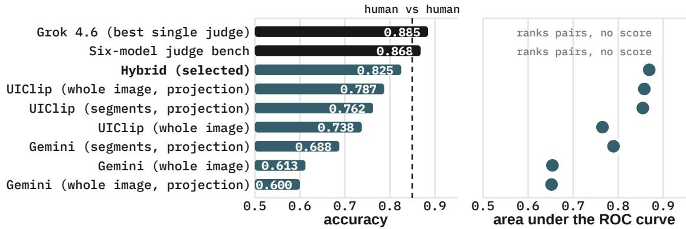  
Figure 8: Does the score agree with people about design repetition? On $\mathcal { D } _ { B } ^ { H }$ , reviewers choose which of two design pairs is more similar. Left: agreement with the pooled human choice; right: ROC AUC from the numerical score diference, which the judges do not have because they rank a pair rather than scoring it. Embedding methods use the 80 cases with a non-tied pooled label; judge accuracies use their answered cases, excluding split majority votes. The dashed line averages the three reviewer pairs, each measured on the comparisons where both of its members made a non-tied choice (195 in total). The hybrid segment metric has the highest embedding accuracy; both LLM judges have higher agreement. Robustness to controlled changes is tested separately in Figure 9.

Table 7: Human agreement of every participant in Figure 8, on the 80 cases with a non-tied pooled label. A row names its encoder, how it aggregates a page, and whether the embeddings pass through the fitted projection. Judges rank a pair rather than scoring it, so they have no AUC. Their denominators are smaller because they omit their own ties and split majorities.
<table><tr><td>Participant</td><td>Accuracy</td><td>AUC</td><td>Cases</td></tr><tr><td>Grok 4.6 (best single judge)</td><td>.885</td><td></td><td>78</td></tr><tr><td>Six-model judge bench</td><td>.868</td><td></td><td>76</td></tr><tr><td>Hybrid (segments, projection), selected</td><td>.825</td><td>.869</td><td>80</td></tr><tr><td>UIClip (whole image, projection)</td><td>.787</td><td>.858</td><td>80</td></tr><tr><td></td><td>UIClip (segments, projection)</td><td>.762 .855</td><td>80</td></tr><tr><td>UIClip (whole image)</td><td></td><td>.738 .765</td><td>80</td></tr><tr><td></td><td>Gemini (segments, projection)</td><td>.688</td><td>.790 80</td></tr><tr><td></td><td>Gemini (whole image)</td><td>.613</td><td>.654 80</td></tr><tr><td></td><td>Gemini (whole image, projection)</td><td>.600</td><td>.652 80</td></tr></table>

## B6 Controlled ladders and robustness ablations

Robustness to convergence and perturbation. In $\mathcal { D } _ { L } ,$ a ladder is a sequence of three cumulative edits, L1–L3, with a known direction of change. This is a metamorphic test (Chen et al., 1998; Segura et al., 2016): the edits define which way similarity should move. In a convergence study, a seed design is progressively edited towards a fixed reference, so similarity to that reference should rise at each level. In a perturbation study, a design is progressively edited away from its original, so similarity to the original should fall. These experiments test sensitivity to design changes without requiring human similarity labels.

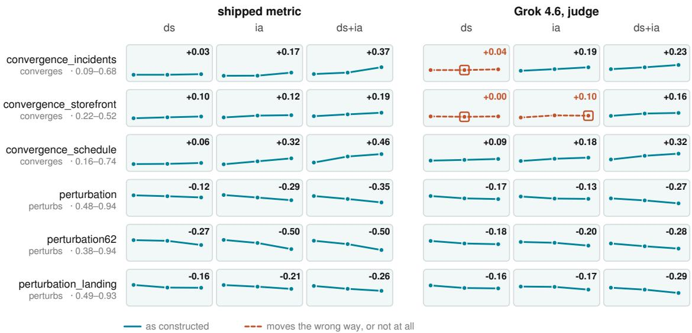  
Figure 9: Does similarity move when the design changes? Each line in $\mathcal { D } _ { L }$ follows three cumulative edit levels, L1–L3. Convergence edits move a seed towards a fixed reference (scores should rise); perturbations move a design away from its original (scores should fall). DS changes visual styling, IA changes content organisation, and DS+IA changes both. Left: the selected metric; right: the strongest judge on human agreement, Grok 4.6. Each study uses a shared vertical scale across its row; numbers give the score change from L1 to L3. Dashed orange lines and boxes mark a plateau or reversal. The metric follows all 18 displayed ladders; the judge follows 15.

The labels in Figure 9 specify what changes. A DS perturbation changes the visual styles—palette, typography, spacing, borders, shadows, and corner treatment—while preserving information architecture. An IA perturbation changes navigation, grouping, layout, or the relationship between content regions while preserving the visual styles. DS+IA applies both sets of edits. The same labels in convergence studies indicate which facets are moved towards the reference. L2 includes the L1 edits, and L3 includes both earlier levels; the levels are ordered interventions.

Across three convergence and three perturbation studies in $\mathcal { D } _ { L }$ , the selected metric moves strictly in the expected direction on all 18 DS, IA, and DS+IA ladders. Grok 4.6 does so on 15 of 18, with plateaus or reversals in three convergence ladders. Figure 9 shows these controlled changes. Together, the two validation experiments motivate the segment metric: it agrees reasonably with human judgements and responds consistently to the controlled changes in the facets used by the benchmark.

The three convergence studies in $\mathcal { D } _ { L }$ are incident management, a storefront, and scheduling. Figure 9 labels the three perturbation studies separately. Edits are specified concretely for each seed: which palette values or style rules change and which regions move. L2 applies the first two edit sets and L3 all three.

The available complete ladders total 18: nine convergence and nine perturbation ladders. A ladder passes only if both adjacent score changes have the required strict sign; a plateau fails. The scorer passes all nine convergence ladders and all nine perturbation ladders. Grok’s three failures are the incident DS, storefront DS, and storefront IA convergence ladders.

Table 8: Robustness ablations on $\mathcal { D } _ { L }$ : complete DS, IA, and DS+IA ladders with strictly monotone scores.
<table><tr><td>Configuration Passing ladders</td></tr><tr><td>Selected hybrid + colour 18/18</td></tr><tr><td>Hybrid + colour, geometric decay 17/18</td></tr><tr><td>Hybrid + thirteen theme fields, decay 16/18</td></tr><tr><td>Graded-colour projections 16/18</td></tr><tr><td>Gemini projected segments 16/18</td></tr><tr><td>UIClip projected segments 17/18</td></tr></table>

## B7 The $\mathcal { D } _ { C }$ agreement set

How the hundred pairs were drawn. The pairs of $\mathcal { D } _ { C }$ were drawn from the pool of generated designs and shown blind. The reviewers saw no model identity, no score and no comparison type, and the left–right order was randomised. The question was whether the two designs would be accepted as two distinct designs, or whether one reads as a rehash of the other. The reviewers judged composition and discounted the content domain.

Agreement. The similarity score separates the two verdicts with an AUC of 0.85. No threshold is fitted on $\mathcal { D } _ { C } \vert$ : the benchmark reports the score itself, and $\mathcal { D } _ { C }$ serves only as a second check of human agreement. Nothing in the scorer was selected or fitted on $\mathcal { D } _ { C }$ (the scoring configuration and the structure/colour weight were chosen on $\mathcal { D } _ { B } ^ { H }$ and the ladders), so the AUC is an out-of-sample check.

## B8 The overall score

Diversity. The overall score first merges the two diversity measures into one. Diversity is 0.9× originality $+ 0 . 1 \times$ creative range, on the raw $1 - S$ scale.

The weights come from a simple model of how designs are used in practice. A person asks an AI agent for a design. The person wants that design to difer from a typical AI-generated design already in use. A typical design is a random draw from all AI-generated designs, so it comes from some model in proportion to that model’s usage. With probability $p$ the draw comes from the same model as the person’s agent, and with probability $1 - p$ it comes from another model.

The two measures cover these two cases. If the typical design comes from the same model, creative range measures how far apart the two designs are, because one model has designed against two diferent briefs. If it comes from another model, originality measures it. The expected distinctiveness from a typical design is therefore $p$ times creative range plus $1 - p$ times originality. Creative range takes the weight $p ,$ and originality takes the weight 1 − p.

If model i produces a share $s _ { i }$ of all AI-generated designs, the person’s agent is model i with probability $s _ { i }$ , and the typical design is too. So $\begin{array} { r } { p = \sum _ { i } s _ { i } ^ { 2 } } \end{array}$ . This sum is never larger than the largest single share, max $s _ { i }$ . So $p$ is small unless one model produces most of the designs.

Shares of UI generation are not published. As a proxy we use the public token rankings of OpenRouter for its twenty most-used models, retrieved on 30 September 2026. There, the most-used model holds 19% of the tokens, and $\textstyle \sum _ { i } s _ { i } ^ { 2 } = 0 . 1 0$ . These shares are computed within the top twenty only, so they overstate the true shares. OpenRouter also does not see tools that call a provider directly, such as Claude Code and Codex. We set $p = 0 . 1$

The mix uses the raw scores, not standardised scores. Creative range varies more across models than originality does (standard deviation 0.051 against 0.035). Standardising each measure first would change how much each one moves the result, and the weights would no longer be shares of an expected distinctiveness.

Combining with appropriateness. Diversity and appropriateness have diferent units, so each is standardised. We subtract the mean of the fifteen models and divide by their standard deviation. We take the mean of the two standardised values, so each measure carries half of the weight. The mean of two standardised values does not itself have unit standard deviation: its variance is $( 1 + r ) / 2$ , where r is the correlation between the two. We therefore standardise the mean once more over the models, and report the result as a T-score, $5 0 + 1 0 z$ . The overall scores of the models then have mean 50 and standard deviation 10. Both steps are linear, so they keep the ranking unchanged, and every model score stays positive. The human reference is placed on the same scale but does not enter the mean or the standard deviation.

Sensitivity. The ranking is stable under nearby weights. With a creative-range weight of 0 or of 0.15 instead of 0.1, the rank correlation with the reported ranking is at least 0.99, and no model moves more than two places. With a weight of 0.25 the correlation is 0.96: Grok 4.7 and Gemini 3.8 Flash move ahead of GPT-6 Astra, and no model moves more than two places.

## B9 Extended results with a frozen panel

The fifteen models of the paper form a frozen panel. A model added later is placed on the panel’s scale; it does not change any panel score. This appendix places eighteen further models on that scale.

Frozen scoring. Three rules keep the panel’s scores fixed.

• Originality against the panel only. A new model’s originality is the mean distinctiveness $1 - S$ of its designs against the panel models’ designs for the same prompt. New models are not compared with each other, and panel models are not compared with new models. No new model shares a lab with a panel model, so each new model has 15 partners and 2,400 pairs.

• Normalisation constants from the panel. Diversity and appropriateness are standardised with the panel’s mean and standard deviation (diversity 0.5917 and 0.0307; appropriateness 97.21% and 1.59 points). The mean of the two standardised values is standardised again with the panel’s constants (mean 0 and standard deviation 0.773), and reported as $5 0 + 1 0 z$

• The same pipeline. The briefs, the generation harness, the segmenter, the embedding model, the judge and the per-brief criteria are the ones the panel was scored with.

Table 9: Extended results on the frozen panel. The fifteen panel models keep the scores reported in the paper; the eighteen new models (italic, with their reasoning efort) are placed on the panel’s scale. Originality of a new model is measured against the panel models only. Orig. is originality, Range is creative range, and Appr. is appropriateness. Cost is the median generation cost per design in US dollars. ⋆ marks the Pareto frontier of overall score against cost.
<table><tr><td># Model</td><td></td><td>Overall</td><td>Orig. Range</td><td></td><td>Appr. (%)</td><td>Cost ($)</td><td>Pareto</td></tr><tr><td>1</td><td>GPT-6 Astra</td><td>65.5</td><td>0.646</td><td>0.472</td><td>99.1</td><td>2.564</td><td>★</td></tr><tr><td>2</td><td>GPT-6.1 Sol</td><td>63.7</td><td>0.642</td><td>0.487</td><td>98.8</td><td>0.460</td><td>★</td></tr><tr><td>3</td><td>Grok 4.7</td><td>62.2</td><td>0.643</td><td>0.603</td><td>97.8</td><td>0.593</td><td></td></tr><tr><td>4</td><td>Gemini 3.8 Flash</td><td>60.6</td><td>0.637</td><td>0.628</td><td>97.5</td><td>0.123</td><td>★</td></tr><tr><td>5</td><td>Qwen3.8 Max</td><td>58.1</td><td>0.623</td><td>0.617</td><td>97.6</td><td>0.309</td><td></td></tr><tr><td>6</td><td>GPT-5.6 Sol</td><td>51.3</td><td>0.587</td><td>0.505</td><td>98.2</td><td>0.598</td><td></td></tr><tr><td>7</td><td>Claude Opus 5.5</td><td>51.0</td><td>0.557</td><td>0.574</td><td>99.2</td><td>1.557</td><td></td></tr><tr><td>8</td><td>Claude Fable 5.1</td><td>48.6</td><td>0.558</td><td>0.589</td><td>98.5</td><td>5.329</td><td></td></tr><tr><td>9</td><td>Muse Spark 1.3</td><td>47.2</td><td>0.568</td><td>0.565</td><td>97.8</td><td>0.080</td><td>★</td></tr><tr><td>10</td><td>Hy4 Preview (high)</td><td>46.2</td><td>0.580</td><td>0.605</td><td>96.8</td><td>0.086</td><td></td></tr><tr><td>11</td><td>DeepSeek V4.1 Flash</td><td>43.6</td><td>0.576</td><td>0.596</td><td>96.3</td><td>0.051</td><td>★</td></tr><tr><td>12</td><td>Grok 4.6</td><td>43.4</td><td>0.591</td><td>0.625</td><td>95.5</td><td>0.100</td><td></td></tr><tr><td>13</td><td>Pareto 26.10 Preview (none)</td><td>42.5</td><td>0.551</td><td>0.633</td><td>97.0</td><td>0.152</td><td></td></tr><tr><td>14</td><td>GLM-5.3</td><td>41.9</td><td>0.579</td><td>0.634</td><td>95.6</td><td>0.043</td><td>★</td></tr><tr><td>15</td><td>Mistral Medium 3.5 (high)</td><td>41.5</td><td>0.675</td><td>0.643</td><td>91.0</td><td>0.080</td><td></td></tr><tr><td>16</td><td>Kimi K3</td><td>40.4</td><td>0.547</td><td>0.615</td><td>96.8</td><td>0.570</td><td></td></tr><tr><td>17</td><td>GLM-5.3-Flash</td><td>38.5</td><td>0.553</td><td>0.611</td><td>96.1</td><td>0.022</td><td>★</td></tr><tr><td>18</td><td>Solar Pro 4 (max)</td><td>36.4</td><td>0.637</td><td>0.694</td><td>91.2</td><td>0.006</td><td>★</td></tr><tr><td>19</td><td>Seed 2.0 Code (high)</td><td>34.1</td><td>0.632</td><td>0.632</td><td>91.2</td><td>0.051</td><td></td></tr><tr><td>20</td><td>MiniMax M3</td><td>34.0</td><td>0.587</td><td>0.602</td><td>93.4</td><td>0.024</td><td></td></tr><tr><td>21</td><td>Laguna S 2.1 (default)</td><td>33.2</td><td>0.662</td><td>0.711</td><td>89.2</td><td>0.002</td><td>★</td></tr><tr><td>22</td><td>Ling 3.0 Flash VL (default)</td><td>30.1</td><td>0.610</td><td>0.639</td><td>91.2</td><td>0.001</td><td>★</td></tr><tr><td>23</td><td>Inkling (max)</td><td>29.9</td><td>0.665</td><td>0.683</td><td>88.4</td><td>0.039</td><td></td></tr><tr><td>24</td><td>Step 3.7 Flash (high)</td><td>28.1</td><td>0.627</td><td>0.646</td><td>89.9</td><td>0.015</td><td></td></tr><tr><td>25</td><td>Solar Mini 4 (default)</td><td>26.0</td><td>0.649</td><td>0.694</td><td>88.1</td><td>0.004</td><td></td></tr><tr><td>26</td><td>Mercury 2.5 (high)</td><td>22.5</td><td>0.730</td><td>0.631</td><td>83.8</td><td>0.001</td><td></td></tr><tr><td>27</td><td>Nova 2 Lite (default)</td><td>20.6</td><td>0.738</td><td>0.696</td><td>82.6</td><td>0.062</td><td></td></tr><tr><td>28</td><td>Ministral 14B 2512 (none)</td><td>19.0</td><td>0.723</td><td>0.622</td><td>83.3</td><td>0.001</td><td></td></tr><tr><td>29</td><td>Relace Search (none)</td><td>17.7</td><td>0.738</td><td>0.617</td><td>82.3</td><td>0.013</td><td></td></tr><tr><td>30</td><td>Command A+ (default)</td><td>10.6</td><td>0.736</td><td>0.753</td><td>80.0</td><td>0.025</td><td></td></tr><tr><td>31</td><td>Trinity Large Thinking (default)</td><td>7.1</td><td>0.694</td><td>0.640</td><td>81.6</td><td>0.006</td><td></td></tr><tr><td>32</td><td>Laguna XS 2.1 (default)</td><td>3.3</td><td>0.701</td><td>0.696</td><td>80.1</td><td>0.001</td><td></td></tr><tr><td>33</td><td>Seed 1.6 Flash (default)</td><td>-2.1</td><td>0.810</td><td>0.704</td><td>73.7</td><td>0.001</td><td></td></tr><tr><td></td><td>Human reference</td><td>92.3</td><td>0.764</td><td>0.902</td><td>98.0</td><td></td><td></td></tr></table>

## C Example appropriateness criteria

Table 10 lists the full criteria set for one design brief from $\mathcal { D } _ { B }$ , a mortgage preapproval form. The brief reads:

UI Goal: Complete a mortgage preapproval application by entering borrower, property, and loan details, reviewing eligibility, and moving to the next step.

Domain: consumer mortgage preapproval application.

Brand: Hearthline.

Content: borrower Maya Patel, 18 Alder Street, \$420,000 purchase price, \$128,000 annual income, \$84,000 down payment, preapproval status In review.

Each criterion is a statement about the finished design that is either true or false. Criteria marked applies if concern elements a design may or may not include; they are true when the element is absent.

Table 10: Appropriateness criteria for the mortgage preapproval brief. Critical marks the criteria tagged critical.
<table><tr><td>ID</td><td>Category</td><td>Critical</td><td>Criterion</td></tr><tr><td></td><td>C01 Scope</td><td>√</td><td>The page is a mortgage preapproval application screen where the ap- plicant enters details, not a marketing landing page, rate-comparison</td></tr><tr><td></td><td>C02 Scope</td><td></td><td>page, or sign-in page. The page shows that the application is a multi-step flow and marks which step is current.</td></tr><tr><td></td><td>C03 Content</td><td></td><td>The brand name Hearthline appears as the app&#x27;s identity.</td></tr><tr><td></td><td>C04 Content</td><td>√</td><td>The borrower is shown as Maya Patel.</td></tr><tr><td>C05</td><td>Content</td><td>√</td><td>The property address is shown as 18 Alder Street.</td></tr><tr><td>C06</td><td>Content</td><td>√</td><td>The purchase price is shown as exactly $420,000.</td></tr><tr><td>C07</td><td>Content</td><td>√</td><td>The borrower&#x27;s annual income is shown as exactly $128,000.</td></tr><tr><td>C08</td><td>Content</td><td>√</td><td>The down payment is shown as exactly $84,000.</td></tr><tr><td></td><td>C09 Content</td><td>√</td><td>A preapproval status is shown with the value &#x27;In review&#x27;.</td></tr><tr><td></td><td>C10 Actions</td><td>√</td><td>Input fields for borrower details (at least name and annual income) are shown.</td></tr><tr><td></td><td>C11 Actions</td><td>√</td><td>Input fields for property details (at least address and purchase price) are shown.</td></tr><tr><td></td><td>C12 Actions</td><td>√</td><td>Input fields for loan details (at least down payment, plus loan amount,</td></tr><tr><td></td><td>C13 Actions</td><td>√</td><td>loan type, or term) are shown. A control to continue to the next step of the application is shown.</td></tr><tr><td></td><td>C14 Correctness</td><td>√</td><td>Any loan amount shown equals $336,000 ($420,000 purchase price minus $84,000 down payment). (Applies if a loan amount is shown.)</td></tr><tr><td></td><td>C15 Correctness</td><td></td><td>Any down payment percentage shown is 20%, and any loan-to-value ratio shown is 80%. (Applies if a down payment percentage or LTV is shown.)</td></tr><tr><td></td><td>C16 Correctness</td><td></td><td>Any value that appears more than once (purchase price, income, down payment, address, borrower name) shows the same value everywhere it appears. (Applies if a value appears more than once.)</td></tr><tr><td></td><td>C17 Domain</td><td></td><td>The eligibility review names at least one specific factor the preapproval depends on (e.g. income, down payment/LTV, debt-to-income, or</td></tr><tr><td></td><td>C18 Goal</td><td></td><td>An eligibility review section or summary is shown together with the entered borrower, property, and loan details on this screen.</td></tr></table>

## References

Tuhin Chakrabarty, Philippe Laban, Divyansh Agarwal, Smaranda Muresan, and Chien-Sheng Wu. Art or artifice? Large language models and the false promise of creativity. In Proceedings of the 2024 CHI Conference on Human Factors in Computing Systems, 2024. https://doi.org/10.1145/3613904.3642731.

T. Y. Chen, S. C. Cheung, and S. M. Yiu. Metamorphic testing: A new approach for generating next test cases. Technical Report HKUST-CS98-01, Hong Kong University of Science and Technology, 1998. https://www.cse.ust.hk/\~scc/publ/CS98-01-metamorphictesting. pdf.

David F. Crouse. On implementing 2D rectangular assignment algorithms. IEEE Transactions on Aerospace and Electronic Systems, 52(4):1679–1696, 2016. https://doi.org/10.1109/ TAES.2016.140952.

Bradley Efron. Bootstrap methods: Another look at the jackknife. The Annals of Statistics, 7(1):1–26, 1979. https://doi.org/10.1214/aos/1176344552.

Christopher A. Field and Alan H. Welsh. Bootstrapping clustered data. Journal of the Royal Statistical Society: Series B, 69(3):369–390, 2007. https://doi.org/10.1111/j.1467-9868. 2007.00593.x.

Alexandrine Fortier, Hazel Chen, and Peter West. Is convergence inevitable? Tracing output homogeneity back to base models. arXiv preprint arXiv:2608.11426, 2026. https://arxiv. org/abs/2608.11426.

J. P. Guilford. Creativity. American Psychologist, 5(9):444–454, 1950. https://doi.org/10. 1037/h0063487.

James A. Hanley and Barbara J. McNeil. The meaning and use of the area under a receiver operating characteristic (ROC) curve. Radiology, 143(1):29–36, 1982. https://doi.org/10. 1148/radiology.143.1.7063747.

Liwei Jiang, Yuanjun Chai, Margaret Li, Mickel Liu, Raymond Fok, Nouha Dziri, Yulia Tsvetkov, Maarten Sap, Alon Albalak, and Yejin Choi. Artificial hivemind: The open-ended homogeneity of language models (and beyond). arXiv preprint arXiv:2510.22954, 2025. https://arxiv.org/abs/2510.22954.

Robert Kirk, Ishita Mediratta, Christoforos Nalmpantis, Jelena Luketina, Eric Hambro, Edward Grefenstette, and Roberta Raileanu. Understanding the efects of RLHF on LLM generalisation and diversity. In Proceedings of the 12th International Conference on Learning Representations, 2024. https://arxiv.org/abs/2310.06452.

Harold W. Kuhn. The Hungarian method for the assignment problem. Naval Research Logistics Quarterly, 2(1–2):83–97, 1955. https://doi.org/10.1002/nav.3800020109.

Thomas Kwa, Ben West, Joel Becker, Amy Deng, Katharyn Garcia, Max Hasin, Sami Jawhar, Megan Kinniment, Nate Rush, Sydney Von Arx, Ryan Bloom, Thomas Broadley, Haoxing Du, Brian Goodrich, Nikola Jurkovic, Luke Harold Miles, Seraphina Nix, Tao Lin, Chris Painter,

Neev Parikh, David Rein, Lucas Jun Koba Sato, Hjalmar Wijk, Daniel M. Ziegler, Elizabeth Barnes, and Lawrence Chan. Measuring AI ability to complete long software tasks. In Advances in Neural Information Processing Systems, 2025. https://arxiv.org/abs/2503.14499.

Talia Lavie and Noam Tractinsky. Assessing dimensions of perceived visual aesthetics of web sites. International Journal of Human-Computer Studies, 60(3):269–298, 2004. https: //doi.org/10.1016/j.ijhcs.2003.09.002.

Yining Lu, Dixuan Wang, Tianjian Li, Dongwei Jiang, Sanjeev Khudanpur, Meng Jiang, and Daniel Khashabi. Benchmarking language model creativity: A case study on code generation. In Proceedings of the 2025 Conference of the Nations of the Americas Chapter of the Association for Computational Linguistics, pages 2776–2794, 2025. https://doi.org/ 10.18653/v1/2025.naacl-long.141.

James Munkres. Algorithms for the assignment and transportation problems. Journal of the Society for Industrial and Applied Mathematics, 5(1):32–38, 1957. https://doi.org/10. 1137/0105003.

Vishakh Padmakumar and He He. Does writing with language models reduce content diversity? In Proceedings of the 12th International Conference on Learning Representations, 2024. https://arxiv.org/abs/2309.05196.

Max Peeperkorn, Tom Kouwenhoven, Dan Brown, and Anna Jordanous. Is temperature the creativity parameter of large language models? In Proceedings of the 15th International Conference on Computational Creativity, 2024. https://arxiv.org/abs/2405.00492.

Alec Radford, Jong Wook Kim, Chris Hallacy, Aditya Ramesh, Gabriel Goh, Sandhini Agarwal, Girish Sastry, Amanda Askell, Pamela Mishkin, Jack Clark, Gretchen Krueger, and Ilya Sutskever. Learning transferable visual models from natural language supervision. In Proceedings of the 38th International Conference on Machine Learning, 2021. https:// arxiv.org/abs/2103.00020.

Mark A. Runco and Garrett J. Jaeger. The standard definition of creativity. Creativity Research Journal, 24(1):92–96, 2012. https://doi.org/10.1080/10400419.2012.650092.

Florian Schrof, Dmitry Kalenichenko, and James Philbin. FaceNet: A unified embedding for face recognition and clustering. In Proceedings of the IEEE Conference on Computer Vision and Pattern Recognition, pages 815–823, 2015. https://doi.org/10.1109/CVPR.2015.7298682.

Sergio Segura, Gordon Fraser, Ana B. Sanchez, and Antonio Ruiz-Cortés. A survey on metamorphic testing. IEEE Transactions on Software Engineering, 42(9):805–824, 2016. https://doi.org/10.1109/TSE.2016.2532875.

Michal Shur-Ofry, Bar Horowitz-Amsalem, Adir Rahamim, and Yonatan Belinkov. Growing a tail: Increasing output diversity in large language models. Machine Learning with Applications, 25:100951, 2026. https://doi.org/10.1016/j.mlwa.2026.100951.

Alexander Shypula, Shuo Li, Botong Zhang, Vishakh Padmakumar, Kayo Yin, and Osbert Bastani. Evaluating the diversity and quality of LLM generated content. In Proceedings of the Conference on Language Modeling, 2025. https://arxiv.org/abs/2504.12522.

Gershon Tevet and Jonathan Berant. Evaluating the evaluation of diversity in natural language generation. In Proceedings of the 16th Conference of the European Chapter of the Association for Computational Linguistics, pages 326–346, 2021. https://doi.org/10.18653/v1/2021. eacl-main.25.

Emily Wenger and Yoed Kenett. We’re diferent, we’re the same: Creative homogeneity across LLMs. arXiv preprint arXiv:2501.19361, 2025. https://arxiv.org/abs/2501.19361.

Peter West and Christopher Potts. Base models beat aligned models at randomness and creativity. arXiv preprint arXiv:2505.00047, 2025. https://arxiv.org/abs/2505.00047.

Jason Wu, Yi-Hao Peng, Amanda Xin Yue Li, Amanda Swearngin, Jefrey P. Bigham, and Jefrey Nichols. UIClip: A data-driven model for assessing user interface design. In Proceedings of the 37th Annual ACM Symposium on User Interface Software and Technology, 2024. https://doi.org/10.1145/3654777.3676408.

Chaojun Xiao, Jie Cai, Weilin Zhao, Biyuan Lin, Guoyang Zeng, Jie Zhou, Zhi Zheng, Xu Han, Zhiyuan Liu, and Maosong Sun. Densing law of LLMs. Nature Machine Intelligence, 7:1823–1833, 2025. https://doi.org/10.1038/s42256-025-01137-0.

Yiming Zhang, Harshita Diddee, Susan Holm, Hanchen Liu, Xinyue Liu, Vinay Samuel, Barry Wang, and Daphne Ippolito. NoveltyBench: Evaluating language models for humanlike diversity. arXiv preprint arXiv:2504.05228, 2025. https://arxiv.org/abs/2504.05228.

Google. Embeddings. Google AI for Developers. Accessed 11 September 2026. https://ai. google.dev/gemini-api/docs/embeddings.