# DynaTE: Accelerating Diffusion LLMs via Dynamic Token Execution

Minghan Jiang, Jiayi Wang, Shuaiting Li, Haibin Shen, Kejie Huang

Abstract—Diffusion-based LLMs (dLLMs) have recently emerged as a promising alternative to autoregressive (AR) LLMs by enabling bidirectional parallel refinement, alleviating the sequential decoding bottleneck of AR generation. However, their parallel iterative refinement mismatches AR accelerators optimized for sequential decoding and their discrete token generation differs from DiT accelerators designed for continuous denoising. Recent dLLM accelerators have explored workloadspecific optimizations to reduce vocabulary processing overhead and redundant computation across denoising iterations. However, these approaches retain all tokens in parallel execution, despite varying token refinement utility and execution requirements.

This paper presents DynaTE, a hardware–software co-design architecture that dynamically adapts accelerator execution to evolving token states during dLLM decoding. DynaTE first enables adaptive token execution by skipping low-utility token computation, while a dimension-reconfigurable PE array maintains high utilization under varying active-token patterns. Second, DynaTE exploits dynamic token dependencies through FLDD to refine a small number of locally dependent tokens within the current iteration, reducing the overall number of denoising iterations, while a Merge–Split–Merge dataflow hides the resulting serial overhead. Third, a streaming vocabulary engine interleaves multiple token streams from the LM head to accommodate irregular output variations caused by selective token computation and uneven vocabulary-selection demands.

Evaluated on two representative dLLMs, DynaTE achieves 2.05–2.78× speedup and 2.99–3.93× higher energy efficiency over state-of-the-art dLLM accelerators, while delivering 2.55× speedup and 6.07× higher energy efficiency over Jetson AGX Orin.

Index Terms—Diffusion LLMs, dynamic token execution, hardware-software co-design, reconfigurable architectures

## I. INTRODUCTION

Large language models (LLMs) have achieved remarkable success with the autoregressive (AR) generation paradigm [1]– [4]. However, AR decoding suffers from limited parallelism due to the sequential dependency among generated tokens, resulting in increasing inference latency for large-scale models [5], [6].

Recently, diffusion large language models (dLLMs) have emerged as an alternative generation paradigm by formulating text generation as an iterative denoising process [7]–[9]. Unlike AR models that generate tokens sequentially, dLLMs simultaneously refine multiple masked tokens and progressively recover the complete sequence through multiple denoising iterations [10], [11], as shown in Fig. 1(a). Fast-dLLM further introduces part-wise decoding with approximate KV-cache reuse [12], as shown in Fig. 1(b). This fundamentally different generation process introduces new execution characteristics for accelerator design.

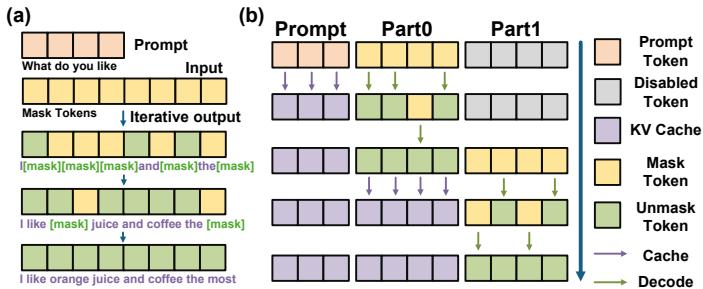  
Fig. 1. (a) Iterative decoding process of a dLLM. (b) Fast-dLLM’s part-wise decoding with approximate KV-cache reuse.

However, existing accelerators are not directly optimized for such workloads. AR-oriented accelerators typically assume sequential single-token generation [6], [13]–[16], while diffusion accelerators such as DiT accelerators mainly target dense updates over continuous latent representations [17]. In contrast, dLLM inference operates on discrete token spaces and requires vocabulary projection and sampling during each denoising iteration, leading to distinct computation and data movement patterns [7], [18].

Recently, several accelerators have been proposed specifically for dLLM inference. DART focuses on accelerating the vocabulary sampling stage by introducing dedicated hardware support for large-vocabulary processing [18], while dLLM-OPU exploits the similarity across denoising iterations through temporal activation reuse [19]. These works demonstrate the importance of adapting accelerator designs to dLLM-specific workloads. However, these designs retain all tokens in parallel execution during denoising, underexploring the varying importance and execution requirements among tokens. Exploiting such token-level variations requires dynamically adapting computation and handling the resulting irregular execution patterns.

To investigate this issue, we characterize dLLM workloads and observe that token execution requirements continuously change during denoising. Specifically, different tokens may require different computation resources, exhibit different refinement dependencies, and generate different vocabulary processing demands. Such token-level execution dynamics introduce new challenges for accelerator design. As shown in Fig. 2, we identify three manifestations of token-level execution dynamics, spanning iterative Transformer computation and vocabulary-side processing.

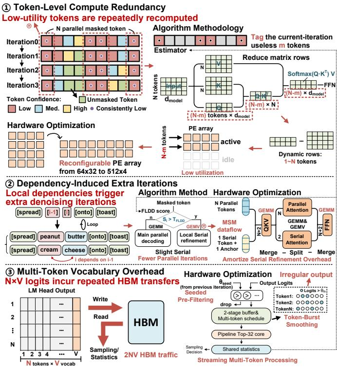  
Fig. 2. Three inefficiencies in dLLM decoding and DynaTE’s corresponding algorithm–hardware optimizations.

Challenge 1 (Dynamic Token Participation): During dLLM denoising, different tokens exhibit different refinement utilities across iterations. Although all unresolved tokens are repeatedly processed, many low-utility tokens provide limited improvement to generation quality while still incurring complete Transformer computation and data movement. Therefore, efficient dLLM accelerators should dynamically adjust token participation according to their refinement utility.

Challenge 2 (Dynamic Token Dependency): Although dLLMs decode multiple tokens in parallel, some locally coupled tokens cannot be resolved independently. Their updated context is only available in later iterations, causing repeated revisions and additional sequence-wide denoising steps.

Challenge 3 (Dynamic Vocabulary Execution): Each denoising iteration generates vocabulary distributions for multiple token positions. However, vocabulary outputs exhibit irregular generation patterns across token streams, leading to inefficient utilization of conventional fixed-granularity vocabulary selection engines. Moreover, materializing the complete N×V logit tensor introduces substantial data movement between the LM head and sampling stage.

To address these challenges, we propose DynaTE, a dynamic token execution architecture for diffusion LLM inference. DynaTE adapts accelerator execution according to evolving token states through three key architectural mechanisms.

First, DynaTE addresses dynamic token participation through adaptive computation execution. It introduces a token utility-aware execution mechanism to identify tokens with limited refinement benefits and avoid unnecessary Transformer computation. To efficiently support varying numbers of active tokens, DynaTE employs a dimension-reconfigurable PE array that dynamically adjusts execution granularity between token and model dimensions, improving hardware utilization under different participation patterns.

Second, DynaTE addresses dynamic token dependency through dependency-aware intra-iteration refinement. Instead of resolving transient token dependencies through additional global denoising iterations, DynaTE employs Fast Local Dependency Detection (FLDD) to identify refinement opportunities and selectively performs local refinement within the current iteration. A Merge-Split-Merge (MSM) dataflow is designed to integrate refinement operations with regular parallel execution while minimizing serialization overhead.

Third, DynaTE addresses dynamic vocabulary execution through streaming multi-token processing. DynaTE introduces a streaming multi-token vocabulary engine that directly processes vocabulary outputs as token streams. By exploiting irregular output patterns among different token positions, DynaTE improves vocabulary selection efficiency and reduces unnecessary data movement during multi-token generation.

DynaTE further incorporates iteration-adaptive activation precision with a shared splittable MAC datapath to reduce computation cost during decoding.

The main contributions of this work are summarized as follows:

• We propose a dynamic token execution approach that adapts token participation and selective local refinement to evolving token states. Token-wise query/FFN pruning reduces low-utility computation, while Fast Local Dependency Detection (FLDD) guides local refinement to reduce unnecessary denoising iterations.

• We develop an architecture that supports the resulting variable workloads through dimension-reconfigurable computation and an MSM dataflow. A streaming multitoken vocabulary engine adapts to irregular token-wise LM-head outputs during denoising and supplies shared distribution statistics for sampling, refinement, and subsequent pruning while avoiding full-logit HBM transfers.

• We evaluate DynaTE on LLaDA-8B and Dream-7B across five benchmarks. The evaluated system achieves 2.05–2.78× speedup and 2.99–3.93× higher energy efficiency over the evaluated prior dLLM accelerators, and 2.55× speedup and 6.07× higher energy efficiency over Jetson AGX Orin.

## II. BACKGROUND & MOTIVATION

## A. dLLM basics

Diffusion large language models (dLLMs) reformulate text generation as an iterative denoising process rather than the conventional left-to-right autoregressive (AR) prediction [7]. Given an original token sequence $x _ { 0 } ~ = ~ ( x _ { 1 } , \ldots , x _ { L } )$ , the forward masking process gradually replaces each token with a special [MASK] symbol according to a masking ratio $t \in [ 0 , 1 ]$

$$
q _ { t } \big ( x _ { t } | x _ { 0 } \big ) = \prod _ { i = 1 } ^ { L } \mathbf { C a t } \big ( x _ { i } ^ { t } ; ( 1 - t ) \delta _ { x _ { i } ^ { 0 } } + t \delta _ { [ \mathrm { M A S K } ] } \big ) ,\tag{1}
$$

where $x _ { t }$ denotes the partially masked sequence at time t. As shown in Fig. 1(a), during inference, the model reconstructs the text through multiple denoising iterations, where all tokens are re-computed in parallel as

$$
\hat { x } ^ { ( k ) } = \arg \operatorname* { m a x } _ { x } p _ { \theta } ( x | x _ { t } ^ { ( k ) } ) ,\tag{2}
$$

and tokens with low confidence are re-masked for regeneration, i.e.,

$$
\boldsymbol { x } _ { t } ^ { ( k + 1 ) } = \mathrm { R e m a s k } \Big ( \hat { \boldsymbol { x } } ^ { ( k ) } , { \tau } \Big ) .\tag{3}
$$

This iterative re-masking mechanism, as illustrated in Fig. 1(a), enables bidirectional context modeling and parallel decoding, effectively alleviating the latency bottleneck of AR models.

Building upon the LLaDA-dLLM framework, Fast-dLLM introduces a part-wise approximate KV caching mechanism, as depicted in Fig. 1(b), which reuses attention activations across adjacent diffusion steps [12]. By exploiting the high temporal similarity of KV states between iterations, this method achieves substantial computational reuse with negligible degradation in generation quality.

Beyond the savings from part-wise decoding and KV-cache reuse, token-level variations in refinement utility and local dependencies offer further opportunities to reduce computation during denoising.

## B. Execution Mismatch with Existing Accelerators

The mismatch stems from the execution unit around which each accelerator is designed.

AR accelerators treat one newly generated token as the basic unit of decoding [20], [21]. Their datapaths are optimized for low-parallelism execution, while their cache systems assume that new states are appended without revisiting earlier positions. A dLLM instead updates several positions within the same block and may revisit them over multiple iterations. Its active workload therefore changes during generation, making a fixed single-token execution path inefficient.

Accelerators for continuous-latent DiTs are built around a different form of iteration [22]. They retain a fixed spatialtoken layout and densely update the latent representation at every timestep. The output remains a compact continuous tensor that is consumed by a numerical scheduler. In contrast, a dLLM produces a vocabulary distribution for each active position and then changes its discrete token state through commit or remask decisions. Although the Transformer compute units remain reusable, the downstream dataflow does not match vocabulary-wide processing or token-state control.

## C. Workload Characterization and Design Opportunities

Section II-B explains why existing accelerators are poorly matched to dLLM execution. We further characterize the inefficiencies that remain in iterative decoding. Fig. 3 presents two representative decoding traces and the vocabulary-side data movement. These observations correspond to the three challenges introduced in Fig. 2.

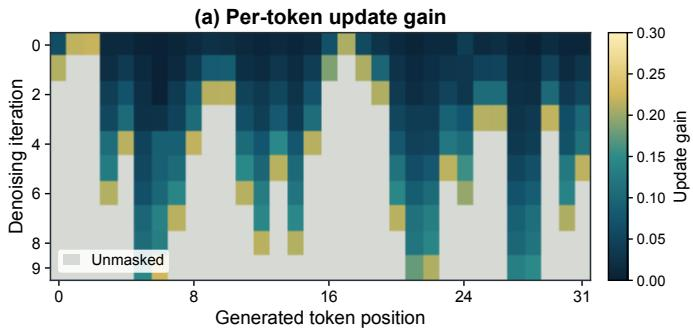

(b) Oracle local-conditioning gain  
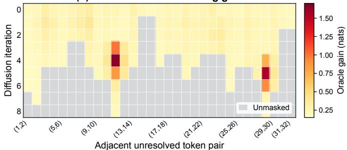

(c) HBM traffic  
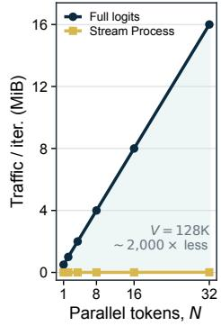

(d) Above-threshold demand  
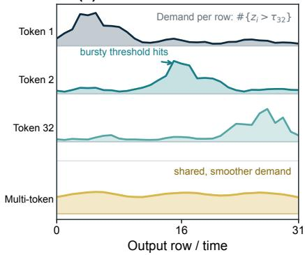  
Fig. 3. Workload characterization of the three optimization opportunities: (a) per-token update gain across denoising iterations; (b) oracle local-conditioning gain between adjacent unresolved tokens; (c) full-logit HBM traffic; and (d) bursty per-token versus smoothed multi-token processing demand.

Observation 1: Token-update utility is uneven. A dLLM repeatedly processes unresolved positions over multiple denoising iterations. However, recomputing a token does not always produce a meaningful improvement. To reveal this behavior, we define the oracle update gain of token i at iteration t as

$$
G _ { i } ^ { ( t ) } = \left[ \log p _ { i , \mathrm { a f t e r } } ^ { ( t ) } ( y _ { i } ) - \log p _ { i , \mathrm { b e f o r e } } ^ { ( t ) } ( y _ { i } ) \right] _ { + } ,\tag{4}
$$

where $y _ { i }$ denotes the reference token and $[ x ] _ { + } = \operatorname* { m a x } ( x , 0 )$

As shown in Fig. 3(a), many unresolved positions receive little benefit from an update, even though they still pass through the complete Transformer. The high-gain positions also change across iterations. Therefore, this redundancy cannot be captured by a fixed token mask. An efficient accelerator should identify low-utility positions at runtime and adapt the active computation accordingly.

Observation 2: Strong local dependencies are sparse and transient. Parallel decoding assumes that unresolved positions can be refined independently within the same iteration. This assumption does not always hold. Resolving one token may provide critical context for a nearby token, making a short serial refinement more effective than another fully parallel iteration.

For an adjacent unresolved pair $( i , j )$ , we define the directional coupling gain as

$$
C _ { i \to j } ^ { ( t ) } = \left[ \log p _ { j } ^ { ( t ) } ( y _ { j } \mid x _ { i } = y _ { i } ) - \log p _ { j } ^ { ( t ) } ( y _ { j } \mid x _ { i } { \mathrm { ~ u n r e s o l v e d } } ) \right] _ { + }\tag{5}
$$

The reference tokens are again used only to expose the underlying opportunity.

Fig. 3(b) shows that high coupling gains appear only at isolated token pairs and iterations. Their locations also change during decoding. Serializing the entire block would therefore sacrifice parallelism for positions that do not benefit from ordered updates. Instead, serial refinement should be restricted to the small number of temporary dependency hotspots.

Observation 3: Vocabulary outputs incur substantial offchip traffic.

Each denoising iteration projects N active token states onto a vocabulary of size V , producing an $N \times V$ logit tensor. In a decoupled LM-head and sampling pipeline, this tensor is first written to HBM and later read back for vocabulary processing. If each logit occupies b bytes, the intermediate traffic per iteration is

$$
D _ { \mathrm { l o g i t } } = 2 N V b ,\tag{6}
$$

where the factor of two accounts for one write and one read. As shown in Fig. 3(c), this traffic increases linearly with the number of tokens decoded in parallel and is repeatedly incurred across denoising iterations.

Meanwhile, the numbers of logits exceeding the current Top-32 threshold are highly uneven over time. As shown in Fig. 3(d), a single token stream exhibits bursty candidate arrivals, while the bursts of different tokens often occur at different vocabulary positions. Processing token streams independently therefore leaves the vocabulary-selection pipeline underutilized, whereas interleaving multiple token streams can smooth the aggregate update demand.

The complete logit tensor need not remain available after generation. Leading vocabulary candidates and full-vocabulary normalization statistics can instead be extracted directly from the LM-head output stream. Therefore, vocabulary outputs should be summarized before crossing the HBM boundary, while multi-token interleaving should be used to smooth irregular candidate arrivals and improve shared selection hardware utilization.

## III. ALGORITHM METHODOLOGY

## A. Token-wise Query-Pruning Strategy

DynaTE first uses the distribution statistics from the previous iteration and the positions of decoded tokens to identify masked tokens with low expected refinement utility. Within the current decoding block $\boldsymbol { B } ^ { ( r ) }$ , the pruning candidate set is defined as

$$
\begin{array} { r l } & { { \mathscr C } ^ { ( r ) } = \big \{ i \in { \mathcal B } ^ { ( r ) } \ \big \vert x _ { i } ^ { ( r ) } = [ \mathrm { M A S K } ] , \ H _ { i } ^ { 3 2 , ( r - 1 ) } \geq \tau _ { H } , } \\ & { \qquad C _ { i } ^ { ( r - 1 ) } \leq \tau _ { C } , \ D _ { i } ^ { ( r ) } \geq \tau _ { D } \big \} . } \end{array}\tag{7}
$$

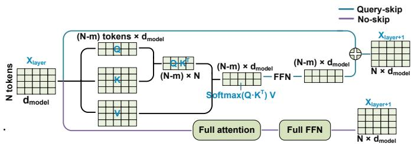  
Fig. 4. Token-wise pruning dataflow. Query-skip removes selected tokens from query-side attention and FFN computation while retaining their keys and values for the remaining tokens; no-skip executes the complete layer.

Here, $H _ { i } ^ { 3 2 , ( r - 1 ) }$ denotes the Top-32 truncated entropy, $C _ { i } ^ { ( r - 1 ) }$ is the token confidence, and $D _ { i } ^ { ( \bar { r } ) }$ is the distance to the nearest decoded token.

Candidate tokens may exhibit different contextual contributions across Transformer layers. DynaTE therefore accumulates the average attention mass received by candidate token i at layer ℓ:

$$
M _ { \ell , i } = \frac { 1 } { N _ { h } | \mathcal { Q } _ { \ell } | } \sum _ { h = 1 } ^ { N _ { h } } \sum _ { q \in \mathcal { Q } _ { \ell } } A _ { \ell , h , q , i } ,\tag{8}
$$

and cumulatively updates the next layer-wise pruning set as

$$
P _ { \ell + 1 } ^ { ( r ) } = P _ { \ell } ^ { ( r ) } \cup \left\{ i \in \mathcal { C } ^ { ( r ) } \setminus P _ { \ell } ^ { ( r ) } \ \middle | \ M _ { \ell , i } < T _ { \ell + 1 } \right\} .\tag{9}
$$

where $T _ { \ell + 1 }$ is an offline-calibrated threshold and $P _ { 1 } ^ { ( r ) } = \emptyset$ for each decoding iteration r. Thus, a token is newly selected for pruning in the next layer only when it is predicted to have low refinement utility and receives little attention from the active queries, with the received attention mass serving as a layer-wise safeguard against pruning contextually influential tokens. The attention mass is accumulated while the normalized attention probabilities are streamed into the AV computation, requiring only lightweight accumulation without storing the complete attention matrix or introducing additional off-chip accesses. As shown in Fig. 4, for a pruned token, the hidden state is passed unchanged to the next layer through an identity bypass. Its keys and values are recomputed at each layer from the normalized layer input and remain accessible to active tokens, while its query-side attention and FFN computations are skipped. Pruning persists through the remaining layers of the current decoding iteration and is reassessed in the next iteration.

## B. Fast Local Dependency Detection for Selective Serial $R e \mathrm { - }$ finement

Since all tokens in parallel decoding are predicted from the same pre-update context, a newly resolved token cannot immediately affect its neighboring positions within the current iteration. DynaTE introduces Fast Local Dependency Detection (FLDD), which compares cross-iteration distribution changes at neighboring positions to identify anchors for local serial refinement.

FLDD measures the difference between the cross-iteration Top-32 truncated KL divergences of neighboring positions i and $i + 1 \colon$

$$
\begin{array} { r l } & { E _ { i } ^ { ( r ) } = \Big | D _ { \mathrm { K L 3 2 } } \Big ( p _ { i } ^ { ( r ) } \| p _ { i } ^ { ( r - 1 ) } \Big ) } \\ & { \qquad - D _ { \mathrm { K L 3 2 } } \Big ( p _ { i + 1 } ^ { ( r ) } \| p _ { i + 1 } ^ { ( r - 1 ) } \Big ) \Big | . } \end{array}\tag{10}
$$

A smaller $E _ { i } ^ { ( r ) }$ indicates more similar magnitudes of crossiteration distribution change, suggesting a potential local dependency.

FLDD then compares the Top-K candidate sets of position i across two consecutive iterations:

$$
O _ { i } ^ { ( r ) } = \frac { \left| \mathrm { T o p K } \left( p _ { i } ^ { ( r - 1 ) } \right) \cap \mathrm { T o p K } \left( p _ { i } ^ { ( r ) } \right) \right| } { K } ,\tag{11}
$$

where $K \ = \ 4$ in our design. A small overlap indicates that the dominant candidates of this position have changed substantially in the current iteration.

Finally, FLDD uses the latest available Top-32 truncated entropy $\mathbf { \dot { H } } _ { i } ^ { 3 2 , ( r ) }$ to characterize the concentration of the prediction distribution. For a position whose confidence remains below the commitment threshold, lower entropy indicates that probability mass is concentrated among fewer candidates, even though the position is not yet confidently resolved. This metric describes current candidate concentration rather than crossiteration stability. The three metrics are combined into the local dependency score:

$$
\begin{array} { r l } & { S _ { i } ^ { ( r ) } = \alpha _ { 1 } \left[ 1 - \mathrm { N o r m } \Big ( E _ { i } ^ { ( r ) } \Big ) \right] + \alpha _ { 2 } \left( 1 - O _ { i } ^ { ( r ) } \right) } \\ & { ~ + ~ \alpha _ { 3 } \left[ 1 - \mathrm { N o r m } \Big ( H _ { i } ^ { 3 2 , ( r ) } \Big ) \right] . } \end{array}\tag{12}
$$

When $S _ { i } ^ { ( r ) }$ exceeds the FLDD threshold, position i is selected as an anchor. The neighboring token at position $i + 1$ is refined using the updated anchor’s KV context, while the parallel path retains the pre-anchor context.

FLDD aims to identify local refinement opportunities with low overhead, reducing denoising iterations without requiring exhaustive dependency detection.

## C. Adaptive Activation Precision

The activation ranges of dLLMs vary with decoding progress and exhibit different sensitivities across model modules. DynaTE therefore builds calibration sets for different decoded-token ratios and offline profiles the quantization sensitivity of individual modules, including QKV projections, the LM head, and FFN projections. Based on this profiling, a compact lookup table assigns W8A8 or W8A4 execution to each module at different decoding stages. At runtime, the controller selects the precomputed precision according to the current decoded-token ratio, while a shared splittable MAC datapath executes either one W8A8 operation or two W8A4 operations in parallel.

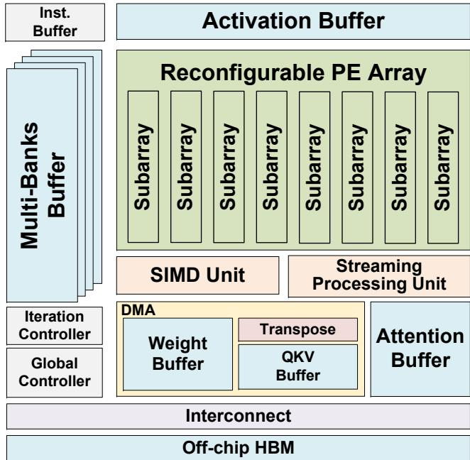  
Fig. 5. Overall architecture of DynaTE.

## IV. HARDWARE OPTIMIZATION

Fig. 5 illustrates the overall architecture of DynaTE, which comprises four main components: the computation core, the memory hierarchy, the streaming processing unit, and the control logic. The computation core includes a dimensionreconfigurable PE array composed of eight subarrays, a SIMD unit for vector operations, and a multi-bank buffer for feeding the PE array. The memory hierarchy consists of the Activation Buffer, Weight Buffer, QKV Buffer with an integrated Transpose unit, and Attention Buffer for storing intermediate results during MSM execution. The Streaming Processing Unit directly processes LM-head outputs and generates Top-32 results and distribution statistics. The Iteration Controller dynamically configures token pruning, serial refinement, array shape, and execution precision according to the current token states, while the Global Controller manages the overall denoising flow. Data are exchanged with off-chip HBM through the interconnect for weight and KV-cache storage.

## A. Reconfigurable Computation Dimension

Token pruning and serial refinement dynamically change the effective matrix dimensions of Attention and FFN operations. To maintain high utilization under these varying workloads, we design a dimension-reconfigurable PE array composed of eight 64×4 subarrays. With a fixed total of 2,048 MAC units, the array supports 64 × 32, 128 × 16, $2 5 6 \times 8$ , and $5 1 2 \times 4$ configurations.

As shown in Fig. 6(a), adjacent subarrays are connected through multiplexer-based gating circuits that enable either horizontal propagation or direct bypass from the left multibank buffer. Vertical data movement is controlled by the routing logic above and below each subarray, with an additional input path from the top buffer. As shown in Fig. 6(b), each PE contains local operand and partial-sum registers together with top and bottom multiplexers, enabling bidirectional vertical routing and supporting WS, IS, and OS dataflows.

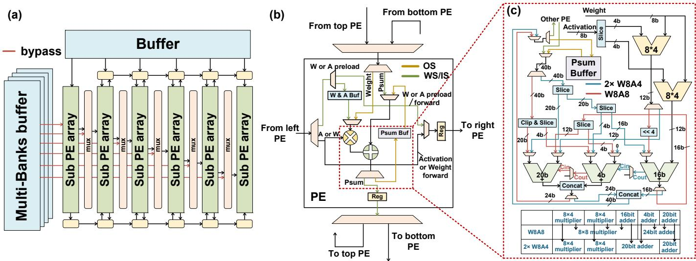  
Fig. 6. (a) Reconfigurable PE array, (b) internal PE structure, and (c) multi-precision splittable MAC unit.

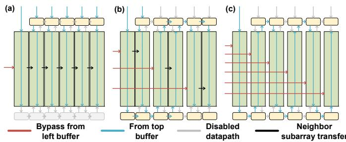  
Fig. 7. Representative PE-array reconfiguration modes: (a) canonical dataflow and (b)–(c) reshaped dataflows using left-buffer bypass and inter-subarray transfers.

Fig. 7 illustrates representative array configurations. In the canonical configuration, horizontal data propagate through adjacent subarrays, while vertical inputs are supplied from the top buffer. In reshaped configurations, the left-buffer bypass and inter-subarray vertical paths are enabled to combine multiple subarrays along the model dimension. Adjacent subarray groups employ opposite propagation directions, forming an Sshaped dataflow that reduces routing distance and contention.

## B. Splittable MAC Unit

Beyond array-level flexibility, each PE supports precision reconfiguration to accommodate the stage-varying activation precision of dLLMs. Conventional reconfigurable MAC designs require two 20-bit accumulators for dual W8A4 execution, while W8A8 execution requires a 24-bit accumulator, resulting in redundant adder resources.

To reduce this overhead, we design a splittable MAC unit that shares its multiplier and accumulator datapaths across precision modes. As shown in Fig. 6(c), each unit consists of two 8 × 4 multipliers, a 16-bit adder, a 4-bit adder, and a 20-bit adder.

W8A8 Mode: The 8-bit activation is divided into upper and lower 4-bit slices and processed by the two 8 × 4 multipliers.

The two partial products are combined with the required shift and sign extension to form an 8 × 8 product. The 20-bit and 4-bit adders are concatenated to form a 24-bit accumulator.

Dual-W8A4 Mode: Two 4-bit activations are processed in parallel by the two 8 × 4 multipliers. The 16-bit and 4-bit adders are combined into one 20-bit accumulator, while the original 20-bit adder forms the other, enabling two independent W8A4 MAC operations.

This adder-sharing design allows each physical MAC to execute either one W8A8 operation or two W8A4 operations without duplicating the accumulator datapath.

## C. Streaming Multi-Token Vocabulary Processing Engine

To avoid transferring the complete N × V logit tensor between the LM head and the sampling module, DynaTE directly connects a streaming vocabulary-processing engine to the LM-head output. As shown in Fig. 8, the Output Reshaper selects valid outputs according to the current PEarray configuration and restores the token order altered by the S-shaped dataflow. The resulting 4–32 logit lanes are packed into a 32-bank elastic buffer and converted by the Row Scanner into a uniform vocabulary stream. This design decouples the bursty outputs of the dimension-reconfigurable PE array from the downstream processing pipeline.

As shown in Fig. 9, for each token, the Top-32 engine first retrieves the Top-32 candidate IDs retained from the previous iteration and computes their current logits. The minimum of these updated logits initializes the selection threshold:

$$
\theta _ { t } ^ { \mathrm { s e e d } } = \operatorname* { m i n } _ { v \in \mathcal { T } _ { t } ^ { ( r - 1 ) } } z _ { t } ^ { ( r ) } ( v ) .\tag{13}
$$

During the subsequent full-vocabulary scan, logits below the threshold are discarded, while the remaining candidates enter the comparison pipeline. The Top-32 table is maintained as an unordered set, and each update replaces only its current minimum. Since buffered candidates may have passed an earlier threshold, they are revalidated against the latest threshold before replacement. The warm start therefore reduces comparison pressure while preserving exact Top-32 selection.

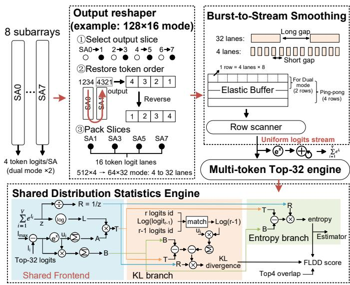  
Fig. 8. Streaming vocabulary-processing engine, including output reshaping, burst-to-stream smoothing, multi-token Top-32 selection, and shared distribution-statistics generation.

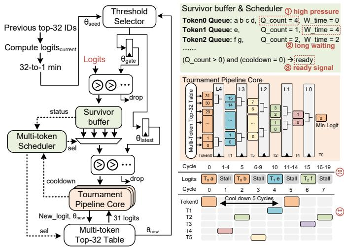  
Fig. 9. Multi-token Top-32 engine and its interleaved tournament-pipeline schedule.

The numbers of surviving candidates from different token streams vary substantially over time. DynaTE assigns a Survivor Buffer to each active token and interleaves their candidates through shared Tournament Pipeline Cores. The scheduler first serves tokens under high buffer pressure, then long-waiting tokens, and finally the remaining ready tokens in a round-robin manner. Interleaving different token streams fills the dependency interval between consecutive updates to the same Top-32 table, thereby smoothing bursty arrivals and improving pipeline utilization. Algorithm 1 summarizes this process.

Meanwhile, the Shared Distribution Statistics Engine accumulates the full-vocabulary Softmax normalization statistics and derives the Top-32 truncated entropy, token confidence, cross-iteration KL divergence, and Top-4 overlap from the retained candidates. The KL branch compares neighboring positions’ cross-iteration divergences and supplies $\bar { 1 - \mathrm { N o r m } ( E _ { i } ^ { ( r ) } ) }$ to FLDD. The Top-32 results support sampling, while the distribution statistics are retained for FLDD and token pruning in the subsequent forward pass. The streaming engine thus eliminates full-logit HBM transfers and unifies sampling, dependency detection, and cross-iteration token evaluation within a shared vocabulary-processing datapath.

Algorithm 1 Multi-Token Top-32 Selection   
Require: Previous Top-32 IDs P[t]; streamed logits $( t , v , x )$   
Ensure: Updated Top-32 table for each token t   
1: for all tokens t do   
2: $\mathrm { T o p 3 2 } [ t ] \gets \mathrm { C }$ urrent $\mathrm { L o g i t s } [ \mathcal { P } [ t ] ]$ ▷ Reuse prior IDs   
to initialize the threshold   
3: $\theta _ { \mathrm { g a t e } } [ t ]  \operatorname* { m i n } ( \mathrm { T o p 3 2 } [ t ] )$   
4: $\theta _ { \mathrm { l a t e s t } } [ t ]  \theta _ { \mathrm { g a t e } } [ t ]$   
5: end for   
6: for all incoming logits (t, v, x) do   
7: if $v \not \in { \mathcal { P } } [ t ]$ and $x > \theta _ { \mathrm { g a t e } } [ t ]$ then   
8: ENQUEUE(Q[t], (v, x))   
9: end if   
10: Update cooldown and waiting-time counters   
11: $r e a d y \gets ( Q _ { \mathrm { c o u n t } } > 0 ) \land ( c o o l d o w n = 0 )$   
12: high pressure ← ready $\land ( Q _ { \mathrm { c o u n t } } \geq Q _ { \mathrm { h i g h } } )$   
13: long waiting ← ready ∧ (wait time $\geq W _ { \mathrm { t h } } )$   
14: if $\mathbf { A N Y } ( h i g h _ { - }$ pressure) then   
15: mask ← high pressure   
16: else if ANY(long waiting) then   
17: mask ← long waiting   
18: else   
19: mask ← ready   
20: end if   
21: t∗ ← RRSELECT(mask) ▷ Interleave tokens to hide   
tree dependencies   
22: if $t ^ { * } \neq \mathrm { I N V A L I D }$ then   
23: $( v ^ { * } , x ^ { * } ) \gets \mathrm { D E Q U E U E } ( Q [ t ^ { * } ] )$   
24: if $x ^ { * } > \theta _ { \mathrm { l a t e s t } } [ t ^ { * } ]$ then ▷ Revalidate   
stale-threshold candidates   
25: REPLACETREEMIN $( t ^ { * } , ( v ^ { * } , x ^ { * } ) )$ ▷ Replace   
only the current minimum   
26: $\theta _ { \mathrm { l a t e s t } } [ t ^ { * } ] \gets \top$ TREEMIN(t∗)   
27: $\theta _ { \mathrm { g a t e } } [ t ^ { * } ]  \theta _ { \mathrm { l a t e s t } } [ t ^ { * } ]$   
28: cooldown[t∗] ← 5   
29: end if   
30: end if   
31: end for   
32: while ANYQUEUENONEMPTY do   
33: Drain remaining survivors with the same policy   
34: end while

## D. Merge-Split-Merge Dataflow

Serial refinement reduces the number of iterations required for token convergence, but introduces two critical inefficiencies if processed independently: (1) The refinement workload consists predominantly of general matrix-vector (GEMV) operations, which suffer from poor computational utilization on standard PE arrays optimized for matrix-matrix multiplication. (2) Serial processing of refinement causes the main parallel token generation to stall, leading to reduced overall throughput.

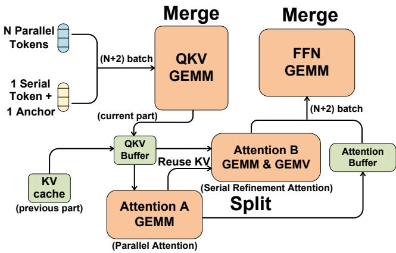  
Fig. 10. Merge–Split–Merge dataflow for integrating local serial refinement into parallel dLLM decoding.

Algorithm 2 FLDD-Guided Local Refinement with MSM   
Require: Current committed state $X ^ { ( r ) } { \mathrm { ; } }$   
retained logits $Z ^ { \mathrm { p r e v } } ;$ history $\Sigma ^ { \mathrm { p r e v } }$   
Ensure: State $X ^ { ( r + 1 ) } ;$ logits $Z ^ { \mathrm { n e w } }$   
1: Y ← PREDICTTOKENS( $Z ^ { \mathrm { p r e v } } )$   
2: $( \underline { i } , \dot { j } ) \gets \mathrm { F L D D } ( Z ^ { \mathrm { p r e v } } , \overbar { \Sigma } ^ { \mathrm { p r e v } } , X ^ { ( r ) } )$   
3: $\tilde { X }  X ^ { ( r ) } ; S  \emptyset$   
4: $H _ { B } \gets \emptyset$   
5: if $( i , j ) \neq \emptyset$ then   
6: $\widetilde { X } _ { i } \gets Y _ { i } ; S \gets \{ i , j \}$   
7: $H _ { B } \gets \mathrm { E M B E D } ( \widetilde { X } _ { S } )$   
8: end if   
9: $H _ { A } \gets \mathrm { E M B E D } ( X ^ { ( r ) } )$   
10: for each Transformer layer ℓ do   
11: $( Q , K , V ) \gets \mathbf { M E R G E D Q K V } ( \boldsymbol { \mathbf { \ell } } _ { ) } \ell ( H _ { A } , H _ { B } )$   
12: $( U _ { A } , U _ { B } ) \gets \mathrm { S P L I T A T T E N T I O N } ( _ { ) } \ell ( Q , K , V , S )$   
13: $( H _ { A } , H _ { B } ) \gets \mathbf { M E R G E D F F N } ( \mathrm { \Omega } _ { ) } \ell ( U _ { A } , U _ { B } )$   
14: end for   
15: $Z ^ { \mathrm { n e w } }  \mathrm { L M H e a d } ( H _ { A } )$   
16: if $S \neq \emptyset$ then   
17: $\begin{array} { r } { Z _ { j } ^ { \mathrm { n e w } }  \mathrm { L M H e a d } ( H _ { B , j } ) } \end{array}$   
18: end if   
19: $Y \gets \mathrm { { P R E D I C T T O K E N S } } ( Z ^ { \mathrm { { n e w } } } )$   
20: $X ^ { ( r + 1 ) } \gets \mathbf { C O M M I T U P D A T E } ( \widetilde { X } , Y )$ ▷ Keep anchor

To mitigate these inefficiencies, we design a merge-splitmerge (MSM) dataflow that interleaves serial refinement with parallel generation, as illustrated in Fig. 10. MSM execution begins after the FLDD-selected anchor is committed using the preceding forward pass’s prediction, so that local refinement is conditioned on the updated anchor.

Merge Stage: The $N$ parallel tokens are merged with the updated anchor and its neighbor-refinement token into an $( N +$ 2)-token batch for QKV projection.

Split Stage: Attention A processes the original parallel batch using the pre-anchor context. Attention B processes the updated anchor and its neighbor, reusing the parallel path’s KV context with the anchor entries replaced by the updated KV produced by the current layer’s merged QKV projection. The updated anchor is propagated through successive layers to provide layer-wise conditioning for neighbor refinement. In addition, GEMV operations in Attention B are executed on the reconfigurable PE array, which dynamically adapts its computation dimensions to maximize the utilization of the GEMV workload.

Merge Stage: The outputs of Attention A and Attention B are merged into an (N + 2)-token batch for FFN computation.

Algorithm 2 summarizes FLDD-guided anchor selection and local refinement using the MSM dataflow. In Algorithm 2, $H _ { B }$ contains the updated anchor and its neighbor-refinement token. Only the neighbor’s output replaces the corresponding parallel prediction. By merging serial refinement into the parallel generation pipeline, the MSM architecture mitigates pipeline stalls while enabling efficient execution of GEMV operations through dimension-adaptive PE reconfiguration.

## V. EVALUATION

## A. Evaluation Methodology

1) Hardware Baselines: We compare DynaTE against three classes of hardware platforms. First, NVIDIA AGX Orin serves as a commercial GPU baseline for low-power edge inference. Second, we construct Fixed-SA, a conventional dLLM accelerator built around a fixed-shape systolic array [23], [24], with the same technology, frequency, compute capacity, onchip storage, and off-chip bandwidth as DynaTE. Finally, we select dLLM-OPU and DART as representative dLLM accelerators and normalize their matrix-compute resources to the same equivalent MAC count as DynaTE for fair comparison.

2) DynaTE Implementation: DynaTE employs a dimension-reconfigurable PE array composed of eight 64 × 4 subarrays, providing a total of 2,048 splittable MAC units. Implemented in a TSMC 28-nm technology at 1 GHz, the array supports $6 4 \times 3 2 , 1 2 8 \times 1 6 , 2 5 6 \times 8$ , and $5 1 2 \times 4$ configurations. The on-chip memory hierarchy includes double-buffered weight and QKV tile buffers, a ping-pong activation buffer, and an attention buffer for MSM execution. The streaming vocabulary-processing engine contains a 32-bank, four-row elastic buffer, an eight-entry survivor queue per token context, and two five-stage tournament cores shared by 32 token contexts. DynaTE is connected to an HBM2 memory system with 512 GB/s peak bandwidth.

Table I summarizes the complete hardware configuration. The datapath and control logic are synthesized using Synopsys Design Compiler. On-chip SRAM area and energy are modeled using CACTI 7.0 [25]. For HBM modeling, we use Ramulator with HBM2 settings [26]. A cycle-accurate simulator models PE execution, on-chip and off-chip memory accesses, MSM refinement, and streaming vocabulary processing.

3) Models and Benchmarks: We evaluate DynaTE on LLaDA-8B [7] and Dream-7B [8], two representative diffusion language models. Both models use part-wise decoding with confidence-based early unmasking and approximate KV-cache reuse. The part size is set to 32, and each part performs at most 32 denoising iterations, terminating early once all tokens in the part have been decoded. For masked-token pruning candidate selection, the confidence and distance thresholds are set to $\tau _ { C } = 0 . 7 5$ and $\tau _ { D } = 3$ for both models, while the entropy threshold $\tau _ { H }$ is set to 0.18 for LLaDA-8B and 0.21 for Dream-7B. The FLDD weights are $( \alpha _ { 1 } , \alpha _ { 2 } , \alpha _ { 3 } ) = ( 0 . 2 5 , 0 . 4 5 , 0 . 3 0 )$ and the FLDD score threshold τFLDD is set to 0.40 for LLaDA-8B and 0.35 for Dream-7B. For both models, Attn-O and MLP-Down use W8A4 throughout decoding. Attn-QKV uses W8A4 in Layers 0-4 and 6, and switches from W8A8 to W8A4 in Layers 5 and 7 once the unmasked-token ratio reaches 50%. All other activations remain W8A8.

TABLE I  
DYNATE HARDWARE CONFIGURATION.
<table><tr><td>Parameter Technology / Frequency</td><td>Configuration  $\overline { { \mathrm { T S M C ~ 2 8 ~ n m ~ / ~ 1 ~ G H z } } }$ </td></tr><tr><td>PE Total MACs Array configurations</td><td>2,048  $6 4 \times 3 2 \mathrm { - } 5 1 2 \times 4$ </td></tr><tr><td>Weight-activation precision</td><td> $\mathrm { W } 8 \mathrm { A } 8 \ \mathrm { o r } \ \mathrm { W } 8 \mathrm { A } 4$ </td></tr><tr><td>Activation buffer Weight buffer</td><td> $2 \times 1 2 8 \mathrm { K B }$ </td></tr><tr><td></td><td> $2 \times 6 4 \mathrm { K B } ,$  double-buffered</td></tr><tr><td>QKV tile buffer Attention buffer</td><td> $2 \times 3 2 \mathrm { K B } .$  double-buffered</td></tr><tr><td></td><td> $1 2 8 \mathrm { K B }$ </td></tr><tr><td>Elastic buffer</td><td>32 banks × 4 rows, ping-pong</td></tr><tr><td>Survivor buffer</td><td>8 entries/context</td></tr><tr><td>Tournament core</td><td></td></tr><tr><td></td><td>2, five-stage pipeline</td></tr><tr><td>Top-32 tables</td><td> $3 2 \ \mathrm { e n t r i e s } \ \times \ 3 2$  contexts</td></tr><tr><td>Off-chip memory</td><td> $\mathrm { H B M } 2 , 5 1 2 \mathrm { G B } / \mathrm { s }$ </td></tr></table>

Our benchmark suite includes GSM8K [27] and MATH [28] for mathematical reasoning, HumanEval [29] and MBPP [30] for code generation, and MMLU [31] for general knowledge. Algorithmic effectiveness and generation quality are evaluated on these five benchmarks.

## B. Design Space Exploration

1) Survivor Buffer Depth: The survivor queues absorb the bursty candidates admitted by threshold filtering. Fig. 11 reports both buffer-full backpressure and buffer area as the per-token queue depth increases. The backpressure ratio drops rapidly from two to eight entries per token for both models, whereas increasing the depth to 16 yields little additional benefit while nearly doubling the buffer area.

2) Tournament Core Count: Fig. 12 explores the number of shared five-stage tournament cores. Increasing the core count from one to two sharply reduces Top-32 latency, whereas moving from two to four and eight cores provides little additional benefit while the engine area continues to increase. We therefore share two tournament cores across the active token contexts.

## C. Algorithmic Effectiveness

1) Token-Pruning Effectiveness: We compare DynaTE with a baseline using the same part-wise decoding configuration without token pruning, which executes all active tokens throughout each Transformer layer. As shown in Fig. 13, token-wise pruning reduces the total executed Transformer MACs by 26.1–40.0% across the evaluated workloads, with average reductions of 32.7% for LLaDA-8B and 34.2% for Dream-7B, respectively. The reduction is larger on workloads with more low-utility token updates, while attention-mass verification prevents influential tokens from being pruned.

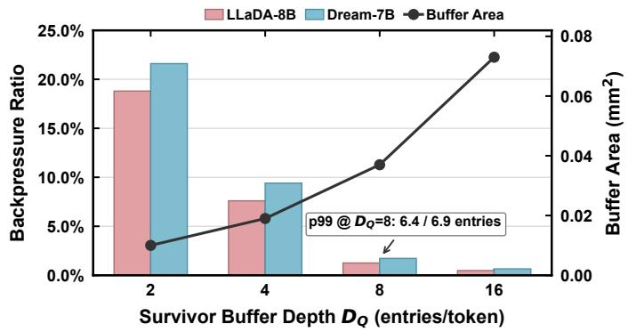  
Fig. 11. Survivor-buffer depth exploration.

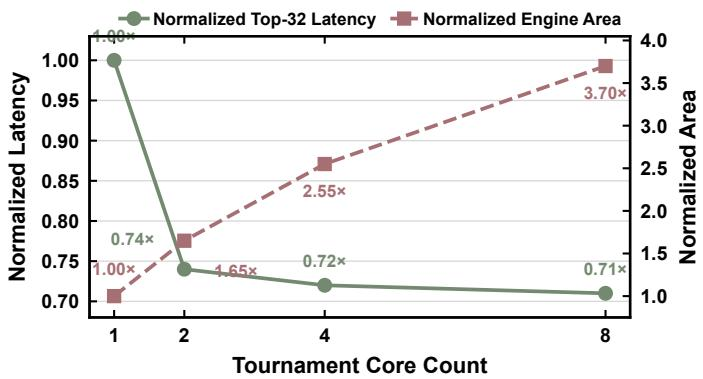  
Fig. 12. Tournament-core count exploration.

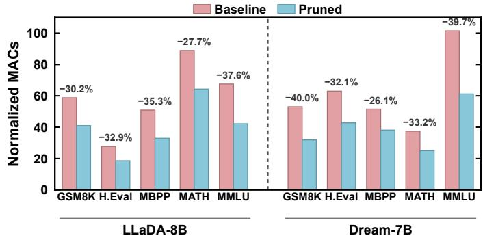  
Fig. 13. Token-pruning effectiveness across LLaDA-8B and Dream-7B: relative total Transformer MAC count before and after pruning.

2) FLDD Effectiveness: Fig. 14 compares the total number of denoising iterations with and without FLDD-guided local refinement. FLDD reduces the iteration count by 21.4– 34.3% across the five benchmarks, corresponding to average reductions of 30.1% for LLaDA-8B and 26.5% for Dream-7B. Fig. 14 also reports the local serial refinements introduced by FLDD, averaging only 14.3% of the baseline denoising iterations. FLDD thus uses a small number of token-level serial refinements to avoid a larger number of block-wide iterations. With support from the MSM dataflow, these refinements incur only an 8.54% per-iteration latency overhead, as evaluated in Section V-D.

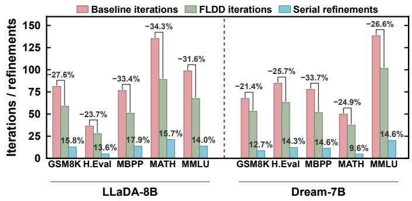  
Fig. 14. FLDD effectiveness across LLaDA-8B and Dream-7B.

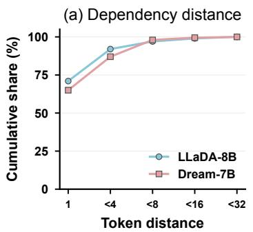

(b) FLDD capture  
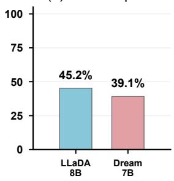  
Fig. 15. Dependency locality and FLDD capture: (a) cumulative distribution of absolute token distances among oracle dependency pairs; (b) fraction of the same oracle pairs captured by FLDD.

As shown in Fig. 15(a), adjacent tokens account for 71% and 65% of oracle dependency pairs on LLaDA-8B and Dream-7B, respectively, motivating refinement within the immediate neighborhood. Fig. 15(b) shows that FLDD captures 45.2% and 39.1% of these oracle pairs, respectively. FLDD is therefore intended as a low-overhead heuristic that captures useful local refinement opportunities without requiring exhaustive coverage of token dependencies.

3) Generation Quality: Table II reports the generation quality after applying each optimization. Across both models and all benchmarks, token pruning causes a maximum score reduction of 0.6 points, while FLDD changes the scores by at most 0.5 points and improves several workloads by up to 0.5 points. Adaptive quantization introduces a maximum reduction of 0.3 points. With all optimizations enabled, the average and maximum score reductions are only 0.41 and 0.7 points, respectively, demonstrating that DynaTE preserves generation quality.

## D. Hardware Evaluation

1) End-to-End Performance and Energy: Fig. 16 compares SA, Jetson AGX Orin, dLLM-OPU, and DynaTE on LLaDA-8B and Dream-7B under different input/output sequence lengths. All four configurations enable adaptive decoding with early stopping, allowing decoding to terminate before the maximum iteration budget rather than enforcing a fixed number of iterations. Jetson AGX Orin and SA execute the same baseline decoding algorithm without additional algorithmic optimizations, while DynaTE and dLLM-OPU apply their respective workload-specific optimizations. DynaTE achieves average speedups of 2.55×, 4.32×, and 1.96× over Jetson AGX Orin, SA, and dLLM-OPU, respectively, together with energy-efficiency improvements of 6.07×, 5.26×, and 3.82×.

TABLE II  
ABLATION STUDY ON GENERATION QUALITY. EACH ENTRY REPORTS LLADA-8B / DREAM-7B.
<table><tr><td>Method</td><td>GSM8K</td><td>H.Eval</td><td>MBPP</td><td>MATH</td><td>MMLU</td></tr><tr><td>Baseline</td><td>70.3 / 74.2</td><td>35.4 / 39.5</td><td>40.0 / 44.3</td><td>31.4 / 29.1</td><td>43.9 / 42.2</td></tr><tr><td>+ Pruning</td><td>69.9 / 74.1</td><td>35.2 / 39.3</td><td>39.7  / 44.5</td><td>30.8 /  28.8</td><td>43.6 / 41.6</td></tr><tr><td>+ FLDD</td><td>70.4 / 74.2</td><td>35.3 / 39.4</td><td>40.0 / 44.1</td><td>31.9 / 29.2</td><td>43.8 / 42.0</td></tr><tr><td>+ Quant.</td><td>70.5 / 73.9</td><td>35.2 / 39.2</td><td>39.7 / 44.1</td><td>31.3 / 28.9</td><td>43.8 / 42.3</td></tr><tr><td>+ All</td><td>69.8 / 73.9</td><td>34.9 / 39.4</td><td>39.3 / 43.7</td><td>30.8 / 28.9</td><td>43.7 / 41.8</td></tr></table>

TABLE III  
AREA AND POWER BREAKDOWN OF DYNATE.
<table><tr><td>Metric</td><td>Logic</td><td>SRAM</td><td>HBM</td><td>Overall</td></tr><tr><td>Area (mm²)</td><td>2.12</td><td>1.79</td><td>1</td><td>3.91</td></tr><tr><td>Power (W)</td><td>1.01</td><td>1.18</td><td>5.17</td><td>7.36</td></tr></table>

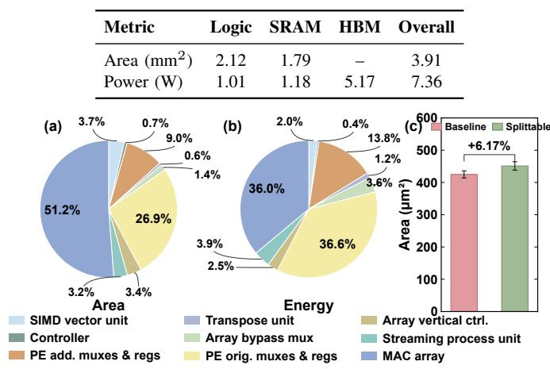  
Fig. 19. Hardware cost: (a)(b) logic-area and logic energy breakdown, and (c) area comparison between the baseline and splittable MAC units.

2) Reconfigurable-Array Effectiveness: The irregular operator shapes produced by token pruning can underutilize a fixed array. Fig. 17 reports the resulting hardware utilization. Across both models and all five workloads, DynaTE’s reconfigurable array maintains over 80% average PE utilization, substantially higher than the matched fixed-array baseline.

3) MSM Dataflow Effectiveness: Fig. 18 shows how MSM supports the serial refinement introduced by FLDD. Independent refinement turns QKV and FFN into low-utilization GEMV execution. MSM instead merges the serial token with the parallel batch for QKV and FFN, hiding much of the additional serial computation and reducing per-iteration latency by 39.4% compared with independently executed serial refinement without MSM. With MSM, local refinement requires only an 8.54% increase in per-iteration latency relative to parallel-only execution, enabling a reduction in the total number of denoising iterations at a modest additional cost per iteration.

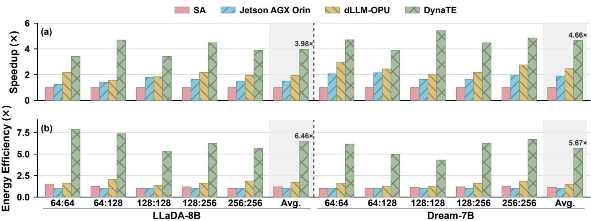  
Fig. 16. End-to-end comparison across LLaDA-8B and Dream-7B: (a) speedup and (b) energy-efficiency improvement.

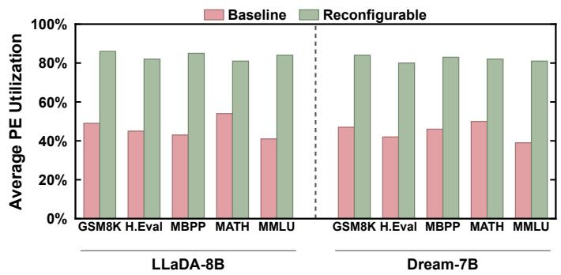  
Fig. 17. Average PE utilization of the fixed and reconfigurable arrays across LLaDA-8B and Dream-7B workloads.

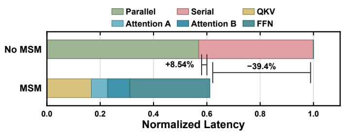  
Fig. 18. Normalized per-iteration latency breakdown with and without the MSM dataflow.

4) Area and Energy Breakdown: Table III and Fig. 19 report the area and energy breakdowns of DynaTE. The MAC array and the original PE datapath remain the dominant contributors. The additional routing and control logic required for reconfiguration forms a modest fraction of the overall design. The streaming process unit contributes only 3.2% of the logic area and 3.9% of the logic energy. Fig. 19(c) compares the proposed splittable MAC with the baseline MAC. Supporting multiple precision modes increases the MAC area by only 6.17%, while iteration-adaptive precision reduces the PE-array energy by 32.6% compared with uniform W8A8 execution.

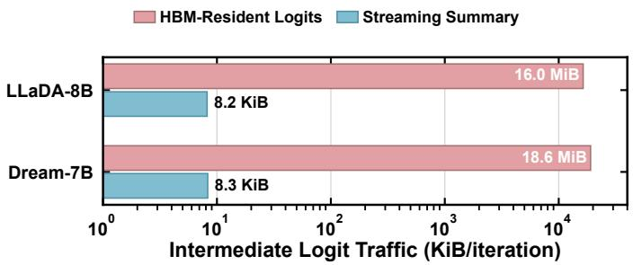

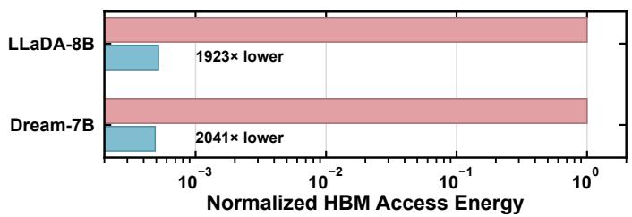  
Fig. 20. Intermediate-logit traffic and normalized HBM access energy for HBM-resident logits and streaming summaries.

5) Streaming Vocabulary Processing: Fig. 20 compares the conventional HBM-resident logit pipeline with DynaTE’s streaming engine. For LLaDA-8B, DynaTE reduces intermediate-logit traffic from 16.0 MiB to 8.2 KiB per iteration and lowers the corresponding HBM access energy by 1,923×. For Dream-7B, the traffic is reduced from 18.6 MiB to 8.3 KiB, yielding a 2,041× reduction in HBM access energy.

6) Multi-token Scheduler Effectiveness: A single token can issue only one tournament update every five cycles because of the pipeline dependency. Fig. 21 shows that single-token scheduling therefore fluctuates around 20% core utilization. Interleaving independent token contexts fills the pipeline bubbles and raises utilization toward 97.6% as the number of concurrent contexts increases. Prior-ID seeding further reduces the number of logits admitted to the tournament tree by 91.68%.

7) Overall Ablation: Fig. 22 shows the cumulative speedup from DynaTE’s main optimizations. Mixed precision improves the baseline to 1.26×, followed by 2.26× with token pruning, 3.07× with FLDD, and 4.32× with streaming vocabulary processing. We also evaluate the corresponding algorithmic optimizations on a fixed systolic array: the mixed-precision, token-pruning, and FLDD configurations achieve cumulative speedups of 1.07×, 1.51×, and 2.08×, respectively, over the same dense baseline. The lower gains in these configurations highlight the importance of coupling the algorithmic optimizations with the splittable MAC datapath, reconfigurable array, and MSM dataflow to translate execution changes into higher end-to-end performance.

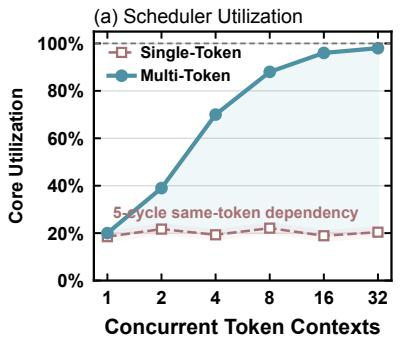

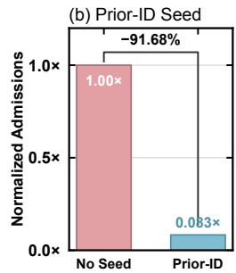

Fig. 21. Top-32 scheduling and filtering effectiveness: (a) tournament-core utilization under single-token and multi-token scheduling; (b) normalized logits admitted to the tournament tree without and with Prior-ID seeding.  
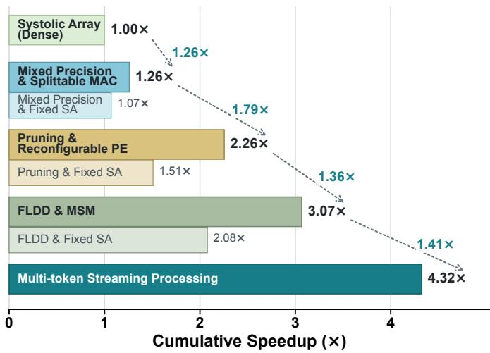  
Fig. 22. Incremental ablation of DynaTE.

8) Comparison with Prior dLLM Accelerators: Table IV reports the average results across LLaDA-8B and Dream-7B on the five evaluated benchmarks, with the generation length fixed at 256 tokens. DART, SA, and DynaTE use the same HBM configuration, while dLLM-OPU retains its native FPGA memory system and decoding pipeline. Compared to three accelerators, DynaTE improves speed and energy efficiency by 2.05–4.32× and 2.99–5.28×, respectively.

## VI. RELATED WORK

dLLM Accelerators. Only a few recent accelerators have begun to address the distinct sampling and computation-reuse patterns of dLLMs. DART [18] accelerates diffusion sampling with dedicated hardware for vocabulary-wide confidence computation and token selection. However, the logits produced by the LM head are first written to HBM and then read back in chunks for sampling. DynaTE instead processes logits directly as they emerge from the LM head, avoiding intermediate fulllogit HBM transfers, and interleaves multiple token streams to accommodate irregular output patterns. dLLM-OPU [19] reduces redundant Transformer computation through crossiteration reuse of Attention and FFN activations, exploiting temporal similarity across adjacent denoising steps. Such cross-iteration reuse requires retaining intermediate activations from previous denoising steps, introducing additional storage requirements. DynaTE focuses on refinement utility and local dependencies to adapt token participation and selectively perform local refinement within an iteration, with corresponding hardware support for the resulting variable workloads.

TABLE IV  
COMPARISON WITH PRIOR DLLM ACCELERATORS.
<table><tr><td>Metric</td><td>DART</td><td>dLLM-OPU</td><td>SA</td><td>DynaTE</td></tr><tr><td>Platform Technology Frequency Area  $( \mathrm { m m } ^ { 2 } )$ </td><td>ASIC 7nm 1GHz 3.20ª</td><td>U200 FPGA 16 nm 300 MHz</td><td>ASIC 28 nm 1GHz 3.34</td><td>ASIC 28 nm 1 GHz 3.91</td></tr><tr><td>Throughput (tokens/s) Area eff. (tokens/s/mm²) Energy eff. (tokens/J)</td><td>8.97 2.81 1.13</td><td>12.12 0.86</td><td>5.76 1.72 0.64</td><td>24.89 6.36 3.38</td></tr></table>

aArea normalized to 28 nm using the scaling model in [32].

dLLM Algorithmic Acceleration. SureLock [33] reduces MAC operations by locking unmasked tokens with low KL divergence between full-vocabulary posterior distributions across consecutive iterations and reusing their cached KV states thereafter. DynaTE instead targets masked tokens with low expected refinement utility and makes layer-wise skipping decisions based on received attention mass. Attention mass is accumulated directly from the attention stream, while candidate selection reuses existing distribution statistics. DynaTE further employs a dimension-reconfigurable PE array to accommodate varying active-token counts and maintain utilization after pruning.

DNN Hardware Optimizations. For array reconfiguration, Planaria [34] dynamically partitions accelerator resources to support spatial multi-tenant DNN execution, whereas DynaTE focuses on dimension reconfiguration driven by token pruning and local serial refinement in dLLM inference. ReDas [35] supports fine-grained reshaping through roundabout datapaths and four surrounding multi-mode buffers. DynaTE uses onesided SRAM bypass paths and inter-subarray vertical connections to implement simpler data routing for token-dimension reconfiguration. For precision reconfiguration, BitFusion [36] uses bit-level fusion to support variable-precision multiplication while retaining a fixed 32-bit partial-sum datapath. DynaTE reconfigures shared adder segments into one 24-bit accumulation path for W8A8 or two independent 20-bit paths for dual-W8A4, utilizing all constituent multipliers and adder segments in both modes. For Top-K selection, SpAtten [37] uses pivot-based partitioning and parallel zero elimination to accelerate selection within a single input vector. DynaTE instead interleaves vocabulary candidates from multiple token streams through shared tournament pipelines to accommodate uneven selection workloads across tokens.

## VII. CONCLUSION

We presented DynaTE, an iteration-aware accelerator that restructures dLLM inference around dynamic token execution. Token-wise pruning and FLDD-guided refinement reduce redundant computation and denoising iterations, while a reconfigurable PE array, splittable MAC units, and MSM dataflow efficiently execute the resulting dynamic workloads. A streaming multi-token vocabulary engine further eliminates full-logit HBM transfers and reuses vocabulary statistics for pruning, dependency detection, and sampling. Evaluations on two representative dLLMs and five benchmarks show that DynaTE achieves speedups of 2.05–2.78× and energyefficiency improvements of 2.99–3.93× over state-of-the-art dLLM accelerators, while delivering a 2.55× speedup and 6.07× higher energy efficiency than Jetson AGX Orin.

## ACKNOWLEDGMENT

This work was supported by the National Natural Science Foundation of China (Grant No. 62274142) and the Zhejiang Province’s Leading Talent Project in Science and Technology Innovation (2023R5204). AI tools (ChatGPT and Claude) were used only to polish the language and improve the readability of this paper.

## REFERENCES

[1] Y. Ge, W. Hua, K. Mei, J. Ji, J. Tan, S. Xu, Z. Li, and Y. Zhang, “OpenAGI: When LLM meets domain experts,” in Advances in Neural Information Processing Systems, vol. 36, 2023, pp. 5539–5568.

[2] F. Du, X.-J. Ma, J.-R. Yang, Y. Liu, C.-R. Luo, X.-B. Wang, H.-O. Jiang, and X. Jing, “A survey of LLM datasets: From autoregressive model to AI chatbot,” Journal of Computer Science and Technology, vol. 39, no. 3, pp. 542–566, 2024.

[3] H. Wu, Z. He, X. Zhang, X. Yao, S. Zheng, H. Zheng, and B. Yu, “ChatEDA: A large language model powered autonomous agent for EDA,” IEEE Transactions on Computer-Aided Design of Integrated Circuits and Systems, vol. 43, no. 10, pp. 3184–3197, 2024.

[4] Y. Zhao, D. Huang, C. Li, P. Jin, M. Song, Y. Xu, Z. Nan, M. Gao, T. Ma, L. Qi, Y. Pan, Z. Zhang, R. Zhang, X. Zhang, Z. Du, Q. Guo, and X. Hu, “CodeV: Empowering LLMs with HDL generation through multilevel summarization,” IEEE Transactions on Computer-Aided Design of Integrated Circuits and Systems, vol. 45, no. 4, pp. 1893–1906, 2026.

[5] M. Yan, S. Agarwal, and S. Venkataraman, “Decoding speculative decoding,” in Proceedings of the 2025 Conference of the Nations of the Americas Chapter of the Association for Computational Linguistics: Human Language Technologies (Volume 1: Long Papers), 2025, pp. 6460–6473.

[6] H. Chen, J. Zhang, Y. Du, S. Xiang, Z. Yue, N. Zhang, Y. Cai, and Z. Zhang, “Understanding the potential of FPGA-based spatial acceleration for large language model inference,” ACM Transactions on Reconfigurable Technology and Systems, vol. 18, no. 1, pp. 1–29, 2025.

[7] S. Nie, F. Zhu, Z. You, X. Zhang, J. Ou, J. Hu, J. Zhou, Y. Lin, J.-R. Wen, and C. Li, “Large language diffusion models,” in Advances in Neural Information Processing Systems, vol. 38, 2025, pp. 50 608–50 646.

[8] J. Ye, Z. Xie, L. Zheng, J. Gao, Z. Wu, X. Jiang, Z. Li, and L. Kong, “Dream 7B: Diffusion large language models,” arXiv preprint arXiv:2508.15487, 2025. [Online]. Available: https: //arxiv.org/abs/2508.15487

[9] S. Gong, S. Agarwal, Y. Zhang, J. Ye, L. Zheng, M. Li, C. An, P. Zhao, W. Bi, J. Han et al., “Scaling diffusion language models via adaptation from autoregressive models,” in International Conference on Learning Representations, vol. 2025, 2025, pp. 5046–5073.

[10] S. S. Sahoo, M. Arriola, Y. Schiff, A. Gokaslan, E. Marroquin, J. T. Chiu, A. Rush, and V. Kuleshov, “Simple and effective masked diffusion language models,” in Advances in Neural Information Processing Systems, vol. 37, 2024, pp. 130 136–130 184.

[11] J. Shi, K. Han, Z. Wang, A. Doucet, and M. K. Titsias, “Simplified and generalized masked diffusion for discrete data,” in Advances in Neural Information Processing Systems, vol. 37, 2024, pp. 103 131–103 167.

[12] C. Wu, H. Zhang, S. Xue, Z. Liu, S. Diao, L. Zhu, P. Luo, S. Han, and E. Xie, “Fast-dLLM: Training-free acceleration of diffusion LLM by enabling KV cache and parallel decoding,” in International Conference on Learning Representations, 2026. [Online]. Available: https://proceedings.iclr.cc/paper files/paper/2026/ hash/5d8d4e6061c3ba96c240b7fa1ae3471d-Abstract-Conference.html

[13] M. Huang, A. Shen, K. Li, H. Peng, B. Li, Y. Su, and H. Yu, “EdgeLLM: A highly efficient CPU-FPGA heterogeneous edge accelerator for large language models,” IEEE Transactions on Circuits and Systems I: Regular Papers, vol. 72, no. 7, pp. 3352–3365, 2025.

[14] J. Li, T. Li, R. Chen, G. Shen, D. Zhao, Q. Zhang, and Y. Zeng, “Hummingbird: A smaller and faster large language model accelerator on embedded FPGA,” in 2025 IEEE/ACM International Conference On Computer Aided Design (ICCAD). IEEE, 2025, pp. 1–9.

[15] Z. Guan, Z. Chen, D. Wu, A. Shen, Y. Guo, Y. Su, G. Chesi, M. Huang, N. Wong, and H. Yu, “APTQ+: Attention-FFN-aware post-training quantization for a layer-wise LLM accelerator on FPGA,” IEEE Transactions on Computer-Aided Design of Integrated Circuits and Systems, 2026, early access.

[16] J. Zheng, G. Chen, L. Huang, X. Lou, and W.-S. Zheng, “Terafly: A multinode FPGA-based accelerator design for efficient cooperative inference in LLMs,” IEEE Transactions on Computer-Aided Design of Integrated Circuits and Systems, vol. 45, no. 5, pp. 2446–2459, 2026.

[17] D. Kim, J. Hwang, C. Oh, and J. Park, “MixDiT: Accelerating image diffusion transformer inference with mixed-precision MX quantization,” IEEE Computer Architecture Letters, vol. 24, no. 1, pp. 141–144, 2025.

[18] B. Lou, H. Wu, K. Lau, G. MacDonald, J. Nie, Y. Lai, C. Xiao, X. Guo, J. Cheng, R. Antonova, R. Mullins, and A. Zhao, “NPU design for diffusion language model inference,” arXiv preprint arXiv:2601.20706, 2026. [Online]. Available: https://arxiv.org/abs/2601.20706

[19] Y. Wei, S. Lu, J. Qian, L. He, D. Qin, X. Shi, C. Wu, and L. Zhang, “dLLM-OPU: An FPGA overlay processor for accelerated diffusion large language models,” in 2026 31st Asia and South Pacific Design Automation Conference (ASP-DAC). IEEE, 2026, pp. 1476–1482.

[20] Z. Zheng, Q. Cheng, T. Wang, W. Lou, L. Gong, X. Chen, C. Wang, and X. Zhou, “LORA: A latency-oriented recurrent architecture for large language model on multi-FPGA platform with communication optimization,” IEEE Transactions on Computer-Aided Design ofIntegrated Circuits and Systems, vol. 45, no. 7, pp. 3319–3332, 2026.

[21] S. Ma, C. Fang, H. Shao, and Z. Wang, “APT-LLM: Exploiting arbitraryprecision tensor core computing for LLM acceleration,” IEEE Transactions on Computer-Aided Design of Integrated Circuits and Systems, vol. 45, no. 4, pp. 1935–1948, 2026.

[22] S. Li, F. Ponzina, and T. Rosing, “AA-DiT: An algorithm-architecture co-design for diffusion transformer acceleration,” IEEE Transactions on Computer-Aided Design of Integrated Circuits and Systems, 2026, early access.

[23] H. Genc, S. Kim, A. Amid, A. Haj-Ali, V. Iyer, P. Prakash, J. Zhao, D. Grubb, H. Liew, H. Mao et al., “Gemmini: Enabling systematic deeplearning architecture evaluation via full-stack integration,” in 2021 58th ACM/IEEE Design Automation Conference (DAC). IEEE, 2021, pp. 769–774.

[24] X. Yi, R. Antonio, J. Dumoulin, J. Sun, J. Van Delm, G. Pereira Paim, and M. Verhelst, “OpenGeMM: A highly-efficient GeMM accelerator generator with lightweight RISC-V control and tight memory coupling,” in Proceedings of the 30th Asia and South Pacific Design Automation Conference, 2025, pp. 1055–1061.

[25] R. Balasubramonian, A. B. Kahng, N. Muralimanohar, A. Shafiee, and V. Srinivas, “CACTI 7: New tools for interconnect exploration in innovative off-chip memories,” ACM Transactions on Architecture and Code Optimization, vol. 14, no. 2, pp. 1–25, 2017, art. no. 14.

[26] Y. Kim, W. Yang, and O. Mutlu, “Ramulator: A fast and extensible DRAM simulator,” IEEE Computer Architecture Letters, vol. 15, no. 1, pp. 45–49, 2016.

[27] K. Cobbe, V. Kosaraju, M. Bavarian, M. Chen, H. Jun, L. Kaiser, M. Plappert, J. Tworek, J. Hilton, R. Nakano et al., “Training verifiers

to solve math word problems,” arXiv preprint arXiv:2110.14168, 2021. [Online]. Available: https://arxiv.org/abs/2110.14168

[28] D. Hendrycks, C. Burns, S. Kadavath, A. Arora, S. Basart, E. Tang, D. Song, and J. Steinhardt, “Measuring mathematical problem solving with the MATH dataset,” in Proceedings of the Neural Information Processing Systems Track on Datasets and Benchmarks, vol. 1, 2021. [Online]. Available: https://datasets-benchmarks-proceedings.neurips.cc/paper files/paper/ 2021/hash/be83ab3ecd0db773eb2dc1b0a17836a1-Abstract-round2.html

[29] M. Chen, J. Tworek, H. Jun, Q. Yuan, H. P. d. O. Pinto, J. Kaplan, H. Edwards, Y. Burda, N. Joseph, G. Brockman et al., “Evaluating large language models trained on code,” arXiv preprint arXiv:2107.03374, 2021. [Online]. Available: https://arxiv.org/abs/2107.03374

[30] J. Austin, A. Odena, M. Nye, M. Bosma, H. Michalewski, D. Dohan, E. Jiang, C. Cai, M. Terry, Q. Le et al., “Program synthesis with large language models,” arXiv preprint arXiv:2108.07732, 2021. [Online]. Available: https://arxiv.org/abs/2108.07732

[31] D. Hendrycks, C. Burns, S. Basart, A. Zou, M. Mazeika, D. Song, and J. Steinhardt, “Measuring massive multitask language understanding,” in International Conference on Learning Representations, 2021. [Online]. Available: https://openreview.net/forum?id=d7KBjmI3GmQ

[32] A. Stillmaker and B. Baas, “Scaling equations for the accurate prediction of CMOS device performance from 180 nm to 7 nm,” Integration, vol. 58, pp. 74–81, 2017.

[33] D. Oba, D. Bollegala, M. Kaneko, and N. Okazaki, “Stopping computation for converged tokens in masked diffusion-LM decoding,” in International Conference on Learning Representations, 2026. [Online]. Available: https://proceedings.iclr.cc/paper files/paper/2026/ hash/e82cfb0ee6ce329759d0d3c90fbbccc4-Abstract-Conference.html

[34] S. Ghodrati, B. H. Ahn, J. K. Kim, S. Kinzer, B. R. Yatham, N. Alla, H. Sharma, M. Alian, E. Ebrahimi, N. S. Kim, C. Young, and H. Esmaeilzadeh, “Planaria: Dynamic architecture fission for spatial multitenant acceleration of deep neural networks,” in 2020 53rd Annual IEEE/ACM International Symposium on Microarchitecture (MICRO), 2020, pp. 681–697.

[35] M. Han, L. Wang, L. Xiao, T. Cai, Z. Wang, X. Xu, and C. Zhang, “ReDas: A lightweight architecture for supporting fine-grained reshaping and multiple dataflows on systolic array,” IEEE Transactions on Computers, vol. 73, no. 8, pp. 1997–2011, 2024.

[36] H. Sharma, J. Park, N. Suda, L. Lai, B. Chau, J. K. Kim, V. Chandra, and H. Esmaeilzadeh, “Bit Fusion: Bit-level dynamically composable architecture for accelerating deep neural network,” in 2018 ACM/IEEE 45th Annual International Symposium on Computer Architecture (ISCA), 2018, pp. 764–775.

[37] H. Wang, Z. Zhang, and S. Han, “SpAtten: Efficient sparse attention architecture with cascade token and head pruning,” in 2021 IEEE International Symposium on High-Performance Computer Architecture (HPCA), 2021, pp. 97–110.