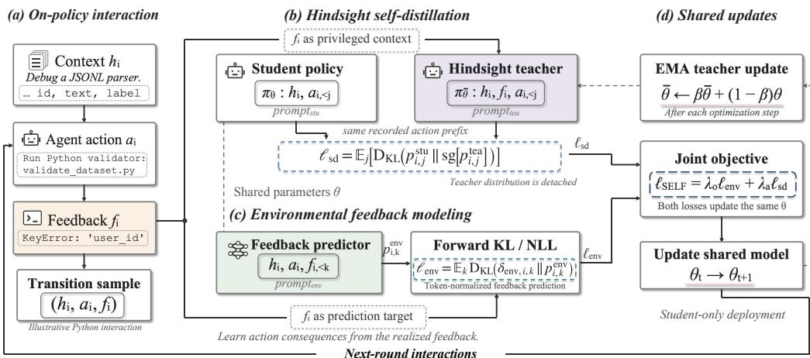
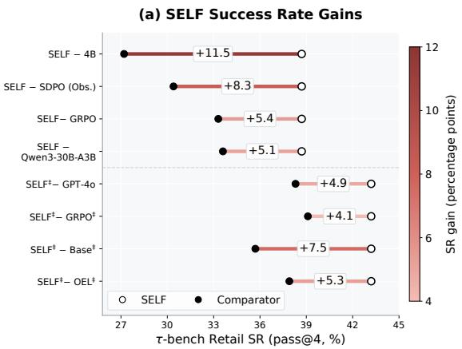
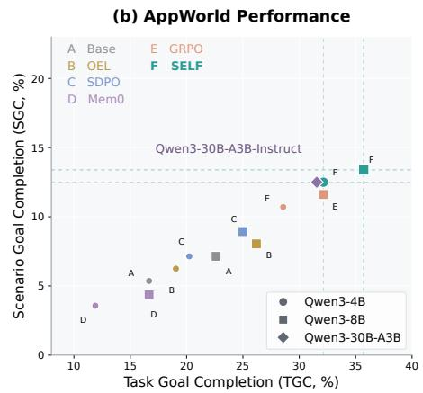
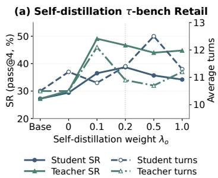
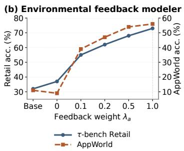
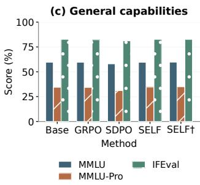
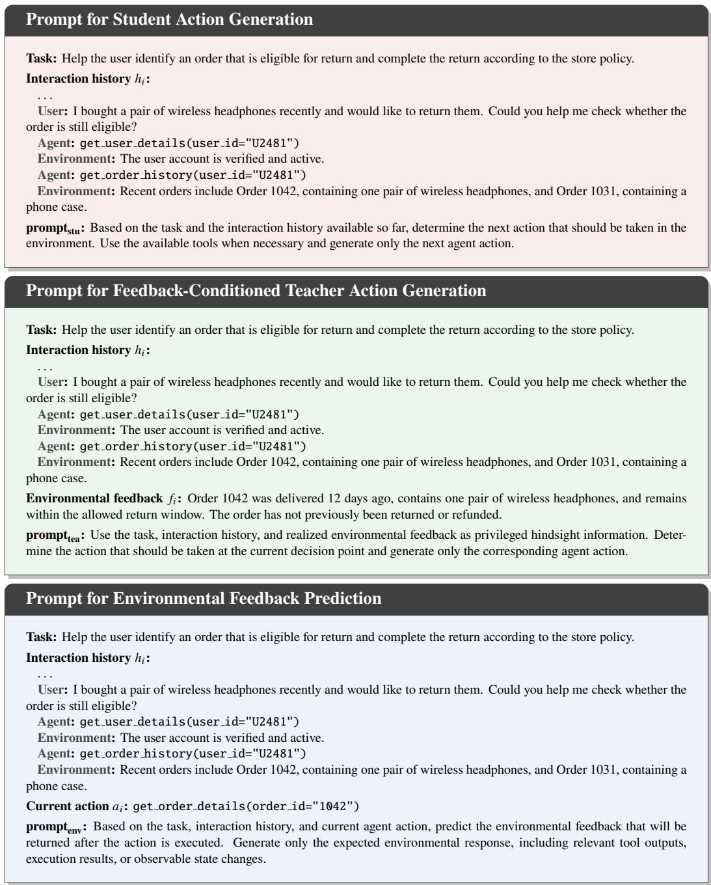

# ENVIRONMENTAL FEEDBACK MODELING MATTERS:RETHINKING FEEDBACK TREATMENT IN AGENTICHINDSIGHT SELF-DISTILLATION

Hangxi Guo1,∗, Fengyuan Liu1,∗, Yue Wang2,3, Yuhua Qi1, Haoyi Xiong4, Fei Sun5, Mengnan Du1,†

1The Chinese University of Hong Kong, Shenzhen 2Shanghai AI Laboratory

3University of Science and Technology of China 4Independent

5Institute of Computing Technology, CAS

keepstudying931@gmail.com, mengnandu@cuhk.edu.cn

∗Equal contribution, †Corresponding author

## ABSTRACT

Reinforcement learning is commonly used to train language agents in interactive environments, but cannot be directly applied when rewards are unavailable. Recent methods use environmental feedback as privileged context for hindsight self-distillation, but our analysis suggests that simply conditioning the teacher on feedback is insufficient, motivating us to rethink how environmental feedback is used in agentic self-distillation. Given that environmental feedback contains rich supervision for modeling how the environment responds to agent actions, we introduce agentic SElf-distilLation with environmental Feedback modeling (SELF), a framework that jointly optimizes environmental feedback modeling and hindsight self-distillation. SELF learns to predict environmental responses while distilling guidance from a feedback-conditioned self-teacher into the policy. Our analysis reveals a mutually reinforcing mechanism: environmental feedback modeling strengthens hindsight supervision and policy learning, while self-distillation enhances the model’s ability to model environmental feedback. With Qwen3-8B, SELF outperforms SDPO and GRPO by 6.4 and 4.1 percentage points in τ-bench success rate, and by 10.71 and 3.57 percentage points in AppWorld task goal completion, respectively. These results show that SELF uses environmental feedback more effectively within agentic self-distillation, improving agent capabilities.

## 1 INTRODUCTION

In recent years, training language agents to solve complex tasks in interactive environments involving tool use and code execution has become increasingly important (Yao et al., 2023; Trivedi et al., 2024; Choudhury & Sodhi, 2025). A common training approach is Reinforcement Learning with Verifiable Rewards (RLVR) (Lambert et al., 2025), where algorithms such as Group Relative Policy Optimization (GRPO) (Shao et al., 2024) use trajectory-level rewards to optimize the policy. In some settings, however, reliable rewards are unavailable (Tian et al., 2026; Liu et al., 2026a), and environmental feedback becomes the primary source of external information for agent training. This feedback arises naturally from interactions and includes tool outputs, code execution results, and environmental state changes caused by the agent’s actions. Since such feedback typically describes action consequences rather than providing direct supervision for policy learning, using it effectively in agent training remains a challenge.

Recent methods tackle this challenge through hindsight self-distillation. SDPO (Hubotter et al.,¨ 2026) conditions a self-teacher on environmental feedback, while OEL (Ye et al., 2026) further extracts transferable knowledge from interaction experience. Our analysis shows that, despite containing sufficient information for policy improvement, such feedback yields only modest gains when used in these ways, suggesting that the key limitation lies in how it is exploited during training. Although environmental feedback does not directly supervise action generation, it provides direct targets for learning how the environment responds to agent actions. We therefore ask: Can learning to predict environmentalfeedback enable more effective use ofit in agentic self-distillation?

Our analysis reveals a mutually reinforcing relationship: environmental feedback modeling im proves hindsight self-distillation, while self-distillation in turn strengthens environmental feedback prediction. Building on this finding, we introduce agentic SElf-distilLation with environmental Feedback (SELF), a framework that jointly optimizes environmental feedback modeling and hindsight self-distillation. For each interaction transition, SELF uses the realized feedback in two complementary ways: as a prediction target for learning how the environment responds to the agent’s action, and as privileged context for a self-teacher whose action distribution is distilled into the student policy. By jointly learning from these two signals within a shared model, SELF enables more effective use of environmental feedback for policy improvement.

We evaluate SELF on τ-bench Retail (Yao et al., 2025) for multi-turn customer-service interactions with domain-specific tools, and AppWorld (Trivedi et al., 2024) for code-based task completion across applications. Across Qwen3-4B-Instruct and Qwen3-8B (non-thinking) (Yang et al., 2025), SELF outperforms feedback-learning baselines and reward-trained GRPO (Shao et al., 2024) in task success and goal completion. With Qwen3-8B, SELF surpasses SDPO (Hubotter et al., 2026) and¨ GRPO by 6.4 and 4.1 percentage points in τ -bench success rate, and by 10.71 and 3.57 percentage points in AppWorld task goal completion, respectively, which demonstrates SELF’s effectiveness in turning environmental feedback into useful supervision for policy improvement. Further analyses show that SELF also retains strong generalization capabilities beyond the training environments.

Our key contributions can be summarized as follows:

• We identify a mutually reinforcing mechanism: environmental feedback modeling improves hindsight self-distillation, while self-distillation strengthens environmental feedback prediction.

• We propose SELF, an agent training framework that learns from environmental feedback by jointly optimizing environmental feedback modeling and hindsight self-distillation.

• We empirically show that SELF improves performance on τ -bench Retail and AppWorld, outperforming both existing self-distillation approaches and reward-trained GRPO, which demonstrates its effectiveness in enabling agentic self-distillation to make better use of environmental feedback.

## 2 RELATED WORK

Agentic Self-Distillation. Agentic self-distillation provides dense policy supervision without requiring a separate stronger teacher. OPSD (Zhao et al., 2026) constructs student and teacher policies from the same model, conditioning the teacher on privileged reference information. SDPO (Hubotter¨ et al., 2026) instead conditions the self-teacher on textual feedback and distills its feedback-informed predictions into the policy. SDFT (Shenfeld et al., 2026) uses demonstration-conditioned selfdistillation to acquire new knowledge and skills while mitigating forgetting. RLSD (Yang et al., 2026a) further combines self-distillation with RLVR, using privileged teachers for token-level credit while retaining verifier rewards to determine the policy-update direction.

Learning from Environmental Feedback. Environmental feedback contains rich information about the realized consequences of agent actions, and recent methods exploit this information in different forms. OCSD (Yang et al., 2026b) contrasts replay contexts with and without future observations to calibrate policy updates, while HERO (Liu et al., 2026b) converts subsequent observations into turn-level hindsight diagnoses. OEL (Ye et al., 2026) extracts transferable experiential knowledge from interaction trajectories before distilling it into the policy. Kleine Buening et al. (Kleine Buening et al., 2026) use raw user follow-up messages as hindsight information for self-distillation. AHEAD (Jin et al., 2026) conditions the teacher on environment feedback and supplements critical error steps with generated corrective hints, whereas OpenClaw-RL (Wang et al., 2026) converts next-state signals into process rewards or hindsight guidance for online agent learning. These approaches use realized feedback to construct or refine supervision for action generation.

Environmental Feedback Modeling for Policy Learning. A complementary line of work directly learns the predictive structure contained in interaction feedback. ECHO (Shrivastava et al., 2026) and PaW (Lu et al., 2026) incorporate environment prediction into policy optimization, while AAWM (Cai et al., 2026) studies decision-oriented modeling targets rather than directly reconstructing future observations. Early Experience (Zhang et al., 2026) uses next states produced by agent actions as supervision for implicit world modeling and self-reflection. Most closely related, RLTF (Song et al., 2026) studies both feedback-conditioned self-distillation and feedback modeling, where textual critiques are predicted as an auxiliary objective. In contrast, SELF models environmental responses directly from interactive trajectories and uses the same realized feedback both as a prediction target and as privileged context for hindsight self-distillation. Our analysis further shows that these objectives mutually reinforce each other.

  
Figure 1: Overview of SELF. The current policy interacts with the environment to collect transitions $\left( h _ { i } , a _ { i } , f _ { i } \right)$ . Each transition is used for two complementary objectives: hindsight self-distillation, where a feedback-conditioned EMA teacher supervises the student policy, and environmental feedback modeling, where the model predicts the realized feedback from the interaction history and action. The two objectives are jointly optimized to obtain the next-round policy.

## 3 METHODOLOGY

We present SELF, a framework that improves agentic self-distillation by explicitly modeling environmental feedback. We first formalize agent–environment interaction and the problem of learning from environmental feedback. We then describe on-policy hindsight self-distillation, which uses realized feedback as privileged information to construct policy supervision. Finally, we introduce the environmental feedback modeling objective and show how it is jointly optimized with hindsight self-distillation within the framework.

## 3.1 PROBLEM FORMULATION

Agent–Environment Interaction. We consider an agent that interacts with an environment through actions and observable feedback, including tool outputs, code execution results, and state changes. Let $q$ denote a task instruction, $o _ { 0 }$ the initial observation, and $f _ { i }$ the feedback returned after action $a _ { i }$ . Before taking $a _ { i }$ , the agent has access to the interaction history

$$
h _ { i } = ( q , o _ { 0 } , a _ { 1 } , f _ { 1 } , \ldots , a _ { i - 1 } , f _ { i - 1 } ) .\tag{1}
$$

At training round t, the current policy and environment generate

$$
\begin{array} { r } { a _ { i } \sim \pi _ { \theta _ { t } } ( \cdot \mid h _ { i } , \mathrm { p r o m p t _ { s t u } } ) , \ f _ { i } \sim \mathcal { P } _ { \mathrm { e n v } } ( \cdot \mid h _ { i } , a _ { i } ) , } \end{array}\tag{2}
$$

where $\pi _ { \theta _ { t } }$ is the policy with parameters $\theta _ { t } , \mathrm { p r o m p t } _ { \mathrm { s t u } }$ specifies the action-generation interface, and $\mathcal { P } _ { \mathrm { e n v } }$ is the conditional distribution of environmental feedback. Each transition $\left( h _ { i } , a _ { i } , f _ { i } \right)$ associates an action with its observed consequence, without requiring access to latent environment states.

A trajectory is $\tau = ( q , o _ { 0 } , a _ { 1 } , f _ { 1 } , \dots , a _ { n _ { \tau } } , f _ { n _ { \tau } } )$ , where $n _ { \tau }$ is the number of interaction turns, and $\mathcal { T } _ { t }$ denotes the trajectories collected at round t. Training uses only the resulting actions and environmental feedback, without task rewards, outcome labels, or external teachers. For feedback modeling, the observed feedback $f _ { i }$ is represented by the point-mass target $\delta _ { \mathrm { e n v } , i } ( f ) = { \bf 1 } \{ f = f _ { i } \}$

## 3.2 HINDSIGHT SELF-DISTILLATION

Hindsight self-distillation provides a general approach for converting environmental feedback into supervision for policy learning. We consider its on-policy form, where trajectories are collected by the current policy and distillation is performed on the action prefixes encountered along these trajectories (Agarwal et al., 2024). For each transition $\left( h _ { i } , a _ { i } , f _ { i } \right)$ , the student predicts the action using only the information available before the environmental feedback is observed, while a selfteacher additionally conditions on the realized feedback $f _ { i }$ as privileged hindsight information. The student and teacher use distinct prompting interfaces, $\mathrm { p r o m p t } _ { \mathrm { s t u } }$ and $\mathrm { \ p r o m p t { } _ { \mathrm { t e a } } , }$ respectively.

For an action $a _ { i }$ containing $L _ { i }$ tokens, we define the student and teacher next-token distributions as

$$
p _ { i , j } ^ { \mathrm { s t u } } ( \cdot ) = \pi _ { \theta } \big ( \cdot \mid h _ { i } , a _ { i , < j } , \mathrm { p r o m p t } _ { \mathrm { s t u } } \big ) , \ p _ { i , j } ^ { \mathrm { t e a } } ( \cdot ) = \pi _ { \bar { \theta } } \big ( \cdot \mid h _ { i } , f _ { i } , a _ { i , < j } , \mathrm { p r o m p t } _ { \mathrm { t e a } } \big ) ,\tag{3}
$$

where both distributions are evaluated on the same on-policy action prefix $a _ { i , < j }$ , but only the teacher has access to the realized environmental feedback. The teacher parameters ¯θ are maintained as an exponential moving average (EMA) (Tarvainen & Valpola, 2017) of the student parameters, $\bar { \theta } $ $\beta { \bar { \theta } } + ( 1 - \beta ) \theta$ , where $\beta$ is the EMA decay coefficient.

The feedback-conditioned teacher is distilled into the student through the reverse-KL objective (Gu et al., 2024)

$$
\ell _ { \mathrm { s d } } ( h _ { i } , a _ { i } , f _ { i } ; \boldsymbol { \theta } , \boldsymbol { \bar { \theta } } ) = \mathbb { E } _ { \boldsymbol { j } \sim \mathrm { U n i f } ( [ \boldsymbol { L } _ { i } ] ) } \left[ D _ { \mathrm { K L } } \big ( p _ { i , j } ^ { \mathrm { s t u } } \big | \big | \mathrm { s g } [ p _ { i , j } ^ { \mathrm { t e a } } ] \big ) \right] ,\tag{4}
$$

where $[ L _ { i } ] = \{ 1 , \dots , L _ { i } \}$ and sg stops gradients through the teacher. The collected action therefore determines the contexts at which the two distributions are compared, rather than serving as a groundtruth action target. This formulation allows information available only after an action is executed to supervise a policy that must act without access to that information at inference time (Choudhury & Sodhi, 2025). In our analysis, however, hindsight self-distillation in this form yields only modest policy improvements, suggesting that conditioning the teacher on feedback alone does not fully exploit the information contained in environmental feedback.

Why Environmental Feedback Modeling? Hindsight self-distillation uses environmental feedback as privileged context for constructing policy supervision, but does not explicitly learn the information contained in the feedback itself. Our analysis suggests that this limits how effectively the self-teacher can exploit environmental feedback.

Environmental feedback, however, provides rich supervision about how the environment responds to an agent’s actions. Each interaction therefore naturally provides a supervised action–feedback relation,

$$
( h _ { i } , a _ { i } ) \longrightarrow f _ { i } .
$$

This motivates explicitly modeling environmental feedback alongside hindsight selfdistillation, so that the model learns how the environment responds while using the same feedback to improve its policy.

## 3.3 ENVIRONMENTAL FEEDBACK MODELING

Motivated by the observation in the previous section, we treat each transition $\left( h _ { i } , a _ { i } , f _ { i } \right)$ not only as privileged context for hindsight self-distillation, but also as direct supervision for modeling how the environment responds to an action. We therefore jointly train environmental feedback modeling and agentic self-distillation.

Given $\left( h _ { i } , a _ { i } , f _ { i } \right)$ , we approximate the conditional feedback distribution $\mathcal { P } _ { \mathrm { e n v } } ( \cdot ~ \vert ~ h _ { i } , a _ { i } )$ with $p _ { \mathrm { e n v , } \theta } ( \cdot \mid h _ { i } , a _ { i } , \mathrm { p r o m p t _ { e n v } ) }$ , where $\mathrm { \ p r o m p t { _ \mathrm { e n v } } }$ is a dedicated prompt for environmental feedback prediction. The conditioning context contains the complete interaction history up to and including $a _ { i }$ , while the realized feedback $f _ { i }$ serves as the prediction target. This prediction interface shares parameters θ with the student policy, rather than introducing a separate environment model.

For a feedback sequence $f _ { i }$ containing $M _ { i }$ tokens, let $\delta _ { \mathrm { e n v } , i , k }$ denote the point-mass target on the observed token $f _ { i , k }$ . We define the autoregressive next-token distribution as

$$
\begin{array} { r } { p _ { i , k } ^ { \mathrm { e n v } } ( \cdot ) = p _ { \mathrm { e n v } , \theta } ( \cdot \mid h _ { i } , a _ { i } , f _ { i , < k } , \mathrm { p r o m p t } _ { \mathrm { e n v } } ) , } \end{array}\tag{5}
$$

Table 1: Comparison of learning paradigms under the configurations considered in this work. Supervision describes the granularity of the learning signal. Teacher denotes the source of teacher supervision. Env. Modeling indicates whether an explicit objective predicts environmental responses from interaction histories and actions. Dashes indicate inapplicable attributes.
<table><tr><td>Method</td><td>Sampling</td><td>Supervision</td><td>Feedback Source</td><td>Teacher</td><td>Env. Modeling</td></tr><tr><td>SFT</td><td>Off-policy</td><td>Dense</td><td>Teacher</td><td>External</td><td>No</td></tr><tr><td>GRPO</td><td>On-policy</td><td>Sparse</td><td>Verifier</td><td>None</td><td>No</td></tr><tr><td>Mem0</td><td></td><td></td><td>Environment</td><td>None</td><td>No</td></tr><tr><td>SDPO</td><td>On-policy</td><td>Dense</td><td>Environment</td><td>Self</td><td>No</td></tr><tr><td>SELF (Ours) On-policy</td><td></td><td>Dense</td><td>Environment</td><td>Self</td><td>Yes</td></tr></table>

where $f _ { i , < k }$ denotes the observed feedback prefix. The environmental feedback modeling objective is

$$
\ell _ { \mathrm { e n v } } \bigl ( h _ { i } , a _ { i } , f _ { i } ; \theta \bigr ) = \mathbb E _ { k \sim \mathrm { U n i f } ( [ M _ { i } ] ) } \left[ D _ { \mathrm { K L } } \bigl ( \delta _ { \mathrm { e n v } , i , k } \big | \big | p _ { i , k } ^ { \mathrm { e n v } } \bigr ) \right] .\tag{6}
$$

Because each target is a point mass, this forward-KL objective is equivalent to the token-normalized negative log-likelihood of the realized feedback. It therefore trains the shared model to capture observable action–feedback relationships directly from interaction, without requiring latent environment states or treating the sampled action as a correct action target.

## 3.4 OVERALL SELF TRAINING OBJECTIVE

The proposed SELF framework jointly optimizes environmental feedback modeling and hindsight self-distillation within a shared model. The same realized feedback $f _ { i }$ serves two complementary roles: it provides a prediction target for learning how the environment responds to an action, while also acting as privileged hindsight information for constructing policy supervision. By optimizing both objectives through the same underlying model, SELF jointly improves environmental feedback modeling and agent action generation. For each transition $\left( h _ { i } , a _ { i } , f _ { i } \right)$ , the SELF objective is

$$
\begin{array} { r } { \ell _ { \mathrm { S E L F } } = \lambda _ { o } \ell _ { \mathrm { e n v } } + \lambda _ { a } \ell _ { \mathrm { s d } } , } \end{array}\tag{7}
$$

where $\lambda _ { o }$ and $\lambda _ { a }$ control the contributions of environmental feedback modeling and hindsight selfdistillation, respectively.

At training round $t ,$ the current policy collects a set of trajectories $\mathcal { T } _ { t } .$ . Averaging the tokennormalized objectives over trajectories and interaction turns yields

$$
\begin{array} { r l } & { \mathcal { L } _ { \mathrm { S E L F } , t } ( \theta ) = \mathbb { E } _ { \tau \sim \mathrm { U n i f } ( \mathcal { T } _ { t } ) } \mathbb { E } _ { i \sim \mathrm { U n i f } ( [ n _ { \tau } ] ) } \left[ \lambda _ { o } \mathbb { E } _ { k \sim \mathrm { U n i f } ( [ M _ { i } ] ) } D _ { \mathrm { K L } } \left( \delta _ { \mathrm { e n v } , i , k } \big \| p _ { i , k } ^ { \mathrm { e n v } } \right) \right. } \\ & { \qquad \left. + \lambda _ { a } \mathbb { E } _ { j \sim \mathrm { U n i f } ( [ L _ { i } ] ) } D _ { \mathrm { K L } } \left( p _ { i , j } ^ { \mathrm { s t u } } \big \| \operatorname { s g } [ p _ { i , j } ^ { \mathrm { t e a } } ] \right) \right] , } \end{array}\tag{8}
$$

where $n _ { \tau }$ denotes the number of interaction turns in trajectory $\tau .$ . Optimizing $\mathcal { L } _ { \mathrm { S E L F } , t }$ updates the shared parameters from $\theta _ { t }$ to $\theta _ { t + 1 }$ . Environmental feedback modeling therefore updates the same model from which subsequent hindsight supervision is derived, while self-distillation directly improves the deployable policy and simultaneously updates the representation used for feedback prediction. The updated policy then collects new interactions for the next training round. At deployment, only the student policy $\pi _ { \theta } ( \cdot \mid h _ { i } , \mathrm { p r o m p t _ { s t u } } )$ is required. The complete training procedure is summarized in Algorithm 1 in the appendix, and illustrative examples of $\mathrm { p r o m p t _ { s t u } , p r o m p t _ { t e a } , }$ and $\mathrm { \ p r o m p t { _ \mathrm { e n v } } }$ are provided in the appendix.

## 4 EXPERIMENTS

In this section, we evaluate SELF on τ-bench Retail and AppWorld and address the following three research questions (RQs). RQ1: Can SELF improve interactive agent performance using environmental feedback without verifiable rewards? RQ2: Do environmental feedback modeling and

Table 2: Performance on τ-bench and AppWorld. SR denotes the pass@4 success rate on τ- bench, and Turns denotes the average number of interaction turns. TGC and SGC denote task goal completion and scenario goal completion on AppWorld, respectively. Observation and Full denote baseline feedback settings, while Reward denotes reward-based training. SELF learns from agent-generated actions and environmental observations, and its rows are shaded light blue. Higher SR, TGC, and SGC and lower Turns are better. Within each backbone, excluding external model baselines, the best means are bold with pale gold shading, and the second-best means are underlined with pale pink shading. Missing results and inapplicable settings are denoted by –.
<table><tr><td rowspan="2">Method</td><td rowspan="2">Setting</td><td colspan="2">τ-bench</td><td colspan="2">AppWorld</td></tr><tr><td>SR↑</td><td>Turns ↓</td><td>TGC ↑</td><td>SGC ↑</td></tr><tr><td></td><td>External Model Baselines</td><td></td><td></td><td></td><td></td></tr><tr><td>Qwen3-30B-A3B-Instruct</td><td></td><td>33.6</td><td>11.9</td><td>31.55</td><td>12.50</td></tr><tr><td colspan="6">Qwen3-4B-Instruct</td></tr><tr><td>Base</td><td></td><td> $2 7 . 2 \pm 1 . 4$ </td><td>_  $\underline { { 1 0 . 5 } } \pm 0 . 3$  1</td><td> $1 6 . 6 7 \pm 1 . 1 9$ </td><td> $5 . 3 6 \pm 0 . 6 2$ </td></tr><tr><td>OEL</td><td>Observation</td><td> $3 0 . 6 \pm 1 . 5$ </td><td> $1 0 . 9 \pm 0 . 4$ </td><td> $1 9 . 0 5 \pm 1 . 4 3$ </td><td> $6 . 2 5 \pm 0 . 7 4$ </td></tr><tr><td>SDPO</td><td>Observation</td><td> $3 0 . 4 \pm { 1 . 7 }$ </td><td> $1 1 . 5 \pm 0 . 5$ </td><td> $2 0 . 2 4 \pm 1 . 5 6$ </td><td> $7 . 1 4 \pm 0 . 8 3$ </td></tr><tr><td>Mem0</td><td>Observation</td><td> $1 9 . 2 \pm { 1 . 8 }$ </td><td> $1 2 . 6 \pm 0 . 6$ </td><td> $1 1 . 9 0 \pm 1 . 3 1$ </td><td> $3 . 5 7 \pm 0 . 5 8$ </td></tr><tr><td>SDPO</td><td>Full</td><td> $2 2 . 5 \pm 1 . 6$ </td><td> $1 2 . 4 \pm 0 . 5$ </td><td> $1 4 . 2 9 \pm 1 . 4 7$ </td><td> $4 . 4 6 \pm 0 . 6 9$ </td></tr><tr><td>Mem0</td><td>Full</td><td> $2 7 . 4 \pm 1 . 5$ </td><td> $1 1 . 7 \pm 0 . 4$ </td><td> $1 7 . 8 6 \pm 1 . 3 8$ </td><td> $5 . 9 5 \pm 0 . 7 7$ </td></tr><tr><td>GRPO</td><td>Reward</td><td> ${ \underline { { 3 3 . 3 } } } \pm 1 . 9$ </td><td> $1 3 . 4 \pm 0 . 7$ </td><td>_  $\underline { { 2 8 . 5 7 } } \pm 1 . 7 2 $ </td><td> $\underline { { 1 0 . 7 1 } } \pm 1 . 0 4$ </td></tr><tr><td>SELF (Ours)</td><td>Observation</td><td> $3 8 . 7 \pm 1 . 5$ </td><td> ${ \bf 1 0 . 4 \pm 0 . 4 }$ </td><td> $3 2 . 1 4 \pm 1 . 6 1$ </td><td> ${ \bf 1 } 2 . 5 { \bf 0 } \pm 0 . 9 6$ </td></tr><tr><td colspan="6">Qwen3-8B (Non-Thinking)</td></tr><tr><td>Base</td><td></td><td> $3 5 . 7 \pm 1 . 3$ </td><td> ${ \bf 1 0 . 0 \pm 0 . 3 }$ </td><td></td><td></td></tr><tr><td>OEL</td><td>Observation</td><td> $3 7 . 9 \pm 1 . 4$ </td><td>_  $\underline { { 1 0 . 4 } } \pm 0 . 4$ </td><td> $2 2 . 6 2 \pm 1 . 2 8$   $2 6 . 1 9 \pm 1 . 4 6$ </td><td> $7 . 1 4 \pm 0 . 7 1$   $8 . 0 4 \pm 0 . 8 2$ </td></tr><tr><td>SDPO</td><td>Observation</td><td> $3 6 . 8 \pm { 1 . 6 }$ </td><td> $1 1 . 0 \pm 0 . 4$ </td><td> $2 5 . 0 0 \pm 1 . 5 3$ </td><td> $8 . 9 3 \pm 0 . 8 9$ </td></tr><tr><td>Mem0</td><td>Observation</td><td> $2 9 . 5 \pm 1 . 7$ </td><td> $1 2 . 0 \pm 0 . 6$ </td><td> $1 6 . 6 7 \pm 1 . 3 5$ </td><td> $4 . 3 6 \pm 0 . 6 3$ </td></tr><tr><td>SDPO</td><td>Full</td><td> $3 0 . 6 \pm 1 . 5$ </td><td> $1 1 . 8 \pm 0 . 5$ </td><td> $1 9 . 0 5 \pm 1 . 4 2$ </td><td> $6 . 2 5 \pm 0 . 7 6$ </td></tr><tr><td>Mem0</td><td>Full</td><td> $3 5 . 8 \pm 1 . 4$ </td><td> $1 1 . 1 \pm 0 . 4$ </td><td> $2 2 . 6 2 \pm 1 . 3 9$ </td><td> $7 . 1 4 \pm 0 . 8 4$ </td></tr><tr><td>GRPO</td><td>Reward</td><td> ${ 3 9 . 1 \pm 1 . 8 }$  </td><td> $1 2 . 7 \pm 0 . 6$ </td><td> $\underline { { 3 2 . 1 4 } } \pm 1 . 6 8$ </td><td> $\underline { { 1 1 . 6 1 } } \pm 1 . 0 2$ </td></tr><tr><td>SELF (Ours)</td><td>Observation</td><td> $4 3 . 2 \pm 1 . 4$ </td><td> $1 0 . 8 \pm 0 . 4$ </td><td> ${ \bf 3 5 . 7 1 \pm 1 . 5 7 }$ </td><td> ${ \bf 1 } 3 . 3 9 \pm 0 . 9 3$ </td></tr></table>

hindsight self-distillation mutually improve each other? RQ3: Does SELF retain general languagemodel capabilities after agent training?

## 4.1 EXPERIMENTAL SETUP

Benchmark Datasets. We evaluate SELF on τ-bench Retail (Yao et al., 2025) and App-World (Trivedi et al., 2024), covering multi-turn customer-service interactions with domain-specific tools and code-based task completion across applications, respectively. We use the official training splits for learning and held-out test splits for evaluation. On τ-bench Retail, we report success rate (SR; pass@4) and the average number of interaction turns (Turns) to assess task performance and interaction efficiency. On AppWorld, we report Task Goal Completion (TGC) and Scenario Goal Completion (SGC), measuring task-level success and consistency across task variants, respectively. We additionally evaluate MMLU (Hendrycks et al., 2021), MMLU-Pro (Wang et al., 2024), and IFEval (Zhou et al., 2023) to assess the retention of general capabilities after agent training.

Comparing Baselines. We compare SELF with hindsight-distillation methods OEL (Ye et al., 2026) and SDPO (Hubotter et al., 2026), the memory-based method Mem0 (Chhikara et al., 2025), and¨ the reinforcement learning method GRPO (Shao et al., 2024). We distinguish three supervision settings: Observation supplies only environmental observations, without ground-truth task outcomes or success/failure labels; Full additionally supplies ground-truth information and explicit success/- failure feedback; and Reward provides verifiable task rewards for reinforcement learning. OEL and

  
Figure 2: Performance comparison on τ -bench Retail and AppWorld. (a) Success rate (SR, pass@4) gains of SELF over selected comparators on τ-bench Retail. Open and filled circles denote SELF and comparator scores, respectively; annotations and line colors indicate gains in percentage points. The superscript ‡ denotes Qwen3-8B; unmarked methods use Qwen3-4B-Instruct unless otherwise specified. (b) Task goal completion (TGC) and scenario goal completion (SGC) on AppWorld. Colors distinguish methods, and marker shapes distinguish model backbones.

SELF use Observation, SDPO and Mem0 are evaluated under both Observation and Full, and GRPO uses Reward. Table 1 summarizes the methods’ sampling strategies, supervision sources, and use of environment modeling. We also report unadapted base models and a strong external model to contextualize trained-agent performance: Qwen3-30B-A3B-Instruct (Yang et al., 2025).

Implementation Details. Our main experiments use Qwen3-4B-Instruct and Qwen3-8B (nonthinking) as backbone models (Yang et al., 2025). All ablation studies, mechanism analyses, and general-capability evaluations use Qwen3-4B-Instruct. Models evaluated in our framework operate under the same ReAct-style tool-use interface (Yao et al., 2023). For SELF, the self-distillation teacher is maintained as an exponential moving average (EMA) (Tarvainen & Valpola, 2017) of the student, with decay coefficient $\beta = 0 . 9 9$ . Unless otherwise specified, we use $\lambda _ { o } = 0 . 2$ and $\lambda _ { a } = 1 . 0$ as the default loss weights. We repeat each experiment over three independent runs and report the mean together with the standard deviation. Complete training hyperparameters and implementation details are provided in the appendix.

## 4.2 MAIN RESULTS (RQ1)

We first evaluate whether SELF improves interactive agent performance using environmental feedback alone, comparing it with self-distillation, memory-based, and reward-trained baselines under different supervision settings. Table 2 and Figure 2 report task performance and interaction efficiency on τ-bench Retail and AppWorld using Qwen3-4B-Instruct and Qwen3-8B (non-thinking). Under Observation, SELF consistently outperforms SDPO and OEL on SR, TGC, and SGC. With Qwen3-4B-Instruct, SELF achieves 38.7% SR, exceeding SDPO and OEL by 8.3 and 8.1 percentage points; the corresponding gains with Qwen3-8B are 6.4 and 5.3 points. These results indicate more effective use of environmental feedback than existing self-distillation methods. SELF also surpasses Mem0 under both Observation and Full: with Qwen3-4B-Instruct, Mem0 achieves 19.2% and 27.4% SR, respectively, versus SELF’s 38.7%. SELF further outperforms SDPO under Full feedback. Indeed, Full feedback reduces SDPO’s SR from 30.4% to 22.5% with Qwen3-4B-Instruct and from 36.8% to 30.6% with Qwen3-8B, alongside lower AppWorld TGC and SGC. Additional ground-truth information and success/failure labels therefore do not necessarily improve feedbackbased learning. Finally, SELF exceeds reward-trained GRPO by 5.4 and 4.1 SR points on the two backbones, respectively, while also achieving higher TGC and SGC. Together, these comparisons demonstrate effective policy learning from environmental feedback without verifiable rewards.

  
Figure 3: Ablation studies and general capability evaluation with Qwen3-4B-Instruct. (a) Student and privileged teacher success rates (SR, pass@4) and average interaction turns on τ-bench Retail across different values of $\lambda _ { o } .$ (b) Environmental feedback prediction accuracy on τ-bench Retail and AppWorld across different values of $\lambda _ { a } .$ (c) Performance on MMLU, MMLU-Pro, and IFEval; SELF† denotes the privileged teacher. Vertical dashed lines in (a) and (b) indicate default settings.

## 4.3 MUTUAL BENEFITS OF FEEDBACK MODELING AND SELF-DISTILLATION (RQ2)

We examine the interaction between the two objectives in SELF. Specifically, we test whether environmental feedback modeling improves feedback-derived hindsight supervision, and whether hindsight self-distillation improves the shared model’s ability to predict environmental feedback.

Table 3: Effect of the environmental feedback modeling weight $\lambda _ { o }$ on τ-bench Retail with Qwen3- 4B-Instruct. SR is reported as pass@4 (%), and Turns denotes the average number of interaction turns. Bold indicates the best result in each column.
<table><tr><td rowspan="2">Setting</td><td colspan="2">Student</td><td colspan="2">Privileged teacher</td></tr><tr><td>SR↑</td><td>Turns ↓</td><td>SR↑</td><td>Turns ↓</td></tr><tr><td>Base</td><td>27.2 ± 1.4</td><td> $1 0 . 5 \pm 0 . 3$ </td><td>一</td><td></td></tr><tr><td> $\lambda _ { o } = 0$ </td><td> $2 9 . 4 \pm 2 . 3$ </td><td> $1 1 . 2 \pm 0 . 5$ </td><td> $3 0 . 1 \pm 1 . 1$ </td><td> ${ \bf 1 0 . 5 \pm 0 . 2 }$ </td></tr><tr><td> $\lambda _ { o } = 0 . 1$ </td><td> $3 6 . 5 \pm 0 . 9$ </td><td> $1 0 . 8 \pm 0 . 4$ </td><td> ${ \bf 4 9 . 1 \pm 1 . 8 }$ </td><td> $1 2 . 1 \pm 0 . 6$ </td></tr><tr><td> $\lambda _ { o } = 0 . 2$  </td><td> $3 8 . 7 \pm { 1 . 5 }$  </td><td> ${ \bf 1 0 . 4 \pm 0 . 4 }$  一</td><td> $4 6 . 7 \pm 2 . 4$ </td><td> $1 0 . 9 \pm 0 . 4$ </td></tr><tr><td> $\lambda _ { o } = 0 . 5$ </td><td> $3 5 . 7 \pm 2 . 1$ </td><td> $1 2 . 5 \pm 0 . 6$ </td><td> $4 4 . 0 \pm 1 . 3$ </td><td> $1 0 . 7 \pm 0 . 3$ </td></tr><tr><td> $\lambda _ { o } = 1 . 0$ </td><td> $3 4 . 2 \pm 1 . 2$ </td><td> $1 1 . 3 \pm 0 . 3$ </td><td> $4 4 . 8 \pm 2 . 0$ </td><td> $1 1 . 2 \pm 0 . 5$ </td></tr></table>

Environmental feedback modeling strengthens the hindsight teacher and improves feedback derived supervision. We vary the observation-modeling weight $\lambda _ { o } \in \{ 0 , 0 . 1 , 0 . \bar { 2 } , 0 . 5 , 1 . 0 \}$ while fixing the self-distillation weight, using Qwen3-4B-Instruct on τ-bench Retail. Table 3 and Figure 3(a) report student and privileged-teacher performance; the teacher evaluation protocol is detailed in the appendix. At the default $\lambda _ { o } = { \bar { 0 } } . 2 .$ , the student achieves its highest SR of 38.7%, exceeding Base by 11.5 percentage points, while the teacher reaches 46.7%. The teacher peaks at 49.1% with $\lambda _ { o } = 0 . 1$ , but the corresponding student achieves only 36.5%, showing that higher privileged-teacher performance does not necessarily produce the best distilled student. Compared with no observation modeling $( \lambda _ { o } ~ = ~ 0 )$ , the default improves teacher SR from 30.1% to 46.7% and student SR from 29.4% to 38.7%, gains of 16.6 and 9.3 points, respectively. These results support the interpretation that feedback modeling strengthens the feedback-conditioned teacher and its ability to provide effective policy supervision, with the student gains demonstrating benefits for hindsight self-distillation, even when learning relies on observed environmental responses.

Self-distillation strengthens environmental feedback modeling, supporting the reverse direction of their mutually reinforcing relationship. We vary the self-distillation weight $\lambda _ { a } \in$ {0, 0.1, 0.2, 0.5, 1.0} while fixing $\lambda _ { o } ,$ using Qwen3-4B-Instruct on τ-bench Retail and AppWorld. We measure feedback prediction accuracy (Acc.) on a shared, fixed set of held-out transitions collected by a reference policy in each environment. All variants receive identical histories and actions and are evaluated against the same observed feedback under identical evaluation settings (see appendix for details). As shown in Table 4 and Figure 3(b), accuracy increases monotonically across the tested $\lambda _ { a }$ values, peaking at $\lambda _ { a } = 1 . 0 \colon$ 73% on Retail and 56% on AppWorld, compared with 37% and 9% without self-distillation. Policy performance improves alongside prediction accuracy: increasing $\lambda _ { a }$ from 0 to 1.0 raises Retail SR from 20.1% to 38.7% and AppWorld TGC from 5.52% to 32.14%. Without self-distillation, task performance falls below Base on both benchmarks, highlighting the importance of the policy-learning objective. Together with the $\lambda _ { o }$ ablation, results support a mutually reinforcing relationship: feedback modeling improves feedback-derived policy supervision, while hindsight self-distillation enhances the shared model’s ability to predict action consequences. Feedback modeling benefits from policy learning while supporting it.

Table 4: Effect of the self-distillation weight $\lambda _ { a }$ on τ-bench Retail and AppWorld with Qwen3-4B-Instruct. SR is reported as pass@4, and Turns denotes the average number of interaction turns. All metrics except Turns are reported as percentages.
<table><tr><td rowspan="2">Setting</td><td colspan="3">τ-bench Retail</td><td colspan="3">AppWorld</td></tr><tr><td>SR↑</td><td>Turns ↓</td><td> ${ \mathrm { A c c . ~ } } \uparrow$ </td><td>TGC ↑</td><td>SGC ↑</td><td>Acc. ↑</td></tr><tr><td>Base</td><td> $2 7 . 2 \pm 1 . 4$ </td><td> $1 0 . 5 \pm 0 . 3$ </td><td> $3 2 \pm 1 . 8$ </td><td> $1 6 . 6 7 \pm 1 . 1 9$ </td><td> $5 . 3 6 \pm 0 . 6 2$ </td><td> $1 1 \pm 1 . 3$ </td></tr><tr><td> $\lambda _ { a } = 0$ </td><td> $2 0 . 1 \pm 2 . 1$ </td><td> $1 1 . 2 \pm 0 . 5$ </td><td> $3 7 \pm 2 . 6$ </td><td> $5 . 5 2 \pm 0 . 8 3$ </td><td> $1 . 2 1 \pm 0 . 3 4$ </td><td> $9 \pm 1 . 7$ </td></tr><tr><td> $\lambda _ { a } = 0 . 1$ </td><td> $3 1 . 5 \pm 1 . 3$ </td><td> $1 2 . 0 \pm 0 . 6$ </td><td> $5 5 \pm 1 . 5$ </td><td> $2 6 . 6 7 \pm 2 . 0 7$ </td><td> $8 . 6 2 \pm 0 . 9 1$ </td><td> $3 9 \pm 2 . 4$ </td></tr><tr><td> $\lambda _ { a } = 0 . 2$ </td><td> $3 3 . 2 \pm { 1 . 8 }$ </td><td> $1 0 . 7 \pm 0 . 3$ </td><td> $6 2 \pm 2 . 2$ </td><td> $2 9 . 9 1 \pm 1 . 4 3$ </td><td> $8 . 4 5 \pm 1 . 1 6$ </td><td> $4 7 \pm 1 . 6$ </td></tr><tr><td> $\lambda _ { a } = 0 . 5$ </td><td> $3 6 . 5 \pm 0 . 9$ </td><td> ${ \bf 1 0 . 2 \pm 0 . 2 }$ </td><td> $6 8 \pm 1 . 3$ </td><td> $3 1 . 1 0 \pm 1 . 8 6$ </td><td> $9 . 7 3 \pm 0 . 7 8$ </td><td> $5 4 \pm 2 . 1$ </td></tr><tr><td> $\lambda _ { a } = 1 . 0$ </td><td> $3 8 . 7 \pm { 1 . 5 }$ </td><td> $1 0 . 4 \pm 0 . 4$ </td><td> $7 3 \pm 1 . 7$ </td><td> $3 2 . 1 4 \pm 1 . 6 1$  </td><td> ${ \bf 1 } 2 . 5 { \bf 0 } \pm 0 . 9 6$  </td><td> ${ \bf 5 6 \pm 1 . 2 }$ </td></tr></table>

Table 5: General capability evaluation on MMLU, MMLU-Pro, and IFEval using Qwen3-4B-Instruct. Results are mean ± standard deviation. Light and darker blue shading identify the SELF student and teacher, respectively. Higher is better; bold entries indicate the highest mean per column.
<table><tr><td>Method</td><td>Setting</td><td>MMLU↑</td><td>MMLU-Pro ↑</td><td>IFEval ↑</td></tr><tr><td>Base</td><td></td><td> $5 9 . 6 0 \pm 0 . 1 8$ </td><td> $3 4 . 3 8 \pm 0 . 2 7$ </td><td> ${ \pm 0 . 6 2 \pm 0 . 3 5 }$ </td></tr><tr><td>GRPO</td><td>Reward</td><td> $5 9 . 6 1 \pm 0 . 2 4$ </td><td> $3 4 . 2 5 \pm 0 . 3 6$ </td><td> $8 2 . 1 9 \pm 0 . 4 8$ </td></tr><tr><td>SDPO</td><td>Observation</td><td> $5 7 . 9 6 \pm 0 . 3 1$ </td><td> $3 1 . 0 2 \pm 0 . 4 2$ </td><td> $8 1 . 1 7 \pm 0 . 5 3$ </td></tr><tr><td>SELF</td><td>Observation</td><td> $5 9 . 5 7 \pm 0 . 2 2$ </td><td> $3 4 . 4 9 \pm 0 . 3 3$ </td><td> $8 2 . 6 1 \pm 0 . 4 1$ </td></tr><tr><td>SELF (teacher) Observation</td><td></td><td> ${ \bf 5 9 . 7 1 \pm 0 . 2 0 }$ </td><td> ${ \bf 3 4 . 9 2 \pm 0 . 2 9 }$ </td><td> $8 2 . 5 8 \pm 0 . 3 8$ </td></tr></table>

## 4.4 GENERAL CAPABILITY RETENTION (RQ3)

Finally, we examine whether SELF’s gains in interactive environments come at the expense of broader capabilities by evaluating the Qwen3-4B-Instruct student and EMA teacher on MMLU, MMLU-Pro, and IFEval, covering general knowledge, reasoning, and instruction following (Table 5 and Figure 3). The SELF student closely matches the base model: MMLU changes from 59.60 to 59.57, MMLU-Pro from 34.38 to 34.49, and IFEval from 82.62 to 82.61, with absolute differences of at most 0.11 points. In contrast, observation-based SDPO reduces these scores to 57.96, 31.02, and 81.17, respectively. The EMA teacher similarly retains general performance. These results support capability retention rather than general capability improvements, showing that SELF’s interactive-task gains accompany minimal changes on the evaluated general benchmarks.

## 5 CONCLUSION

We introduced SELF, a framework that jointly optimizes environmental feedback modeling and hindsight self-distillation, using realized action consequences both as prediction targets for learning action–feedback relationships and as privileged context for self-teacher supervision. Experiments on τ-bench Retail and AppWorld show that SELF consistently outperforms existing feedback-learning methods and reward-trained GRPO while largely preserving the general capabilities of the base model. Our analysis further reveals a mutually reinforcing mechanism: environmental feedback modeling strengthens hindsight self-distillation, while self-distillation improves feedback prediction. These findings suggest that effective learning from environmental feedback requires not only conditioning on the observed feedback, but also explicitly learning the action–feedback regularities encoded in interaction. SELF therefore provides a simple framework for jointly learning how the environment responds and how the agent should act.

## REFERENCES

Rishabh Agarwal, Nino Vieillard, Yongchao Zhou, Piotr Stanczyk, Sabela Ramos, Matthieu Geist, and Olivier Bachem. On-policy distillation of language models: Learning from selfgenerated mistakes. In The Twelfth International Conference on Learning Representations, 2024. URL https://proceedings.iclr.cc/paper\_files/paper/2024/file/ 5be69a584901a26c521c2b51e40a4c20-Paper-Conference.pdf.

Guangfeng Cai, Kaibing Yang, Shuo He, Yu Li, Shengtian Yang, Jiaqi Lv, and Lei Feng. Beyond next-observation prediction: Agent-authored world modeling for sequential decision making. arXiv preprint arXiv:2606.25421, 2026. doi: 10.48550/arXiv.2606.25421. URL https: //arxiv.org/abs/2606.25421.

Prateek Chhikara, Dev Khant, Saket Aryan, Taranjeet Singh, and Deshraj Yadav. Mem0: Building production-ready AI agents with scalable long-term memory. In ECAI 2025, pp. 2993–3000, 2025. doi: 10.3233/FAIA251160. URL https://doi.org/10.3233/FAIA251160.

Sanjiban Choudhury and Paloma Sodhi. Better than your teacher: LLM agents that learn from privileged AI feedback. In The Thirteenth International Conference on Learning Representations, 2025. URL https://proceedings.iclr.cc/paper\_files/paper/2025/hash/ 1c60ed2b01120d383eebf12dc7a0e138-Abstract-Conference.html.

Yuxian Gu, Li Dong, Furu Wei, and Minlie Huang. MiniLLM: Knowledge distillation of large language models. In The Twelfth International Conference on Learning Representations, 2024. URL https://proceedings.iclr.cc/paper\_files/paper/2024/hash/ 8ac015d409635f196f9e3e9dcfb9a94e-Abstract-Conference.html.

Dan Hendrycks, Collin Burns, Steven Basart, Andy Zou, Mantas Mazeika, Dawn Song, and Jacob Steinhardt. Measuring massive multitask language understanding. In International Conference on Learning Representations, 2021. URL https://openreview.net/forum?id= d7KBjmI3GmQ.

Edward J. Hu, Yelong Shen, Phillip Wallis, Zeyuan Allen-Zhu, Yuanzhi Li, Shean Wang, Lu Wang, and Weizhu Chen. LoRA: Low-rank adaptation of large language models. In International Conference on Learning Representations, 2022. URL https://openreview.net/forum? id=nZeVKeeFYf9.

Jonas Hubotter, Frederike L¨ ubeck, Lejs Behric, Anton Baumann, Marco Bagatella, Daniel Marta,¨ Ido Hakimi, Idan Shenfeld, Thomas Kleine Buening, Carlos Guestrin, and Andreas Krause. Reinforcement learning via self-distillation. In International Conference on Machine Learning, 2026. URL https://openreview.net/forum?id=QkfkxyRizZ.

Xiaolong Jin, Dingmin Wang, Vijay Lingam, and Varun Kumar. Ahead: Adaptive hindsight with environment-augmented distillation for agentic rl. arXiv preprint arXiv:2608.24114, 2026. doi: 10.48550/arXiv.2608.24114.

Thomas Kleine Buening, Jonas Hubotter, Barna P¨ asztor, Idan Shenfeld, Giorgia Ramponi,´ and Andreas Krause. Aligning language models from user interactions. arXiv preprint arXiv:2603.12273, 2026. doi: 10.48550/arXiv.2603.12273.

Nathan Lambert, Jacob Morrison, Valentina Pyatkin, Shengyi Huang, Hamish Ivison, Faeze Brahman, Lester James V. Miranda, Alisa Liu, Nouha Dziri, Xinxi Lyu, Yuling Gu, Saumya Malik, Victoria Graf, Jena D. Hwang, Jiangjiang Yang, Ronan Le Bras, Oyvind Tafjord, Christopher Wil helm, Luca Soldaini, Noah A. Smith, Yizhong Wang, Pradeep Dasigi, and Hannaneh Hajishirzi.

Tulu 3: Pushing frontiers in open language model post-training. In ¨ Second Conference on Language Modeling, 2025. URL https://openreview.net/forum?id=i1uGbfHHpH.

Fengyuan Liu, Yongliang Miao, Zirui He, Yanguang Liu, Fei Sun, and Mengnan Du. DynaCF: Mitigating shortcut learning in reward models via dynamic counterfactual sensitivity. arXiv preprint arXiv:2606.09043, 2026a. doi: 10.48550/arXiv.2606.09043. URL https://arxiv.org/ abs/2606.09043.

Haoran Liu, Yuwei Zhang, Xiyao Li, Bohan Lyu, and Jingbo Shang. HERO: Hindsight-Enhanced Reflection from Environment Observations for Agentic Self-Distillation. arXiv preprint arXiv:2606.11559, 2026b. URL https://arxiv.org/abs/2606.11559.

Ilya Loshchilov and Frank Hutter. Decoupled weight decay regularization. In International Conference on Learning Representations, 2019. URL https://openreview.net/forum?id= Bkg6RiCqY7.

Ning Lu, Baijiong Lin, Shengcai Liu, Jiahao Wu, Haoze Lv, Yanbin Wei, Lingting Zhu, Shengju Qian, Xin Wang, Ying-Cong Chen, Qi Wang, and Ke Tang. Policy and world modeling cotraining for language agents. In Proceedings of the 2026 Conference on Empirical Methods in Natural Language Processing, 2026. URL https://arxiv.org/abs/2606.02388.

Zhihong Shao, Peiyi Wang, Qihao Zhu, Runxin Xu, Junxiao Song, Xiao Bi, Haowei Zhang, Mingchuan Zhang, Y. K. Li, Y. Wu, and Daya Guo. DeepSeekMath: Pushing the limits of mathematical reasoning in open language models. arXiv preprint arXiv:2402.03300, 2024. URL https://arxiv.org/abs/2402.03300.

Idan Shenfeld, Mehul Damani, Jonas Hubotter, and Pulkit Agrawal. Self-distillation enables¨ continual learning. In International Conference on Machine Learning, 2026. URL https: //openreview.net/forum?id=qA6FgH0nnZ.

Vaishnavi Shrivastava, Piero Kauffmann, Ahmed Awadallah, and Dimitris Papailiopoulos. Echo: Terminal agents learn world models for free. arXiv preprint arXiv:2605.24517, 2026. URL https://arxiv.org/abs/2605.24517.

Yuda Song, Lili Chen, Fahim Tajwar, Remi Munos, Deepak Pathak, J. Andrew Bagnell, Aarti Singh, and Andrea Zanette. Expanding the capabilities of reinforcement learning via text feedback. arXiv preprint arXiv:2602.02482, 2026. doi: 10.48550/arXiv.2602.02482.

Antti Tarvainen and Harri Valpola. Mean teachers are better role models: Weight-averaged consistency targets improve semi-supervised deep learning results. In Advances in Neural Information Processing Systems, volume 30, 2017. URL https://proceedings.neurips.cc/ paper/2017/hash/68053af2923e00204c3ca7c6a3150cf7-Abstract.html.

Juanxi Tian, Fengyuan Liu, Jiaming Han, Yilei Jiang, Yongliang Wu, Yesheng Liu, Haodong Li, Furong Xu, and Wanhua Li. Auto-Rubric as reward: From implicit preferences to explicit mul timodal generative criteria. arXiv preprint arXiv:2605.08354, 2026. doi: 10.48550/arXiv.2605. 08354. URL https://arxiv.org/abs/2605.08354.

Harsh Trivedi, Tushar Khot, Mareike Hartmann, Ruskin Manku, Vinty Dong, Edward Li, Shashank Gupta, Ashish Sabharwal, and Niranjan Balasubramanian. AppWorld: A controllable world of apps and people for benchmarking interactive coding agents. In Proceedings ofthe 62nd Annual Meeting of the Association for Computational Linguistics (Volume 1: Long Papers), pp. 16022– 16076. Association for Computational Linguistics, 2024. doi: 10.18653/v1/2024.acl-long.850. URL https://aclanthology.org/2024.acl-long.850/.

Yinjie Wang, Xuyang Chen, Xiaolong Jin, Mengdi Wang, and Ling Yang. Openclaw-rl: Train any agent simply by talking. arXiv preprint arXiv:2603.10165, 2026. doi: 10.48550/arXiv.2603. 10165.

Yubo Wang, Xueguang Ma, Ge Zhang, Yuansheng Ni, Abhranil Chandra, Shiguang Guo, Weiming Ren, Aaran Arulraj, Xuan He, Ziyan Jiang, Tianle Li, Max Ku, Kai Wang, Alex Zhuang,

Rongqi Fan, Xiang Yue, and Wenhu Chen. MMLU-Pro: A more robust and challenging multitask language understanding benchmark. In Advances in Neural Information Processing Systems, volume 37, 2024. URL https://openreview.net/forum?id=y10DM6R2r3# discussion.

An Yang, Anfeng Li, Baosong Yang, Beichen Zhang, Binyuan Hui, Bo Zheng, Bowen Yu, Chang Gao, Chengen Huang, Chenxu Lv, Chujie Zheng, Dayiheng Liu, Fan Zhou, Fei Huang, Feng Hu, Hao Ge, Haoran Wei, Huan Lin, Jialong Tang, Jian Yang, Jianhong Tu, Jianwei Zhang, Jianxin Yang, Jiaxi Yang, Jing Zhou, Jingren Zhou, Junyang Lin, Kai Dang, Keqin Bao, Kexin Yang, Le Yu, Lianghao Deng, Mei Li, Mingfeng Xue, Mingze Li, Pei Zhang, Peng Wang, Qin Zhu, Rui Men, Ruize Gao, Shixuan Liu, Shuang Luo, Tianhao Li, Tianyi Tang, Wenbiao Yin, Xingzhang Ren, Xinyu Wang, Xinyu Zhang, Xuancheng Ren, Yang Fan, Yang Su, Yichang Zhang, Yinger Zhang, Yu Wan, Yuqiong Liu, Zekun Wang, Zeyu Cui, Zhenru Zhang, Zhipeng Zhou, and Zihan Qiu. Qwen3 technical report. arXiv preprint arXiv:2505.09388, 2025. URL https://arxiv. org/abs/2505.09388.

Chenxu Yang, Chuanyu Qin, Qingyi Si, Minghui Chen, Naibin Gu, Dingyu Yao, Zheng Lin, Weiping Wang, Jiaqi Wang, and Nan Duan. Self-distilled rlvr. arXiv preprint arXiv:2604.03128, 2026a. doi: 10.48550/arXiv.2604.03128.

Yi Yang, Cong Qin, Xiaodan Liu, Chishui Chen, Qing Dong, Yan Zhang, Cao Liu, Zhao Yang, Lu Pan, Jiaye Lin, and Yi Feng. Agentic reinforcement learning with observation-calibrated selfdistillation. arXiv preprint arXiv:2608.04788, 2026b. URL https://arxiv.org/abs/ 2608.04788.

Shunyu Yao, Jeffrey Zhao, Dian Yu, Nan Du, Izhak Shafran, Karthik Narasimhan, and Yuan Cao. ReAct: Synergizing reasoning and acting in language models. In The Eleventh International Conference on Learning Representations, 2023. URL https://openreview.net/forum? id=WE\_vluYUL-X.

Shunyu Yao, Noah Shinn, Pedram Razavi, and Karthik Narasimhan. τ-bench: A benchmark for tool-agent-user interaction in real-world domains. In The Thirteenth International Conference on Learning Representations, 2025. URL https://openreview.net/forum?id= roNSXZpUDN.

Tianzhu Ye, Li Dong, Qingxiu Dong, Xun Wu, Shaohan Huang, and Furu Wei. Online experiential learning for language models. arXivpreprint arXiv:2603.16856, 2026. URL https://arxiv. org/abs/2603.16856.

Kai Zhang, Xiangchao Chen, Bo Liu, Tianci Xue, Zeyi Liao, Zhihan Liu, Xiyao Wang, Yuting Ning, Zhaorun Chen, Xiaohan Fu, Jian Xie, Yuxuan Sun, Boyu Gou, Qi Qi, Zihang Meng, Jianwei Yang, Ning Zhang, Xian Li, Ashish Shah, Dat Huynh, Hengduo Li, Zi Yang, Xuefei Cao, Lawrence Keunho Jang, Shuyan Zhou, Jiacheng Zhu, Huan Sun, Jason E. Weston, Yu Su, and Yifan Wu. Agent learning via early experience. In Forty-third International Conference on Machine Learning, 2026.

Siyan Zhao, Zhihui Xie, Mengchen Liu, Jing Huang, Guan Pang, Feiyu Chen, and Aditya Grover. Self-distilled reasoner: On-policy self-distillation for large language models. In International Conference on Machine Learning, 2026. URL https://openreview.net/forum?id= Jpxfof0EaS&noteId=qRewJdmNTV.

Jeffrey Zhou, Tianjian Lu, Swaroop Mishra, Siddhartha Brahma, Sujoy Basu, Yi Luan, Denny Zhou, and Le Hou. Instruction-following evaluation for large language models. arXiv preprint arXiv:2311.07911, 2023. URL https://arxiv.org/abs/2311.07911.

## A DATASETS, BENCHMARKS, AND MODELS

This section introduces the interactive environments, general capability benchmarks, and models used to evaluate SELF. Interactive environments assess learning from action consequences, while general capability benchmarks measure retention of knowledge, reasoning, and instruction following after agent training.

## A.1 DATASETS AND BENCHMARKS

Interactive Benchmarks. We use τ-bench Retail and AppWorld to evaluate learning from agent– environment interactions. Learning uses the official training splits, and task performance is measured on held-out test splits. Training trajectories are collected by interacting with the environments, rather than provided as expert demonstrations. For SELF, the resulting observations serve as feedback-prediction targets and as hindsight context for self-distillation. Task-success annotations are reserved for evaluation.

• τ-bench Retail. The retail domain of τ-bench evaluates agents through multi-turn conversations with simulated users and calls to domain-specific tools (Yao et al., 2025). Agents must interpret user requests, obtain relevant information, and perform actions consistent with retail policies. Tool responses reveal the consequences of actions and inform subsequent decisions, but successful execution of a tool call does not necessarily establish that the user’s overall request has been fulfilled. We use Retail to assess learning from tool feedback in policy-constrained interactions.

• AppWorld. AppWorld evaluates agents that generate and execute code to complete tasks across multiple applications (Trivedi et al., 2024). Tasks combine application APIs with program logic, and execution outputs guide subsequent actions. A single code-based action can compose multiple operations, creating dependencies both within actions and across interaction steps. Programmatic tests assess the resulting application states, including task completion and unintended changes. We use AppWorld to assess learning from codeexecution feedback, complementing Retail’s tool-based interactions.

General Capability Benchmarks. MMLU, MMLU-Pro, and IFEval are used exclusively for evaluation. We compare the initial Qwen3-4B-Instruct checkpoint, the trained SELF student, and it EMA teacher to assess changes in general capabilities after agent training. Each checkpoint receives only the inputs provided by the corresponding benchmark. These evaluations measure the teacher’s general capabilities separately from its use of privileged hindsight information during interactive learning.

• MMLU. MMLU evaluates knowledge and problem solving through multiple-choice questions across 57 subjects, including mathematics, history, computer science, and law (Hendrycks et al., 2021). Its broad subject coverage extends beyond the retail and application domains used for agent training. We use it to assess whether interactive adaptation preserves general knowledge and question-answering ability.

• MMLU-Pro. MMLU-Pro emphasizes reasoning-intensive questions and increases the number of answer options to as many as ten (Wang et al., 2024). It complements MMLU with a more demanding assessment of reasoning and answer selection. We use it to examine whether these capabilities are retained after interactive training.

• IFEval. IFEval evaluates instruction following through programmatically verifiable requirements, such as constraints on response length and keyword usage (Zhou et al., 2023). It assesses whether generated responses satisfy explicit instructions without relying on a subjective model judge. We use it to measure retention of instruction-following behavior beyond tool use and code execution.

## A.2 MODELS

We use Qwen3-4B-Instruct and Qwen3-8B as trainable backbones to evaluate SELF across model scales, and include Qwen3-30B-A3B-Instruct as external comparisons.

• Qwen3-4B-Instruct. Qwen3-4B-Instruct is an instruction-tuned language model in the Qwen3 family (Yang et al., 2025). We use it as a trainable backbone for the main interactive-task comparisons, coefficient ablations, mechanism analyses, and general capability evaluations.

• Qwen3-8B. Qwen3-8B is an open-weight language model in the Qwen3 family (Yang et al., 2025). We use its non-thinking configuration as a second trainable backbone to evaluate SELF on Retail and AppWorld at a larger model scale.

• Qwen3-30B-A3B-Instruct. Qwen3-30B-A3B-Instruct is an instruction-tuned mixture-ofexperts model in the Qwen3 family (Yang et al., 2025). We report its performance on Retail and AppWorld to compare SELF with a larger model from the same family.

## B IMPLEMENTATION DETAILS

This section specifies the training hyperparameters, dataset partitions, and evaluation protocols used for SELF. Benchmark and model descriptions are provided in Appendix $\mathbf { A } ,$ , and the training objectives are derived in Appendix D.3.

## B.1 HYPERPARAMETERS

Optimization Settings. We train Qwen3-4B-Instruct and Qwen3-8B using LoRA (Hu et al., 2022) with AdamW (Loshchilov & Hutter, 2019), a learning rate of $3 \times 1 0 ^ { - 4 }$ , and a training batch size of 16. Qwen3-8B uses its non-thinking configuration. The feedback-modeling and hindsightdistillation weights are $\lambda _ { o } ~ = ~ 0 . 2$ and $\lambda _ { a } ~ = ~ 1 . 0$ , respectively. Both objectives update the same student adapters. Table 6 summarizes the default configuration, including the backbone-specific LoRA settings.

Interaction Collection and Optimization. Agents use a ReAct-style interface (Yao et al., 2023), selecting actions from the task instruction and accumulated interaction history. At the start of each training round, the current student collects trajectories containing transitions $\left( h _ { i } , a _ { i } , f _ { i } \right)$ , where $h _ { i }$ is the history preceding an action, $a _ { i }$ is the executed action, and $f _ { i }$ is the resulting environmental feedback. The collected trajectories remain fixed during optimization within that round. The updated student then collects the next round of interactions. Optimization samples a trajectory uniformly and then a turn uniformly from that trajectory. Within each transition, feedback-prediction and action-distillation losses are normalized separately by their target lengths. This corresponds to averaging over trajectories, turns, and target tokens, rather than giving longer trajectories greater outer weight. Recorded actions and feedback are treated as fixed data; gradients do not propagate through sampling or environment execution.

Training Targets. Feedback prediction conditions on the history and executed action, and uses the realized environmental response as its target. During training, the response is scored through teacher forcing with token-averaged negative log-likelihood. For hindsight distillation, the student and teacher score the same recorded action prefixes. The student receives the available interaction history, while the teacher additionally receives the realized feedback. Their token distributions are aligned by position within the action, accounting for the different conditioning-context lengths. Distillation uses reverse KL from the student distribution to the detached teacher distribution over the full vocabulary (Gu et al., 2024). Feedback and action losses are evaluated only at their respective target positions; conditioning and padding tokens are excluded. At deployment, action generation uses only the student policy, without an additional feedback-prediction or teacher-scoring step.

## B.2 DATASET SETUP

Training and Test Partitions. We use the official training and test partitions of τ-bench Retail and AppWorld. Retail is evaluated on its official test split, and AppWorld is evaluated on test-normal. Training trajectories are collected through interactions with training tasks, rather than provided as expert solutions. Held-out test interactions do not contribute to parameter updates.

Supervision Available During Learning. SELF learns from environmental observations, including ordinary execution outputs, error messages, and status information. It does not add separate task-success labels to either training objective. In the comparison settings, Observation supplies environmental responses; Full additionally supplies ground-truth information and explicit success/- failure feedback; Reward supplies verifiable task rewards. OEL (Ye et al., 2026) and SELF use Observation, SDPO Hubotter et al. (2026) and Mem0 (Chhikara et al., 2025) are evaluated under¨ both Observation and Full, and GRPO (Shao et al., 2024) uses Reward. Task-success annotations remain available to the evaluator for scoring held-out performance.

Table 6: Default SELF training configuration. Backbone-specific LoRA settings are listed separately; other settings are shared.
<table><tr><td>Hyperparameter</td><td>Qwen3-4B-Instruct Qwen3-8B</td><td></td></tr><tr><td>Optimizer</td><td>AdamW</td><td></td></tr><tr><td>Learning rate</td><td> $3 \times 1 0 ^ { - 4 }$ </td><td></td></tr><tr><td>Training batch size</td><td>16</td><td></td></tr><tr><td>LoRA rank r</td><td>16</td><td>96</td></tr><tr><td>LoRA alpha</td><td>32</td><td>128</td></tr><tr><td>LoRA dropout</td><td>0.05</td><td>0.05</td></tr><tr><td>Gradient checkpointing</td><td>Enabled</td><td></td></tr><tr><td>Feedback-modeling weight  $\lambda _ { o }$ </td><td>0.2</td><td></td></tr><tr><td>Hindsight-distillation weight λa</td><td>1.0</td><td></td></tr><tr><td>Interaction interface</td><td>ReAct-style</td><td></td></tr><tr><td>Collection policy</td><td></td><td>Current student at the start of each round</td></tr><tr><td>Within-round data</td><td>Fixed trajectory collection</td><td> $\mathcal { T } _ { t }$ </td></tr><tr><td>Action-prefix alignment</td><td></td><td>Same recorded prefixes for student and teacher</td></tr><tr><td>Teacher gradients</td><td>Stopped during distillation</td><td></td></tr><tr><td>Feedback-prediction loss</td><td></td><td>Token-averaged negative log-likelihood</td></tr><tr><td>Action-distillation loss</td><td>Full-vocabulary reverse KL</td><td></td></tr><tr><td>Loss averaging order</td><td></td><td>Trajectories, turns, then target tokens</td></tr><tr><td>Deployment</td><td>Student action policy only</td><td></td></tr></table>

Feedback-Prediction Evaluation Data. We construct a fixed transition collection for each interactive benchmark using the initial Qwen3-4B-Instruct model. This model runs over the benchmark’s evaluation tasks three times, producing recorded histories, actions, and actual environmental responses. The resulting transitions are shared across the feedback predictors being compared. These three collection passes define the diagnostic evaluation data; they are distinct from the four attempts per task used to calculate Retail pass@4.

## B.3 EVALUATION PROTOCOLS

Interactive Task Performance. The deployable student is evaluated on held-out tasks using only the information available before each action. Task completion is determined by the benchmark evaluator. Retail reports success rate (SR), calculated as pass@4, and average interaction turns (Turns). AppWorld reports its official Task Goal Completion (TGC) and Scenario Goal Completion (SGC) metrics (Trivedi et al., 2024). SR, TGC, and SGC are expressed as percentages.

Retail Success Rate and Interaction Length. For each of the N test tasks, we conduct four independent attempts. Let $s _ { q , r } \in \{ 0 , 1 \}$ indicate whether attempt r on task q succeeds. A task contributes to pass@4 if at least one attempt succeeds:

$$
\mathrm { S R } = \mathrm { p a s s @ 4 } = \frac { 1 0 0 } { N } \sum _ { q = 1 } ^ { N } \mathbf { 1 } \left[ \sum _ { r = 1 } ^ { 4 } s _ { q , r } \geq 1 \right] .\tag{9}
$$

Thus, each task receives equal weight, regardless of how many of its attempts succeed. This measures success within four attempts, rather than the proportion of tasks successful in all four attempts.

Let $L _ { q , \ i }$ r be the interaction length of attempt r on task $q .$ We average over all attempts, including failures:

$$
\mathrm { T u r n s } = \frac { 1 } { 4 N } \sum _ { q = 1 } ^ { N } \sum _ { r = 1 } ^ { 4 } L _ { q , r } .\tag{10}
$$

Turns is interpreted together with SR, since a short failed interaction does not indicate efficient task completion.

Feedback-Prediction Accuracy. Let $\mathcal { E } _ { b }$ denote the fixed transition collection for benchmark b obtained from the three collection passes above. For each recorded transition $\left( h _ { i } , a _ { i } , f _ { i } \right)$ , the evaluated model generates a feedback prediction $\hat { f } _ { i }$ conditioned on $h _ { i }$ and $a _ { i }$ . The realized response $f _ { i }$ is withheld from the predictor and used only as the reference for scoring. This evaluation measures generated feedback, rather than token likelihood under teacher forcing.

GPT-5.6-Luna, with reasoning effort set to low, compares $\hat { f } _ { i }$ with $f _ { i }$ and returns a binary judgment:

$$
c _ { i } = J ( \hat { f } _ { i } , f _ { i } ) \in \{ 0 , 1 \} , \mathrm { A c c . } _ { b } = \frac { 1 0 0 } { | { \mathcal E } _ { b } | } \sum _ { i \in { \mathcal E } _ { b } } c _ { i } .\tag{11}
$$

Here, $c _ { i } ~ = ~ 1$ means that the judge considers the predicted feedback consistent with the actual feedback, and $c _ { i } = 0$ means that it does not. The judge receives only the two feedback texts, without the interaction history or action. Consequently, Acc. measures agreement with observed feedback, not whether the action itself is appropriate or completes the task. All recorded steps receive equal weight, so longer trajectories contribute more evaluation examples. The same transition collection is used for every predictor to separate prediction quality from differences in the trajectories generated by their own policies.

Privileged-Teacher Task Evaluation. The privileged teacher is evaluated on complete tasks, using the same task-success criteria as the student. At each decision step, we save the current environment state. The student generates a trial action and executes it to obtain environmental feedback. The teacher then receives the student’s pre-action context augmented with that feedback. The student’s trial action is not included in the teacher prompt; the feedback is its only additional information relative to the student’s context. The environment is then restored to the saved pre-action state, and the teacher generates and executes its action from that state. The resulting teacher-action transition is added to the ongoing interaction history and determines the state for the next step. The student trial is used only to obtain the additional feedback; its state changes are rolled back. This process is repeated until the task terminates, so task success is evaluated on the trajectory executed by the teacher rather than by editing a completed student trajectory.

Teacher task scores assess performance with privileged feedback unavailable to the student at its original decision. They are reported separately from deployable student scores and do not represent ordinary inference without access to additional environmental information.

General Capability Retention. We evaluate the initial Qwen3-4B-Instruct model, the adapted student, and the teacher checkpoint on MMLU, MMLU-Pro, and IFEval. Each checkpoint receives the benchmark inputs without privileged environmental feedback. These evaluations assess knowledge, reasoning, and instruction following after agent training and are excluded from the training objectives. The teacher’s general capability scores are therefore distinct from its privileged interactivetask performance.

## C ADDITIONAL RESULTS

## C.1 EFFECT OF CROSS-ROLLOUT FEEDBACK MODELING

Experimental Design. We examine whether the benefit of environmental feedback modeling depends on being coupled to the same interaction experience used for hindsight self-distillation. In standard SELF, the two objectives are computed from the same recorded transitions: the realized feedback of a transition is used both as privileged context for hindsight self-distillation and as the prediction target for environmental feedback modeling. We compare this setting with a cross-rollout variant, in which the two objectives are trained on transitions from different rollouts.

Let

$$
\boldsymbol { B } = \{ ( h _ { i } , a _ { i } , f _ { i } ) \} _ { i = 1 } ^ { B }
$$

Table 7: Effect of coupling environmental feedback modeling and hindsight self-distillation on the same rollout with Qwen3-4B-Instruct. In the cross-rollout condition, feedback modeling uses intact transitions from independently collected rollouts, while hindsight self-distillation uses the original rollout. Results are from one run per condition. SR, TGC, and SGC are percentages, with higher values indicating better performance. Turns is interpreted alongside SR. Bold values indicate the best completion scores.
<table><tr><td rowspan="2">Condition</td><td colspan="2">Retail</td><td colspan="2">AppWorld</td></tr><tr><td>SR↑</td><td>Turns ↓</td><td>TGC ↑</td><td>SGC ↑</td></tr><tr><td>Base</td><td>27.1</td><td>10.7</td><td>17.00</td><td>5.56</td></tr><tr><td>GRPO</td><td>33.0</td><td>13.4</td><td>28.67</td><td>10.50</td></tr><tr><td>SELF (cross-rollout)</td><td>36.6</td><td>11.7</td><td>31.21</td><td>8.67</td></tr><tr><td>SELF (same-rollout)</td><td>38.6</td><td>10.3</td><td>32.16</td><td>12.44</td></tr></table>

denote a batch of transitions used for hindsight self-distillation. Standard SELF also computes environmental feedback modeling on the same batch,

$$
\mathcal { L } _ { \mathrm { S E L F } } = \frac { \lambda _ { a } } { B } \sum _ { i = 1 } ^ { B } \ell _ { \mathrm { s d } } ( h _ { i } , a _ { i } , f _ { i } ) + \frac { \lambda _ { o } } { B } \sum _ { i = 1 } ^ { B } \ell _ { \mathrm { e n v } } ( h _ { i } , a _ { i } , f _ { i } ) .\tag{12}
$$

For the cross-rollout variant, we independently sample another batch

$$
\boldsymbol { B } ^ { \prime } = \{ ( h _ { i } ^ { \prime } , a _ { i } ^ { \prime } , f _ { i } ^ { \prime } ) \} _ { i = 1 } ^ { B }
$$

from different collected rollouts and optimize

$$
\mathcal { L } _ { \mathrm { c r o s s } } = \frac { \lambda _ { a } } { B } \sum _ { i = 1 } ^ { B } \ell _ { \mathrm { s d } } ( h _ { i } , a _ { i } , f _ { i } ) + \frac { \lambda _ { o } } { B } \sum _ { i = 1 } ^ { B } \ell _ { \mathrm { e n v } } ( h _ { i } ^ { \prime } , a _ { i } ^ { \prime } , f _ { i } ^ { \prime } ) .\tag{13}
$$

Importantly, each transition in $B ^ { \prime }$ preserves its original history, action, and realized feedback. Thus, the feedback-prediction task remains well defined: $( h _ { i } ^ { \prime } , a _ { i } ^ { \prime } ) ^ { \bullet }  \ f _ { i } ^ { \prime }$ is still an actual environment transition. The intervention only removes the requirement that feedback modeling and hindsight self-distillation operate on the same interaction experience.

This comparison allows us to distinguish the general benefit of learning environmental feedback from the additional benefit of coupling feedback modeling and hindsight supervision on the same transitions. All other training settings are kept fixed. Each condition is evaluated in a single run. We report Retail success rate (SR; pass@4) and average interaction turns, together with AppWorld Task Goal Completion (TGC) and Scenario Goal Completion (SGC).

Results and Analysis. Table 7 shows that environmental feedback modeling remains effective even when its training transitions are decoupled from those used for hindsight self-distillation. The crossrollout variant achieves 36.6% SR on Retail and 31.21% TGC on AppWorld, substantially outperforming the unadapted backbone and remaining competitive with the full SELF objective. This result suggests that the benefit of feedback modeling does not arise solely from using the same transition for both objectives: learning to predict environmental responses from valid interaction experience can improve the shared model even when that experience comes from a different rollout.

Using the same rollout for both objectives provides an additional benefit. Compared with crossrollout training, standard SELF improves Retail SR from 36.6% to 38.6% while reducing average interaction length from 11.7 to 10.3 turns. On AppWorld, TGC increases from 31.21% to 32.16%, while SGC increases from 8.67% to 12.44%. These results indicate that environmental feedback modeling provides a broadly useful learning signal on its own, while coupling it with hindsight self-distillation on the same interaction experience yields further gains.

## C.2 TRAINING COST

Measurement Setup. We compare SELF with OEL (Ye et al., 2026), SDPO (Hubotter et al., 2026)¨ under the Observation setting, and GRPO (Shao et al., 2024) using four NVIDIA A100 GPUs 80 GB.

Table 8: Training costs for the main experiments in Table 1 using four NVIDIA A100 80 GB GPUs. Values are aggregated across the reported training runs and exclude final evaluation and additional ablations. Lower values indicate lower cost.
<table><tr><td>Method</td><td>GPU-hours</td><td>Wall time(h)</td></tr><tr><td>OEL</td><td>20.3</td><td>6.12</td></tr><tr><td>SDPO (Observation)</td><td>11.8</td><td>3.67</td></tr><tr><td>GRPO</td><td>41.2</td><td>12.46</td></tr><tr><td>SELF</td><td>16.4</td><td>4.93</td></tr></table>

For each method, we aggregate the training costs of its runs in Table 1 across the reported backbones and interactive benchmarks. The accounting includes interaction collection and optimization, but excludes final evaluation and additional ablation experiments. Table 8 reports local GPU-hours and wall time. GPU-hours sum the device time used across runs, while wall time sums the elapsed duration of the individual training runs.

Results and Analysis. SELF requires 16.4 GPU-hours and 4.93 hours of wall time. Compared with GRPO, it reduces GPU usage by 60.2% and wall time by 60.4%. It also uses 19.2% fewer GPU-hours and 19.4% less wall time than OEL. Relative to SDPO (Observation), SELF incurs an additional 4.6 GPU-hours and 1.26 hours, corresponding to increases of 39.0% and 34.3%, respectively. SELF therefore has a higher training cost than SDPO (Observation), while remaining less expensive than OEL and GRPO in these experiments. Its feedback-prediction and hindsight distillation objectives reuse collected transitions without requiring additional environment execution to construct their targets. The additional computation is confined to training: deployment uses only the student action policy.

## D SELF DETAILS

This section presents the complete SELF training procedure, then explains the construction of hindsight supervision and the two learning objectives. We distinguish the data held fixed within a collection round from the model quantities recomputed at each optimization step, and specify how losses are aligned, normalized, and differentiated.

## D.1 TRAINING WORKFLOW

Interaction Collection and Recorded Transitions. SELF alternates between collecting interactions and optimizing the student. At the start of round t, the current student interacts with the training environment through its deployable action policy. A recorded transition $\left( h _ { i } , a _ { i } , f _ { i } \right)$ contains the task instruction and pre-action history $h _ { i } .$ , the executed action $a _ { i } ,$ , and the resulting environmental feedback $f _ { i } .$ Earlier observations are included in $h _ { i } ;$ the response to $a _ { i }$ becomes available only after that action is executed.

The resulting trajectory collection $\mathcal { T } _ { t }$ remains fixed throughout the round’s optimization steps. SELF does not resample actions or rerun the environment to construct targets from these transitions. Instead, feedback prediction uses the recorded response as a target, and hindsight distillation uses that response as additional teacher context. After optimization, the updated student collects the next round.

Student and Teacher Roles. The student uses shared trainable parameters θ for action generation and feedback prediction, with separate instructions for the two uses. In the LoRA implementation, both objectives update the same student adapters while the backbone weights remain frozen. The teacher, denoted by parameters ${ \bar { \theta } } ,$ is initialized from the student and maintained through EMA updates. Teacher outputs are detached during distillation. Algorithm 1 treats teacher maintenance as a separate step rather than a gradient-based update through the teacher.

Sampling and Optimization. Each minibatch contains 16 transitions. To give trajectories equal outer weight, each transition is sampled by first selecting a trajectory uniformly from $\mathcal { T } _ { t }$ and then selecting a turn uniformly from that trajectory. Both losses are computed for each sampled transition and normalized by their respective target lengths before averaging across the minibatch. The resulting estimator matches the objective in Equation 28.

Algorithm 1 SELF: training with environmental feedback and hindsight distillation   
Require: Initial student parameters $\theta _ { 0 } ;$ training environment; rounds $\overline { { T ; } }$ updates per round $\overline { { K ; } }$ batch size   
$B = 1 6$   
Require: Loss weights $\lambda _ { o } = 0 . 2 , \lambda _ { a } = 1 . 0 ;$ learning rate $\eta = 3 \times 1 0 ^ { - 4 }$ ; student, teacher, and feedback   
prompts   
1: Initialize student $\theta  \theta _ { 0 }$ and teacher $\bar { \theta }  \theta _ { 0 }$   
2: Initialize the AdamW optimizer for the student trainable parameters   
3: for $t = 0 , \ldots , T - 1$ do   
4: Collect T using the current student action policy   
5: Store each transition $\left( h _ { i } , a _ { i } , f _ { i } \right)$ ; hold $\mathcal { T } _ { t }$ fixed in this round   
6: for $s = 1 , \ldots , K$ do   
7: Form $\overset { \cdot } { \boldsymbol { B } }$ by sampling B times: a uniform trajectory, then a uniform turn   
8: for all $( \boldsymbol { h _ { i } } , \boldsymbol { a _ { i } } , \boldsymbol { \hat { f _ { i } } } ) \in B$ do   
9: Compute student action distributions $p _ { i , j } ^ { \mathrm { s t u } }$ at recorded prefixes   
10: Compute detached teacher distributions $p _ { i , j } ^ { \mathrm { t e a } }$ using $h _ { i } , f _ { i } , a _ { i , < j }$   
11: Align student and teacher outputs by action-token position j   
12: $\ell _ { \mathrm { s d } } ^ { ( i ) }  \frac { 1 } { L _ { i } } \sum _ { j = 1 } ^ { L _ { i } } D _ { \mathrm { K L } } \big ( p _ { i , j } ^ { \mathrm { s t u } } \big | \big | \mathrm { s g } [ p _ { i , j } ^ { \mathrm { t e a } } ] \big )$   
13: Compute $p _ { i , k } ^ { \mathrm { e n v } }$ using $h _ { i } , a _ { i } , f _ { i , < k }$   
14: $\ell _ { \mathrm { e n v } } ^ { ( i ) } \gets - \frac { 1 } { M _ { i } } \sum _ { k = 1 } ^ { M _ { i } } \log p _ { i , k } ^ { \mathrm { e n v } } ( f _ { i , k } )$   
15: end for   
16: $\widehat { \mathcal { L } } \gets \frac { 1 } { B } \sum _ { i \in \mathcal { B } } \left( \lambda _ { o } \ell _ { \mathrm { e n v } } ^ { ( i ) } + \lambda _ { a } \ell _ { \mathrm { s d } } ^ { ( i ) } \right)$   
17: Clear student gradients and backpropagate $\widehat { \mathcal { L } }$   
18: Update student trainable parameters with AdamW at learning rate η   
19: Update the teacher using the maintained EMA rule, without backpropagation   
20: end for   
21: end for   
22: return Student action policy conditioned on the task and available history

Algorithm 1 uses K optimization steps per collection round. AdamW updates only the student parameters; teacher outputs, recorded prefixes, and environmental feedback are treated as constants for that update. The teacher distributions are recomputed using the current teacher checkpoint at subsequent steps, even though the underlying transitions remain unchanged. Default optimizer and LoRA settings are given in appendix.

## D.2 HINDSIGHT SELF-DISTILLATION

Constructing Hindsight Supervision. Consider a collected transition $\left( h _ { i } , a _ { i } , f _ { i } \right)$ , where $h _ { i }$ contains the task instruction and the interaction history before action $a _ { i } .$ and $f _ { i }$ is the feedback returned after its execution. The feedback records the realized consequence of the action, but does not directly specify a corrected action or a target policy. SELF constructs such supervision through a hindsight teacher that evaluates the recorded action with access to both the original task context and its observed consequence.

Let $a _ { i } = ( a _ { i , 1 } , \ldots , a _ { i , L _ { i } } )$ . At action position $j ,$ the student and teacher distributions are

$$
\begin{array} { r } { p _ { i , j } ^ { \mathrm { s t u } } ( v ) = \pi _ { \boldsymbol { \theta } } ( v \mid h _ { i } , a _ { i , < j } , \mathrm { p r o m p t } _ { \mathrm { s t u } } ) , } \end{array}\tag{14}
$$

$$
p _ { i , j } ^ { \mathrm { t e a } } ( v ) = \pi _ { \bar { \theta } } ( v \mid h _ { i } , f _ { i } , a _ { i , < j } , \mathrm { p r o m p t _ { t e a } } ) ,\tag{15}
$$

for vocabulary token $v \in \mathcal V .$ . The teacher parameters $\bar { \theta }$ are maintained as an exponential moving average of the student. The task instruction remains available through $h _ { i } ,$ so hindsight reassessment is conditioned on what the agent was asked to accomplish, not merely on the contents of the feedback.

The teacher and student evaluate the same recorded action prefix $a _ { i , < j }$ . The complete action is not provided as additional teacher context; at position $j ,$ only its prefix is used to define the nexttoken prediction being compared. The teacher additionally receives $f _ { i }$ , while the task and pre-action history remain available through $h _ { i } .$ This places both distributions at the same action-token decision, with hindsight feedback as the teacher’s privileged information. The target is a learned distribution, not an externally supplied corrected action.

Because feedback adds tokens to the teacher’s input, the student and teacher logits must be matched by position within the recorded action, not by absolute position in their full input sequences. Conditioning and padding positions are excluded from the comparison. In the formulas below, $L _ { i }$ and $M _ { i }$ denote the numbers of scored action and feedback tokens, respectively, and are assumed to be positive.

Action-Prefix Alignment and Distillation. SELF transfers hindsight supervision through the length-normalized reverse KL

$$
\ell _ { \mathrm { s d } } ( h _ { i } , a _ { i } , f _ { i } ) = \frac { 1 } { L _ { i } } \sum _ { j = 1 } ^ { L _ { i } } D _ { \mathrm { K L } } ( p _ { i , j } ^ { \mathrm { s t u } }  \mathrm { s g } [ p _ { i , j } ^ { \mathrm { t e a } } ] ) ,\tag{16}
$$

where sg denotes stop-gradient. The comparison uses distributions over candidate next tokens, rather than treating the recorded token $a _ { i , j }$ as a correct action label. Consequently, the sampled action determines the prefixes at which learning occurs without requiring that the sampled action itself be successful.

For a fixed position, abbreviate $p = p _ { i , j } ^ { \mathrm { s t u } }$ and $q = \mathrm { s g } [ p _ { i , j } ^ { \mathrm { t e a } } ]$ . The local objective is

$$
D _ { \mathrm { K L } } ( p \Vert q ) = \sum _ { v \in \mathcal { V } } p ( v ) \bigl ( \log p ( v ) - \log q ( v ) \bigr ) .\tag{17}
$$

This objective allows the teacher to redistribute support across the vocabulary. Unlike hard-label imitation, it need not reinforce the recorded next token; the update depends on the teacher’s distribution relative to the student’s current prediction. The exact form of this update is derived below.

Gradient Boundaries and Deployment. The observation $f _ { i }$ enters the teacher context during training, but not the deployable student’s context for action ${ { a } _ { i } } .$ . Distillation therefore transfers information through parameter updates rather than through access to future observations at inference time. Earlier observations remain available in $h _ { i } ,$ as in the original interaction process.

Within each gradient update, the recorded transition and detached teacher prediction are fixed supervision. Gradients do not pass through the teacher, action sampling, or environment execution. When trajectories are reused across optimization steps, the recorded prefixes remain fixed even as the student parameters change. Equation 16 therefore defines distillation at behavior-policy prefixes, with the hindsight context supplied by each recorded transition.

This training computation differs from the privileged-teacher full-task evaluation in appendix. Training scores recorded prefixes without executing teacher actions. In that diagnostic evaluation, a student trial provides feedback, the environment is restored to its pre-action state, and the teacher generates and executes its own action. Ordinary deployment uses neither this trial-and-restore procedure nor future feedback.

## D.3 SELF OBJECTIVE

We derive the feedback-prediction and hindsight-distillation gradients, then express their contributions to the shared student under the trajectory–turn–token weighting.

Feedback Prediction as Forward KL. Hindsight supervision depends on the teacher’s ability to interpret the feedback it receives. SELF complements this supervision with a predictive objective that directly trains the shared model on action–consequence relationships.

Write $f _ { i } = \left( f _ { i , 1 } , \ldots , f _ { i , M _ { i } } \right)$ and define

$$
p _ { i , k } ^ { \mathrm { e n v } } ( v ) = p _ { \mathrm { e n v } , \theta } ( v \mid h _ { i } , a _ { i } , f _ { i , < k } , \mathrm { p r o m p t } _ { \mathrm { e n v } } ) .\tag{18}
$$

These token distributions define the autoregressive feedback model

$$
p _ { \mathrm { e n v } , \theta } ( f _ { i } \mid h _ { i } , a _ { i } , \mathrm { p r o m p t _ { e n v } ) = \prod _ { k = 1 } ^ { M _ { i } } } p _ { i , k } ^ { \mathrm { e n v } } ( f _ { i , k } ) .\tag{19}
$$

Let $\delta _ { \mathrm { e n v } , i , k }$ be a point mass on the observed token $f _ { i , k }$ . This is an empirical token target from a recorded response, rather than the full distribution of possible environmental responses. Its entropy is zero, giving

$$
\begin{array} { r l } {  { D _ { \mathrm { K L } } \bigl ( \delta _ { \mathrm { e n v } , i , k } \bigr \| p _ { i , k } ^ { \mathrm { e n v } } \bigr ) = \sum _ { v \in \mathcal { V } } \delta _ { \mathrm { e n v } , i , k } ( v ) \log \frac { \delta _ { \mathrm { e n v } , i , k } ( v ) } { p _ { i , k } ^ { \mathrm { e n v } } ( v ) } } } \\ & { = - \log p _ { i , k } ^ { \mathrm { e n v } } ( f _ { i , k } ) . } \end{array}\tag{20}
$$

Here, zero-probability terms use the standard convention 0 log $0 = 0$ . Averaging over the feedback tokens yields

$$
\begin{array} { l } { \displaystyle \ell _ { \mathrm { e n v } } ( h _ { i } , a _ { i } , f _ { i } ) = \frac { 1 } { M _ { i } } \sum _ { k = 1 } ^ { M _ { i } } { D _ { \mathrm { K L } } \big ( \delta _ { \mathrm { e n v } , i , k } \big \| p _ { i , k } ^ { \mathrm { e n v } } \big ) } } \\ { = - \frac { 1 } { M _ { i } } \sum _ { k = 1 } ^ { M _ { i } } \log p _ { i , k } ^ { \mathrm { e n v } } ( f _ { i , k } ) } \\ { = - \frac { 1 } { M _ { i } } \log p _ { \mathrm { e n v } , \theta } ( f _ { i } \mid h _ { i } , a _ { i } , \mathrm { p r o m p t _ { e n v } } ) . } \end{array}\tag{21}
$$

Thus, forward-KL feedback modeling is exactly length-normalized maximum-likelihood learning from the realized environment response.

For a feedback-prediction logit $u _ { i , k , v }$ , softmax differentiation gives

$$
\frac { \partial \ell _ { \mathrm { e n v } } } { \partial u _ { i , k , v } } = \frac { 1 } { M _ { i } } \left( p _ { i , k } ^ { \mathrm { e n v } } ( v ) - 1 \{ v = f _ { i , k } \} \right) .\tag{22}
$$

For the response recorded in a transition, the target is available regardless of whether the action ultimately contributes to task success. For example, an execution error remains a valid observation to predict. The objective learns what follows an action, rather than labeling the action as desirable. This distinction explains why feedback modeling complements, rather than replaces, policy learning.

Deriving the Reverse-KL Gradient. At a fixed action position, write $p = p _ { i , j } ^ { \mathrm { s t u } }$ and $q = \mathrm { s g } [ p _ { i , j } ^ { \mathrm { t e a } } ]$ Let $z _ { v }$ denote the student logit, with $\begin{array} { r } { p ( v ) = \exp ( z _ { v } ) / \sum _ { u } \exp ( z _ { u } ) } \end{array}$ . Assuming positive probabilities, define

$$
A ( v ) = \log q ( v ) - \log p ( v ) , \qquad \bar { A } = \sum _ { u \in \mathcal { V } } p ( u ) A ( u ) .\tag{23}
$$

The quantity $A ( v )$ measures relative teacher support, and $\bar { A } = - D _ { \mathrm { K L } } ( p \Vert q )$ . Since $q$ is detached,

$$
\frac { \partial D _ { \mathrm { K L } } ( p \| q ) } { \partial p ( u ) } = \log p ( u ) - \log q ( u ) + 1 .\tag{24}
$$

Combining this expression with the softmax Jacobian,

$$
\frac { \partial p ( u ) } { \partial z _ { v } } = p ( u ) \big ( { \bf 1 } \{ u = v \} - p ( v ) \big ) ,\tag{25}
$$

gives

$$
\begin{array} { l } { \displaystyle \frac { \partial D _ { \mathrm { K L } } ( p | | q ) } { \partial z _ { v } } = \sum _ { u \in \mathcal { V } } p ( u ) \big ( \mathbf { 1 } \{ u = v \} - p ( v ) \big ) \big ( \log p ( u ) - \log q ( u ) + 1 \big ) } \\ { \displaystyle \qquad = p ( v ) \left[ \log p ( v ) - \log q ( v ) - \sum _ { u \in \mathcal { V } } p ( u ) \big ( \log p ( u ) - \log q ( u ) \big ) \right] } \\ { \displaystyle \qquad = - p ( v ) \big ( A ( v ) - \bar { A } \big ) . } \end{array}\tag{26}
$$

The constant terms cancel because $\begin{array} { r } { \sum _ { u } p ( u ) = 1 } \end{array}$ . For the transition-level distillation loss, the corresponding derivative is

$$
\frac { \partial \ell _ { \mathrm { s d } } } { \partial z _ { i , j , v } } = - \frac { 1 } { L _ { i } } p _ { i , j } ^ { \mathrm { s t u } } ( v ) \left( A _ { i , j } ( v ) - \bar { A } _ { i , j } \right) .\tag{27}
$$

If logits were optimized independently, gradient descent would increase a token’s logit when its relative teacher support exceeds the student-weighted average, and decrease it when that support is below average. In the actual model, these logit derivatives propagate through shared trainable parameters, so their effects across tokens and examples are coupled. The centering arises from probability normalization, not from a reward-based advantage estimator. Although A resembles an advantage notation, it is computed entirely from the student and teacher distributions.

This derivation explains how an observation can produce dense policy supervision without specifying a reference action. The usefulness of the correction depends on whether the feedbackconditioned teacher provides informative relative support for candidate tokens. The gradient expression characterizes how that support is transferred; it does not establish that every teacher reassessment improves task performance.

Joint Objective and Effective Sample Weights. For a fixed collection $\mathcal { T } _ { t } ,$ let $n _ { \tau }$ be the number of turns in trajectory τ. Transition indices below are local to each trajectory; the trajectory subscript on $\left( h _ { i } , a _ { i } , f _ { i } \right)$ is omitted for readability. SELF combines the two transition-level objectives as follows:

$$
\mathcal { L } _ { \mathrm { S E L F } , t } = \frac { 1 } { | \mathcal { T } _ { t } | } \sum _ { \tau \in \mathcal { T } _ { t } } \frac { 1 } { n _ { \tau } } \sum _ { i = 1 } ^ { n _ { \tau } } \left[ \lambda _ { o } \ell _ { \mathrm { e n v } } ( h _ { i } , a _ { i } , f _ { i } ) + \lambda _ { a } \ell _ { \mathrm { s d } } ( h _ { i } , a _ { i } , f _ { i } ) \right] .\tag{28}
$$

For nonempty trajectories and scored sequences, the effective coefficients on individual feedback and action token losses are, respectively,

$$
w _ { \tau , i , k } ^ { \mathrm { e n v } } = \frac { \lambda _ { o } } { \left| \mathcal { T } _ { t } \right| n _ { \tau } M _ { i } } , \qquad w _ { \tau , i , j } ^ { \mathrm { s d } } = \frac { \lambda _ { a } } { \left| \mathcal { T } _ { t } \right| n _ { \tau } L _ { i } } .\tag{29}
$$

Each trajectory receives equal outer weight, turns are averaged within their trajectory, and each objective is normalized by its own target length. Long feedback sequences therefore do not receive greater total weight merely because they contain more tokens. The coefficients $\lambda _ { o }$ and $\lambda _ { a }$ control the explicit weighting of the two normalized objectives, although their gradient magnitudes also depend on the model predictions.

This formulation corresponds to the trajectory-then-turn sampling procedure in Algorithm 1. Uniformly sampling a flattened pool of transitions would instead favor trajectories containing more turns, unless equivalent weighting corrections were applied. Similarly, a single average over all tokens in a batch generally differs from averaging the length-normalized transition losses.

Shared-Parameter Learning across Updates. Let

$$
\begin{array} { c } { { \displaystyle g _ { \mathrm { e n v } } = \frac { 1 } { | \mathcal T _ { t } | } \sum _ { \tau \in \mathcal T _ { t } } \frac { 1 } { n _ { \tau } } \sum _ { i = 1 } ^ { n _ { \tau } } \nabla _ { \theta } \ell _ { \mathrm { e n v } } ^ { ( i ) } , } } \\ { { \displaystyle g _ { \mathrm { s d } } = \frac { 1 } { | \mathcal T _ { t } | } \sum _ { \tau \in \mathcal T _ { t } } \frac { 1 } { n _ { \tau } } \sum _ { i = 1 } ^ { n _ { \tau } } \nabla _ { \theta } \ell _ { \mathrm { s d } } ^ { ( i ) } . } } \end{array}\tag{30}
$$

With the collected data and teacher outputs fixed within the update, linearity gives

$$
\nabla _ { \boldsymbol { \theta } } \mathcal { L } _ { \mathrm { S E L F } , t } = \lambda _ { o } g _ { \mathrm { e n v } } + \lambda _ { a } g _ { \mathrm { s d } } .\tag{31}
$$

The two gradients act on the same student parameters, but provide different supervision: $g _ { \mathrm { e n v } }$ learns the observed consequence of the recorded action, whereas $g _ { \mathrm { s d } }$ transfers the teacher’s hindsight action distribution into the deployable policy.

Their interaction also extends beyond the current optimization step. Feedback-modeling updates alter the student and, through subsequent EMA updates (Tarvainen & Valpola, 2017), the teacher used for future hindsight supervision. Policy distillation also changes these shared parameters and can therefore affect feedback prediction, although the direction of that effect is an empirical question.

It can additionally change the actions and observations collected in later rounds. Because the teacher is detached, this interaction is not a same-step differentiable cycle.

This decomposition describes how the two objectives update the shared model, while the coefficient studies provide empirical evidence for their complementary benefits. These benefits are not guaranteed by gradient addition alone; the component gradients may reinforce or oppose one another at different optimization steps.

## E ILLUSTRATIVE PROMPTS AND EXAMPLES

[q] Task instruction   
Fix the Python program analyze sales.py. The script should read   
data/orders.csv, consider only orders whose status is completed,   
compute the average revenue of those orders, and print the result   
with exactly two decimal places.   
You may inspect files, execute Python or shell commands, and edit   
the implementation. Do not modify the tests.   
[o ] Initial environment observation   
Working directory: /workspace/sales analysis   
Repository contents:   
analyze sales.py   
data/orders.csv   
tests/test analyze sales.py   
README.md   
[a ] Agent action   
sed -n ’1,220p’ analyze sales.py   
[f ] Environmental feedback   
import csv   
def main():   
total = 0.0   
count = 0   
with open("data/orders.csv") as f:   
reader = csv.DictReader(f)   
for row in reader:   
total += float(row["revenue"])   
count += 1   
print(f"Average revenue: {total/count:.1f}")   
if name == " main ":   
main()   
[a2] Agent action   
head -5 data/orders.csv && pytest -q   
[f2] Environmental feedback   
order id,status,total   
1001,completed,32.50   
1002,cancelled,80.00   
1003,completed,62.00   
1004,pending,44.00   
F   
FAILURES   
KeyError: ’revenue’   
analyze sales.py:10   
[a3] Agent action   
sed -n ’1,220p’ tests/test analyze sales.py   
[f ] Environmental feedback   
def test completed orders only(capsys):   
main()

out = capsys.readouterr().out.strip()   
assert out == "Average completed-order revenue: 47.25"   
[a ] Agent action   
Inspect all rows to verify which records should contribute:   
cat data/orders.csv   
[f6] Environmental feedback   
F   
============================= FAILURES   
Expected: Average completed-order revenue: 47.25   
Received: Average completed-order revenue: 47.2   
1 failed in 0.08s   
[a7] Agent action   
python - <<’PY’   
from pathlib import Path   
p = Path("analyze sales.py")   
s = p.read text().replace(’:.1f’, ’:.2f’)   
p.write text(s)   
PY   
[f7] Environmental feedback   
Command completed successfully.   
[a8] Agent action   
pytest -q   
[f8] Environmental feedback   
1 passed in 0.07s   
[a9] Agent action   
python analyze sales.py   
[f ] Environmental feedback   
Average completed-order revenue: 47.25   
[a ] Agent action   
git diff -- analyze sales.py   
[f ] Environmental feedback   
total += float(row["revenue"])   
count += 1   
+ if row["status"] != "completed":   
+ continue   
+ total += float(row["total"])   
+ count += 1   
print(f"Average revenue: {total/count:.1f}")   
print(f"Average completed-order revenue: {total/count:.2f}")   
[an] Final agent response   
Implemented the fix in analyze sales.py. The program now filters   
for completed orders, uses the total field, and prints the average   
with two decimal places. The test suite passes successfully.

Example 1 --- Python execution Correct prediction   
Task q: Debug a Python script that parses a JSONL dataset.   
History hi: ... The agent inspected the schema and found that each   
record contains id, text, and label.   
Current action a : python validate dataset.py data/train.jsonl   
Realized feedback fi: KeyError: ’user id’ at validate dataset.py:27   
Predicted feedback ˆf : KeyError: ’user id’ at validate dataset.py:27   
Result: The prediction correctly identifies both the exception type   
and the missing field.   
Example 2 --- Retail tool interaction Incorrect prediction   
Task q: Determine whether the user’s wireless-headphone order is   
eligible for return.   
History hi: ... The user account has been verified and Order 1042 was   
identified as the relevant purchase.   
Current action ai: get order details(order id="1042")   
Realized feedback fi: Order 1042 was delivered 12 days ago and   
remains within the return window.   
Predicted feedback ˆfi: Order 1042 was cancelled before shipment and   
is eligible for an automatic refund.   
Result: The model predicts the wrong order state and therefore   
misinterprets the consequence of the action.   
Example 3 --- SQL database interaction Incorrect prediction   
Task q: Count the number of pending orders in the database.   
History hi: ... The agent connected successfully to orders.db and   
verified the table schema.   
Current action a : SELECT COUNT( ) FROM orders WHERE   
status=’pending’;   
Realized feedback f : 17   
Predicted feedback ˆfi: 0   
Result: The predicted database response is incorrect despite the   
action itself being syntactically valid.   
Example 4 --- Filesystem interaction Correct prediction   
Task q: Locate the configuration used by the training script.   
History h : ... The repository contains train.py, configs/, and   
several experiment directories.   
Current action ai: cat configs/base.yaml   
Realized feedback fi: model: qwen3-4b   
batch size: 16   
learning rate: 1e-6   
Predicted feedback ˆf : model: qwen3-4b   
batch size: 16   
learning rate: 1e-6   
Result: The predicted environmental feedback matches the observed   
file contents.

## E.1 PROMPTS

  
Figure 4: Illustrative prompting interfaces used in SELF. The student prompt $\mathrm { p r o m p t } _ { \mathrm { s t u } }$ generates the next action $a _ { i }$ from the interaction history $h _ { i } ;$ ; the teacher prompt $\mathrm { { p r o m p t } _ { \mathrm { { t e a } } } }$ additionally conditions on the realized environmental feedback $f _ { i }$ as privileged hindsight information; and the environmental-feedback modeling prompt $\mathrm { p r o m p t _ { e n v } }$ predicts $f _ { i }$ from $h _ { i }$ and the current action ${ { a } _ { i } } .$