# EVOALLOC: A SELF-EVOLVING RESOURCE ALLOCA-TION AGENT FOR EFFICIENT PROGRAM EVOLUTION

Yanning Dai<sup>1</sup> Yuhui Wang<sup>1∗</sup> Nanbo Li<sup>1</sup> Wenyi Wang<sup>1,2</sup> Jürgen Schmidhuber<sup>1</sup>

<sup>1</sup> Center of Excellence for Generative AI, King Abdullah University of Science and Technology (KAUST), Thuwal, Saudi Arabia.

<sup>2</sup> Sakana AI, Tokyo, Japan.

## ABSTRACT

LLM-based program evolution relies on evaluation feedback to guide the iterative search for high-performing programs. However, evaluation is often computationally expensive, making it essential to allocate limited resources to candidates that can most effectively advance the search. Existing LLM-based methods typically rely on fixed allocation strategies throughout the search, potentially wasting resources on low-value candidates while overlooking promising ones. We propose EvoAlloc, a self-evolving resource-allocation agent that learns from search experience to revise its strategy for allocating computational resources across candidates. EvoAlloc periodically consolidates prior search and allocation outcomes into reusable experience, which informs subsequent strategy revisions. It further uses a counterfactual exploration mechanism to occasionally evaluate candidates denied resources by the allocator, revealing their outcomes to enrich its experience for future strategy updates. Across coding and agent-harness optimization benchmarks, EvoAlloc requires 59–82% fewer full evaluations and 61–89% fewer total LLM tokens to reach baseline-level performance. Moreover, under the same full-evaluation budget, EvoAlloc achieves 8.7–12.0% higher final performance.

EvOAlloC A self-evolvin resource-alloction agent for program evolution  
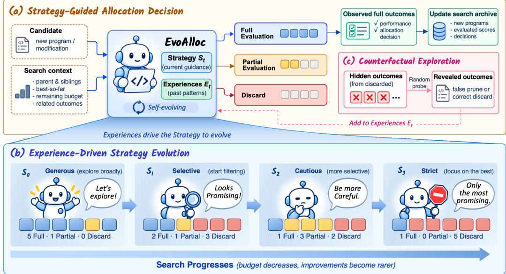  
Figure 1: EvoAlloc, a self-evolving resource allocation agent for program evolution. (a) Strategyguided allocation decision, (b) Experience-driven Strategy evolution, and (c) counterfactual exploration jointly adapt how evaluation is allocated as search progresses.

## 1 INTRODUCTION

Recent advances in LLM-based program evolution have established a general paradigm for discovering and refining executable programs through iterative cycles of generation, evaluation, and selection. By pairing the ability of language models to propose semantically meaningful code modifications with feedback from program execution, these methods have demonstrated strong potential across mathematical and algorithmic discovery (Romera-Paredes et al., 2024), scientific and systems optimization (Novikov et al., 2025), and the automated improvement of coding agents (Lange et al., 2026; Zhang et al., 2026; Wang et al., 2026). Evaluation plays a central role in this process because it directly shapes the trajectory of search. Evaluated programs populate the archive from which future parents are drawn (Wan et al., 2025), whereas a promising candidate that goes unevaluated cannot influence what is explored next. At the same time, fully evaluating a candidate can be expensive, requiring execution over many benchmark instances or random seeds, calls to external models or solvers, or multi-step rollouts of LLM agents (Robeyns et al., 2025). Deciding which candidates to evaluate, and how much evaluation each should receive, is therefore not merely a matter of saving compute but a central decision of the search itself.

Existing approaches largely make this decision using an allocation rule specified before search begins. The rule may be a predefined multi-fidelity procedure that promotes candidates through increasing evaluation budgets (Li et al., 2018; 2020), or an LLM that judges, ranks, or filters candidates before full evaluation (Foster et al., 2026). While these methods may condition individual decisions on intermediate results or search history, the allocation strategy itself remains fixed. This leaves valuable information unused. Each evaluated candidate reveals whether the decision to evaluate it was worthwhile, and as search proceeds, these outcomes accumulate into experience about which allocation choices advanced the search. Such experience matters because the value of evaluating a candidate is not a property of the candidate alone. It depends on the evolving state of the search. As the incumbent improves, useful improvements become rarer and the remaining budget shrinks, so what is worth evaluating changes over time. We argue that the allocator should therefore co-evolve with the search, improving its strategy from the outcomes of its own decisions.

Building on this view, we introduce EvoAlloc, a self-evolving allocation agent embedded in the program-evolution loop (Figure 1). EvoAlloc maintains an explicit allocation strategy that determines whether and how much to evaluate each candidate. Rather than keeping this strategy fixed, EvoAlloc evolves it as the search proceeds, drawing on a reflective memory that distills the search history and past allocation outcomes into reusable experience. Proposed revisions are adopted when shared validation favors them, prioritizing fewer missed new-best candidates and then lower evaluation cost. This self-evolution loop, however, creates a selective-feedback challenge: the agent’s own decisions determine which outcomes become observable. EvoAlloc therefore incorporates counterfactual exploration to gather additional experience beyond what its current strategy would otherwise generate. Across coding and agent-harness optimization benchmarks, EvoAlloc improves final performance by 8.7–12.0% over baseline under the same evaluation budget, while requiring 59–82% fewer full evaluations and 61–89% fewer recorded LLM tokens to match the baseline’s final performance. Ablations confirm the contributions of strategy evolution and counterfactual exploration.

## Our main contributions are:

1. We introduce a view of evaluation allocation as an evolving component of program evolution. We reframe allocation from fixed per-proposal judgments into an evolving decision process that uses the outcomes of prior allocation decisions to inform future ones.

2. We introduce EvoAlloc, a self-evolving resource-allocation agent. EvoAlloc acts through an explicit strategy, accumulates reusable experience from its interaction with the search, explores counterfactual outcomes, and revises future allocation behavior.

3. We provide an empirical analysis of how evolving evaluation allocation reshapes program search. Across coding and agent-harness benchmarks, we show that adaptive allocation improves search under limited budgets and analyze how it changes resource use, candidate coverage, and the resulting search trajectories.

## 2 RELATED WORK

Program Evolution and Self-Improving Search. Program evolution has a long history in genetic programming, where evolutionary variation and selection are applied directly to executable programs (Cramer, 1985; Dickmanns et al., 1987). LLM-based systems extend this paradigm by using language models to generate, revise, and recombine candidate programs within iterative search (Romera-Paredes et al., 2024; Novikov et al., 2025). Recent work has further made the search process itself more adaptive through mechanisms such as parent selection, novelty control, population management, and learned search strategies (Lange et al., 2026; Assumpção et al., 2025; Wan et al., 2025). A related line of work considers self-improvement beyond the candidate programs themselves. Early meta-evolution explored evolving program-modification mechanisms (Schmidhuber, 1987), while the Gödel Machine formalized self-improvement as rewriting its own code once a modification is proven useful (Schmidhuber, 2007). More recent systems such as Darwin Gödel Machine and Huxley-Gödel Machine pursue this idea empirically by evolving coding agents and their problemsolving procedures (Zhang et al., 2026; Wang et al., 2026). While these approaches largely adapt how candidates are generated and searched, the evaluation mechanism that allocates compute typically remains fixed; EvoAlloc allows this mechanism to evolve as well, drawing on accumulated search experience.

Selective Evaluation and Adaptive Resource Allocation. Efficient search depends on how computation is allocated, particularly when candidate evaluation is expensive. Earlier work on online algorithm portfolios adaptively allocated computation among a given set of search algorithms or parameter configurations, using performance prediction or bandit-based methods to adjust resource shares online (Gagliolo et al., 2004; Gagliolo & Schmidhuber, 2005; 2009). A complementary line of work allocates evaluation effort across candidate solutions: surrogate-assisted methods predict candidate quality to reduce expensive evaluations (Snoek et al., 2012; Jin, 2011), while multi-fidelity methods progressively allocate resources using partial evaluations (Li et al., 2018; 2020). Racing and adaptive capping discard unpromising configurations or terminate runs early (Hutter et al., 2009; López-Ibáñez et al., 2016). In LLM-based program evolution, selective evaluation takes the form of cascade evaluation through increasingly comprehensive tests (Novikov et al., 2025), novelty-based rejection of near-duplicate proposals (Lange et al., 2026), and LLM-based candidate ranking or filtering before costly evaluation (Foster et al., 2026). These program-evolution approaches can adapt individual decisions to available evidence while retaining predefined allocation rules. EvoAlloc instead revises an explicit allocation strategy using accumulated search and evaluation outcomes.

## 3 PROBLEM FORMULATION

## 3.1 EVALUATION ALLOCATION IN PROGRAM EVOLUTION

Consider a program-evolution process that iteratively generates candidate programs, evaluates them, and uses the evaluated programs to guide subsequent generation. We formulate evaluation allocation within this process as a sequential decision problem solved by an allocation agent A, which distributes a limited evaluation budget across candidates to maximize the best program score reached by the search. At each search step t, a candidate program $x _ { t }$ is generated, and the agent observes a decisiontime context $c _ { t }$ containing information available before evaluating $x _ { t }$ , such as the parent program and its score, the best score found so far, and the remaining budget.

For candidate $x _ { t } .$ , allocation may involve multiple decisions. Let $j = 0 , 1 , \ldots , K _ { t }$ index the decisions within its allocation episode, and let $a _ { t , j }$ denote the allocation action taken at decision j. Each intermediate action $a _ { t , j } ~ ( j ~ < ~ K _ { t } )$ acquires evaluation evidence $e _ { t , j }$ about $x _ { t } .$ , which becomes available to subsequent decisions, and the final action $\boldsymbol { a } _ { t , K _ { t } }$ either commits the candidate to full evaluation or stops further evaluation. The agent may condition each decision on the candidate, the decision-time context, and the evidence acquired earlier in the same episode:

$$
a _ { t , j } = \mathcal { A } ( x _ { t } , c _ { t } , e _ { t , < j } ) ,\tag{1}
$$

where $\boldsymbol { e } _ { t , < j } : = ( e _ { t , 0 } , \ldots , e _ { t , j - 1 } )$ , with $e _ { t , < 0 } : = \emptyset$ . The resulting allocation episode is $\begin{array} { r l } { \tau _ { t } } & { { } = } \end{array}$ $\big ( a _ { t , 0 } , e _ { t , 0 } , \ldots , a _ { t , K _ { t } - 1 } , e _ { t , K _ { t } - 1 } , a _ { t , K _ { t } } \big )$ . Let $y _ { t } \in \mathbb R$ denote the full-evaluation score of $x _ { t } .$ , which is defined regardless of whether $x _ { t }$ is actually fully evaluated. The score observed from the allocation

episode is

$$
y _ { t } ^ { \mathrm { o b s } } = \left\{ { \begin{array} { l l } { y _ { t } , } & { \mathrm { i f } ~ x _ { t } { \mathrm { ~ i s ~ f u l l y ~ e v a l u a t e d } } , } \\ { \emptyset , } & { \mathrm { o t h e r w i s e } . } \end{array} } \right.
$$

Only $y _ { t } ^ { \mathrm { o b s } }$ is available to the search and to the agent; the scores of candidates that are not fully evaluated remain hidden.

Let $b _ { t }$ denote the cumulative resource consumed after proposal $t ,$ measured, for example, by completed full evaluations or cumulative LLM tokens. Using this resource variable, we evaluate A through the resulting search trajectory. Let $Q _ { 0 }$ denote the best score among the initial programs. For any resource level $b ,$ define

$$
\begin{array} { r } { Q _ { \mathcal { A } } ^ { \star } ( b ) = \operatorname* { m a x } \left( \{ Q _ { 0 } \} \cup \{ y _ { t } ^ { \mathrm { o b s } } : t \in \mathbb { N } , \ b _ { t } \leq b , \ y _ { t } ^ { \mathrm { o b s } } \neq \emptyset \} \right) , } \end{array}\tag{2}
$$

which gives the best fully evaluated program score obtained after consuming at most resource b. Given a total resource budget $B ,$ the objective is to choose an allocation agent A that maximizes $\mathbb { E } [ Q _ { A } ^ { \star } ( B ) ]$ where the expectation is over the stochasticity of both the search process and the allocation agent. Conversely, for a target score $q ,$ the resource required to reach it is $\bar { C _ { q } } ( A ) = \operatorname* { i n f } \left\{ b \geq 0 : Q _ { A } ^ { \star } ( b ) \geq q \right\}$ These objectives make evaluation allocation a search-level sequential decision problem rather than independent proposal-level decisions. Resources saved on one candidate remain available for later search, while fully evaluated candidates can influence which programs are explored next.

## 3.2 SELF-EVOLVING ALLOCATION FROM SEARCH EXPERIENCE

Across proposals, the agent accumulates the interaction history $\mathcal { H } _ { t } = \{ ( x _ { i } , c _ { i } , \tau _ { i } , y _ { i } ^ { \mathrm { o b s } } ) \} _ { i < t } ,$ , which contains all allocation interactions before search step t. Here, $\tau _ { i }$ records the allocation actions and intermediate evidence for candidate $x _ { i } .$ . Episodes without Full evaluation are also included, with $y _ { i } ^ { \mathrm { o b s } } = \emptyset$ , although these candidates cannot participate in subsequent program evolution.

We represent the allocation agent over the search as $\mathcal { A } = ( \mathcal { A } _ { t } ) _ { t \geq 0 } .$ , where $\boldsymbol { A } _ { t }$ denotes its decision mechanism at search step t. A fixed allocation agent may make different decisions as the proposal, search context, and within-episode evidence change, while its decision mechanism remains unchanged: $\boldsymbol { \mathcal { A } } _ { t } = \boldsymbol { \mathcal { A } } _ { 0 }$ for all t. We call an allocation agent self-evolving when it can also revise this mechanism using the accumulated interaction history: $\mathscr { A } _ { t + 1 } = \mathscr { U } ( \mathscr { A } _ { t } , \mathscr { H } _ { t + 1 } )$ , where $\mathcal { U }$ denotes the agent-update process and leaves $\boldsymbol { A } _ { t }$ unchanged when no update is performed. Section 4 instantiates this formulation in EvoAlloc, where $\boldsymbol { A } _ { t }$ is guided by an explicit allocation Strategy $S _ { t }$ and reusable Experiences $E _ { t }$ distilled from observed search outcomes.

## 4 METHOD

EvoAlloc. EvoAlloc is a self-evolving evaluation-allocation agent for program evolution. It follows an explicit strategy that allocates evaluation resources to each candidate using the information available at decision time. As outcomes accumulate, EvoAlloc distills prior allocation episodes into reusable experience and uses it to evolve the strategy. It further uses counterfactual exploration to reveal outcomes of selected candidates that would otherwise remain unevaluated, providing additional feedback for subsequent strategy evolution. The following sections describe these three mechanisms: explicit evaluation allocation (Section 4.1), experience-driven strategy evolution (Section 4.2), and counterfactual exploration (Section 4.3).

## 4.1 EXPLICIT EVALUATION ALLOCATION STRATEGY

EvoAlloc maintains an explicit natural-language allocation strategy $S _ { t }$ that persists across candidates and is revised as the search progresses (Sec. 4.2). Rather than making each allocation decision from its current inputs alone, $S _ { t }$ captures search-level guidance for allocating evaluation resources. It specifies both the allocator’s overall selectivity and conditional guidance for choosing allocation actions under different search contexts. Representative strategy trajectories are provided in Appendix C.

In EvoAlloc, the agent $\boldsymbol { A } _ { t }$ at search step t is determined by its current Strategy $S _ { t }$ and Experiences $E _ { t }$ , which are provided to a fixed allocator LLM together with the inputs of Eq. (1). Here, $c _ { t }$ captures the decision-time search context, including the parent score, evaluated sibling outcomes, current best score, and remaining budget, while $e _ { t , < j }$ contains evidence acquired earlier in the same allocation episode. Across candidates, $E _ { t }$ summarizes reusable evidence from observed outcomes, and $S _ { t }$ provides the current run-level allocation guidance. The allocation action space is task-dependent. In all settings, EvoAlloc may choose FULL\_EVAL to commit the candidate to full evaluation or DISCARD to stop further evaluation. When a meaningful lower-cost intermediate evaluator is available, the agent may additionally choose PARTIAL\_EVAL to acquire further evidence. After such evidence is observed, the subsequent action is either CONTINUE\_TO\_FULL or STOP. These actions instantiate the multi-step allocation episode defined in Section 3.1.

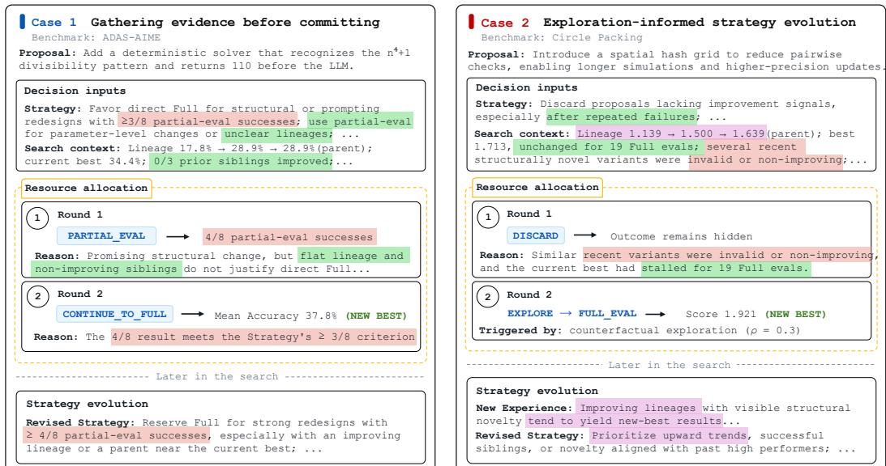  
Figure 2: Information flow between the strategy and allocation decisions in EvoAlloc. Each case reads top to bottom: the strategy and search context inform the allocation agent’s decisions, whose outcomes feed into later strategy updates. Proposals describe changes to the parent program. Matching highlights link related information across stages. Content is shortened for clarity. Strategy updates reflect feedback accumulated over multiple proposals, not the illustrated proposal alone.

## 4.2 EXPERIENCE-DRIVEN STRATEGY EVOLUTION

EvoAlloc implements the agent-update process U of Section 3.2 by updating two complementary components from observed outcomes. Experiences $E _ { t }$ summarize recurring patterns across observed cases, and the Strategy $S _ { t }$ translates these patterns into allocation criteria.

Experience updates. After every $k _ { E }$ newly observed Full outcomes, the LLM consolidates the new cases into $E _ { t }$ by adding, updating, or removing Experiences. Each Experience maintains the indices of its supporting and contradicting cases and a status of tentative, active, or stale. The case indices are chronological, preserving how the evidence for an Experience changes over time. New patterns enter as tentative; during later updates, the LLM may promote well-supported Experiences to active or mark outdated ones as stale as new evidence accumulates. Stale Experiences remain as historical records but no longer guide allocation.

Strategy evolution. EvoAlloc starts from an initial strategy $S _ { 0 }$ derived from a few example cases. Each run begins with a short warm-up in which the allocator acts under $S _ { 0 }$ but every candidate is fully evaluated, seeding run-specific evidence. Thereafter, every $k _ { S }$ newly observed Full outcomes, EvoAlloc reflects on the current strategy, Experiences, and recent cases to propose a challenger ${ \widetilde { S } } .$ The challenger is validated against the current strategy on subsequent candidates that induce different allocation paths under the two strategies (disagreements). For each disagreement, EvoAlloc executes the union of both strategies’ requested evaluations and shares the resulting evidence. Validation ends after two disagreements with an observed Full outcome. Sharing evaluations prevents outcomes requested only by the challenger from being censored in favor of the incumbent (Appendix D.7). The two strategies are then compared lexicographically on the realized consequences of their decisions:

fewer missed new-best candidates, then fewer Full evaluations, then fewer Partial evaluations. The challenger is adopted if it is better on the first criterion where the two differ; otherwise, the current strategy is retained. This grounds strategy updates in observed allocation consequences rather than in LLM judgment alone. Implementation details and prompts are provided in Appendix E.

## 4.3 COUNTERFACTUAL EXPLORATION

Strategy evolution requires evaluation feedback, yet selective allocation itself determines which feedback becomes observable. As defined in Sec. 3.1, candidates that terminate without full evaluation have $y _ { t } ^ { \mathrm { o b s } } = \emptyset$ . The resulting feedback is therefore filtered by the current strategy: systematic allocation errors can remain hidden because the corresponding candidates are never evaluated. To expose such missing feedback, EvoAlloc introduces counterfactual exploration. For each candidate whose allocation episode terminates in DISCARD or STOP, EvoAlloc independently samples $z _ { t } \sim \mathrm { B e r n o u l l i } ( \rho )$ , where ρ is the exploration rate (0.3 by default). When $z _ { t } = 1$ , EvoAlloc executes EXPLORE\_EVAL, fully evaluating the otherwise skipped candidate and revealing $y _ { t } ^ { \mathrm { o b s } } = y _ { t }$ Exploratory outcomes are marked separately from strategy-selected feedback. Strong outcomes provide counterevidence to the current allocation criteria, while weak ones support them; both inform subsequent experience and strategy updates. Once fully evaluated, an explored candidate participates in the underlying program search as usual.

Together, these components form a closed loop: the Strategy guides the agent’s decisions, and the outcomes of these decisions are used to revise the Strategy. Figure 2 illustrates this loop through two cases. In Case 1, the Strategy’s evidence threshold leads the agent to request Partial evaluation before committing to Full evaluation, and accumulated outcomes later refine this threshold. In Case 2, counterfactual exploration reveals the outcome of a candidate the agent had discarded, exposing feedback that would otherwise remain unobserved and informing a revised Strategy.

## 5 EXPERIMENTS

## 5.1 EXPERIMENTAL SETUP

Implementation and protocol. We implement EvoAlloc within the ShinkaEvolve programevolution framework (Lange et al., 2026), with all methods sharing the search pipeline except for evaluation allocation. Unless otherwise stated, experiments use five independent seeds. We report mean best-so-far performance against Full evaluations and cumulative LLM tokens, together with final best performance. Our primary efficiency metric is matched-target cost. We first average best-so-far scores and cumulative token usage across five seeds at each completed Full-evaluation index. We then find the first index at which the mean score reaches a common target and report that index and its corresponding mean cumulative token usage (Appendix D.3).

Benchmarks. We evaluate EvoAlloc across program-evolution settings spanning reasoning-harness optimization and solution-program optimization, with differing access to intermediate evaluation feedback. ADAS-AIME evolves programmatic reasoning harnesses around a fixed Qwen3-8B solver on the 30 AIME 2024 problems. Each candidate is scored by its mean accuracy over three independent runs. A Full evaluation uses all 30 problems, while a Partial evaluation uses the first eight before deciding whether to continue to Full. Circle Packing evolves Python programs that arrange 26 non-overlapping circles within the unit square to maximize the sum of their radii. Its evaluator is deterministic, and since no lower-cost intermediate evaluation is available, the allocator chooses directly between Full and Discard.

Baselines. We compare against four baselines within the same search framework. ShinkaEvolve (Lange et al., 2026) fully evaluates every proposal that passes the standard checks, providing a reference without evaluation allocation. One-Step LLM Allocator uses the same allocator LLM and search context as EvoAlloc, but makes each allocation decision directly without an explicit Strategy or accumulated Experience. Lineage-UCB is an LLM-free adaptive allocator that builds a Beta posterior from parent-improvement outcomes in the local lineage and applies a fixed UCB rule for evaluation allocation. RPM (Foster et al., 2026) is a recent LLM-based evaluation-allocation method that generates 15 proposals at each selection step and uses pairwise LLM comparisons in a knockout tournament to select one for Full evaluation. Implementation details, hyperparameters, token accounting, and baseline adaptations are provided in Appendices B and D.

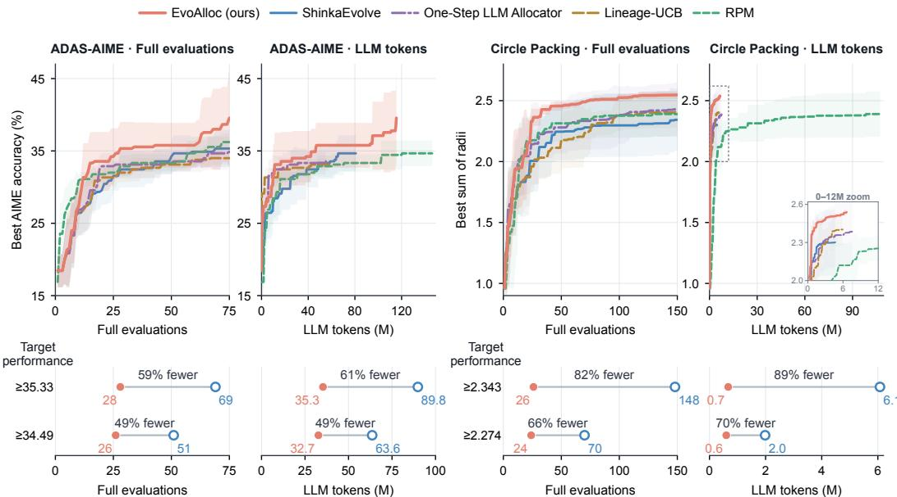  
Figure 3: Main results on ADAS-AIME and Circle Packing. Curves show five-seed mean best-sofar performance (±1 std.) against Full evaluations and cumulative LLM tokens. Bottom panels report the resources required to reach ShinkaEvolve’s final-performance and 95%-gain targets. Token costs are the mean cumulative usage at the first target-reaching Full-evaluation index of the evaluationaligned mean performance curve.

## 5.2 MAIN RESULTS

Figure 3 shows that EvoAlloc achieves the highest mean final performance among all evaluated methods on both benchmarks. Relative to ShinkaEvolve, the underlying program-evolution framework, EvoAlloc improves mean final performance by 12.0% on ADAS-AIME and 8.7% on Circle Packing. It also substantially reduces matched-target cost, requiring 59–82% fewer Full evaluations and 61–89% fewer LLM tokens to reach ShinkaEvolve’s final-performance target. LLM-token cost includes all input and output tokens consumed during search, including proposal generation, benchmark evaluation, and method-specific allocation or selection calls. The improvements persist across both evaluation settings: on Circle Packing, where no Partial evaluation is available, EvoAlloc still benefits from selectively allocating Full evaluations, showing that the gains are not simply due to access to an additional evaluation stage. The consistent advantage over the One-Step LLM Allocator further supports the value of maintaining an explicit Strategy and accumulated Experience across the search rather than making independent LLM allocation decisions. Complete statistics, matched-target costs, and auxiliary trajectory AUC are reported in Appendix D.

## 5.3 ABLATION AND SENSITIVITY ANALYSIS

Figure 4(a–b) compares variants of EvoAlloc. One-Step Alloc replaces the maintained Strategy with independent one-step allocation decisions, using the same allocator LLM and decision-time search context as EvoAlloc. w/o Evolution uses fixed custom allocation guidance, distilled from baseline run examples and manually refined (Appendix D.1). w/o Exploration removes counterfactual exploration while leaving the remaining adaptation mechanisms unchanged. Across both benchmarks, the full EvoAlloc achieves the strongest mean best-so-far trajectories. The full EvoAlloc outperforms both one-step allocation and fixed custom guidance. Removing exploration also weakens performance, reflecting the value of counterfactual outcomes that selective allocation would otherwise leave unobserved. Figure 4(c) varies the exploration rate $\rho$ on Circle Packing. Final performance is similar across rates, but the LLM tokens needed to reach ShinkaEvolve’s final performance vary substantially, with $\rho = 0 . 3$ the most efficient. Too little exploration provides limited feedback on skipped candidates, whereas too much offsets the savings from selective allocation.

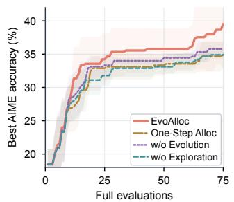  
(a) ADAS-AIME

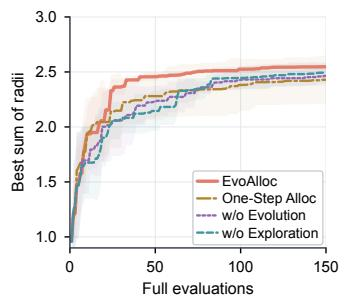  
(b) Circle Packing

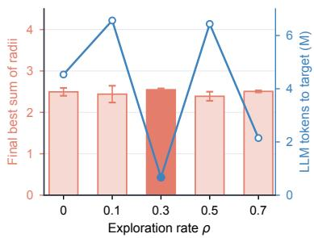  
(c) Exploration rate sensitivity  
Figure 4: Component ablations and exploration-rate sensitivity. (a–b) Five-seed online ablations under matched Full-evaluation budgets; shading denotes ±1 standard deviation. (c) Exploration-rate sweep on Circle Packing over $\rho \in \{ 0 , 0 . 1 , 0 . 3 , 0 . 5 , 0 . 7 \}$ ; bars show the final best sum of radii, and the line shows the LLM tokens required to reach ShinkaEvolve’s final performance.

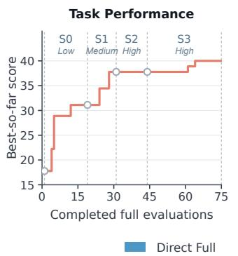

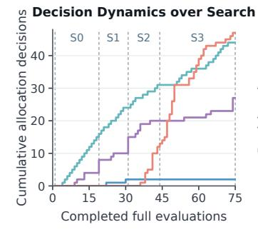  
Decision Mix by Strategy Stage

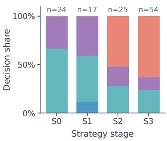  
Figure 5: Evolution of allocation behavior on ADAS-AIME. A representative 75-full-evaluation run showing best-so-far performance and allocation decisions across S0–S3. Allocation panels show decisions before counterfactual exploration, with explored proposals counted by their original allocation decision. Dashed lines mark the adoption of validated Strategies.

## 5.4 HOW THE ALLOCATION STRATEGY EVOLVES AND RESHAPES SEARCH

A good allocation strategy changes as search progresses. What is worth evaluating depends on the state of the search: early outcomes are hard to predict and gains are frequent, so broad evaluation is informative, whereas later gains become rare and the budget is better spent on fewer, stronger candidates. EvoAlloc’s evolved strategies follow this shift (Figure 5; see Appendix C.2 for Circle Packing). On ADAS-AIME, allocation moves from gathering evidence through Partial evaluation with no direct discards to discarding most proposals outright. This greater selectivity does not stop discovery, as EvoAlloc still finds a late improvement. These stage-wise changes support revising allocation criteria as search experience accumulates.

Savings become exploration. Selective allocation does more than reduce cost: every evaluation withheld from a weak candidate is reinvested in further search. With the same Full-evaluation budget on the same seed, EvoAlloc examines 124 proposals on ADAS-AIME versus 75 for ShinkaEvolve (Figure 6), and 302 versus 150 on Circle Packing (Appendix C.3). The extra proposals expand the tree with additional siblings and descendants. The candidates EvoAlloc chooses to evaluate also tend to score higher, even though each choice is made before the Full outcome is known, so the broader coverage does not come at the expense of evaluation quality. This reinvestment is why EvoAlloc improves final performance under a fixed budget, not only the cost of reaching a given target.

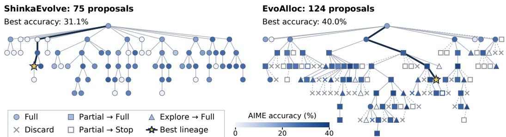  
Figure 6: ADAS-AIME search trees. Both methods complete 75 full evaluations with the same seed. Shapes encode allocation decisions; colors indicate observed Full-evaluation accuracy. Gray markers denote proposals without Full outcomes; stars mark the best programs, and highlighted edges trace their lineages.

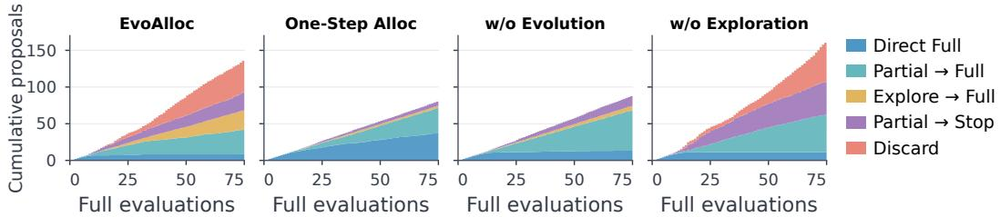  
Figure 7: Allocation decisions under ablations on ADAS-AIME. Five-seed mean cumulative proposal counts by allocation decision as Full evaluations accumulate; the stacked total gives the number of proposals considered.

EvoAlloc components jointly shape allocation behavior. Figure 7 shows how removing each component changes allocation behavior on ADAS-AIME. One-Step Alloc sees the same search history, but without a Strategy that consolidates it into explicit criteria, the LLM cannot confidently decline, and it therefore sends most proposals to Full evaluation and saves little budget. With fixed custom guidance, allocation remains Partial-heavy throughout the search, unlike the stage-wise shifts of EvoAlloc. Without exploration, discarded outcomes stay hidden, leaving no counterexamples to the current criteria, so pruning errors go uncorrected and falsely pruned candidates never enter the archive as parents. Effective allocation thus requires explicit criteria, their evolution with the search, and exploration to check them against hidden outcomes.

## 6 CONCLUSION AND LIMITATIONS

We introduced EvoAlloc, a self-evolving agent that treats evaluation allocation as an evolving component of program evolution. EvoAlloc revises an explicit allocation Strategy from accumulated Experiences and uses counterfactual exploration to recover feedback that selective allocation would otherwise leave hidden. Across ADAS-AIME and Circle Packing, EvoAlloc improves final performance and reaches the reference final-performance targets with 59–82% fewer Full evaluations and 61–89% fewer LLM tokens. These findings point toward self-improving systems that learn not only what to search, but also where to spend their evaluation effort.

Our study examines self-evolving allocation at the evaluation layer on two benchmarks with contrast ing evaluators, within a single search run and with generation, evaluators, and update mechanisms held fixed. Extending resource allocation to generation and allowing evaluation and update mechanisms to evolve could broaden the scope of self-improvement (Robeyns et al., 2025; Zhang et al., 2026). Retaining allocation experience across runs could allow future allocators to build on previously learned strategies, supporting longer-term knowledge accumulation and inheritance, as learngenes do by passing condensed knowledge across generations of agents (Feng et al., 2025). More broadly, adaptive resource allocation could help systems pursuing open-ended self-improvement continually refine how they invest finite computation in future progress.

## AI USE STATEMENT

Generative AI tools were used to assist with code implementation and debugging, as well as language editing and presentation of the manuscript. The core research idea and experimental design were developed by the authors. AI-assisted code was reviewed and tested by the authors before use in the experiments, and all AI-assisted manuscript content was manually reviewed and revised for technical correctness and consistency with the reported results. The authors take full responsibility for the final content of the paper.

## REPRODUCIBILITY STATEMENT

We provide detailed information to support reproducibility in the appendix, including the EvoAlloc pseudocode, implementation details and hyperparameters, benchmark and evaluation protocols, budget accounting, and all prompts required to reproduce the method. We additionally report fiveseed results and allocation breakdowns to facilitate verification of the main findings. The code and configurations will be released upon acceptance.

## REFERENCES

Henrique Assumpção, Diego Ferreira, Leandro Campos, and Fabricio Murai. CodeEvolve: An open source evolutionary coding agent for algorithmic discovery and optimization. arXiv preprint arXiv:2510.14150, 2025.

Nichael Lynn Cramer. A representation for the adaptive generation of simple sequential programs. In Proceedings of the First International Conference on Genetic Algorithms and Their Applications, pp. 183–187, 1985.

Dirk Dickmanns, Jürgen Schmidhuber, and Andreas Winklhofer. Der genetische Algorithmus: Eine Implementierung in Prolog. Fortgeschrittenenpraktikum, Institut für Informatik, Lehrstuhl Prof. Radig, Technische Universität München, 1987.

Fu Feng, Jing Wang, Xu Yang, and Xin Geng. Learngene: Inheritable “genes” in intelligent agents. Artificial Intelligence, 348:104421, 2025. doi: 10.1016/j.artint.2025.104421.

Thomas Simon Foster, Bassel Al Omari, Tingchen Fu, Thomas Mann, Carl Domond, Lucia Cipolina-Kun, Bhavul Gauri, Muna Aghamelu, Alexander D. Goldie, Eryk Helenowski, Jean-Christophe Gagnon-Audet, Alberto Pepe, Saba Nazir, Daniel Izcovich, Noam Levi, Rishi Hazra, Karen Hambardzumyan, Nicolas Baldwin, Xian Li, Martin Josifoski, Paris Giampouras, Masoud Jalili Sabet, Anya Sims, Hela Momand, Tatiana Shavrina, Despoina Magka, Jason Weston, Yulin Wang, Anirudh Goyal, João Henriques, Yoram Bachrach, Emily McMilin, and Jakob Nicolaus Foerster. AI research preference models. arXiv preprint arXiv:2608.13940, 2026.

Matteo Gagliolo and Jürgen Schmidhuber. A neural network model for inter-problem adaptive online time allocation. In Artificial Neural Networks: Formal Models and Their Applications – ICANN 2005, pp. 7–12. Springer Berlin Heidelberg, 2005.

Matteo Gagliolo and Jürgen Schmidhuber. Towards distributed algorithm portfolios. In International Symposium on Distributed Computing and Artificial Intelligence 2008 (DCAI 2008), volume 50 of Advances in Soft Computing, pp. 634–643, Berlin, Heidelberg, 2009. Springer. doi: 10.1007/ 978-3-540-85863-8\_75.

Matteo Gagliolo, Viktor Zhumatiy, and Jürgen Schmidhuber. Adaptive online time allocation to search algorithms. In Machine Learning: ECML 2004, pp. 134–143, Berlin, Heidelberg, 2004. Springer Berlin Heidelberg.

Frank Hutter, Holger H. Hoos, Kevin Leyton-Brown, and Thomas Stützle. ParamILS: An automatic algorithm configuration framework. Journal ofArtificial Intelligence Research, 36:267–306, 2009.

Yaochu Jin. Surrogate-assisted evolutionary computation: Recent advances and future challenges. Swarm and Evolutionary Computation, 1(2):61–70, 2011.

Robert Tjarko Lange, Yuki Imajuku, and Edoardo Cetin. ShinkaEvolve: Towards open-ended and sample-efficient program evolution. In International Conference on Learning Representations (ICLR), 2026.

Liam Li, Kevin Jamieson, Afshin Rostamizadeh, Ekaterina Gonina, Jonathan Ben-tzur, Moritz Hardt, Benjamin Recht, and Ameet Talwalkar. A system for massively parallel hyperparameter tuning. In Proceedings ofMachine Learning and Systems, volume 2, pp. 230–246, 2020.

Lisha Li, Kevin Jamieson, Giulia DeSalvo, Afshin Rostamizadeh, and Ameet Talwalkar. Hyperband: A novel bandit-based approach to hyperparameter optimization. Journal ofMachine Learning Research, 18(185):1–52, 2018.

Manuel López-Ibáñez, Jérémie Dubois-Lacoste, Leslie Pérez Cáceres, Thomas Stützle, and Mauro Birattari. The irace package: Iterated racing for automatic algorithm configuration. Operations Research Perspectives, 3:43–58, 2016. doi: 10.1016/j.orp.2016.09.002.

Alexander Novikov, Ngân Vu, Marvin Eisenberger, Emilien Dupont, Po-Sen Huang, Adam Zsolt Wag-˜ ner, Sergey Shirobokov, Borislav Kozlovskii, Francisco J. R. Ruiz, Abbas Mehrabian, M. Pawan Kumar, Abigail See, Swarat Chaudhuri, George Holland, Alex Davies, Sebastian Nowozin, Pushmeet Kohli, and Matej Balog. AlphaEvolve: A coding agent for scientific and algorithmic discovery. arXiv preprint arXiv:2506.13131, 2025.

Maxime Robeyns, Martin Szummer, and Laurence Aitchison. A self-improving coding agent. arXiv preprint arXiv:2504.15228, 2025.

Bernardino Romera-Paredes, Mohammadamin Barekatain, Alexander Novikov, Matej Balog, M. Pawan Kumar, Emilien Dupont, Francisco J. R. Ruiz, Jordan S. Ellenberg, Pengming Wang, Omar Fawzi, Pushmeet Kohli, and Alhussein Fawzi. Mathematical discoveries from program search with large language models. Nature, 625:468–475, 2024.

Jürgen Schmidhuber. Evolutionary principles in self-referential learning, or on learning how to learn: The meta-meta-... hook. Diploma thesis, Technische Universität München, 1987.

Jürgen Schmidhuber. Gödel Machines: Fully self-referential optimal universal self-improvers. In Artificial General Intelligence, pp. 199–226. Springer, 2007. Also arXiv:cs/0309048 (2003).

Jasper Snoek, Hugo Larochelle, and Ryan P. Adams. Practical Bayesian optimization of machine learning algorithms. In Advances in Neural Information Processing Systems, volume 25, pp. 2951–2959, 2012.

Chunhui Wan, Xunan Dai, Zhuo Wang, Minglei Li, Yanpeng Wang, Yinan Mao, Yu Lan, and Zhiwen Xiao. LoongFlow: Directed evolutionary search via a cognitive plan-execute-summarize paradigm. arXiv preprint arXiv:2512.24077, 2025.

Wenyi Wang, Piotr Pi˛ekos, Li Nanbo, Firas Laakom, Yimeng Chen, Mateusz Ostaszewski, Mingchen Zhuge, and Jürgen Schmidhuber. Huxley-Gödel Machine: Human-level coding agent development by an approximation of the optimal self-improving machine. In International Conference on Learning Representations (ICLR), 2026.

Jenny Zhang, Shengran Hu, Cong Lu, Robert Tjarko Lange, and Jeff Clune. Darwin Gödel Machine: Open-ended evolution of self-improving agents. In International Conference on Learning Representations (ICLR), 2026.

## APPENDIX

## A EVOALLOC ALGORITHM

Algorithm 1 highlights EvoAlloc-specific operations. Parent selection, proposal generation, archive updates, and benchmark evaluation follow the underlying search procedure.

Algorithm 1: Program evolution with EvoAlloc   
Input: initial programs; example cases; Full-evaluation budget $B ;$ exploration rate $\rho ;$ update   
intervals $k _ { E } , k _ { S } .$   
Output: best program $x ^ { * }$   
1 $\mathcal { P } $ INITARCHIVE(initial programs); $H \gets \emptyset ;$ $n \gets 0$ ▷ archive and interaction history   
2 $S  S _ { 0 }$ ← INITSTRATEGY(example cases); $E  \emptyset ;$ $\tilde { S }  \emptyset$   
3 while $n < B$ do   
4 $x _ { p } \gets \mathrm { S E L E C T P A R E N T } ( \mathcal { P } ) ;$ x ← GENERATEPROPOSAL $( x _ { p } , \mathcal { P } )$   
5 $\boldsymbol { c } \gets \mathbf { B U I L D C O N T E X T } ( \boldsymbol { x } _ { p } , \mathcal { P } , H , n , B )$ ▷ decision-time context   
6 $\tau \gets \mathrm { A L L O C A T E } ( x , c ; \dot { S } , \dot { E } )$ ▷ executes and caches any Partial evaluation   
7 $\tilde { \tau } \gets \mathrm { A L L O C A T E } ( x , c ; \tilde { S } , E ) \ i \mathbf { f } \ \tilde { S } \neq \emptyset$ else ∅   
▷ shadow allocation; reuses cached Partial evidence   
<sup>8</sup> <sub>9</sub> if τ ends in Full then   
$y ^ { \mathrm { o b s } } \gets \mathrm { F U L L E V A L } ( x )$   
else if not WARMUPCOMPLETE(H) then   
$y ^ { \mathrm { o b s } } \gets \mathrm { F U L L E V A L } ( x )$   
else if τ˜ ends in Full then   
$y ^ { \mathrm { o b s } } \gets \mathrm { F U L L E V A L } ( x )$ ▷ shared validation (Sec. 4.2)   
else   
sample $z \sim$ Bernoul $\operatorname { l i } ( \rho )$   
$\mathbf { i f } \ z = 1$ then $y ^ { \mathrm { o b s } } \gets \mathrm { F U L L E V A L } ( x )$   
else $y ^ { \mathrm { o b s } }  \emptyset$   
$H \gets \bar { H \cup } \{ ( x , c , \tau , \widetilde { \tau } , y ^ { \mathrm { o b s } } ) \}$   
19 if $y ^ { \mathrm { o b s } } \neq \emptyset$ then $n \gets n + 1 ;$ P ← UPDATEARCHIVE $( \mathcal { P } , x , y ^ { \mathrm { o b s } } )$   
20 if $k _ { E }$ new Full outcomes since the last Experience update then   
$E \gets \mathrm { { U P D A T E E X P E R I E N C E S } } ( E , H )$   
if $\tilde { S } \neq \emptyset$ and VALIDATIONCOMPLETE(H) then   
$S \gets \mathrm { V A L I D A T E S T R A T E G Y } ( S , \tilde { S } , H ) ; \tilde { S } \gets \emptyset$ ▷ adopt or retain   
else if $\tilde { S } = \emptyset$ and WARMUPCOMPLETE(H) and   
k<sub>S</sub> new Full outcomes since the last reflection then   
24 $\tilde { S } \gets$ REFLECTSTRATEGY $( S , E , H )$ ▷ one challenger at a time   
25 return BEST(P)

Here, P is the search archive and H the interaction history (Section 3.2), retaining original allocation episodes even when outcomes are later revealed. ALLOCATE follows the allocation procedure in Section 4.1. During validation, the union of requested evaluations is executed once and the resulting evidence is shared. All Full evaluations, including warm-up, validation, and exploration, count toward B.

## B IMPLEMENTATION AND BENCHMARKS

## B.1 MODELS AND EVOALLOC CONFIGURATION

EvoAlloc is implemented on top of the public ShinkaEvolve program-evolution loop (Lange et al., 2026). Unless otherwise stated, substrate hyperparameters follow the default ShinkaEvolve configuration. All language models are open-weight and locally served on NVIDIA A100 GPUs, with the same serving setup used across all compared methods. Table 1 summarizes the backbone models, the main EvoAlloc configuration, and the benchmark-specific settings.

Table 1: Implementation and benchmark configuration. Shared model and controller settings with benchmark-specific budgets, action spaces, and Partial-evaluation availability.
<table><tr><td colspan="3">Backbone and Models</td></tr><tr><td>Proposer LLMs ShinkaEvolve meta model</td><td></td><td>GLM-4.5-Air; gpt-oss-120b; Qwen3.6-35B-A3B</td></tr><tr><td>ShinkaEvolve novelty model</td><td rowspan="3">Qwen3.6-35B-A3B</td><td>Qwen3.6-35B-A3B</td></tr><tr><td></td><td></td></tr><tr><td>Embedding model Proposer temperatures</td><td>Qwen3-Embedding-0.6B</td></tr><tr><td>Max tokens</td><td colspan="2">[0.0, 0.5, 1.0] 16,384</td></tr><tr><td>EvoAlloc Configuration</td><td colspan="2"></td></tr><tr><td>Allocator and self-evolution LLM Adaptive warm-up</td><td colspan="2">Qwen3-Coder-Next</td></tr><tr><td>Experience update interval  $k _ { E }$ </td><td colspan="2">Requires ≥ 1 new-best and</td></tr><tr><td>Strategy update interval  $k _ { S }$ </td><td colspan="2">5 new Full outcomes 10 new Full outcomes</td></tr><tr><td>Strategy validation window</td><td colspan="2">2 allocation disagreements with known Full outcomes</td></tr><tr><td>Experience capacity</td><td colspan="2">4 active/tentative + 4 stale</td></tr><tr><td>Counterfactual exploration rate</td><td colspan="2">0.30</td></tr><tr><td></td><td></td><td></td></tr><tr><td>Benchmark-Specific Configuration</td><td></td><td></td></tr><tr><td></td><td>Circle Packing</td><td>ADAS-AIME</td></tr><tr><td>Objective / metric</td><td>Packing score</td><td>AIME accuracy</td></tr><tr><td>Evaluation model</td><td></td><td></td></tr><tr><td></td><td>Deterministic evaluator</td><td>Qwen3-8B solver (thinking off)</td></tr><tr><td>Full-evaluation budget</td><td>150</td><td>75</td></tr><tr><td>Allocator actions</td><td>{FULL_EVAL, DISCARD}</td><td>{FULL_EVAL, PARTIAL_EVAL, DISCARD}</td></tr><tr><td>Partial-evaluation subset</td><td></td><td>Fixed subset, k = 8 (first 8 of 30 problems)</td></tr><tr><td>Post-Partial actions</td><td></td><td>{CONTINUE_TO_FULL, STOP}</td></tr></table>

Strategy initialization. We initialize $S _ { 0 }$ by summarizing 50 example cases, comprising 10 candidate evaluation records from each of five ShinkaEvolve baseline runs with different seeds. The initial selectivity is set to low. The cost of obtaining these baseline cases is excluded from the reported search costs.

## B.2 ADAS-AIME

ADAS-AIME evolves the Python scaffold around a fixed mathematical-reasoning solver on the 30 AIME 2024 problems. A candidate is a reusable Agent: it may query the solver, vary sampling temperature, combine responses, filter or vote over candidate answers, and extract the final integer answer returned to the benchmark harness. The solver weights and benchmark questions are fixed; the evolved object is the reasoning scaffold.

Following the ShinkaEvolve evaluation protocol, each candidate is evaluated over all 30 AIME 2024 problems in three independent runs, and the resulting accuracies are averaged. These three repetitions together count as one Full evaluation in the search budget. For allocation decisions, we use a Partial evaluation on the first 8 of 30 problems using a single evaluation seed. After observing the Partial result, the allocator chooses CONTINUE\_TO\_FULL or STOP. The Partial result is used only to decide whether the current proposal deserves the remaining full-evaluation cost; final performance is always measured by the full evaluator. Search and evaluation use the same fixed 30-problem suite.

The example below illustrates a reasoning harness that samples eight solutions at three temperatures, extracts candidate answers, and selects the most frequent answer by majority voting.

## Example evolved program: ADAS-AIME

```python
import re
from collections import Counter
from typing import Callable, Optional
class Agent:
def __init__(
self,
query_llm: Callable,
temperature=0.0,
):
self.query_llm = query_llm
self.max_calls = 10
def _extract_answer(self, response: str) -> Optional[int]:
match = re.search(r’\\boxed\{(\d+)\}’, response)
if match:
return int(match.group(1))
lines = response.strip().split(’\n’)
for line in reversed(lines):
line = line.strip()
if line.isdigit() and 0 <= int(line) <= 999:
return int(line)
return None
def forward(self, problem: str) -> tuple[str, float]:
system_prompt = (
"You are an expert mathematician. Solve the following problem step-by-step. "
"Think carefully and verify your steps. "
"On the final line output only the digits of the answer (0-999). "
"Provide your final answer enclosed in a LaTeX \\boxed{...} command."
)
temperatures = [0.8, 0.8, 0.8, 0.5, 0.5, 0.2, 0.2, 0.2]
candidates = []
total_cost = 0.0
for t in temperatures:
if len(candidates) >= self.max_calls:
break
task_prompt = f"{problem}\n\n"
response, cost = self.query_llm(
prompt=task_prompt,
system=system_prompt,
temperature=t,
)
total_cost += cost
ans = self._extract_answer(response)
if ans is not None:
candidates.append((ans, response))
if not candidates:
return "", total_cost
ans_counts = Counter([c[0] for c in candidates])
best_ans = ans_counts.most_common(1)[0][0]
for ans, resp in candidates:
if ans == best_ans:
return resp, total_cost
return candidates[0][1], total_cost
```

## B.3 CIRCLE PACKING

Circle Packing evolves compact Python programs that construct feasible placements of 26 circles in the unit square. The evaluator checks boundary and non-overlap constraints, computes the induced radii, and returns the packing objective. Unlike ADAS-AIME, the evaluator is deterministic and non-LLM; the artifact is a constructive geometric algorithm rather than a language-model scaffold.

We do not use Partial evaluation in this setting. The allocator therefore chooses directly between FULL\_EVAL and DISCARD. This setting isolates adaptive full-evaluation allocation on a deterministic algorithm-design task.

Example evolved program (excerpt): Circle Packing

```python
def construct_packing():
n = 26
rng = np.random.default_rng(seed=12345)
initializations = [
_init_hexagonal(n, rng),
_init_concentric(n, rng),
_init_corner_focused(n, rng),
_init_voronoi(n, rng),
_init_strategic(n, rng),
]
best_centers = None
best_radii = None
best_score = -1.0
for init_c in initializations:
best_c, best_r = anneal_centers(init_c, rng, max_iter=35000)
best_r = radius_expansion(best_c, best_r, max_iters=10)
best_c, best_r = gradient_refine(best_c, best_r, iterations=14, step_size=0.022,
momentum=0.78)
best_r = _lp_max_radii(best_c)
score = best_r.sum()
if score > best_score:
best_score = score
best_centers = best_c.copy()
best_radii = best_r.copy()
best_radii = np.maximum(best_radii, 0.0)
return best_centers, best_radii
```

## C EVOLUTION AND SEARCH ANALYSIS

This appendix examines how EvoAlloc’s Strategy and Experiences evolve during search, and how these changes reshape the search itself. We first trace their evolution on ADAS-AIME and Circle Packing, then analyze the resulting search trees.

## C.1 ADAS-AIME STRATEGY AND EXPERIENCE EVOLUTION

Strategy trajectory. Figure 5 visualizes the representative ADAS-AIME run analyzed here. The adopted Strategy starts permissive, moves to medium selectivity once sufficient evidence has accumulated, and then passes through two highly selective stages. Its criteria also become more specific over time: the generic guidance of S0 gives way to explicit Partial-evaluation thresholds conditioned on lineage trends. Table 2 lists each stage’s Full-evaluation window, selectivity level, and complete Strategy text; the final Experience inventory is reported afterward.

Table 2: Evolution of the learned allocation Strategy on ADAS-AIME. Each row lists one Strategy stage with its full-evaluation window, selectivity level, and complete Strategy text, with “smoke” replaced by “partial evaluation” for consistency with the main text.
<table><tr><td>Stage</td><td>Full window Selectivity</td><td></td><td>Allocation strategy</td></tr><tr><td>SO</td><td>1-19</td><td>Low</td><td>Allocate evaluator calls using the available evidence while preserving useful uncertainty. Preserve evaluator calls without hiding promising or informative candidates.</td></tr><tr><td>S1</td><td>20-31</td><td>Medium</td><td>Prefer direct full evaluation for structural or prompting redesigns with at least 3 of 8 partial-evaluation successes. Use partial evaluation for parameter-level changes or unclear lineages, and reserve discarding for poor partial-evaluation execution or lineages already at the current best</td></tr><tr><td>S2</td><td>32-44</td><td>High</td><td>without a novel mechanism. Reserve full evaluation for strong structural redesigns with at least 4 of 8 partial-evaluation successes, especially when the lineage is improving or the parent is near the current best. Continue after partial evaluation only under the same evidence; otherwise stop early, and discard proposals with few partial-evaluation successes from flat or regressive lineages more</td></tr><tr><td>S3</td><td>45-75</td><td>High</td><td>aggressively. Reserve full evaluation for structural redesigns with at least 4 of 8 partial-evaluation successes and clear lineage improvement. Use partial evaluation for parameter-level or unclear-lineage proposals, but continue only with both strong partial-evaluation evidence and an improving lineage Aggressively discard proposals with at most 2 of 8 partial-evaluation successes when the lineage is flat or declining or the change lacks structural novelty.</td></tr></table>

<table><tr><td>Experience 4 stale</td></tr><tr><td>APPLICABILITY</td></tr><tr><td>Targeted deterministic solvers with at least 4 of 8 partial-evaluation successes, especially on a flat or declining lineage.</td></tr><tr><td>EXPECTED TENDENCY</td></tr><tr><td>They often plateau at or below the current best despite strong partial-evaluation results and structural novelty.</td></tr><tr><td>EVIDENCE</td></tr><tr><td>4 support / 1 counter.</td></tr></table>

<table><tr><td>APPLICABILITY Targeted deterministic solvers for recurring AIME patterns with at most 2 of 8 partial-evaluation successes,</td></tr><tr><td>especially on a flat or declining lineage.</td></tr><tr><td>EXPECTED TENDENCY</td></tr><tr><td>They may still improve over the parent when the structural fix targets a known blind spot.</td></tr><tr><td>EVIDENCE</td></tr><tr><td>2 support / 2 counter.</td></tr></table>

Final learned Experiences. The Experience inventory records recurring search situations and the outcome tendencies distilled from them during the run. Each entry specifies an applicability condition, an expected tendency, and its supporting and contradicting evidence. Unlike the run-level Strategy, Experiences retain local, case-grounded information that can be reused when similar search states reappear. Conditions that refer to Partial-evaluation results apply only after Partial evaluation has been observed. As in Table 2, “smoke” in the original text is replaced by “partial evaluation”.

<table><tr><td>Experience 1 active</td></tr><tr><td>APPLICABILITY Proposals with at most 2 of 8 partial-evaluation successes, especially when the lineage is flat or declining,</td></tr><tr><td>even when the proposed structural change appears promising.</td></tr><tr><td>EXPECTED TENDENCY</td></tr><tr><td>They tend to yield low or non-improving full scores regardless of design ambition.</td></tr><tr><td></td></tr><tr><td>EVIDENCE 15 support / 3 counter.</td></tr></table>

<table><tr><td>Experience 2 active</td></tr><tr><td>APPLICABILITY</td></tr><tr><td>Targeted deterministic solvers with at least 4 of 8 partial-evaluation successes when the lineage is improving and the parent is at or near the current best.</td></tr><tr><td>EXPECTED TENDENCY They can improve over the parent and sometimes establish a new best when the fix targets a known failure</td></tr><tr><td>mode.</td></tr><tr><td>EVIDENCE</td></tr><tr><td>2 support / 0 counter.</td></tr></table>

## Experience 3

stale

## C.2 CIRCLE PACKING STRATEGY AND EXPERIENCE EVOLUTION

Strategy trajectory. Figure 8 shows a representative Circle Packing run. Its Strategy follows a progression in selectivity similar to ADAS-AIME, but without Partial evaluation, so each decision is made directly between Full evaluation and discard. The allocator first evaluates proposals broadly, then becomes increasingly selective as evidence accumulates and the search matures. Table 3 lists the corresponding Strategy stages.

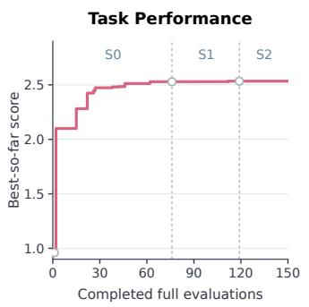

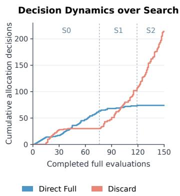

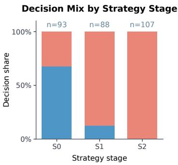  
Figure 8: Evolution of allocation behavior on Circle Packing. A representative 150-full-evaluation run (seed 3) showing best-so-far performance and allocation decisions across S0–S2. Allocation panels show decisions before counterfactual exploration, with explored proposals counted by their original allocation decision. Dashed lines mark the adoption of validated Strategies.

Table 3: Evolution of the learned allocation Strategy on Circle Packing. Each row lists one Strategy stage with its full-evaluation window, selectivity level, and complete Strategy text.
<table><tr><td>Stage</td><td>e Full window Selectivity Allocation strategy</td><td></td><td></td></tr><tr><td>SO</td><td>1-76</td><td>Low</td><td>Begin with low selectivity. Early proposal outcomes are highly variable, and surface plausibility does not reliably distinguish failures from improvements. Evaluate broadly until grounded outcomes establish a repeatable basis for discarding, then tighten allocation gradually. Use the</td></tr><tr><td>S1</td><td>77-119</td><td>Medium</td><td>limited evaluation budget efficiently over the full search. Begin to favor targeted evaluation. Retain broad coverage for proposals with strong lineage improvement trends or structural novelty, but increasingly discard repeated marginal variants or invalid proposals without structural divergence. Prioritize full evaluation for candidates that</td></tr><tr><td>S2</td><td>120-150</td><td>High</td><td>extend a promising new-best lineage or introduce a substantially new initialization or optimization strategy. Strongly favor discarding repeated marginal variants on plateaued lineages or motifs associated with invalid and non-improving cases. Reserve full evaluation primarily for structurally novel strategies with promising lineage evidence, or for candidates directly extending a new-best lineage and plausibly escaping a local optimum.</td></tr></table>

<table><tr><td>APPLICABILITY</td></tr><tr><td>Rare new-best outcomes that emerge after repeated invalid or low-scoring attempts.</td></tr><tr><td></td></tr><tr><td>EXPECTED TENDENCY</td></tr><tr><td>Such outcomes are not reliably predictable from prior local scores and may require full evaluation to confirm.</td></tr><tr><td>EVIDENCE</td></tr><tr><td>9 support / 1 counter.</td></tr></table>

Final learned Experiences. The final inventory summarizes recurring proposal patterns and their observed outcomes. Descriptions such as “valid but non-improving” characterize past evaluated cases, not conditions to be checked on a new candidate. These Experiences inform Strategy revision and expectations about related proposals through visible code changes and known lineage outcomes. Allocation uses only information available at decision time, without access to the current candidate’s Full outcome (Appendix E.2).

<table><tr><td>Experience 1 active</td></tr><tr><td>APPLICABILITY Valid but substantially non-improving candidates, especially minor perturbations of invalid or low-quality</td></tr><tr><td>structures.</td></tr><tr><td>EXPECTED TENDENCY</td></tr><tr><td>Such candidates rarely improve without structural innovation.</td></tr><tr><td>EVIDENCE</td></tr><tr><td>9 support / 0 counter.</td></tr></table>

<table><tr><td>Experience 2 active</td></tr><tr><td>APPLICABILITY</td></tr><tr><td>Invalid outputs associated with structural flaws, such as overlap or boundary violations, often following aggressive or poorly constrained edits.</td></tr><tr><td>EXPECTED TENDENCY</td></tr><tr><td>Invalid outcomes rarely precede improvement without corrective refinement.</td></tr><tr><td>EVIDENCE</td></tr><tr><td>28 support / 0 counter.</td></tr></table>

<table><tr><td>Experience 3 active</td></tr><tr><td>APPLICABILITY</td></tr><tr><td>Candidates that improve on a valid parent, even when their absolute quality remains low.</td></tr><tr><td>EXPECTED TENDENCY</td></tr><tr><td>Local parent improvement can reveal useful structural motifs and may precede larger gains after further refinement.</td></tr><tr><td></td></tr><tr><td>EVIDENCE</td></tr><tr><td>58 support / 9 counter.</td></tr></table>

## Experience 4

stale

## C.3 SEARCH-TREE ANALYSIS

Figure 9 complements Section 5.4 with Circle Packing search trees. With the same seed and 150 Full evaluations, EvoAlloc considers 302 proposals, compared with 150 for ShinkaEvolve. Since Circle Packing has no Partial evaluation, this expansion comes entirely from deciding which proposals receive Full evaluation. Highlighted edges trace the lineages of the best programs.

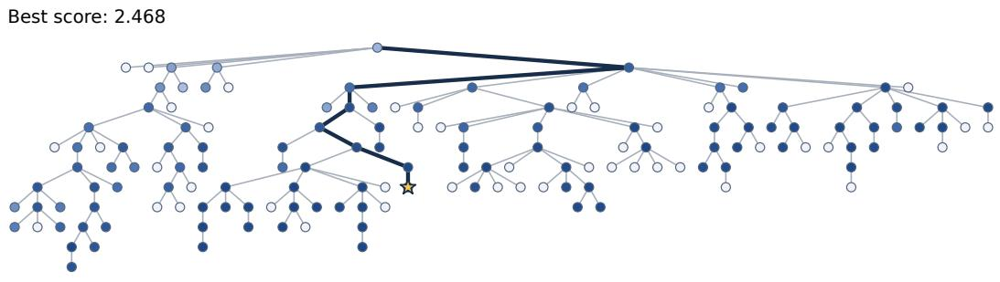

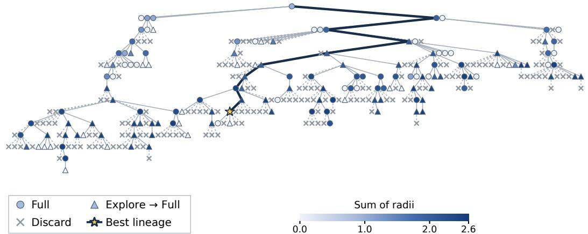  
Figure 9: Circle Packing search trees. Both methods complete 150 full evaluations with the same seed (seed 1). Shapes encode allocation decisions; colors indicate the observed sum of radii. Gray crosses denote proposals without Full outcomes; stars mark the best programs, and highlighted edges trace their lineages.

## D EXPERIMENTAL DETAILS AND ADDITIONAL RESULTS

This appendix describes the baseline and ablation configurations and reports detailed performance, resource costs, and allocation breakdowns. Implementation settings and benchmark protocols are given in Appendix B.

## D.1 BASELINES AND COMPARISON CONFIGURATION

All methods run within the same ShinkaEvolve framework, using its default configuration and benchmark evaluation protocols unless stated otherwise in Appendix B. They differ only in how evaluation resources are allocated after a candidate is generated. Following the framework’s default behavior, a candidate that does not ultimately receive Full evaluation is discarded and cannot be selected as a parent. Allocation therefore determines which candidates enter the archive, and different methods may consequently induce different proposal streams over the course of a run; we treat this interaction as part of the closed-loop allocation problem. While the default configuration uses a single seed, we run each method with five seeds and report averages for more reliable comparisons.

ShinkaEvolve. ShinkaEvolve (Lange et al., 2026) is the program-evolution framework underlying all methods and serves as the full-evaluation reference, in which every generated candidate receives Full evaluation. We retain its main search mechanisms, including an ensemble of proposer LLMs sampled at multiple temperatures, a meta model that periodically reflects on evaluated programs to guide subsequent proposals, and novelty filtering that combines embedding similarity with an LLM novelty judge to reject near-duplicate candidates. The models used for each role are listed in Table 1. We rerun ShinkaEvolve with the same locally served open-weight search models used by EvoAlloc and the other baselines (Table 1). This differs from the proprietary model ensemble used in the original study, so the reported scores should be interpreted within our shared model configuration rather than as a reproduction of its published results. Our comparisons assess evaluation allocation under a common search backbone and matched Full-evaluation budgets.

One-Step LLM Allocator. This baseline isolates the effect of EvoAlloc’s persistent allocation state while matching its allocator, action space, counterfactual exploration, and decision context. Each decision is conditioned on the same search information available to EvoAlloc, including recent cases, retrieved similar cases, and the current search state. The baseline differs only in maintaining neither an explicit Strategy nor distilled Experiences; instead, it maps the available context directly to an allocation action at each step. This comparison evaluates the benefit of explicitly consolidating search history into reusable Experiences and an evolving Strategy, beyond directly conditioning an LLM allocator on the search history.

Lineage-UCB. Lineage-UCB represents classical adaptive allocation based on a fixed statistical rule, in the spirit of bandit-based methods. It uses a binary action space of Full evaluation or discard on both benchmarks. For each candidate, it estimates the improvement tendency of its local lineage using a Beta posterior initialized as Beta(1, 1) and updated from previously observed outcomes, with weight 1 for direct relatives and 0.5 for second-level relatives. A candidate receives Full evaluation if the posterior mean plus one standard deviation is at least 0.5, and is otherwise discarded. The allocator requires no LLM calls. This comparison isolates the benefit of learned, structured allocation guidance beyond online adaptation under a fixed statistical rule.

RPM. We include RPM (Foster et al., 2026) as a recent LLM-based proposal-selection baseline that addresses the closely related problem of deciding which candidates merit computationally expensive evaluation. We adapt its inference-time selector to our setting. At each selection step, 15 candidates are generated from the same parent and compared through a seeded, randomly ordered knockout tournament, with the winner receiving Full evaluation and all others discarded. The batch size of 15 follows the end-to-end configuration in the original RPM study. Each pairwise comparison is conditioned on the two candidates’ plans and code, together with up to 10 previously evaluated programs retrieved from the search history. We use Qwen3-Coder-Next as the judge with temperature 0 and a maximum of 4,096 output tokens. Unlike EvoAlloc, RPM performs batch-level selection among competing candidates and follows a fixed selection rule throughout search. LLM tokens consumed by all generated candidates, including those not selected for evaluation, are included in the total cost.

Ablations. Section 5.3 compares EvoAlloc with variants using one-step allocation, fixed allocation guidance, and no counterfactual exploration. One-Step Alloc corresponds to the One-Step LLM Allocator described above, removing both the persistent Strategy and distilled Experiences. w/o Evolution uses fixed custom allocation guidance: a medium-selectivity Strategy and seeded Experiences distilled from baseline run examples, with the Strategy manually refined into reasonable allocation criteria. This guidance remains fixed throughout search. w/o Exploration sets $\rho = 0 ;$ , preventing discarded or stopped candidates from receiving exploratory Full evaluation and thus leaving their Full outcomes unobserved.

## D.2 DETAILED PERFORMANCE

Table 4 reports final performance and normalized trajectory AUC as an auxiliary anytime measure; matched-target cost remains the primary efficiency metric. For each seed, we normalize the area under the best-so-far curve by the range length, using the full evaluation budget for eval-budget AUC and the common token range covered by all methods and seeds for token-budget AUC (0.62–55.1 M tokens on ADAS-AIME and 0.27–4.68 M on Circle Packing). We report the mean and standard deviation across five seeds, with standard deviations computed under the population convention to match the shaded bands in Figure 3.

Table 4: Final performance and auxiliary trajectory AUC. Five-seed mean $\pm$ one standard deviation; bold denotes the best method per benchmark and column. AUC is the normalized area under the best-so-far curve over the evaluation or token budget; higher is better.
<table><tr><td>Benchmark</td><td>Method</td><td>Performance</td><td>Eval-budget AUC</td><td>Token-budget AUC</td></tr><tr><td rowspan="5">ADAS-AIME</td><td>ShinkaEvolve</td><td> $3 5 . 3 3 \pm 2 . 5 7$ </td><td> $3 1 . 2 9 \pm 1 . 9 5$ </td><td> $3 0 . 2 4 \pm 2 . 8 2$ </td></tr><tr><td>One-Step Alloc</td><td> $3 4 . 8 9 \pm 1 . 9 4$ </td><td> $3 1 . 4 0 \pm 1 . 3 4$ </td><td> $3 2 . 4 5 \pm 1 . 4 9$ </td></tr><tr><td>Lineage-UCB</td><td> $3 4 . 0 0 \pm 0 . 8 9$ </td><td> $3 0 . 8 8 \pm 0 . 5 3$ </td><td> $3 2 . 3 2 \pm 1 . 0 7$ </td></tr><tr><td>RPM</td><td> $3 6 . 2 2 \pm 1 . 1 3$ </td><td> $3 2 . 4 9 \pm 0 . 6 9$ </td><td> $3 0 . 3 1 \pm 0 . 9 4$ </td></tr><tr><td>EvoAlloc (ours)</td><td> $\mathbf { 3 9 . 5 6 \pm 6 . 8 0 }$ </td><td> $\mathbf { 3 3 . 6 9 \pm 3 . 3 3 }$ </td><td> $\mathbf { 3 3 . 1 5 \pm 2 . 8 9 }$ </td></tr><tr><td rowspan="5">Circle Packing</td><td>ShinkaEvolve</td><td> $2 . 3 4 3 { \scriptstyle \pm 0 . 2 5 4 }$ </td><td> $2 . 1 7 2 { \scriptstyle \pm 0 . 2 3 9 }$ </td><td> $2 . 2 4 5 \pm 0 . 2 5 7$ </td></tr><tr><td>One-Step Alloc</td><td> $2 . 4 2 9 \pm 0 . 2 1 9$ </td><td> $2 . 2 6 1 \pm 0 . 2 2 2$ </td><td> $2 . 2 5 1 \pm 0 . 2 6 6$ </td></tr><tr><td>Lineage-UCB</td><td> $2 . 4 0 8 \pm 0 . 1 3 1$ </td><td> $2 . 1 8 1 \pm 0 . 1 5 6$ </td><td> $2 . 2 1 3 { \scriptstyle \pm 0 . 1 4 7 }$ </td></tr><tr><td>RPM</td><td> $2 . 3 9 0 { \scriptstyle \pm 0 . 1 8 6 }$ </td><td> $2 . 2 4 6 \pm 0 . 1 5 1$ </td><td> $1 . 5 5 3 { \scriptstyle \pm 0 . 2 7 7 }$ </td></tr><tr><td>EvoAlloc (ours)</td><td> $\mathbf { 2 . 5 4 7 \pm 0 . 0 3 0 }$ </td><td> $\mathbf { 2 . 3 8 9 \pm 0 . 0 4 3 }$ </td><td> $\mathbf { 2 . 4 3 6 \pm 0 . 0 2 4 }$ </td></tr></table>

## D.3 RESOURCE AND TOKEN COSTS

Table 5 summarizes the Full evaluations and total LLM tokens needed to reach matched performance targets. For each method, we align the five seed trajectories by completed Full evaluations and average both their best-so-far scores and cumulative token usage at each evaluation index. We then identify the first index at which the mean score reaches the target. The reported costs are this Full-evaluation index and the corresponding mean cumulative token usage.

Target matching is therefore performed after averaging across seeds, rather than averaging each seed’s individual first-hit cost. In particular, the reported token cost is not the first-hit token budget of the token-aligned mean performance curve shown in Figure 3. It is the mean cumulative token usage at the target-reaching Full-evaluation index, as used consistently in Table 5 and the bottom panels of Figure 3.

The reference final target is ShinkaEvolve’s five-seed mean final score. Let $Q _ { \mathrm { i n i t i a l } }$ and $Q _ { \mathrm { f i n a l } }$ denote the first and final values of its mean best-so-far curve. The 95%-gain target is

$$
q _ { 9 5 } = Q _ { \mathrm { i n i t i a l } } + 0 . 9 5 ( Q _ { \mathrm { f i n a l } } - Q _ { \mathrm { i n i t i a l } } ) ,\tag{3}
$$

corresponding to 95% of ShinkaEvolve’s improvement over its initial score.

Budget accounting. All Full evaluations performed during online search count toward the same search budget, including those from warm-up, counterfactual exploration, and Strategy validation; shared evaluations are counted once. Recorded LLM usage includes proposal generation, benchmark evaluation, and allocator calls for resource allocation, self-evolution, and shadow validation, and Partial evaluations are counted whether a proposal stops or continues. For RPM, allocator costs are the tokens spent on pairwise comparisons; Lineage-UCB requires no LLM calls for allocation. Table 6 reports costs at the full evaluation budget. At this budget, EvoAlloc consumes more total tokens than ShinkaEvolve, since the evaluations it withholds are reinvested in examining additional proposals (Section 5.4). Its allocator accounts for 1.02 M tokens on ADAS-AIME and 1.67 M on Circle Packing. Total usage need not scale linearly with the number of proposals, as generated programs differ in their evaluation costs. The savings in Table 5 therefore reflect how quickly each method reaches a given performance level, rather than its total consumption once the budget is exhausted.

Table 5: Resources to matched performance targets. First-hit costs read from the five-seed mean best-so-far curves, with mean cumulative token usage taken at the corresponding Full-evaluation index. Parentheses show changes relative to ShinkaEvolve; dashes indicate that the mean curve does not reach the target within the observed evaluation budget.
<table><tr><td rowspan="2">Method</td><td colspan="2">Reference final target (100%)</td><td colspan="2">95%-gain target</td></tr><tr><td>Full evals ↓</td><td>LLM tokens (M) ↓</td><td>Full evals ↓</td><td>LLM tokens (M) ↓</td></tr><tr><td>ADAS-AIME</td><td colspan="2">target: ≥ 35.33</td><td colspan="2">target: ≥ 34.49</td></tr><tr><td>ShinkaEvolve</td><td>69</td><td>89.8</td><td>51</td><td>63.6</td></tr><tr><td>One-Step Alloc</td><td>一</td><td>一</td><td>66 (+29%)</td><td>77.7(+22%)</td></tr><tr><td>Lineage-UCB</td><td></td><td></td><td></td><td></td></tr><tr><td>RPM</td><td>66 (-4%)</td><td>140.1 (+56%)</td><td>57(+12%)</td><td>117.2 (+84%)</td></tr><tr><td>EvoAlloc (ours)</td><td>28 (-59%)</td><td>35.3 (-61%)</td><td>26 (-49%)</td><td>32.7(-49%)</td></tr><tr><td>Circle Packing</td><td colspan="2">target: ≥ 2.343</td><td colspan="2">target: ≥ 2.274</td></tr><tr><td>ShinkaEvolve</td><td>148</td><td>6.1</td><td>70</td><td>2.0</td></tr><tr><td>One-Step Alloc</td><td>84(-43%)</td><td>5.0 (-18%)</td><td>44(-37%)</td><td>1.9 (−4%)</td></tr><tr><td>Lineage-UCB</td><td>95 (-36%)</td><td>3.5 (-42%)</td><td>76(+9%)</td><td>2.7(+36%)</td></tr><tr><td>RPM</td><td>67(-55%)</td><td>41.4(+582%)</td><td>40 (-43%)</td><td>19.0 (+860%)</td></tr><tr><td>EvoAlloc (ours)</td><td>26 (-82%)</td><td>0.7(-89%)</td><td>24(-66%)</td><td>0.6 (−70%)</td></tr></table>

## D.4 ALLOCATION BREAKDOWN

Table 6 shows how each method spends the same Full-evaluation budget. At this budget, EvoAlloc considers 136.8 proposals per seed on ADAS-AIME and 243.0 on Circle Packing, compared with 75.0 and 150.0 for ShinkaEvolve. Proposal counts include all candidates that reach the allocation stage and complete their allocation episode, with initialization and warm-up candidates counted as Direct Full. Allocation percentages are computed per seed over the same candidates and record each candidate’s original decision rather than its evaluation outcome: candidates evaluated for Strategy validation remain in their original category, and Explore→Full counts only candidates revealed by counterfactual exploration. For RPM, we report the nominal counts prescribed by its protocol, with 15 proposals per Full evaluation of which one is selected, while its token costs are measured from the actual runs.

Table 6: Token costs and allocation decisions. Five-seed averages at the full evaluation budget; RPM allocation statistics follow its nominal batch protocol (Section D.4). Allocator tokens include resource allocation, self-evolution, and shadow validation; for RPM, they are the tokens spent on pairwise selection. Dashes denote methods without an LLM-based allocator or allocation paths a method does not use. Allocation categories are mutually exclusive and sum to 100% within each method, up to rounding, with percentages computed per seed and then averaged. Percentages describe allocator decisions rather than all executed evaluations; candidates receiving additional Full evaluations during validation are counted under their original decision categories.
<table><tr><td></td><td colspan="3">Token &amp; proposal cost</td><td colspan="5">Allocation breakdown (%)</td></tr><tr><td>Method</td><td>Total tokens (M)</td><td>Allocator/selector (M; % of total)</td><td>Proposal count</td><td>Direct Full</td><td>Partial →Full</td><td>Partial →Stop</td><td>Direct Discard</td><td>Explore →Full</td></tr><tr><td colspan="9">ADAS-AIME</td></tr><tr><td>ShinkaEvolve</td><td>98.44</td><td></td><td>75.0</td><td>100.0</td><td></td><td>一</td><td>一</td><td></td></tr><tr><td>One-Step Alloc</td><td>92.53</td><td>0.03 (&lt; 0.1%)</td><td>81.2</td><td>45.7</td><td>43.4</td><td>7.5</td><td>0.0</td><td>3.4</td></tr><tr><td>Lineage-UCB</td><td>84.93</td><td></td><td>95.4</td><td>78.7</td><td></td><td>一</td><td>21.3</td><td></td></tr><tr><td>RPM</td><td>178.27</td><td>10.98 (6.2%)</td><td>1125.0</td><td>6.7</td><td></td><td></td><td>93.3</td><td></td></tr><tr><td>EvoAlloc (ours)</td><td>128.76</td><td>1.02 (0.8%)</td><td>136.8</td><td>6.2</td><td>26.7</td><td>19.1</td><td>29.2</td><td>18.8</td></tr><tr><td colspan="9">Circle Packing</td></tr><tr><td>ShinkaEvolve</td><td>6.11</td><td></td><td>150.0</td><td>100.0</td><td>一</td><td>一</td><td></td><td></td></tr><tr><td>One-Step Alloc</td><td>10.57</td><td>0.38 (3.6%)</td><td>266.8</td><td>41.3</td><td>一</td><td>一</td><td>41.6</td><td>17.1</td></tr><tr><td>Lineage-UCB</td><td>6.61</td><td></td><td>190.4</td><td>78.8</td><td>一</td><td>一</td><td>21.2</td><td>一</td></tr><tr><td>RPM</td><td>121.31</td><td>29.64 (24.6%)</td><td>2250.0</td><td>6.7</td><td>1</td><td>一</td><td>93.3</td><td></td></tr><tr><td>EvoAlloc (ours)</td><td>10.85</td><td>1.67 (16.1%)</td><td>243.0</td><td>25.5</td><td>一</td><td>一</td><td>58.5</td><td>16.0</td></tr></table>

## D.5 ADDITIONAL ABLATION EXPERIMENTS

Ablation of Random Allocation. To examine whether content-independent filtering can reproduce EvoAlloc’s gains, we evaluate Random Allocation on Circle Packing. After warm-up, this allocator discards each candidate with probability 0.5, independently of its content, and otherwise requests Full evaluation. We compare five-seed results under a budget of 150 Full evaluations per run, using the main-experiment EvoAlloc results as the reference.

EvoAlloc achieves a final sum of radii of $2 . 5 4 7 \pm 0 . 0 3 0 .$ , compared with $2 . 4 0 4 \pm 0 . 1 8 4$ for Random Allocation. Figure 10 also shows higher mean best-so-far performance for EvoAlloc against both Full evaluations and cumulative LLM tokens. Randomly withholding evaluations at this fixed probability therefore does not reproduce EvoAlloc’s observed performance.

EvoAlloc (ours)  
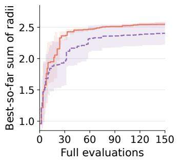

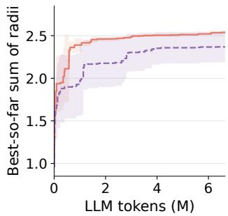  
Random Allocation (50%)  
Figure 10: Ablation with random allocation on Circle Packing. Random Allocation discards candidates with probability 0.5 after warm-up. Best-so-far performance is shown against Full evaluations (left) and cumulative LLM tokens (right). Lines show five-seed means, and shading denotes ±1 standard deviation. Token curves use the common observed range across methods and seeds.

Ablation of Exploration Feedback. The w/o Exploration ablation in Section 5.3 removes exploratory evaluations together with the feedback they provide. To examine the feedback contribution while retaining exploration, we introduce w/o Exploration Feedback. This variant keeps the exploration probability at $\rho = 0 . 3 \colon$ explored candidates still receive Full evaluation, enter the search archive, and can improve the best-so-far score or serve as parents. However, their outcome cases are withheld from subsequent allocation decisions, Experience updates, and Strategy revisions. The ablation thus removes explicit case feedback while preserving explored candidates’ participation in program search.

We compare five-seed results with the main-experiment EvoAlloc reference, using budgets of 150 Full evaluations on Circle Packing and 75 on ADAS-AIME. On Circle Packing, w/o Exploration Feedback achieves $2 . 4 4 6 { \pm } 0 . 1 1 0 .$ , compared with $2 . 5 4 7 { \pm } 0 . 0 3 0$ for EvoAlloc; the corresponding trajectories are shown in Figure 11. On ADAS-AIME, the final accuracies are $( 3 2 . 2 2 \pm 4 . 1 0 ) \\hat { \% }$ and $( 3 9 . 5 6 \pm 6 . 8 0 ) \%$ respectively. The lower mean performance without explicit feedback is consistent with exploration helping not only by recovering candidates, but also by informing subsequent allocation.

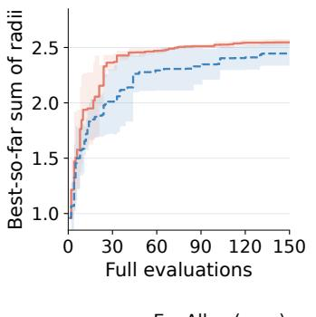  
EvoAlloc (ours)

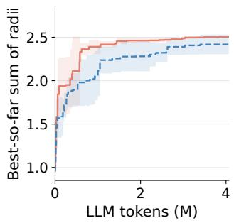  
w/o Exploration Feedback  
Figure 11: Ablation of exploration feedback on Circle Packing. The ablated variant retains exploratory evaluations and archive updates but withholds their explicit outcome-case feedback from allocation and self-evolution. Best-so-far performance is shown against Full evaluations (left) and cumulative LLM tokens (right). Lines show five-seed means, and shading denotes ±1 standard deviation. Token curves use the common observed range across methods and seeds.

## D.6 EXPLORATION OUTCOMES ACROSS STRATEGY STAGES

We analyze candidates with Full outcomes obtained through random counterfactual exploration $( \rho = 0 . 3 )$ from five runs per benchmark. We count only exploration following DISCARD or STOP, excluding warm-up and shared-validation evaluations. Candidates are grouped by the Strategy active at decision time: $S _ { 0 }$ is the initial Strategy, and subsequent indices denote successive adopted revisions within each run. A candidate is new-best if its Full score exceeds the decision-time best-so-far score, and improved-parent if it exceeds its parent’s score; the latter includes new-best candidates.

Table 7 shows that these recoveries are not confined to the initial Strategy: all six new-best candidates on ADAS-AIME occur under $S _ { 2 }$ or $S _ { 3 } .$ , while Circle Packing recovers 15 under $S _ { 2 }$ . Exploration thus reveals missed improvements even after multiple Strategy revisions, exposing outcomes that the allocator’s decisions alone would leave unobserved. Stage coverage differs across runs, with only one run per benchmark reaching $S _ { 3 }$ , so the pooled rates should not be interpreted as a common temporal trend.

Table 7: Outcomes recovered by counterfactual exploration across Strategy stages. Counts are pooled across five seeds within each benchmark. Percentages use the number of explored candidates in each row as the denominator, rather than averaging per-seed rates. Improved-parent includes new-best.
<table><tr><td rowspan="2">Benchmark</td><td rowspan="2">Strategy stage</td><td rowspan="2">Runs reaching the stage</td><td rowspan="2">Explored candidates</td><td colspan="2"></td></tr><tr><td></td><td>New-best Improved-parent</td></tr><tr><td rowspan="5">ADAS-AIME</td><td> $S _ { 0 }$ </td><td>5</td><td>10</td><td>0 (0.0%)</td><td>3 (30.0%)</td></tr><tr><td> $S _ { 1 }$ </td><td>5</td><td>35</td><td>0 (0.0%)</td><td>4 (11.4%)</td></tr><tr><td> $S _ { 2 }$ </td><td>4</td><td>72</td><td>5 (6.9%)</td><td>18 (25.0%)</td></tr><tr><td> $S _ { 3 }$ </td><td>1</td><td>15</td><td>1 (6.7%)</td><td>8 (53.3%)</td></tr><tr><td>Total</td><td>-</td><td>132</td><td>6 (4.5%)</td><td>33 (25.0%)</td></tr><tr><td rowspan="5">Circle Packing</td><td> $S _ { 0 }$ </td><td>5</td><td>13</td><td>2 (15.4%)</td><td>7 (53.8%)</td></tr><tr><td> $S _ { 1 }$ </td><td>5</td><td>80</td><td>5 (6.3%)</td><td>22 (27.5%)</td></tr><tr><td> $S _ { 2 }$ </td><td>5</td><td>200</td><td>15 (7.5%)</td><td>62 (31.0%)</td></tr><tr><td> $S _ { 3 }$ </td><td>1</td><td>3</td><td>0 (0.0%)</td><td>0 (0.0%)</td></tr><tr><td>Total</td><td>-</td><td>296</td><td>22 (7.4%)</td><td>91 (30.7%)</td></tr></table>

## D.7 STRATEGY VALIDATION DETAILS

Shared evaluation. During validation, the incumbent Strategy $S$ and the challenger $\widetilde { S }$ are applied to the same online proposals with the same archive, Experiences, and decision-time information. EvoAlloc executes the union of their requested evaluations once, charges them to the search budget, and shares the resulting evidence with both Strategies. A candidate requested for Full evaluation only by the challenger is therefore still evaluated, so validation is not restricted to outcomes selected by the incumbent. Outcomes of candidates that neither Strategy sends to Full evaluation are revealed only through counterfactual exploration (Section 4.3), which also supplies evidence for skipped candidates outside validation windows.

Consequence-based comparison. Let I denote the proposals in a validation window on which the two Strategies select different allocation paths and the Full outcome is known, whether requested by either Strategy or revealed by exploration; a window closes once $| I | = 2$ . For $T \in \{ S , \widetilde { S } \}$ , let $m _ { \mathrm { b e s t } } ( T )$ count proposals in I whose Full score exceeds the best score in the shared archive at decision time but whose allocation path under $T$ would leave that outcome hidden. Let $n _ { F } ( T )$ and $n _ { P } ( T )$ count the Full and Partial evaluations requested under $T$ on these proposals, rather than those executed for the union. The challenger is adopted if

$$
Z ( T ) = \bigl ( m _ { \mathrm { b e s t } } ( T ) , n _ { F } ( T ) , n _ { P } ( T ) \bigr )
$$

is lexicographically smaller for $\widetilde { S }$ than for $S ;$ a complete tie retains the incumbent, and the last component is omitted when no Partial evaluator is available. This establishes a preference over realized allocation consequences within a finite window, not a guarantee of improvement in $\mathbb { E } [ Q _ { A } ^ { \star } ( B ) ]$ ; continued search supplies evidence for subsequent Strategy revisions.

Observed validation outcomes. Table 8 summarizes how often proposed challengers were adopted across both benchmarks, together with the distribution of adoption criteria. Each validation window compares a challenger with the incumbent on shared proposals; completed windows are those that reached a decision to adopt the challenger or retain the incumbent. The reported adoptions were driven by fewer Full or Partial evaluations, while matching the incumbent’s missed-new-best count within the corresponding validation windows. Validation thus primarily favored more selective use of evaluation resources, refining how much evaluation to allocate to each candidate.

Table 8: Strategy validation outcomes aggregated over five seeds per benchmark. The final three columns count adoptions decided by fewer missed new-best candidates $( m _ { \mathrm { b e s t } } )$ , fewer Full evaluations $( n _ { F } )$ , or fewer Partial evaluations $( n _ { P } )$
<table><tr><td colspan="4">Benchmark</td><td colspan="3">Adoption criterion</td></tr><tr><td></td><td></td><td>Proposed challengers Completed windows Adopted challengers</td><td></td><td> $m _ { \mathrm { b e s t } }$ </td><td> $n _ { F }$ </td><td> $n _ { P }$ </td></tr><tr><td>ADAS-AIME</td><td>23</td><td>20</td><td>10</td><td>0</td><td>7</td><td>3</td></tr><tr><td>Circle Packing</td><td>44</td><td>42</td><td>11</td><td>0</td><td>11</td><td>0</td></tr></table>

## E PROMPTS AND CONTEXT

This appendix details the inputs, prompts, and representative outputs of the two LLM calls in EvoAlloc: resource allocation for each candidate (Section 4.1), and self-evolution, which updates Experiences and proposes Strategy revisions (Section 4.2).

## E.1 INPUT CONTEXT

Each LLM call in EvoAlloc is conditioned on a structured context assembled from the ongoing search, summarized in Table 9. Resource allocation and self-evolution both receive the benchmark setup, the current allocation guidance, recent cases, and a summary of search progress. Resource allocation additionally receives the current candidate, its search context, and historical cases retrieved by similarity; together with search progress, these form the decision-time context $c _ { t }$ of Section 3.1. Since allocation decisions are made before the candidate is fully evaluated, its own Full outcome is never part of this context.

Table 9: Input context for resource allocation and self-evolution.
<table><tr><td>Context</td><td>Information</td></tr><tr><td colspan="2">Shared by resource allocation and self-evolution</td></tr><tr><td>Benchmark</td><td>Evaluation protocol and available actions</td></tr><tr><td>Allocation guidance</td><td>Current Strategy and Experiences</td></tr><tr><td>Recent cases</td><td>Recently observed cases, as case cards (Appendix E.4)</td></tr><tr><td>Search progress</td><td>Budget usage and recent decision counts</td></tr><tr><td colspan="2">Additional context for resource allocation</td></tr><tr><td>Candidate</td><td>Candidate description and code changes relative to its parent</td></tr><tr><td>Search context</td><td>Lineage scores, the parent&#x27;s gap to the current best, and sibling outcomes</td></tr><tr><td>Retrieved cases</td><td>Similar historical cases, with their observed outcomes</td></tr><tr><td>Partial evidence</td><td>Partial-evaluation result, for the continuation decision only</td></tr></table>

## E.2 RESOURCE ALLOCATION PROMPT

The prompt below guides resource allocation using the current Strategy, relevant Experiences, and available search context. Representative structured outputs illustrate the initial allocation and post-Partial continuation decisions.

Resource allocation prompt   
You are the resource allocator of EvoAlloc, a resource-allocation system in a   
self-improving program search loop. EvoAlloc aims to improve sample efficiency over   
the full run by allocating evaluations where they have the greatest search value.   
Through self-evolution, EvoAlloc learns reusable search experiences from observed   
outcomes and maintains an allocation strategy for future resource allocation. Use   
this strategy as the primary guidance, together with relevant experiences and search   
context, to choose among:   
- FULL\_EVAL: run the full benchmark evaluation and observe its result.   
- PARTIAL\_EVAL: obtain limited evidence, then choose CONTINUE\_TO\_FULL or STOP.   
- DISCARD: skip full evaluation and leave its result hidden.   
Judge the proposal’s marginal search value against preserving the same resources for   
future search. Consider both its current evidence and whether evaluating it would   
preserve a branch with meaningful downstream search value.   
Use the allocation strategy as the run-level default, and adjust the decision when   
current grounded experience is materially relevant.   
Apply only guidance that is usable at decision time; ignore any condition that requires   
the current proposal’s unknown Full outcome.   
- Use PARTIAL\_EVAL only when at least two plausible partial-evaluation observations would   
support different final actions. If likely observations would all support the same   
final action, take it now. Partial evaluation is an information-acquisition action,   
not a safe compromise or an automatic step before Full evaluation.

Interpret partial evaluation according to what it reveals: successful execution alone   
does not justify CONTINUE\_TO\_FULL, and low partial performance alone does not   
justify STOP. A reproducible candidate-side execution failure is strong negative   
evidence because Full evaluation runs the same candidate unchanged.

Post-Partial continuation. When Partial evaluation is requested, its verified observation is appended to the original allocation context and the allocator makes a second decision using the same proposal, Strategy, Experiences, and search context.

Post-Partial continuation prompt   
The partial evaluator returned the following verified observation:   
{partial\_observation}   
Complete the same allocation episode using the original proposal, allocation strategy,   
experiences, and search context.   
Return only one valid JSON object:   
{continuation\_schema}

The outputs use structured JSON. Ellipses in the abbreviated examples denote generated text.

Resource allocation: initial decision Resource allocation: post-Partial   
{ {   
"action": "PARTIAL\_EVAL", "action": "CONTINUE\_TO\_FULL",   
"matched\_experience\_ids": ["e1", "e3"], "reason": "..   
"reason": "...", "used\_experience\_ids": ["e1"]   
"partial\_request": {"purpose": "..."} }   
}

## E.3 SELF-EVOLUTION PROMPTS

The prompts below specify separate updates to Experiences and the Strategy. Experience updates maintain case-grounded evidence, while Strategy updates propose challengers for shadow validation.

Experience operations. ADD introduces a new Experience with initial status tentative. UPDATE attaches supporting or contradicting evidence to an existing Experience and may change its status, but cannot rewrite its content, so accumulated evidence always refers to a fixed statement. DELETE removes an Experience. Rewriting an Experience therefore requires deleting it and adding a new one, and no operation is performed when evidence is insufficient. Each Experience has one of three statuses: tentative (limited or mixed evidence), active (consistent evidence), or stale (retained as a historical record but no longer guiding current decisions). Unlike DELETE, marking an Experience stale keeps it in memory.

Experience update prompt   
Update only the evolving search experiences.   
Experiences are descriptive. Each contains one recurring pattern and one qualitative   
outcome tendency, separated into applicability visible at decision time and observed   
tendency. It must remain identifiable and useful across future proposals, while   
retaining enough mechanism-level detail to distinguish the pattern. Experiences do   
not prescribe allocation actions.   
Full outcomes, including those revealed by exploration, are grounded evidence. Explored   
outcomes provide grounded evidence for allocation decisions whose Full outcomes   
would otherwise remain hidden. Partial evaluation provides limited evidence;   
unexplored DISCARD and STOP cases have unknown Full outcomes.

Strategy update prompt   
Update only the allocation strategy.   
The strategy is prescriptive. It is the allocator’s run-level posture for balancing the   
available allocation actions as evidence and budget change, rather than encoding a   
decision tree.   
Reconsider the strategy using recent outcomes, including those revealed by exploration,   
together with accumulated experiences and broader run context, then ALWAYS propose   
the allocation strategy you would use right now as a challenger.

## Self-evolution: Experience update

```jinja
{
"experience_operations": [{
"operation": "UPDATE",
"experience_id": "e1",
"status": "active",
"support_case_ids":
["Case-5", "Case-10"],
"counter_case_ids": [],
"rationale": "..."
}]
}
```

## Self-evolution: Strategy update

"allocation\_strategy\_update": {   
"operation": "REVISE",   
"selectivity": "medium",   
"allocation\_strategy": "...",   
"rationale": "...",   
"evidence\_experience\_ids": ["e1"]   
}   
}

## E.4 CASE CARD EXAMPLES

Each observed candidate is summarized as a case card, which records the proposal, its search context, the allocation decision, and the observed outcomes. Case cards provide the recent and retrieved cases in the input context of resource allocation and self-evolution (Table 9). The examples below show two ADAS-AIME case cards: Partial evaluation followed by Full evaluation, and Partial evaluation followed by STOP and later counterfactual exploration.

## ADAS-AIME: Partial evaluation followed by Full evaluation

Case-11   
Proposal:   
- Name: self\_consistency\_ensemble\_verification   
Search context:   
- Current best: 32.222   
- Lineage scores: 21.111   
- Parent position: below current best   
- Lineage trend: insufficient observed history   
- Earlier siblings: 1 observed; scores 32.222   
- Sibling outcomes: 1/1 improved over parent; 1/1 reached current best   
- Decision-time experience matches: e1   
Observed allocation path and outcomes:   
- Allocation path: PARTIAL\_EVAL -> CONTINUE\_TO\_FULL   
- Partial: 3/8 passed; execution completed.   
- Full eval: 40.000, valid new-best

## ADAS-AIME: Partial–STOP followed by counterfactual exploration

## Case-67

Proposal:   
- Name: rigorous\_verify\_synthesize   
Search context:   
- Current best: 33.333   
- Lineage scores: 25.556 -> 28.889 -> 27.778   
- Parent position: below current best   
- Lineage trend: mixed   
- Earlier siblings: 1 observed; scores 27.778   
- Sibling outcomes: 0/1 improved over parent; 0/1 reached current best   
- Decision-time experience matches: e2   
Observed allocation path and outcomes:   
- Allocation path: PARTIAL\_EVAL -> STOP -> EXPLORE\_EVAL   
- Partial: 3/8 passed; execution completed.   
- Full eval: 28.889, valid improved parent